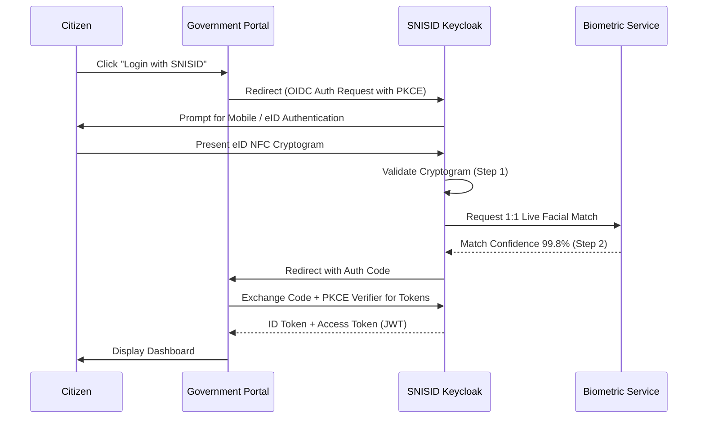
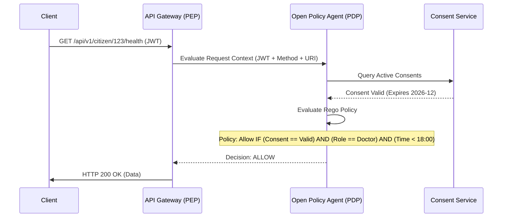

# SNISID: National Identity & Access Management (IAM) Architecture
## Sovereign Security & Zero Trust Authentication Framework

This document details the complete **Identity and Access Management (IAM)** architecture for the Système National d’Identification et d’Interopérabilité Sécurisée des Identités et des Données (SNISID). It is engineered in strict accordance with **NIST SP 800-63 (Digital Identity Guidelines)** and sovereign Zero Trust principles.

---

## 1. National IAM Framework

The SNISID IAM architecture unifies three distinct domains into a centralized governance model:
1. **Citizen Identity (CIAM):** High-scale, frictionless authentication for 15+ million Haitians.
2. **Workforce Identity (B2E):** Highly secure, hardware-backed access for civil servants and government administrators.
3. **Machine Identity:** Cryptographic identities for servers, APIs, and edge devices.

## 2. Citizen & Government Identity Architectures

### Citizen Identity Architecture (CIAM)
- **Central Broker:** Uses Keycloak (or similar enterprise OSS IDP) optimized for massive horizontal scale.
- **Passwordless Focus:** Citizens use their eID Smart Card (NFC) or Mobile App coupled with Biometrics (Facial/Fingerprint) to authenticate. Passwords are actively deprecated to prevent phishing.

### Government Employee IAM & Privileged Access Management (PAM)
- **Workforce IDP:** A logically separated Identity Provider specifically for government staff.
- **PAM:** "Domain Admin" or "Superuser" access is never standing. Administrators must use a PAM solution (e.g., CyberArk or Teleport) to "check out" temporary, audited access for a specific time window, requiring Maker-Checker approval.

### Agency Federation & SSO Architecture
- **Federation Hub:** The SNISID IDP acts as the national Federation Hub.
- External ministries (e.g., Ministry of Health, DGI) act as Service Providers (SPs). They federate via **SAML 2.0** or **OpenID Connect (OIDC)** to SNISID, providing true National Single Sign-On (SSO). When a civil servant is terminated in the HR database, their access is instantly revoked across all interconnected government applications.

## 3. Core Authentication Standards (OAuth2 & OIDC)

- **OpenID Connect (OIDC):** Used exclusively for authentication (verifying *who* the user is).
- **OAuth2 Architecture:** Used for delegated authorization (verifying *what* the user can access). E.g., A private bank requests read-access to a citizen's basic profile.
- **Strict PKCE:** Authorization Code Flow with Proof Key for Code Exchange (PKCE) is strictly mandated for all Mobile and Single-Page Applications (SPAs) to prevent authorization code interception attacks.

## 4. Advanced Authentication Modalities

### MFA, Biometric, and Passwordless Authentication
- **FIDO2 / WebAuthn:** Government administrators are issued FIDO2 Hardware Security Keys (e.g., YubiKeys).
- **Biometric Authentication:** The Citizen Mobile App uses FIDO2 standards utilizing the smartphone's Secure Enclave (FaceID/TouchID), bridging the biometric data to a cryptographically signed assertion sent to SNISID.

### Risk-Based & Adaptive Authentication
- Contextual signals (IP reputation, device geolocation, impossible travel velocity) are evaluated during every login.
- **Adaptive Auth:** A user logging in from their usual Port-au-Prince IP address during working hours requires a simple PIN. If that same user attempts to log in from a foreign IP address at 3:00 AM, the IDP dynamically forces a step-up Biometric verification.

## 5. Machine & Device Identity Management

### Device Identity Management
- All edge biometric kiosks and government laptops are assigned an X.509 certificate from the `Device-IoT-CA` (National PKI integration). The API Gateway verifies this certificate via mTLS before the device can even present a user login prompt.

### Machine & Service Identity (SPIFFE/SPIRE)
- **Zero Trust Microservices:** Kubernetes workloads do not use static API keys. **SPIRE** injects a short-lived X.509 SVID (SPIFFE Verifiable Identity Document) into the pod memory. Envoy proxies use this SVID to authenticate pod-to-pod communication.

## 6. Authorization: RBAC & ABAC

### Policy Enforcement & Decision Points
- **Policy Enforcement Point (PEP):** The API Gateway (Kong) or Service Mesh Proxy (Istio).
- **Policy Decision Point (PDP):** The Open Policy Agent (OPA) sidecar attached to the workload.

### RBAC vs. ABAC
- **RBAC (Role-Based Access Control):** Grants broad permissions based on the user's role (e.g., `role: custom_officer`).
- **ABAC (Attribute-Based Access Control):** Evaluates real-time attributes. OPA takes the RBAC role, the user's current location, the time of day, and the sensitivity classification of the requested data to make a final Allow/Deny decision.

## 7. Consent & Delegated Authorization
- **Consent Management:** The central Consent Service stores cryptographic proofs of a citizen granting access to their data. 
- A hospital's OAuth2 request to read a citizen's medical flag fails at the API layer if a valid, unexpired consent grant is not present in the Consent Service database.

## 8. Lifecycle, Enrollment & Recovery Workflows

### Identity Lifecycle Management
- **Enrollment:** State machine governing `Pending` -> `Biometric Verification` -> `Active`.
- **Identity Recovery:** If an eID or Mobile device is lost, recovery requires physical presence at an ONI center to undergo a 1:N Biometric facial/fingerprint scan to rebind the identity to new cryptographic material. Remote password resets via SMS/Email are disabled for Tier 1 high-security accounts.

## 9. Security, Kubernetes, & Compliance Integration

### Kubernetes IAM Integration (IRSA)
- Utilizing OIDC federation, Kubernetes Service Accounts are mapped directly to IAM roles. A pod running the Audit Service assumes an IAM role granting write-only access to the S3 Audit Bucket, preventing lateral movement if the pod is compromised.

### Session Security
- **Token Lifespans:** Access Tokens (JWT) expire in 15 minutes. Refresh Tokens expire in 12 hours and feature rotation (using a Refresh Token immediately invalidates the previous one, detecting token theft).

### Audit & Compliance Architecture
- Every authentication success, failure, and step-up challenge is logged to the SIEM via Kafka.
- Fulfills stringent ISO 27001 Access Control requirements and enables frictionless compliance reporting.

---

## 10. Architecture Diagrams (Mermaid)

### 1. Citizen SSO Login Flow (OIDC + Biometric)


### 2. Agency Federation Architecture (SAML/OIDC)
```mermaid
graph TD
    subgraph DGI Environment
        DGI_App[DGI Tax Portal]
        DGI_IDP[DGI Active Directory]
    end

    subgraph Ministry of Health Environment
        MOH_App[Hospital Portal]
    end

    subgraph SNISID Central Identity
        SNISID_IDP[SNISID National Federation Broker]
        AuthZ[Authorization / Consent DB]
    end

    DGI_App -->|SAML 2.0 Auth Request| SNISID_IDP
    MOH_App -->|OIDC Auth Request| SNISID_IDP
    DGI_IDP -->|IdP Sync / Trust| SNISID_IDP

    SNISID_IDP <--> AuthZ
    
    Note right of SNISID_IDP: Centralized Access Revocation.<br/>Terminating an employee here<br/>locks them out of DGI and MOH instantly.
```

### 3. ABAC Policy Decision Flow (OPA)


### 4. Zero Trust Machine Identity Flow (SPIFFE/SPIRE)
```mermaid
graph TD
    subgraph K8s Worker Node
        Kubelet[Kubelet]
        SpireAgent[SPIRE Agent]
        
        subgraph Pod [Identity Service]
            App[Microservice]
            Envoy[Istio Sidecar]
        end
    end

    SpireServer[SPIRE Central Server]

    SpireAgent -->|Node Attestation| SpireServer
    SpireServer -->|Validates Node| SpireAgent
    
    SpireAgent -->|Workload Attestation (Checks cgroups/uid)| Kubelet
    SpireAgent -->|Injects Short-Lived X.509 SVID| Envoy
    
    Envoy -->|Uses SVID for mTLS| ExternalService[Other SNISID Microservice]
```

---
*Prepared by the SNISID Identity & Access Management Strategy Board.*
