# SNISID: National Identity Conflict Resolution Framework
## Enterprise Conflict Adjudication, Forensic Validation & Escalation Governance

This document defines the **complete conflict resolution architecture** for the Système National d'Identification et d'Interopérabilité Sécurisée des Identités et des Données (SNISID). When Haiti's 15+ million citizens are enrolled under the principle of **"One Citizen, One Identity,"** conflicts *will* arise — duplicate biometric hits, contradictory civil records, contested identities, and deliberate fraud. This framework codifies every pathway from automated detection to judicial finality, ensuring no conflict is lost, no citizen is denied due process, and every decision is preserved in an immutable forensic chain.

---

## Table of Contents

1. [Conflict Taxonomy & Detection Architecture](#1-conflict-taxonomy--detection-architecture)
2. [Master Conflict Resolution BPMN Workflow](#2-master-conflict-resolution-bpmn-workflow)
3. [Duplicate Biometrics Resolution](#3-duplicate-biometrics-resolution)
4. [Conflicting Identity Records Resolution](#4-conflicting-identity-records-resolution)
5. [Fraud Investigation Workflow](#5-fraud-investigation-workflow)
6. [Manual Verification Procedures](#6-manual-verification-procedures)
7. [Judicial Escalation Workflow](#7-judicial-escalation-workflow)
8. [Citizen Appeals Process](#8-citizen-appeals-process)
9. [Forensic Validation Framework](#9-forensic-validation-framework)
10. [Audit Preservation Architecture](#10-audit-preservation-architecture)
11. [Escalation Governance Model](#11-escalation-governance-model)
12. [Operational Procedures & SLA Definitions](#12-operational-procedures--sla-definitions)
13. [Governance RACI Matrix](#13-governance-raci-matrix)

---

## 1. Conflict Taxonomy & Detection Architecture

### 1.1 Conflict Classification

Every identity conflict detected by SNISID is classified into one of six severity tiers, which directly determine the resolution pathway, required authority level, and SLA timeline.

| Tier | Classification | Example | Resolution Authority | SLA |
|------|---------------|---------|---------------------|-----|
| **T1** | Administrative Duplicate | Typo creates two records for same person | Enrollment Agent | 24h |
| **T2** | Biometric Near-Match | ABIS returns similarity score 85–94% | Biometric Adjudicator | 48h |
| **T3** | Biometric Hard-Match | ABIS returns similarity score ≥95% | Senior Forensic Examiner | 72h |
| **T4** | Multi-Record Conflict | Multiple NNIs with conflicting demographics for confirmed same person | Regional Director + Legal | 7 days |
| **T5** | Suspected Fraud | Deliberate duplicate enrollment, synthetic biometrics, or identity theft | DCPJ Fraud Unit | 30 days |
| **T6** | Judicial Conflict | Court-contested identity, inheritance disputes, contested nationality | Tribunal de Paix / Tribunal Civil | 90 days |

### 1.2 Detection Sources

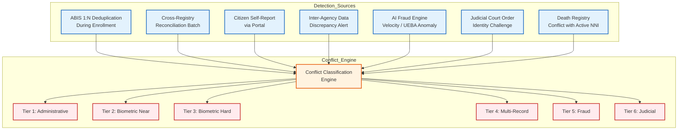

### 1.3 Conflict Record Data Model

Every detected conflict generates an immutable `ConflictCase` record:

```yaml
ConflictCase:
  case_id: "CFR-2026-0001847"       # Unique sequential case ID
  detected_at: "2026-05-23T20:01:00Z"
  detection_source: "ABIS_DEDUP"     # Enum: ABIS_DEDUP | BATCH_RECON | CITIZEN_REPORT | INTER_AGENCY | AI_FRAUD | JUDICIAL | DEATH_REGISTRY
  tier: "T3"                         # Enum: T1-T6
  status: "OPEN"                     # Enum: OPEN | ASSIGNED | UNDER_REVIEW | ESCALATED | PENDING_JUDICIAL | RESOLVED | APPEALED | CLOSED
  primary_nni: "HT-2026-00391847"
  conflicting_nni: "HT-2019-00128374"
  abis_match_score: 97.3             # Nullable
  assigned_to: "AGT-00482"           # Nullable — assigned adjudicator
  escalation_chain: []               # Array of escalation records
  resolution:
    decision: null                   # MERGE | DEACTIVATE_PRIMARY | DEACTIVATE_CONFLICTING | REFER_JUDICIAL | FRAUD_CONFIRMED | CLEARED
    decided_by: null
    decided_at: null
    rationale: null
  audit_hash: "sha256:a4f8c2e1..."   # Cryptographic chain hash
  evidence_vault_ref: "vault://conflicts/CFR-2026-0001847"
```

---

## 2. Master Conflict Resolution BPMN Workflow

This is the **top-level orchestration workflow** governing all conflict resolution. It acts as the primary saga coordinator, dispatching to specialized sub-processes based on conflict tier.

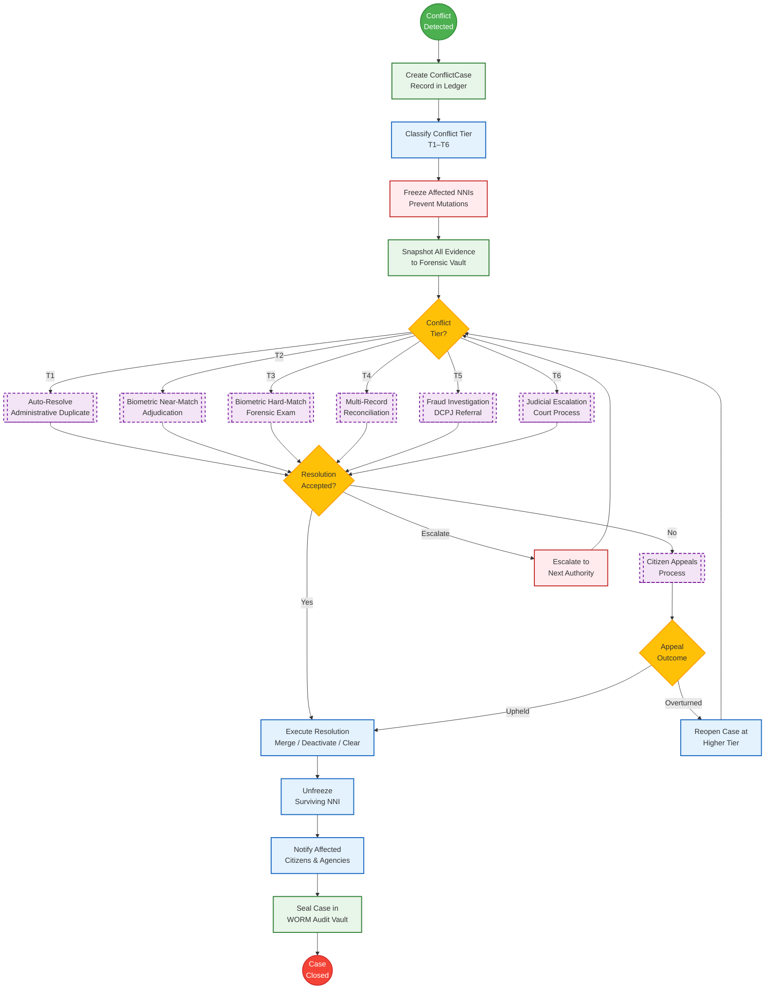

---

## 3. Duplicate Biometrics Resolution

### 3.1 ABIS Deduplication Conflict Workflow

When the ABIS 1:N search during enrollment returns a candidate match, the conflict enters this specialized sub-process.

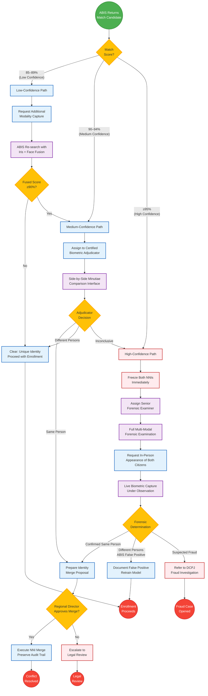

### 3.2 Biometric Adjudication Scoring Matrix

| Modality | Weight | Threshold (Same Person) | Threshold (Inconclusive) |
|----------|--------|------------------------|--------------------------|
| Fingerprint (10-print) | 40% | ≥95% individual, ≥12 minutiae match | 85–94% |
| Iris (dual) | 35% | Hamming distance ≤ 0.28 | 0.28–0.35 |
| Facial (3D mesh) | 20% | ≥92% similarity | 80–91% |
| Demographic cross-check | 5% | Name + DOB + Commune match | Partial match |

### 3.3 Multi-Modal Fusion Decision Logic

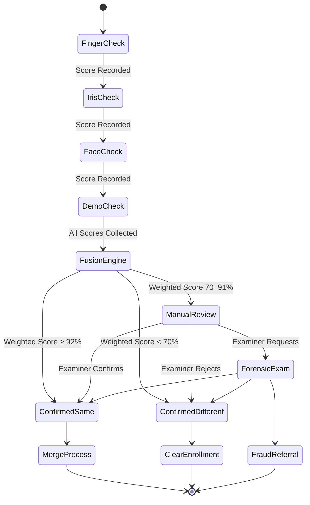

---

## 4. Conflicting Identity Records Resolution

### 4.1 Record Conflict Detection Sources

Conflicting identity records arise when two or more NNIs contain contradictory authoritative data for what appears to be the same person. Common scenarios:

- **Civil registry mismatch:** Birth certificate says "Jean-Pierre BAPTISTE" born 1985-03-15, but NNI record says "Jean Pierre BATISTE" born 1985-05-13.
- **Cross-agency discrepancy:** DGI tax records under NIF-A link to NNI-X, but Immigration passport records under the same biometrics link to NNI-Y.
- **Historical migration:** Pre-SNISID records from multiple paper-based registries merged incorrectly during the initial digitization campaign.

### 4.2 Record Conflict Resolution BPMN

```mermaid
flowchart TD
    classDef startEvent fill:#4CAF50,stroke:#388E3C,stroke-width:2px,color:white;
    classDef endEvent fill:#F44336,stroke:#D32F2F,stroke-width:2px,color:white;
    classDef task fill:#E3F2FD,stroke:#1565C0,stroke-width:2px;
    classDef gateway fill:#FFC107,stroke:#FFA000,stroke-width:2px;
    classDef evidence fill:#e8f5e9,stroke:#2e7d32,stroke-width:2px;
    classDef danger fill:#ffebee,stroke:#c62828,stroke-width:2px;

    S((Record Conflict<br/>Detected)):::startEvent

    S --> GATHER[Gather All Records<br/>Across Registries]:::task
    GATHER --> TIMELINE[Construct Chronological<br/>Identity Timeline]:::evidence
    TIMELINE --> COMPARE[Automated Field-by-Field<br/>Discrepancy Analysis]:::task

    COMPARE --> SEVERITY{Discrepancy<br/>Severity}:::gateway

    SEVERITY -- "Minor: Typo / Accent<br/>Formatting difference" --> AUTO_FIX[Apply Automated<br/>Normalization Rules]:::task
    SEVERITY -- "Moderate: Name variant<br/>or DOB off by ≤30 days" --> AGENT_REVIEW[Assign to Data<br/>Quality Agent]:::task
    SEVERITY -- "Major: Core identity<br/>fields contradict" --> LEGAL_REVIEW[Assign to Legal<br/>Adjudicator]:::danger

    AUTO_FIX --> VERIFY_FIX{Citizen<br/>Confirms?}:::gateway
    VERIFY_FIX -- Yes --> APPLY[Apply Correction<br/>to Master Record]:::task
    VERIFY_FIX -- No --> AGENT_REVIEW

    AGENT_REVIEW --> DOCS[Request Original<br/>Source Documents]:::evidence
    DOCS --> CROSS_REF[Cross-Reference with<br/>Civil Registry Archives]:::task
    CROSS_REF --> AGENT_DEC{Agent<br/>Determination}:::gateway
    AGENT_DEC -- Resolved --> APPLY
    AGENT_DEC -- Cannot Determine --> LEGAL_REVIEW

    LEGAL_REVIEW --> COURT_DOCS[Require Sworn<br/>Affidavit from Citizen]:::evidence
    COURT_DOCS --> WITNESS[Gather Witness<br/>Statements if Needed]:::task
    WITNESS --> LEGAL_DEC{Legal<br/>Determination}:::gateway
    LEGAL_DEC -- "Administrative Fix" --> APPLY
    LEGAL_DEC -- "Court Order Required" --> JUDICIAL_REF[Refer to Tribunal<br/>de Paix]:::danger

    APPLY --> PROPAGATE[Propagate Correction<br/>to All Linked Agencies]:::task
    PROPAGATE --> AUDIT_SEAL[Seal Previous Record<br/>Version in Audit Vault]:::evidence
    AUDIT_SEAL --> E1((Conflict<br/>Resolved)):::endEvent
    JUDICIAL_REF --> E2((Judicial<br/>Process)):::endEvent
```

### 4.3 Source Document Authority Hierarchy

When conflicting documents exist, SNISID follows this strict authority precedence:

| Priority | Document Source | Authority Level | Notes |
|----------|---------------|-----------------|-------|
| 1 | Court Judgment (Jugement Supplétif) | Absolute | Overrides all other sources |
| 2 | Original Birth Certificate (Acte de Naissance) | Primary | Official civil registry extract |
| 3 | Baptismal Certificate | Secondary | Accepted where civil records destroyed |
| 4 | Hospital Birth Record | Secondary | Medical institution attestation |
| 5 | Passport / Travel Document | Tertiary | Immigration-issued identity |
| 6 | National ID Card (CIN) | Tertiary | Pre-SNISID legacy card |
| 7 | Electoral Card | Quaternary | CEP-issued voter registration |
| 8 | Sworn Affidavit (Affidavit Notarié) | Lowest | Requires corroborating evidence |

---

## 5. Fraud Investigation Workflow

### 5.1 Fraud Classification

| Code | Fraud Type | Detection Method | Penalty Severity |
|------|-----------|------------------|------------------|
| **F1** | Duplicate Enrollment | ABIS 1:N hard match + different demographic alias | Criminal |
| **F2** | Identity Theft | Citizen reports someone enrolled using their biometrics | Criminal |
| **F3** | Synthetic Biometrics | Liveness/PAD detection failure, deepfake artifacts | Criminal |
| **F4** | Ghost Worker Fraud | Salary disbursement to non-existent or deceased NNI | Criminal |
| **F5** | Agent Collusion | Insider deliberately bypasses ABIS checks | Criminal + Administrative |
| **F6** | Document Forgery | Altered birth certificates or court orders submitted | Criminal |
| **F7** | Identity Laundering | Serial identity changes to evade legal obligations | Criminal |

### 5.2 Fraud Investigation BPMN

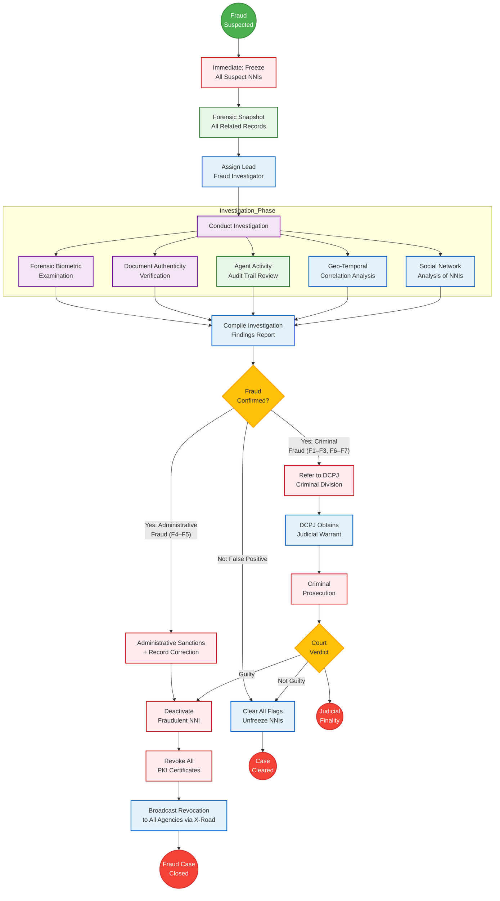

### 5.3 Fraud Investigation Sequence — Agent Collusion Scenario

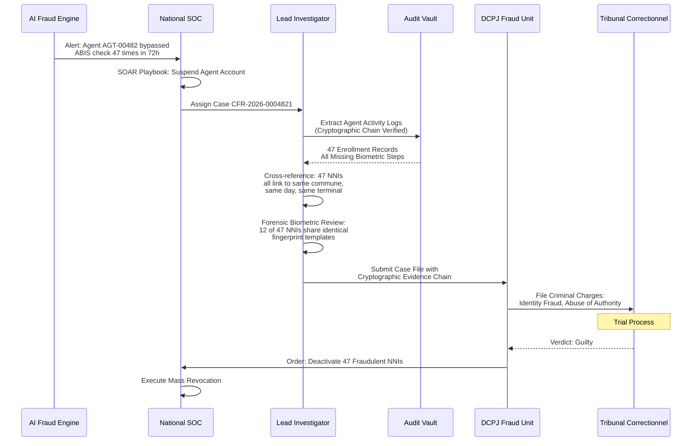

---

## 6. Manual Verification Procedures

### 6.1 In-Person Verification Protocol

When automated systems cannot resolve a conflict, SNISID triggers a mandatory in-person verification. This is a controlled, audited process.

**Operational Procedure: MV-001 — Citizen In-Person Verification**

| Step | Action | Actor | System | Evidence |
|------|--------|-------|--------|----------|
| 1 | Issue summons letter (bilingual FR/HT) with case reference | System | Notification Service | Delivery receipt logged |
| 2 | Citizen presents at designated ONI verification center | Citizen | — | Sign-in recorded |
| 3 | Verify original documents against scanned copies in vault | Verification Agent | Document Viewer | Side-by-side comparison screenshot |
| 4 | Capture fresh biometrics under direct camera observation | Biometric Technician | ABIS Workstation | Liveness verified, video recorded |
| 5 | Run fresh biometrics against both conflicting NNIs (1:1) | System | ABIS | Match scores logged |
| 6 | Record sworn verbal declaration from citizen | Verification Agent | Audio Recorder | Timestamped recording, consent noted |
| 7 | Agent submits determination with evidence attachments | Verification Agent | Case Management | Decision + rationale logged |
| 8 | Supervisor reviews and countersigns within 24h | Supervisor | Workflow Engine | Maker-checker pattern enforced |

### 6.2 Manual Verification BPMN

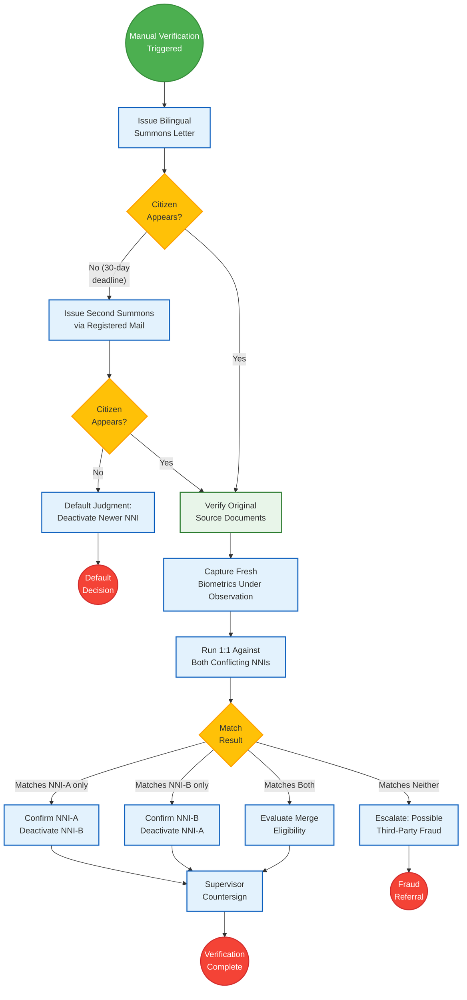

---

## 7. Judicial Escalation Workflow

### 7.1 Escalation Triggers

Judicial escalation occurs when:
- A core identity field (name, nationality, parentage) is contested and cannot be resolved administratively
- A citizen disputes the administrative resolution through formal legal challenge
- A court order is required to merge, split, or revoke an identity
- Criminal fraud charges are necessary
- Inheritance or property disputes hinge on identity determination

### 7.2 Judicial Process BPMN

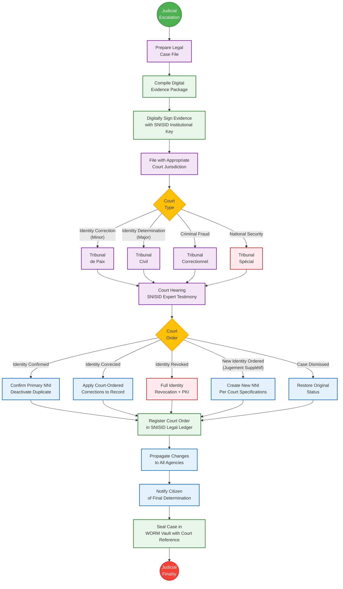

### 7.3 Court-to-SNISID Integration Sequence

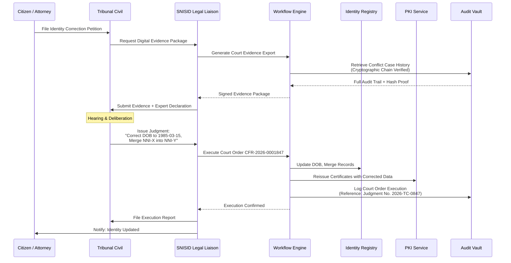

---

## 8. Citizen Appeals Process

### 8.1 Appeal Rights

Every citizen affected by a conflict resolution decision has the constitutional right to appeal. The appeals process is multi-tiered:

| Level | Appeal Body | Scope | Timeline | Filing Method |
|-------|------------|-------|----------|--------------|
| **L1** | ONI Regional Director | Administrative decisions (T1–T3) | 15 business days | Online portal or in-person |
| **L2** | National Identity Appeals Board (NIAB) | All administrative decisions, DCPJ referrals | 30 business days | Formal written petition |
| **L3** | Tribunal Administratif | Government agency disputes | 60 calendar days | Legal filing via attorney |
| **L4** | Cour de Cassation | Constitutional rights challenges | 90 calendar days | Supreme Court petition |

### 8.2 Citizen Appeals BPMN

```mermaid
flowchart TD
    classDef startEvent fill:#4CAF50,stroke:#388E3C,stroke-width:2px,color:white;
    classDef endEvent fill:#F44336,stroke:#D32F2F,stroke-width:2px,color:white;
    classDef task fill:#E3F2FD,stroke:#1565C0,stroke-width:2px;
    classDef gateway fill:#FFC107,stroke:#FFA000,stroke-width:2px;
    classDef citizen fill:#e8f5e9,stroke:#2e7d32,stroke-width:2px;
    classDef legal fill:#F3E5F5,stroke:#7B1FA2,stroke-width:2px;

    S((Citizen Files<br/>Appeal)):::startEvent

    S --> VALIDATE[Validate Appeal<br/>Eligibility & Timeliness]:::task
    VALIDATE --> ELIGIBLE{Appeal<br/>Eligible?}:::gateway

    ELIGIBLE -- "No: Out of Time<br/>or Not Appealable" --> REJECT[Reject Appeal<br/>with Explanation]:::task
    ELIGIBLE -- Yes --> ACCEPT[Accept Appeal<br/>Stay Original Decision]:::citizen

    ACCEPT --> LEVEL{Appeal<br/>Level}:::gateway

    LEVEL -- L1 --> REGIONAL[ONI Regional<br/>Director Review]:::task
    LEVEL -- L2 --> NIAB[National Identity<br/>Appeals Board Hearing]:::legal
    LEVEL -- L3 --> TRIBUNAL[Tribunal<br/>Administratif Filing]:::legal
    LEVEL -- L4 --> CASSATION[Cour de Cassation<br/>Constitutional Review]:::legal

    REGIONAL --> GATHER_L1[Gather Additional<br/>Evidence from Citizen]:::citizen
    GATHER_L1 --> REVIEW_L1[Complete Case Review<br/>with Fresh Eyes]:::task
    REVIEW_L1 --> DEC_L1{L1<br/>Decision}:::gateway
    DEC_L1 -- "Uphold Original" --> CITIZEN_NEXT{Citizen Accepts<br/>or Escalates?}:::gateway
    DEC_L1 -- "Overturn: Correct Error" --> OVERTURN[Apply Corrected<br/>Decision]:::task

    CITIZEN_NEXT -- Accepts --> FINALIZE
    CITIZEN_NEXT -- Escalates --> NIAB

    NIAB --> PANEL[Convene 3-Member<br/>Review Panel]:::legal
    PANEL --> HEARING_L2[Formal Hearing:<br/>Citizen Presents Case]:::citizen
    HEARING_L2 --> DEC_L2{NIAB<br/>Decision}:::gateway
    DEC_L2 -- Uphold --> CITIZEN_NEXT2{Citizen Accepts<br/>or Escalates?}:::gateway
    DEC_L2 -- Overturn --> OVERTURN

    CITIZEN_NEXT2 -- Accepts --> FINALIZE
    CITIZEN_NEXT2 -- Escalates --> TRIBUNAL

    TRIBUNAL --> COURT_PROC[Full Judicial<br/>Proceedings]:::legal
    COURT_PROC --> DEC_L3{Court<br/>Decision}:::gateway
    DEC_L3 -- Final --> FINALIZE

    CASSATION --> CONST_REVIEW[Constitutional<br/>Rights Review]:::legal
    CONST_REVIEW --> DEC_L4{Supreme Court<br/>Decision}:::gateway
    DEC_L4 -- Final --> FINALIZE

    OVERTURN --> FINALIZE[Finalize Decision<br/>Update Records & Notify]:::task
    REJECT --> E1((Appeal<br/>Rejected)):::endEvent
    FINALIZE --> E2((Appeal<br/>Concluded)):::endEvent
```

### 8.3 Appeal Notification Template (Bilingual)

```
═══════════════════════════════════════════════════════════════
RÉPUBLIQUE D'HAÏTI — SNISID
NOTIFICATION DE RÉSOLUTION DE CONFLIT D'IDENTITÉ
NOTIFIKASYON REZOLISYON KONFLI IDANTITE
═══════════════════════════════════════════════════════════════

Réf: CFR-2026-0001847
NNI: HT-2026-00391847
Date: 2026-05-23

FR: Nous vous informons qu'une décision a été rendue 
    concernant le conflit d'identité enregistré sous la 
    référence ci-dessus. Vous disposez de 15 jours ouvrables 
    pour faire appel de cette décision.

HT: Nou enfòme w ke yo te pran yon desizyon konsènan 
    konfli idantite ki anrejistre anba referans ki pi wo a. 
    Ou gen 15 jou travay pou fè apèl kont desizyon sa a.

Décision / Desizyon: [MERGE | DEACTIVATE | CORRECTED]
Motif / Rezon: [Rationale in both languages]

Pour faire appel / Pou fè apèl:
  → En ligne / Sou entènèt: https://portal.snisid.gouv.ht/appeals
  → En personne / An pèsòn: Bureau ONI le plus proche
  → Par courrier / Pa lapòs: ONI, Rue [X], Port-au-Prince

═══════════════════════════════════════════════════════════════
```

---

## 9. Forensic Validation Framework

### 9.1 Forensic Examiner Certification Requirements

| Certification | Issuing Body | Validity | Required For |
|--------------|-------------|----------|-------------|
| Certified Latent Print Examiner (CLPE) | IAI (International Association for Identification) | 5 years | Fingerprint adjudication (T3+) |
| ABIS Operator Certification | SNISID Academy | 2 years | All biometric adjudication |
| ISO/IEC 19795 Biometric Testing | ISO | 3 years | ABIS threshold calibration |
| Forensic Document Examiner (FDE) | ABFDE | 5 years | Document forgery detection (F6) |
| Digital Forensics Certification | SNISID Academy | 2 years | Digital evidence handling |

### 9.2 Forensic Examination Workflow

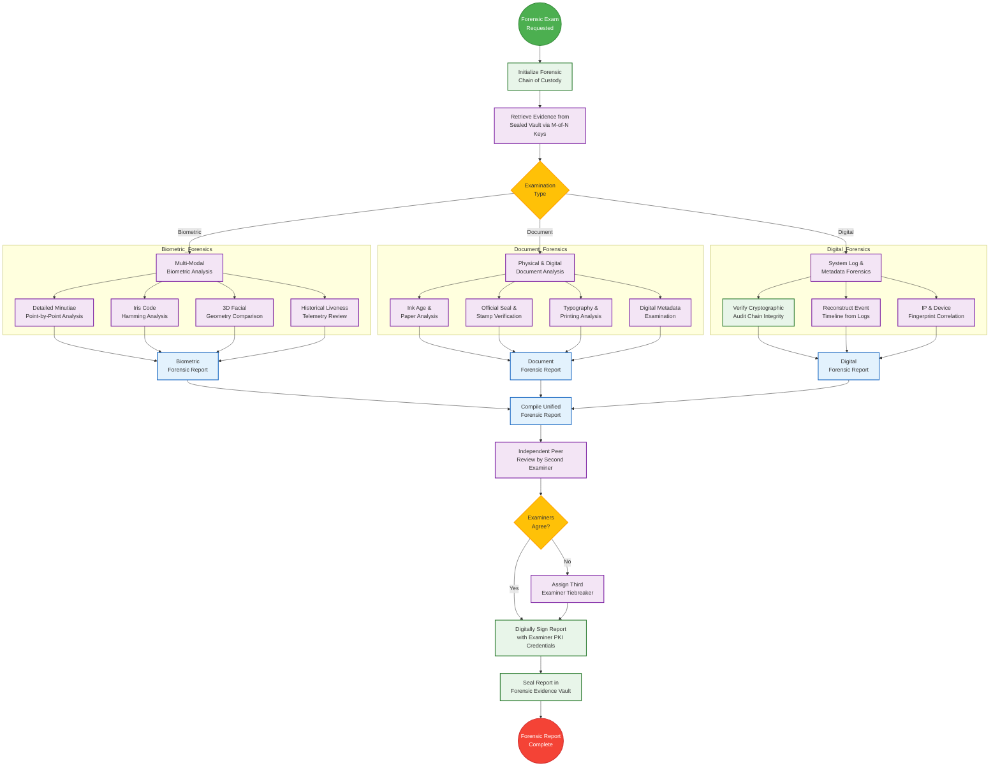

### 9.3 Forensic Chain of Custody Record

```yaml
ForensicChainOfCustody:
  case_ref: "CFR-2026-0001847"
  evidence_items:
    - item_id: "EV-001"
      type: "BIOMETRIC_TEMPLATE"
      description: "10-print fingerprint template, NNI HT-2026-00391847"
      retrieved_from: "ABIS Gallery Vault"
      retrieved_by: "EXAM-00127 (Marie-Claire DESROSIERS)"
      retrieved_at: "2026-05-23T14:30:00Z"
      retrieval_witness: "EXAM-00089 (Jean FRANÇOIS)"
      integrity_hash: "sha256:7f3c8a2b..."
      chain:
        - action: "RETRIEVED"
          actor: "EXAM-00127"
          timestamp: "2026-05-23T14:30:00Z"
          location: "Forensic Lab, ONI Central"
        - action: "EXAMINED"
          actor: "EXAM-00127"
          timestamp: "2026-05-23T15:45:00Z"
          location: "Forensic Workstation WS-04"
        - action: "PEER_REVIEWED"
          actor: "EXAM-00089"
          timestamp: "2026-05-23T17:00:00Z"
          location: "Forensic Workstation WS-07"
        - action: "SEALED"
          actor: "EXAM-00127"
          timestamp: "2026-05-23T17:30:00Z"
          location: "Evidence Vault V-02"
          seal_hash: "sha256:b9d4e1f7..."
```

---

## 10. Audit Preservation Architecture

### 10.1 Conflict Resolution Audit Requirements

Every conflict resolution action generates an immutable audit record that satisfies three requirements:

1. **Legal Admissibility:** Records must be cryptographically signed and chain-linked to be admissible in Haitian courts
2. **Forensic Completeness:** Every decision, evidence item, and state transition is captured
3. **Tamper Evidence:** Any modification to historical records is mathematically detectable

### 10.2 Audit Event Taxonomy for Conflict Resolution

| Event Code | Event Description | Data Captured | Retention |
|-----------|-------------------|---------------|-----------|
| `CR.DETECTED` | Conflict initially detected | Source, tier, affected NNIs, ABIS score | 10 years |
| `CR.CLASSIFIED` | Conflict tier assigned | Tier level, classification rationale | 10 years |
| `CR.FROZEN` | NNI(s) frozen | Frozen NNIs, freeze timestamp, authority | 10 years |
| `CR.ASSIGNED` | Case assigned to adjudicator | Assignee ID, tier, SLA deadline | 10 years |
| `CR.EVIDENCE.ADDED` | Evidence item attached | Evidence hash, type, source | 10 years |
| `CR.ESCALATED` | Case escalated to higher tier | From-tier, to-tier, escalation reason | 10 years |
| `CR.DECISION` | Resolution decision made | Decision type, rationale, decided-by | **Permanent** |
| `CR.APPEAL.FILED` | Citizen files appeal | Appeal level, grounds, filing method | **Permanent** |
| `CR.APPEAL.DECIDED` | Appeal decided | Upheld/overturned, rationale | **Permanent** |
| `CR.EXECUTED` | Resolution executed in registry | Changes applied, before/after snapshot | **Permanent** |
| `CR.JUDICIAL.FILED` | Case filed with court | Court reference, jurisdiction | **Permanent** |
| `CR.JUDICIAL.ORDER` | Court order received | Order text, judge, court reference | **Permanent** |
| `CR.SEALED` | Case sealed in WORM vault | Final hash, seal timestamp | **Permanent** |

### 10.3 Audit Preservation Pipeline

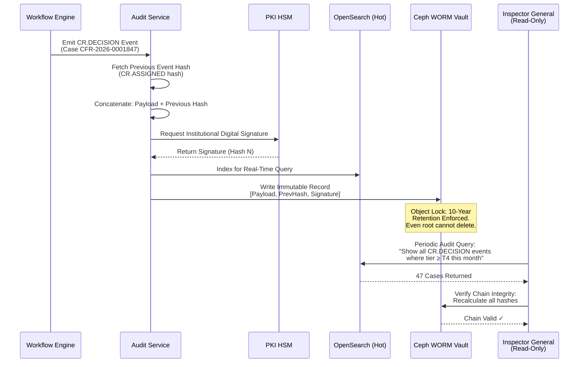

---

## 11. Escalation Governance Model

### 11.1 Escalation Authority Matrix

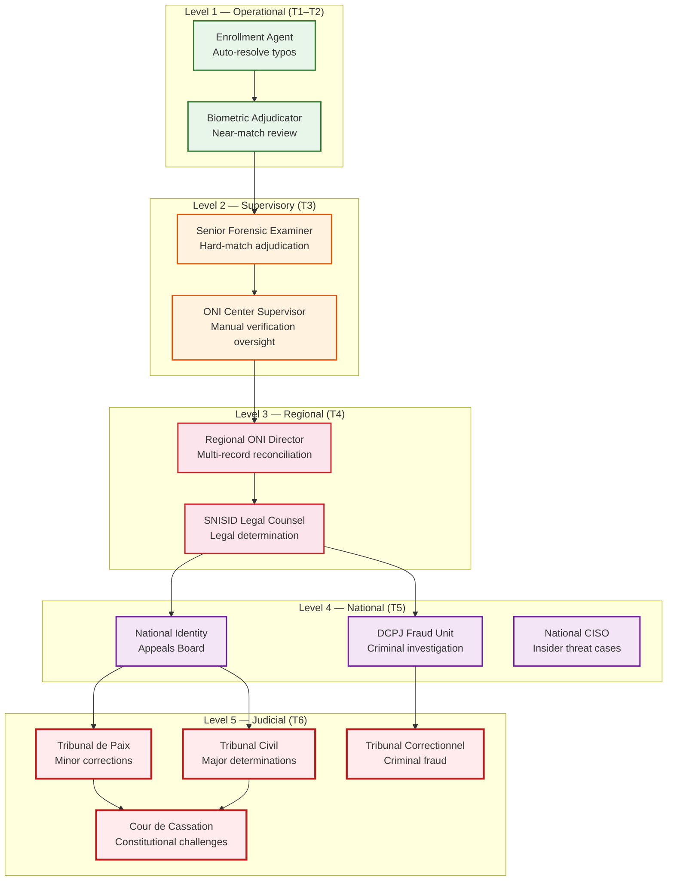

### 11.2 Escalation Trigger Rules

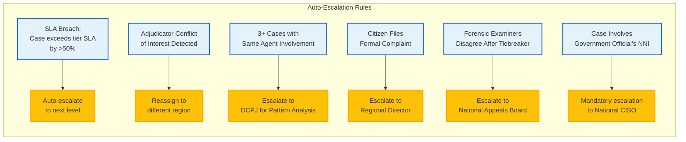

### 11.3 Conflict of Interest Controls

To prevent corruption in the adjudication process:

| Control | Implementation | Verification |
|---------|---------------|-------------|
| **Geographic Isolation** | Adjudicators cannot review cases from their home commune | System enforces via commune-of-origin check |
| **Relationship Screening** | System cross-references adjudicator's family NNIs against case participants | Automated pre-assignment check |
| **Random Assignment** | Cases assigned via weighted random algorithm, not manual selection | Algorithm audited quarterly |
| **Rotation Policy** | Adjudicators rotate regions every 6 months | HR system integration |
| **Dual-Control** | All T3+ decisions require independent countersignature | Workflow engine enforced |
| **Audit Trail** | Every case view, action, and decision is logged to WORM | Continuous monitoring by Inspector General |

---

## 12. Operational Procedures & SLA Definitions

### 12.1 SLA Escalation Timeline

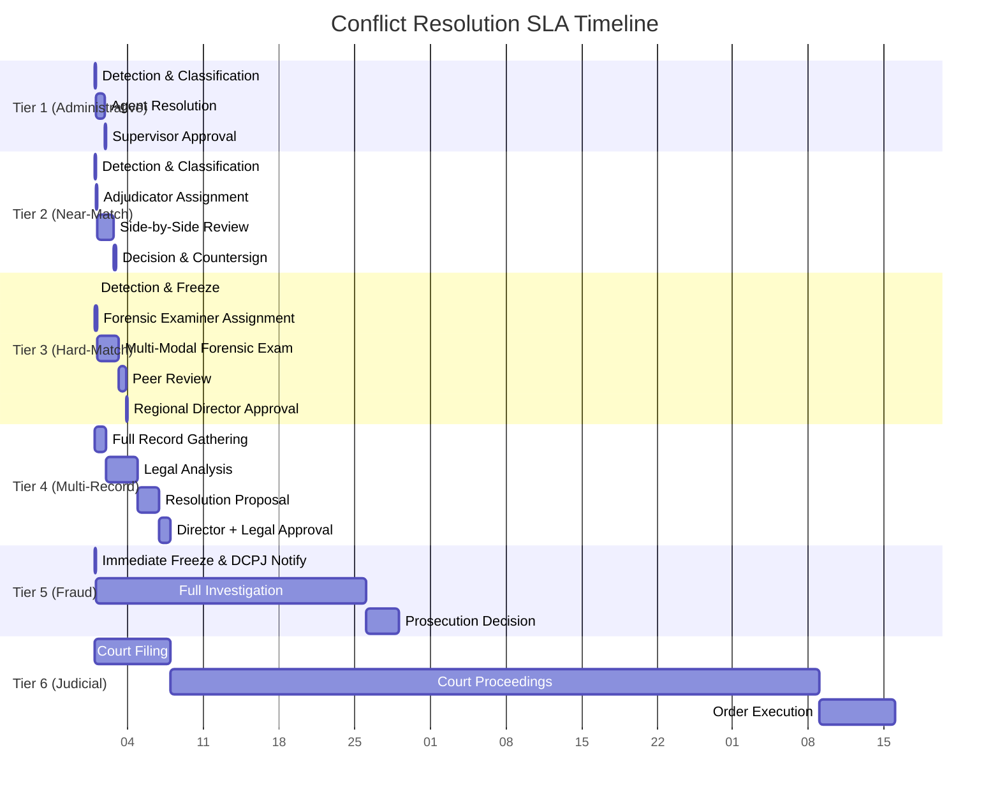

### 12.2 Key Performance Indicators (KPIs)

| KPI | Target | Measurement | Reporting |
|-----|--------|-------------|-----------|
| Mean Time to Detect (MTTD) | < 1 minute (automated) | Time from enrollment to conflict flag | Real-time dashboard |
| Mean Time to Assign (MTTA) | < 4 hours | Time from detection to adjudicator assignment | Daily report |
| Mean Time to Resolve (MTTR) | Within SLA per tier | Time from detection to case closure | Weekly report |
| SLA Compliance Rate | ≥ 95% | % of cases resolved within SLA | Monthly report |
| False Positive Rate (ABIS) | < 2% | % of biometric conflicts that are false positives | Quarterly report |
| Appeal Overturn Rate | < 10% | % of decisions overturned on appeal | Monthly report |
| Fraud Conviction Rate | ≥ 80% | % of referred fraud cases resulting in conviction | Annual report |
| Audit Chain Integrity | 100% | % of audit records passing chain verification | Continuous |

### 12.3 Operational Procedure Index

| Procedure Code | Title | Scope |
|---------------|-------|-------|
| **OP-CR-001** | Conflict Detection & Initial Classification | All tiers |
| **OP-CR-002** | NNI Freeze & Evidence Preservation | T2+ |
| **OP-CR-003** | Biometric Adjudication (Near-Match) | T2 |
| **OP-CR-004** | Forensic Biometric Examination | T3+ |
| **OP-CR-005** | Multi-Modal Fusion Analysis | T3+ |
| **OP-CR-006** | In-Person Manual Verification | T2+ |
| **OP-CR-007** | Record Conflict Reconciliation | T4 |
| **OP-CR-008** | Fraud Investigation Launch | T5 |
| **OP-CR-009** | DCPJ Criminal Referral | T5 |
| **OP-CR-010** | Judicial Case Filing | T6 |
| **OP-CR-011** | Court Order Execution | T6 |
| **OP-CR-012** | Citizen Appeal Processing | All tiers |
| **OP-CR-013** | NNI Merge Execution | T2–T4 |
| **OP-CR-014** | NNI Deactivation Execution | T3–T6 |
| **OP-CR-015** | Post-Resolution Agency Notification | All tiers |
| **OP-CR-016** | Forensic Chain of Custody Management | T3+ |
| **OP-CR-017** | Escalation Trigger Review | All tiers |
| **OP-CR-018** | Conflict of Interest Screening | All tiers |
| **OP-CR-019** | Case Sealing & WORM Archival | All tiers |
| **OP-CR-020** | Inspector General Quarterly Audit | Governance |

---

## 13. Governance RACI Matrix

### 13.1 Conflict Resolution RACI

| Activity | Enrollment Agent | Biometric Adjudicator | Forensic Examiner | Regional Director | DCPJ Fraud Unit | Legal Counsel | NIAB | Court | Inspector General | National CISO |
|----------|:---:|:---:|:---:|:---:|:---:|:---:|:---:|:---:|:---:|:---:|
| Detect Conflict | **R** | I | I | I | I | — | — | — | I | I |
| Classify Tier | **R** | C | C | I | — | — | — | — | I | — |
| Freeze NNI | A | **R** | — | I | — | — | — | — | I | I |
| T1 Resolution | **R/A** | — | — | I | — | — | — | — | I | — |
| T2 Adjudication | I | **R/A** | C | I | — | — | — | — | I | — |
| T3 Forensic Exam | — | C | **R** | **A** | I | — | — | — | I | — |
| T4 Reconciliation | — | — | C | **R/A** | — | **R** | I | — | I | — |
| T5 Fraud Investigation | — | — | C | I | **R/A** | C | — | — | I | C |
| T6 Judicial Process | — | — | C | I | C | **R** | — | **A** | I | — |
| Citizen Appeal (L1) | — | — | — | **R/A** | — | C | I | — | I | — |
| Citizen Appeal (L2) | — | — | — | C | — | C | **R/A** | — | I | — |
| Court Order Execution | — | — | — | I | I | **R** | — | **A** | I | I |
| Audit Preservation | I | I | I | I | I | I | I | I | **R/A** | C |
| Escalation Governance | — | — | — | C | C | C | C | — | **R** | **A** |

**Legend:** R = Responsible, A = Accountable, C = Consulted, I = Informed

### 13.2 Governance Review Cadence

| Review | Frequency | Participants | Output |
|--------|-----------|-------------|--------|
| Operational Case Review | Daily | Adjudicators, Supervisors | Active case status update |
| SLA Compliance Review | Weekly | Regional Directors, Ops Manager | SLA breach report + remediation |
| Fraud Pattern Analysis | Bi-weekly | DCPJ, AI Team, CISO | Emerging fraud vector assessment |
| Appeals Trend Analysis | Monthly | NIAB, Legal Counsel | Systemic error identification |
| ABIS Threshold Calibration | Quarterly | Forensic Examiners, ABIS Vendor | FAR/FRR optimization |
| Inspector General Audit | Quarterly | IG, National CISO | Independence & integrity report |
| National Governance Review | Annually | All stakeholders | Framework revision & policy update |

---

## Appendix A: Conflict Resolution State Machine

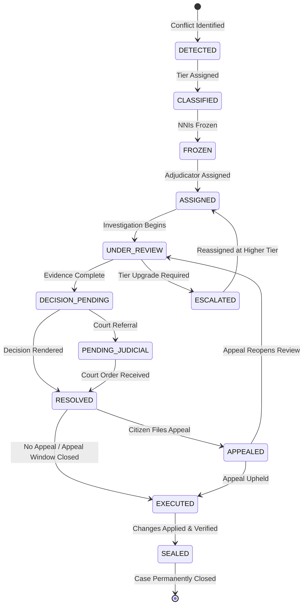

---

## Appendix B: API Contracts for Conflict Resolution

```yaml
paths:
  /v1/conflicts:
    post:
      summary: Report a new identity conflict
      security: [bearer_token, mtls]
      requestBody:
        content:
          application/json:
            schema:
              type: object
              required: [detection_source, primary_nni]
              properties:
                detection_source:
                  type: string
                  enum: [ABIS_DEDUP, BATCH_RECON, CITIZEN_REPORT, INTER_AGENCY, AI_FRAUD, JUDICIAL, DEATH_REGISTRY]
                primary_nni: { type: string }
                conflicting_nni: { type: string }
                abis_match_score: { type: number, minimum: 0, maximum: 100 }
                evidence: 
                  type: array
                  items:
                    type: object
                    properties:
                      type: { type: string }
                      data: { type: string, format: base64 }
      responses:
        '201':
          description: Conflict case created
          content:
            application/json:
              schema:
                properties:
                  case_id: { type: string, example: "CFR-2026-0001847" }
                  tier: { type: string, example: "T3" }
                  status: { type: string, example: "OPEN" }
                  sla_deadline: { type: string, format: date-time }

  /v1/conflicts/{case_id}/resolution:
    post:
      summary: Submit a resolution decision for a conflict case
      security: [bearer_token, mtls, rbac_adjudicator]
      parameters:
        - name: case_id
          in: path
          required: true
          schema: { type: string }
      requestBody:
        content:
          application/json:
            schema:
              type: object
              required: [decision, rationale]
              properties:
                decision:
                  type: string
                  enum: [MERGE, DEACTIVATE_PRIMARY, DEACTIVATE_CONFLICTING, REFER_JUDICIAL, FRAUD_CONFIRMED, CLEARED]
                rationale: { type: string, minLength: 50 }
                evidence_refs:
                  type: array
                  items: { type: string }
                countersigned_by: { type: string }
      responses:
        '200':
          description: Resolution accepted, pending execution
        '409':
          description: Conflict case already resolved or under appeal

  /v1/conflicts/{case_id}/appeal:
    post:
      summary: File a citizen appeal against a conflict resolution
      security: [citizen_auth, fido2]
      parameters:
        - name: case_id
          in: path
          required: true
          schema: { type: string }
      requestBody:
        content:
          application/json:
            schema:
              type: object
              required: [appeal_level, grounds]
              properties:
                appeal_level:
                  type: string
                  enum: [L1_REGIONAL, L2_NIAB, L3_TRIBUNAL, L4_CASSATION]
                grounds: { type: string, minLength: 100 }
                supporting_documents:
                  type: array
                  items:
                    type: object
                    properties:
                      filename: { type: string }
                      data: { type: string, format: base64 }
      responses:
        '201':
          description: Appeal filed, original decision stayed
        '400':
          description: Appeal window expired or invalid level
```

---

*Ratified by the National Digital Identity & Interoperability Steering Committee (Comité National d'Identité Numérique et d'Interopérabilité).*

*Document Classification: SNISID-GOV-CR-001 | Version 1.0 | Date: 2026-05-23*

*Prepared by the SNISID Enterprise Architecture & Legal Governance Division.*
