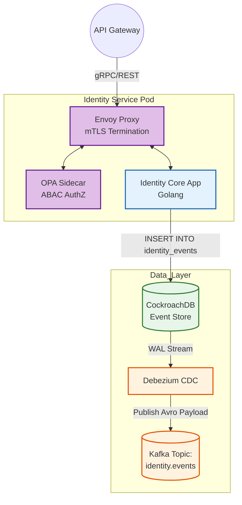
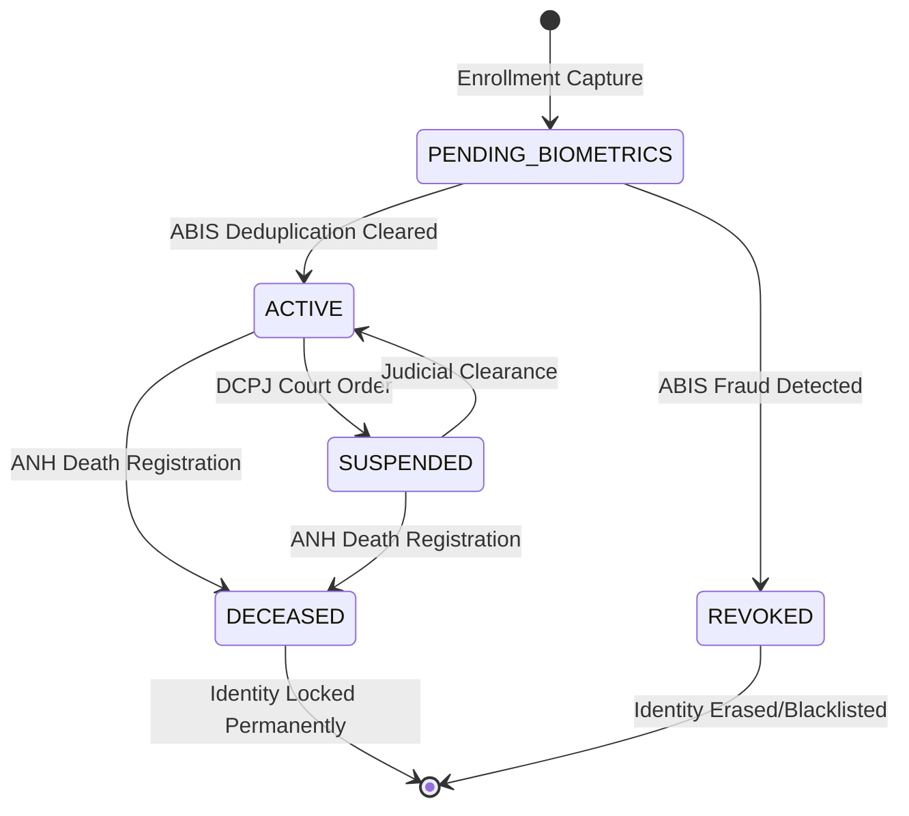

# SNISID Identity Service Architecture
## Core Distributed Systems Design

This document provides the deep-dive architectural design for the **Identity Service**, the most critical Write-Path (Command) microservice within the SNISID ecosystem. It manages the complete lifecycle of the Haitian citizen's digital identity using Event Sourcing, CQRS, and strict Zero Trust principles.

---

## 1. Identity Lifecycle & Unique National Identifier (NIU)

The Identity Service acts as the authoritative source for the **Numéro d'Identification Unique (NIU)**. The NIU is a 10-digit randomly generated cryptographic identifier, replacing the legacy CIN (Carte d'Identification Nationale) numbers to prevent demographic profiling (the number contains no geographic or birth date metadata).

### Lifecycle States
1. **PENDING_BIOMETRICS:** Basic demographic data captured. Awaiting ABIS 1:N deduplication.
2. **ACTIVE:** Biometrics cleared. The identity is cryptographically signed and the PKI certificate is issued.
3. **SUSPENDED:** Temporarily locked due to suspected fraud or judicial decree (DCPJ).
4. **REVOKED:** Identity permanently invalidated (e.g., proven duplicate).
5. **DECEASED:** Triggered asynchronously by the ANH (Archives Nationales d'Haïti) upon death registration. Locks all IAM and inter-agency access.

---

## 2. Event Sourcing & Database Schema

Instead of updating a single row when a citizen changes their address, the Identity Service utilizes **Event Sourcing**. Every change is appended as an immutable fact to a **CockroachDB** distributed SQL database.

### CockroachDB Schema Design

```sql
-- The Immutable Event Store
CREATE TABLE identity_events (
    event_id UUID PRIMARY KEY DEFAULT gen_random_uuid(),
    niu VARCHAR(10) NOT NULL,
    event_type VARCHAR(50) NOT NULL, -- e.g., 'CitizenRegistered', 'AddressUpdated'
    event_version INT NOT NULL,
    payload JSONB NOT NULL,
    metadata JSONB NOT NULL, -- Contains TraceID, AgentID, Timestamp
    created_at TIMESTAMP DEFAULT now(),
    UNIQUE (niu, event_version)
);

-- Optimization: Materialized Snapshots for fast state recreation
CREATE TABLE identity_snapshots (
    niu VARCHAR(10) PRIMARY KEY,
    latest_version INT NOT NULL,
    state JSONB NOT NULL,
    updated_at TIMESTAMP DEFAULT now()
);
```

---

## 3. Event Topology & CQRS Integration

When the Identity Service writes to `identity_events`, a **Debezium Change Data Capture (CDC)** connector reads the CockroachDB Write-Ahead Log (WAL) and instantly publishes the event to **Kafka**. 

- **Kafka Topic:** `snisid.identity.events`
- **Partitions:** 12 (allowing 12 parallel consumer instances to build read models)
- **Retention:** Infinite (Log Compaction enabled based on NIU key)

The **Citizen Registry Service (CQRS Read Model)** consumes this topic and updates the Elasticsearch cluster to provide sub-millisecond search capabilities for the API Gateway.

---

## 4. Zero Trust & Security Integration

### RBAC/ABAC (Role & Attribute Based Access Control)
- **Open Policy Agent (OPA):** The Identity Service contains zero authorization logic in its Go codebase. A sidecar OPA container evaluates incoming requests. 
- **ABAC Rule:** `ALLOW IF agent.role == 'enrollment_officer' AND agent.assigned_commune == citizen.birth_commune`.

### mTLS & Istio Service Mesh
- The microservice only exposes `localhost:8080` to its Envoy sidecar.
- Envoy terminates the **strict mTLS** connection, validating that the caller (e.g., the API Gateway) possesses a valid SPIFFE certificate issued by the SNISID Root CA.

### Immutable Audit Logging
- Every command processed by the Identity Service sends a parallel asynchronous message to the `snisid.audit.system.accessed` Kafka topic, guaranteeing that every identity modification is permanently recorded in the WORM (Write-Once-Read-Many) storage.

---

## 5. Architecture Diagrams (Mermaid)

### 1. Identity Service CQRS & Microservice Topology
This diagram illustrates the internal workings of the Identity Service, from OPA authorization to Event Sourcing and CDC publishing.



### 2. Kubernetes Deployment Model (HPA & Anti-Affinity)
To guarantee HA during node failures, the deployment enforces strict pod anti-affinity.

```mermaid
graph TD
    classDef node fill:#f9f9f9,stroke:#333,stroke-width:2px;
    classDef pod fill:#e3f2fd,stroke:#1565c0,stroke-width:2px;

    subgraph DC1_Cluster [Port-au-Prince Cluster]
        subgraph Node_A [Physical Worker Node 1]
            P1[Identity Pod 1]:::pod
        end
        subgraph Node_B [Physical Worker Node 2]
            P2[Identity Pod 2]:::pod
        end
        subgraph Node_C [Physical Worker Node 3]
            P3[Identity Pod 3]:::pod
        end
    end

    HPA((Horizontal Pod Autoscaler)) -.->|Scales based on 70% CPU| DC1_Cluster
    Note over Node_A,Node_C: Pod Anti-Affinity guarantees <br/> Pods 1, 2, 3 are NEVER <br/> scheduled on the same hardware.
```

### 3. Citizen Identity Lifecycle State Machine


---
*Prepared by the SNISID Cloud Infrastructure & Resilience Board.*
