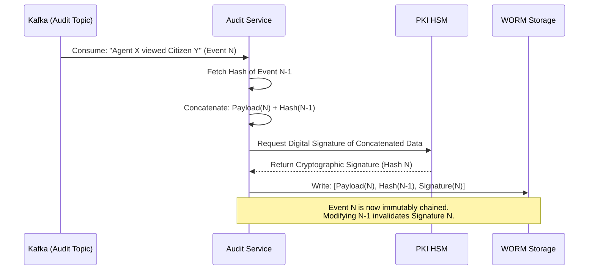

# SNISID Immutable Audit Service
## Cryptographic Non-Repudiation & Forensic Logging

This document details the architectural design for the **Immutable Audit Service**. In a sovereign national identity system, the internal threat (e.g., a corrupt official viewing records illegally or a compromised database administrator modifying data) is just as dangerous as external hackers. The Audit Service acts as the ultimate, tamper-proof source of truth for every action taken within SNISID, guaranteeing non-repudiation in Haitian courts of law.

---

## 1. Core Principles & Tamper Detection

### Append-Only Architecture
The Audit Service has absolutely no `UPDATE` or `DELETE` API endpoints. It is fundamentally an append-only ledger. Once an event is ingested, it is permanent.

### Blockchain-Inspired Cryptographic Chaining
To prevent a malicious administrator with raw database access from deleting or modifying a log entry, SNISID uses cryptographic chaining (similar to a Merkle Tree or blockchain):
1. When Event `N` arrives, the service calculates a SHA-256 hash combining the payload of Event `N` with the hash of Event `N-1`.
2. If an attacker alters the payload of Event `N-1`, the hash changes, completely breaking the cryptographic chain for every subsequent event.
3. A background verification daemon continuously recalculates the chain. If a break is detected, an absolute P1 alert is fired to the SOC.

---

## 2. Storage Strategy & WORM Enforcement

### Three-Tier Retention Strategy
1. **Hot Storage (0 - 30 Days):** Logs are stored in an **OpenSearch** cluster. This allows the SOC and SIEM tools to perform sub-second queries, build dashboards, and run real-time anomaly detection (UEBA).
2. **Warm Storage (30 Days - 1 Year):** Logs are moved to cheaper, slower disk storage but remain queryable.
3. **Cold Storage (1 Year - 10 Years):** Logs are archived to an S3-compatible object store (e.g., Ceph) utilizing strict **Object Lock (WORM - Write Once Read Many)**. Even the root user of the storage cluster cannot delete or modify these files until the hardware-enforced 10-year retention policy expires.

---

## 3. SIEM & SOC Integration

- **Standardized Ingestion:** All microservices output logs in structured JSON format via `stdout`. **FluentBit** (deployed as a DaemonSet on every Kubernetes node) captures these logs, enriches them with Kubernetes metadata (Pod Name, Namespace), and streams them to the `snisid.audit.events` Kafka topic.
- **SIEM Forwarding:** The Audit Service consumes from Kafka, cryptographically signs the logs, writes them to the WORM storage, and simultaneously forwards a copy to the National SOC's SIEM (Security Information and Event Management) platform for real-time threat hunting.

---

## 4. Legal Compliance & Evidence Preservation

- **Non-Repudiation:** Because API requests must be signed with mTLS or JWTs, the Audit Service records the cryptographically verified identity of the requester. An agency or civil servant cannot legally deny having accessed a specific record.
- **Chain of Custody:** If the DCPJ (Judicial Police) requires access logs for an investigation, the Audit Service can export the logs along with a digitally signed cryptographic proof (the hash chain). This mathematical proof can be verified independently in court to guarantee the logs were not fabricated by the prosecution.

---

## 5. Architecture & Event Flow Diagrams (Mermaid)

### 1. Cryptographically Chained Logging Workflow
This sequence diagram shows how the Audit Service ensures tamper-proof logging utilizing previous hashes.



### 2. Global Audit Topology & SIEM Integration
This diagram illustrates the pipeline from a microservice pod generating a log, all the way to the SOC dashboard and Cold Vault.

```mermaid
graph TD
    classDef app fill:#e3f2fd,stroke:#1565c0,stroke-width:2px;
    classDef broker fill:#fff3e0,stroke:#e65100,stroke-width:2px;
    classDef audit fill:#e1bee7,stroke:#6a1b9a,stroke-width:2px;
    classDef storage fill:#e8f5e9,stroke:#2e7d32,stroke-width:2px;
    classDef soc fill:#ffebee,stroke:#c62828,stroke-width:2px;

    subgraph Kubernetes_Node
        App[Identity Service Pod]:::app
        FB[FluentBit DaemonSet]:::app
        App -->|JSON stdout| FB
    end

    KAFKA[(Kafka Cluster)]:::broker

    subgraph Audit_Pipeline
        AS[Audit Service]:::audit
        HSM[Network HSM]:::audit
        AS <-->|Sign| HSM
    end

    subgraph Storage_Tiers
        HOT[(OpenSearch <br/> 30 Days Hot)]:::storage
        COLD[(Ceph S3 Object Lock <br/> 10 Years WORM)]:::storage
    end

    subgraph Cyber_Defense
        SIEM[SOC SIEM <br/> Threat Detection]:::soc
        UEBA[UEBA Engine <br/> Anomaly Detection]:::soc
    end

    FB -->|Stream Logs| KAFKA
    KAFKA -->|Consume| AS
    
    AS -->|Write| HOT
    AS -->|Archive (Immutable)| COLD
    
    HOT --> SIEM
    HOT --> UEBA
```

---
*Prepared by the SNISID Cloud Infrastructure & Resilience Board.*
