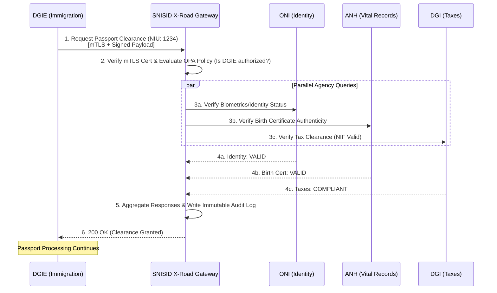
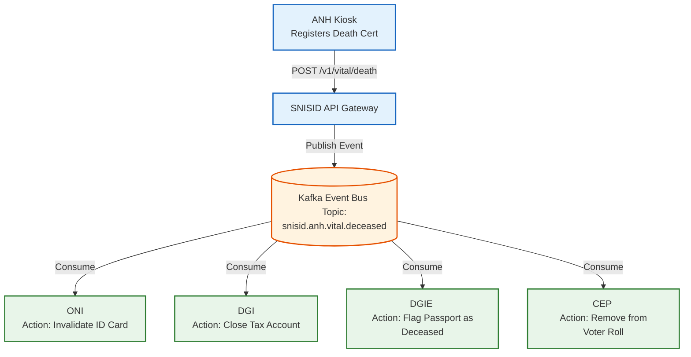

# SNISID Inter-Agency Integration Architecture
## National Data Exchange & Interoperability Framework

This document defines the **Inter-Agency Integration Architecture** for SNISID. Rather than creating a massive, centralized data lake that poses a catastrophic security risk, SNISID operates as an **Interoperability Gateway** (heavily inspired by the Estonian X-Road model). Data remains decentralized, owned, and governed by the respective sovereign agencies. SNISID facilitates the secure, cryptographically verifiable, and heavily audited transit of data between these entities.

---

## 1. Agency Roles & Data Custodianship

Each agency acts as the authoritative source of truth for a specific domain. SNISID maps the **Citizen Unique Identification Number (NIU)** across these domains.

1. **ONI (Office National d'Identification):** Source of truth for core identity, demographics, and biometrics.
2. **ANH (Archives Nationales d'Haïti):** Source of truth for vital events (birth, marriage, divorce, death).
3. **DGI (Direction Générale des Impôts):** Source of truth for tax compliance and the NIF (Numéro d'Immatriculation Fiscale).
4. **DCPJ (Direction Centrale de la Police Judiciaire):** Source of truth for criminal records and active judicial warrants.
5. **DGIE (Direction de l'Immigration et de l'Émigration):** Source of truth for passports, visas, and border movements.
6. **CEP (Conseil Électoral Provisoire):** Source of truth for voter registration and electoral participation.

---

## 2. Integration Governance & Standards

### Interoperability Standards
- **Protocol:** All inter-agency communication occurs over **RESTful HTTP/2** or **gRPC**.
- **Security:** Strict **Mutual TLS (mTLS)** is enforced. The API Gateway authenticates the calling agency's X.509 certificate (issued by the SNISID PKI) before routing traffic.
- **Data Exchange Format:** Standardized JSON payloads using a common data dictionary to ensure fields like `nom`, `prenom`, and `date_naissance` are uniformly formatted across the government.

### Data Minimization & Digital MOUs
Agencies cannot blindly dump data. Access is governed by digital Memorandums of Understanding (MOUs) codified as Open Policy Agent (OPA) Rego rules.
- *Example:* The CEP can query ONI to verify if a citizen is 18+, but the CEP cannot query the DCPJ to see if the citizen has a criminal record.

---

## 3. Sample API Contract (OpenAPI Snippet)

This contract defines how external agencies query SNISID for a citizen's interoperability status. SNISID returns a minimal payload; if the agency requires deep tax data, they must query DGI directly using the SNISID gateway.

```yaml
openapi: 3.0.3
info:
  title: SNISID Inter-Agency Identity API
  version: 1.0.0
paths:
  /v1/interop/citizens/{niu}/status:
    get:
      summary: Verify core citizen status across agencies
      parameters:
        - name: niu
          in: path
          required: true
          schema:
            type: string
            example: "1234567890"
      responses:
        '200':
          description: Aggregated Status Response
          content:
            application/json:
              schema:
                type: object
                properties:
                  identity_valid:
                    type: boolean
                    description: "True if ONI confirms active identity"
                  tax_compliant:
                    type: boolean
                    description: "True if DGI confirms tax clearance"
                  vital_status:
                    type: string
                    enum: [ALIVE, DECEASED]
                    description: "Sourced from ANH"
```

---

## 4. Integration Event Flows (Mermaid)

### Synchronous Flow: Passport Issuance (DGIE)
When a citizen applies for a passport, DGIE must verify their identity (ONI), birth certificate (ANH), and tax compliance (DGI) in real-time.



### Asynchronous Flow: Citizen Death Registration (ANH)
When a citizen passes away, the ANH registers the death certificate. This must asynchronously trigger updates across the entire government to prevent identity fraud, halt pension payments, and remove the citizen from voter rolls.



---
*Prepared by the SNISID Cloud Infrastructure & Resilience Board.*
