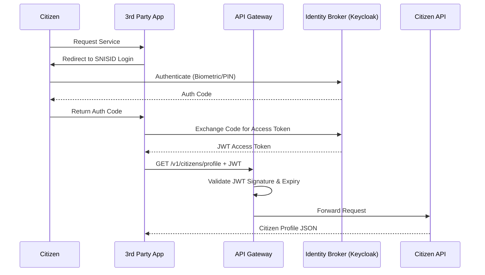
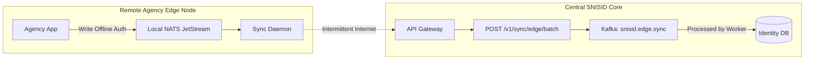
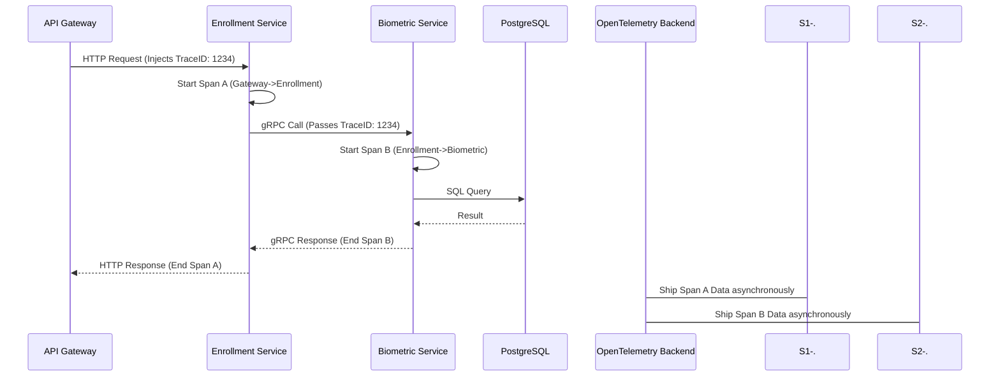

# SNISID: National Interoperability & API Gateway Architecture
## Secure Data Exchange & Sovereign API Governance

This document defines the **National Interoperability Framework and API Gateway Architecture** for the Système National d’Identification et d’Interopérabilité Sécurisée des Identités et des Données (SNISID). Built on Zero Trust API principles, OpenAPI/AsyncAPI standards, and heavily influenced by the Estonian X-Road model, this architecture ensures secure, highly available data exchange across the Republic of Haiti.

---

## 1. National Interoperability Framework & API Gateway

### The X-Road Inter-Agency Model
SNISID mandates a decentralized interoperability model. Government agencies (DGI, ONI, DCPJ) do not connect directly to centralized SNISID databases.
- **Security Servers:** Each agency hosts a Security Server acting as an API edge proxy.
- **Encrypted Envelopes:** Data requests are encapsulated in cryptographically signed SOAP or REST envelopes, ensuring non-repudiation and preventing Man-in-the-Middle (MitM) alterations.

### API Gateway Architecture
For external traffic (Citizens, Third-Party Banks, Web/Mobile Apps), SNISID utilizes an enterprise API Gateway (e.g., Kong or Tyk).
- **Edge Routing:** Acts as the single entry point to the Kubernetes cluster.
- **Plugins:** Handles rate limiting, JWT validation, WAF inspection, and request transformation *before* traffic reaches internal microservices.

## 2. API Lifecycle & Governance

### API Developer Portal & Sandbox
- **Developer Portal:** A centralized portal where authorized agencies and vetted private entities can browse available APIs, view OpenAPI specifications, and request access keys.
- **Sandbox Architecture:** A complete mock environment using synthetic citizen data (not real PII) allowing developers to test API integrations safely before applying for production access.

### National API Governance
- A central Interoperability Governance Board dictates strict JSON schema rules.
- **Standardized API Contracts:** All REST APIs must adhere to the OpenAPI 3.0.x specification. All asynchronous event streams must adhere to AsyncAPI specifications.
- **Versioning Standards:** URI-based major versioning (`/v1/citizens/`) with header-based minor versioning for non-breaking changes (`Accept-Version: v1.2`). Breaking changes require a 6-month deprecation period.
- **Error Handling Standards:** All errors strictly follow RFC 7807 (Problem Details for HTTP APIs) providing standard `type`, `title`, `status`, and `detail` fields.

## 3. API Security & Access Controls

### OAuth2 / OpenID Connect (OIDC) Integration
- The API Gateway integrates with the SNISID Identity Broker (Keycloak).
- Authorization Code Flow with PKCE is mandated for all mobile and single-page applications.

### mTLS API Security & Zero Trust
- **External mTLS:** High-security endpoints (e.g., Judicial extraction APIs) require the calling agency client to present an X.509 certificate issued by the SNISID PKI.
- **Internal mTLS:** The API Gateway proxies traffic to backend microservices over Istio-managed mTLS.

### API Rate Limiting, Throttling & Monetization
- **Rate Limiting:** Protects the infrastructure from DDoS. E.g., global limit of 10,000 requests/second per IP.
- **Throttling/Quotas:** Specific to the API Key/Client. E.g., A private bank may be restricted to 500 identity verifications per hour.
- **Monetization Readiness:** The API Gateway tracks precise usage metrics per Client ID, allowing the government to bill private entities (banks, telecoms) for biometric verification requests.

### Anti-Fraud Protections
- The Gateway inspects request headers and bodies. Large variations in `User-Agent`, impossible geographic travel times between API requests, or bulk sequential ID scraping trigger the WAF and instantly suspend the API key.

## 4. Event-Driven Integration & Orchestration

### Kafka & NATS Integration
Not all inter-agency communication is synchronous (REST).
- **Apache Kafka:** Used for heavy, central asynchronous orchestration. E.g., DGI subscribing to the `snisid.citizen.deceased` topic to automatically halt tax collection without polling a REST endpoint.
- **NATS JetStream:** Used at the edge. Lightweight, low-latency messaging for remote agencies.

### Service Registry & API Discovery
- Internal microservices register with CoreDNS and the Istio Service Registry.
- External API endpoints are published to the API Developer Portal dynamically via CI/CD pipelines reading the OpenAPI specs.

## 5. Core API Domains

### Citizen Verification APIs
- `GET /v1/citizens/{nni}/status`: Verifies if a National Identity Number (NNI) is active, suspended, or deceased.

### Biometric Verification APIs
- `POST /v1/biometrics/verify`: Accepts an encrypted biometric template and an NNI. Returns a boolean match score. (Raw images are strictly rejected).

### Consent APIs
- `POST /v1/consent/request`: Triggers a push notification to a citizen's mobile app requesting permission for Agency X to view their data.
- `GET /v1/citizens/{nni}/data`: Fails via 403 Forbidden if a valid consent grant is not found in the Consent Database.

### Offline Synchronization APIs
- `POST /v1/sync/edge/batch`: Designed for remote Haitian agencies. Accepts a compressed batch of offline transactions (e.g., offline birth registrations) signed by the local edge node's TPM.

### Audit APIs
- `GET /v1/audit/logs`: Highly restricted API for the Inspector General to pull immutable WORM logs showing exactly who accessed a citizen's record.

## 6. Observability, Analytics & SLA

### Distributed Tracing & OpenTelemetry
- Every API request hitting the Gateway is assigned a `trace-id`. 
- **OpenTelemetry** propagates this ID across Kafka streams and gRPC backend calls, allowing Jaeger to visualize the exact latency bottleneck across 15+ microservices.

### API Observability & Analytics
- The API Gateway pushes telemetry to Prometheus/Grafana.
- **Metrics Tracked:** P99 Latency, 4xx/5xx Error Rates, Payload Sizes.

### SLA Governance
- **Tier 1 APIs (Biometrics, Auth):** 99.999% availability. <200ms latency.
- **Tier 2 APIs (Analytics, Audit):** 99.9% availability. <2s latency.

## 7. Haiti-Specific Resilience Considerations

- **Asynchronous Fallbacks:** If the central database is slow due to degraded database replication links between Port-au-Prince and Cap-Haïtien, APIs automatically degrade gracefully. E.g., returning a `202 Accepted` and processing the request via Kafka instead of a timeout.
- **Edge Cache:** The API Gateway aggressively caches public/static API responses (e.g., public keys, CRLs) to minimize backend load during internet brownouts.

---

## 8. Architecture Diagrams (Mermaid)

### 1. National API Gateway & Interoperability Architecture
```mermaid
graph TD
    subgraph External Clients
        M[Mobile App]
        B[Private Bank]
    end

    subgraph Agency Domains
        DGI[DGI Security Server]
        ONI[ONI Security Server]
    end

    subgraph SNISID API Gateway (Kong)
        WAF[Web Application Firewall]
        Auth[OIDC / JWT Plugin]
        RL[Rate Limiting Plugin]
    end

    subgraph Internal SNISID Microservices
        ID[Identity Service]
        Bio[Biometric Service]
    end

    M -->|REST/HTTPS| WAF
    B -->|mTLS + REST| WAF
    DGI -->|X-Road Encrypted Envelope| ONI
    ONI -->|REST| WAF

    WAF --> Auth
    Auth --> RL
    RL -->|Istio mTLS| ID
    RL -->|Istio mTLS| Bio
```

### 2. OAuth2/OIDC Citizen Verification Flow


### 3. Offline Synchronization via NATS and Kafka


### 4. OpenTelemetry API Distributed Tracing Flow


---
*Prepared by the SNISID API Governance & Interoperability Board.*
