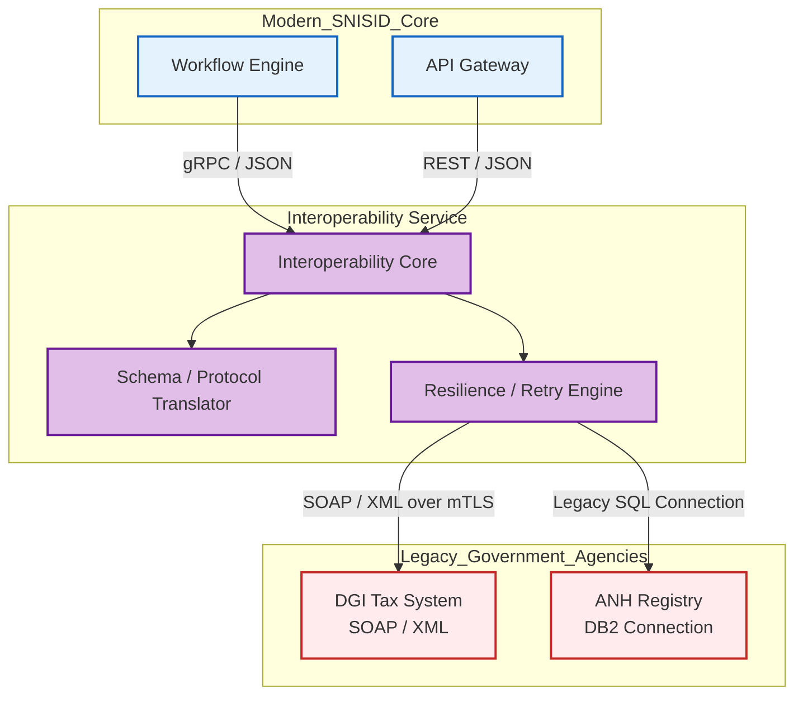
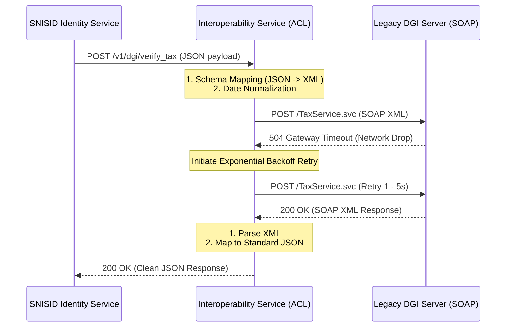

# SNISID Interoperability Service Architecture
## API Mediation & Protocol Translation (Anti-Corruption Layer)

This document outlines the architectural design for the **Interoperability Service**. While SNISID is a modern, cloud-native ecosystem communicating via gRPC and REST/JSON, the reality of the Haitian government is that many external agencies (e.g., DGI, ANH) run legacy, on-premise systems utilizing archaic protocols like SOAP/XML, or direct database connections. 

The Interoperability Service acts as an **Anti-Corruption Layer (ACL)**, shielding the pristine SNISID microservices from external legacy technical debt by mediating, translating, and normalizing all cross-agency communication.

---

## 1. API Mediation & Protocol Translation

### Legacy Protocol Translation
When SNISID needs to query an agency's legacy system, the Interoperability Service intercepts the modern internal request and translates it on-the-fly.
- **Input (From SNISID):** Standardized HTTP/2 REST `GET /v1/taxes/1234` (JSON)
- **Output (To DGI):** Legacy SOAP 1.1 Envelope over HTTP/1.1 (XML)

### Schema Transformation & Data Normalization
Different agencies use different database structures. The Interoperability Service maps and normalizes data into the unified SNISID ontology.
- **Date Normalization:** Converts external `DD-MM-YYYY` formats into strict ISO 8601 (`YYYY-MM-DDThh:mm:ssZ`).
- **Field Mapping:** Maps a legacy database column like `N_Famille` to the standardized SNISID field `last_name`.
- **Character Encoding:** Normalizes CP1252 or Latin-1 encodings (common in older systems) into standard `UTF-8` to ensure French and Haitian Creole accents (é, à, è) are preserved flawlessly.

---

## 2. Security: Request Signing & mTLS

- **Strict mTLS Validation:** The service acts as the edge client for outbound requests, maintaining the X.509 client certificates required to authenticate against other agencies.
- **JSON Web Signatures (JWS):** For highly sensitive payloads (e.g., sending biometric data to DCPJ), the service wraps the JSON payload in a JWS. The receiving agency can mathematically verify that the payload was generated by SNISID and not altered in transit.

---

## 3. Resilience & Retry Orchestration

Legacy government servers often suffer from extreme latency or unplanned downtime due to local power outages.
- **Asynchronous Buffering:** If the SNISID Workflow Engine requests a legacy update, the Interoperability Service accepts the request instantly (`202 Accepted`) and manages the actual HTTP call in the background.
- **Exponential Backoff:** If the external agency server times out, the service orchestrates an exponential backoff retry loop (e.g., retrying at 1s, 5s, 30s, 5m).
- **Circuit Breaking:** If an agency is completely offline, the Interoperability Service trips a local circuit breaker to prevent exhaustion of SNISID network connections, returning a cached state or a clean failure message.

---

## 4. Architecture Diagrams (Mermaid)

### 1. Interoperability Service Topology (Anti-Corruption Layer)
This diagram illustrates how the service insulates the modern core from legacy external systems.

### 2. Protocol Translation & Retry Sequence Flow
This sequence demonstrates the translation process and resilience mechanics when interacting with an unstable legacy system.

---
*Prepared by the SNISID Cloud Infrastructure & Resilience Board.*
