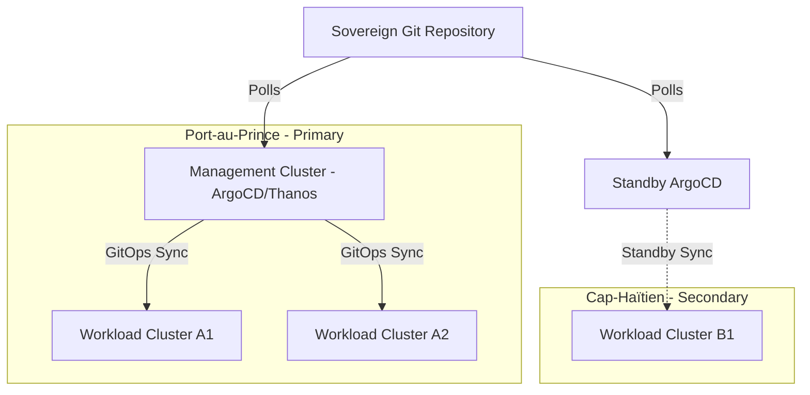
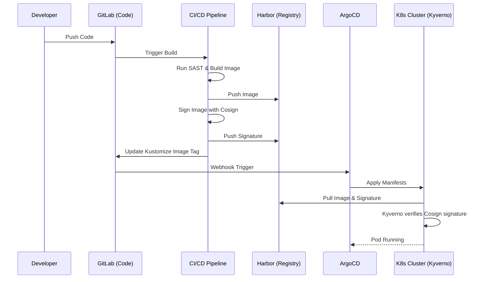
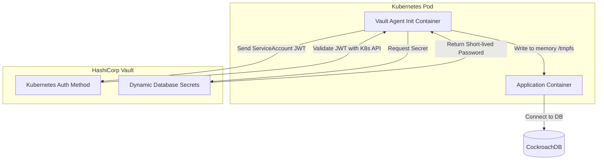
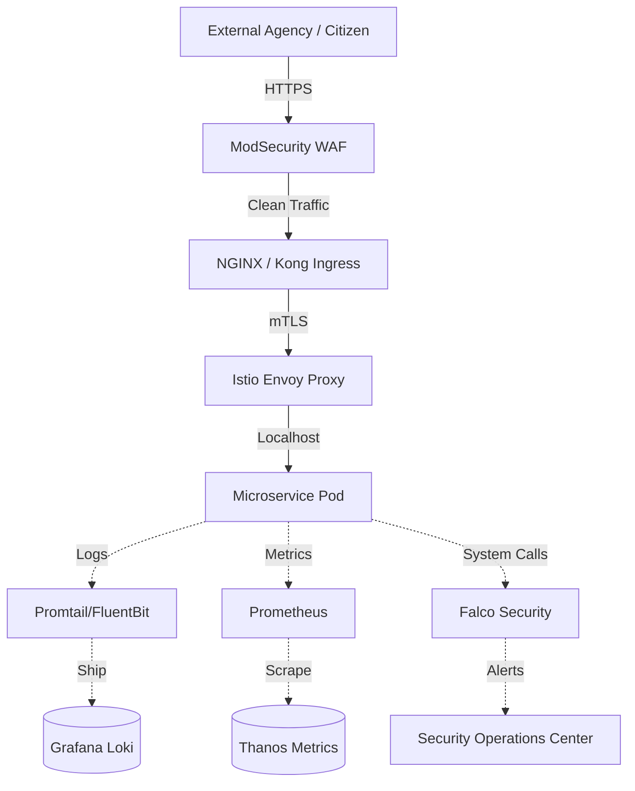

# SNISID: National Kubernetes Platform Architecture
## Sovereign Cloud-Native Infrastructure Specification

This document details the complete, sovereign, and production-grade Kubernetes architecture for the **Système National d’Identification et d’Interopérabilité Sécurisée des Identités et des Données (SNISID)**. This architecture strictly adheres to CNCF standards, NIST Zero Trust principles, and is built to withstand Haiti's unique infrastructure challenges.

---

## 1. Multi-Cluster & Multi-Region Topology

### National Platform Architecture
SNISID does not rely on a single massive cluster. Instead, it utilizes a federated, multi-cluster model to minimize the blast radius of any single failure.
- **Management Cluster:** Runs GitOps controllers (ArgoCD), centralized observability (Thanos/Grafana), and security dashboards.
- **Workload Clusters:** Dedicated clusters for Core Identity, Interoperability (X-Road), and Edge proxies.

### Multi-Region HA & Multi-Datacenter Strategy
- **Region A (Port-au-Prince):** Primary active datacenter. 3 distinct availability zones (racks/power domains).
- **Region B (Cap-Haïtien):** Secondary active datacenter.
- **Global Load Balancing (GSLB):** BGP Anycast routes traffic to the nearest healthy ingress. If Region A's cluster fails, traffic seamlessly shifts to Region B.

### Control Plane & Worker Node Segmentation
- **Control Plane:** 3x dedicated master nodes per cluster, running `etcd` on dedicated NVMe SSDs for low latency. Strictly tainted (`node-role.kubernetes.io/master:NoSchedule`).
- **Worker Segmentation (Node Pools):**
  - `system-pool`: Ingress controllers, CoreDNS.
  - `app-pool`: General microservices.
  - `data-pool`: Stateful workloads (CockroachDB). Hardware accelerated (High IOPS).
  - `bio-pool`: Biometric matching workloads. Hardware accelerated (GPUs/High CPU).

---

## 2. Security, Isolation & Zero Trust

### Namespace Strategy & Multi-Tenant Isolation
Namespaces act as hard multi-tenant boundaries.
- `snisid-core`: Core identity services.
- `snisid-edge`: API Gateway and WAF.
- `snisid-data`: Databases.
- `snisid-obs`: Observability stack.

### Network Policies & Service Mesh
- **Default Deny:** A global Cilium `NetworkPolicy` denies all ingress/egress traffic by default. Services must explicitly declare allowed peers.
- **Service Mesh:** **Istio** proxy sidecars are injected into every pod, enforcing strict **mTLS** for all pod-to-pod communication.

### RBAC, Pod Security & Admission Controllers
- **RBAC:** Strictly enforced. Service Accounts are mapped via OIDC to human identities. No human has cluster-admin access in production.
- **Pod Security Standards (PSS):** Enforced at the `Restricted` level. Containers must run as non-root, and `allowPrivilegeEscalation` must be false.
- **Admission Controllers:** **Kyverno** validates every YAML manifest before it touches the API server, blocking deployments that lack required labels or attempt to mount host volumes.

---

## 3. Secrets, Vault, and HSM Integration

### Secrets Management & Vault
Kubernetes `Secrets` (base64 encoded) are explicitly banned.
- **HashiCorp Vault:** Acts as the central secret store. 
- **Vault Agent Injector:** Injects secrets directly into pod memory (`/vault/secrets/config`) using Kubernetes Service Account authentication.

### HSM Integration
- Vault’s Auto-Unseal and Master Key are backed by the National PKI Thales HSMs using the PKCS#11 standard. This ensures the Kubernetes encryption keys are hardware-backed.

---

## 4. GitOps Deployment Architecture

### ArgoCD, Helm, and Kustomize Strategy
- **ArgoCD:** The single source of truth. ArgoCD continuously monitors Git repositories and synchronizes the state to the clusters. `kubectl apply` is disabled for humans.
- **Helm:** Used to package complex third-party applications (e.g., Istio, CockroachDB).
- **Kustomize:** Used to overlay environment-specific configurations (Dev, Staging, Prod) onto base manifests without duplicating YAML.

### GitOps Repository Structure
```text
snisid-gitops/
├── clusters/
│   ├── port-au-prince-prod/ (ArgoCD App-of-Apps)
│   └── cap-haitien-prod/
├── base/
│   ├── identity-service/ (Deployments, Services)
│   └── biometric-service/
└── overlays/
    ├── prod/ (Kustomization patches for HA)
    └── staging/
```

---

## 5. Storage, Backup & Disaster Recovery

### Persistent Storage & Cluster Autoscaling
- **Storage:** **Rook/Ceph** provides distributed block (`RWO`) and object storage within the cluster.
- **Autoscaling:** **Cluster Autoscaler** interacts with the underlying hypervisor (or bare metal API) to provision new worker nodes. **HPA** and **KEDA** scale pods horizontally based on CPU and Kafka lag.

### Disaster Recovery & Backups
- **Velero:** Takes daily snapshots of Kubernetes state (ETCD) and Persistent Volumes.
- **Immutability:** Backups are shipped to an immutable S3-compatible object store in a geographically separate bunker. RTO < 1 hour.

---

## 6. Observability Stack & Runtime Security

### Observability
- **Prometheus & Thanos:** Scrapes metrics. Thanos federates metrics across all multi-region clusters for a single pane of glass.
- **Grafana:** Visualizes metrics.
- **Loki:** Aggregates logs efficiently using label indexing, avoiding the heavy footprint of Elasticsearch.
- **OpenTelemetry:** Traces every request from the Ingress down to the database using W3C trace contexts.

### Runtime Security & Falco
- **Falco:** Runs as a DaemonSet. Triggers high-priority SOC alerts if a container performs a suspicious system call (e.g., `execve` spawning bash, reading `/etc/shadow`).

---

## 7. Supply Chain & CI/CD Integration

### Image Signing & SBOM Strategy
- **Cosign (Sigstore):** Every Docker image is cryptographically signed in the GitLab CI/CD pipeline.
- **Kyverno Enforcer:** Kyverno blocks the deployment of any image that lacks a valid Cosign signature from the SNISID internal PKI.
- **SBOM:** Syft generates a Software Bill of Materials for every image, identifying vulnerable transitive dependencies before deployment.

---

## 8. Haiti-Specific Resilience Patterns

### Offline Resilience Strategy
- **Edge Kubernetes (K3s):** Remote agency locations run a lightweight K3s single-node cluster. If internet connectivity to Port-au-Prince drops, the local K3s node continues to serve offline cached identity verifications and queues logs via NATS Jetstream.
- **Bandwidth Optimization:** Container images are highly optimized (Alpine/Distroless, <50MB) to allow rapid pulls over saturated satellite or 3G links.
- **Power Failure Safe-State:** Storage classes are configured to safely flush cache on AC power loss signals from local UPS systems, preventing Ceph volume corruption during sudden grid blackouts.

---

## 9. Production-Ready YAML Examples

### 1. Zero Trust Network Policy (Cilium/Kubernetes)
```yaml
apiVersion: networking.k8s.io/v1
kind: NetworkPolicy
metadata:
  name: default-deny-identity-namespace
  namespace: snisid-core
spec:
  podSelector: {} # Selects all pods in the namespace
  policyTypes:
  - Ingress
  - Egress
  ingress:
  - from:
    - namespaceSelector:
        matchLabels:
          kubernetes.io/metadata.name: snisid-edge
    - podSelector:
        matchLabels:
          app: api-gateway
    ports:
    - protocol: TCP
      port: 8443 # Only allow mTLS traffic from the API Gateway
```

### 2. ArgoCD Application Manifest (GitOps)
```yaml
apiVersion: argoproj.io/v1alpha1
kind: Application
metadata:
  name: snisid-identity-service-prod
  namespace: argocd
spec:
  project: default
  source:
    repoURL: 'https://git.snisid.gov.ht/infrastructure/snisid-gitops.git'
    path: overlays/prod/identity-service
    targetRevision: HEAD
  destination:
    server: 'https://kubernetes.default.svc'
    namespace: snisid-core
  syncPolicy:
    automated:
      prune: true
      selfHeal: true
```

---

## 10. Architecture Diagrams (Mermaid)

### 1. Multi-Cluster Topology & Multi-Region HA


### 2. GitOps Supply Chain & Image Signing Flow


### 3. Vault Secrets Injection & Pod Security


### 4. Zero Trust Ingress & Observability Flow


---
*Enterprise Architect Note: SNISID Kubernetes infrastructure strictly disables all legacy features (e.g., ABAC, insecure-port, anonymous-auth) to ensure absolute alignment with CIS Kubernetes Benchmarks.*
