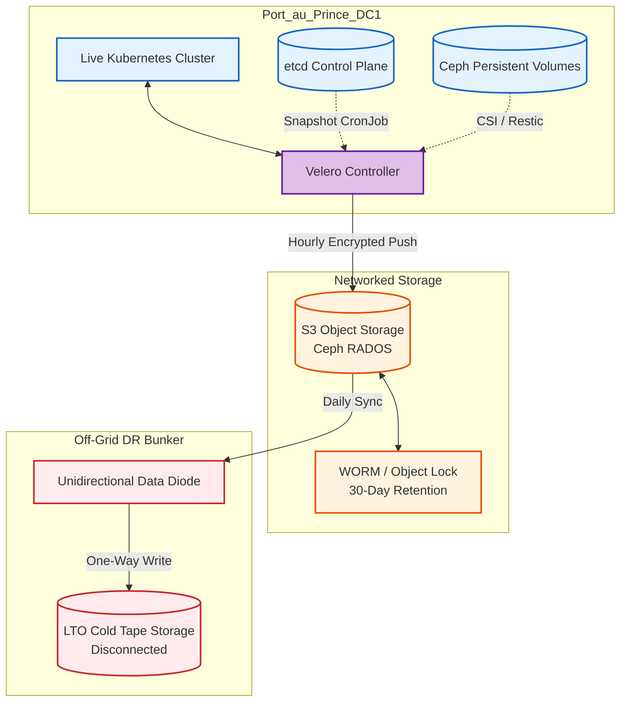
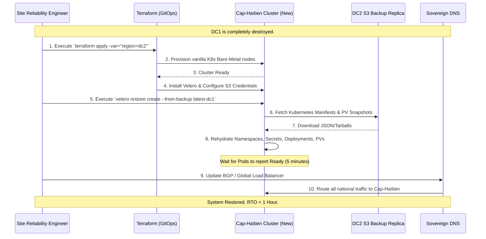

# SNISID Kubernetes Disaster Recovery Architecture
## Velero Backups, Etcd Resilience & Air-Gapped Recovery

This document details the **Kubernetes Disaster Recovery (DR) Architecture** for SNISID. Beyond standard active-active replication, this architecture focuses on "Black Swan" events—such as catastrophic ransomware wiping out the primary storage arrays, or a Category 5 hurricane physically destroying the Port-au-Prince datacenter. It ensures that the entire SNISID Kubernetes ecosystem can be restored from scratch.

---

## 1. Etcd Backup & Cluster State

The `etcd` key-value store is the absolute "brain" of Kubernetes. If `etcd` is lost, the cluster is dead.
- **Automated Snapshots:** CronJobs running on the master nodes execute `etcdctl snapshot save` every 15 minutes.
- **Off-Node Storage:** Snapshots are immediately pushed via an encrypted tunnel to an immutable S3 bucket. They are never kept solely on the local master node's disk.

---

## 2. Workload & Persistent Volume Backups (Velero)

SNISID utilizes **VMware Velero** to backup cluster resources, namespaces, and StatefulSet persistent volumes.

### Kubernetes Resources (Stateless)
- Velero takes hourly snapshots of all Kubernetes objects (Deployments, Services, ConfigMaps, Secrets, Istio VirtualServices, OPA Policies) and stores them as JSON/tarballs in an S3-compatible backend (e.g., MinIO or Ceph).

### Persistent Volumes (Stateful)
- **CSI Snapshots:** For databases (CockroachDB, Kafka), Velero utilizes the Ceph Container Storage Interface (CSI) to trigger instant storage-level snapshots.
- **Restic/Kopia:** For volumes that do not support native CSI snapshots, Velero uses Kopia to copy the filesystem data block-by-block.

---

## 3. Immutable & Air-Gapped Storage

To survive targeted ransomware attacks or malicious insiders attempting to wipe backups:
1. **Object Lock (WORM):** The primary Ceph S3 backup bucket enforces Write-Once-Read-Many (WORM). Once Velero writes a backup, it cannot be deleted or modified by anyone—even the storage administrator—for 30 days.
2. **Air-Gapped Cold Vault:** Once a day, the backups are pushed over a unidirectional data diode to an air-gapped, offline storage vault (or LTO tape drives in an offsite bunker). This ensures that even if the entire SNISID network is logically compromised, an untouched baseline exists offline.

---

## 4. Disaster Recovery Scenarios & Automation

### 1. Accidental Namespace Deletion (Targeted Restore)
- **Scenario:** A Junior admin accidentally runs `kubectl delete namespace snisid-identity`.
- **Response:** An SRE runs `velero restore create --from-backup <latest> --include-namespaces snisid-identity`. The Identity microservices are pulled from S3 and fully restored within 3 minutes.

### 2. Complete Cluster Loss (DC1 Destroyed)
- **Scenario:** Port-au-Prince is hit by a massive earthquake. The bare-metal cluster is gone.
- **Response:** 
  1. The DR team spins up a vanilla Kubernetes cluster in the DC2 (Cap-Haïtien) location via automated Terraform.
  2. Velero is installed and pointed to the replicated (or air-gapped) S3 backup bucket.
  3. `velero restore create --from-backup <latest>` is executed. All namespaces, policies, and persistent volumes are rehydrated into the new cluster.
  4. Global DNS automatically flips to point to the DC2 ingress.

---

## 5. Architecture & Recovery Diagrams (Mermaid)

### 1. Velero Backup & Air-Gapped Topology
This diagram illustrates how data flows from the live cluster into immutable and air-gapped storage.

### 2. Complete Cluster Recovery Workflow (DC1 to DC2)
This sequence maps the automated procedure to restore SNISID after a catastrophic physical loss.

---
*Prepared by the SNISID Cloud Infrastructure & Resilience Board.*
