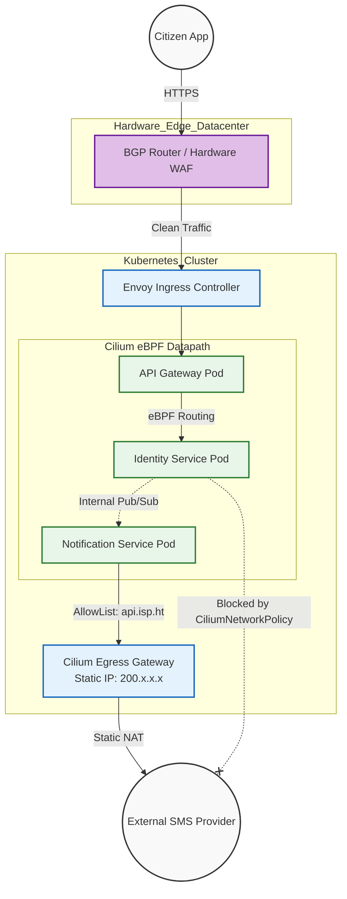

# SNISID Kubernetes Networking Architecture
## Sovereign Routing, Cilium eBPF, and Network Segmentation

This document details the **Kubernetes Networking Architecture** for SNISID. To achieve extreme performance, scale, and uncompromising Zero Trust isolation, SNISID completely replaces traditional iptables-based routing with **Cilium**—a next-generation eBPF-powered Container Network Interface (CNI). 

---

## 1. Core CNI & Datapath (Cilium & eBPF)

### Bypassing `kube-proxy`
Legacy Kubernetes networking relies on `kube-proxy` and massive, complex `iptables` rulesets, which degrade in performance as clusters scale to thousands of services. 
SNISID runs **Cilium in strict `kube-proxy` replacement mode**. By compiling networking rules directly into the Linux kernel using **eBPF (Extended Berkeley Packet Filter)**, packet routing, load balancing, and network policy enforcement occur at the lowest possible layer, drastically reducing latency and CPU overhead.

### Identity-Aware Networking
Unlike traditional firewalls that rely on ephemeral IP addresses (which change constantly in Kubernetes), Cilium assigns a cryptographic security identity to every pod based on its Kubernetes labels and service accounts. Network policies are enforced based on these identities, not IPs.

---

## 2. Ingress, Egress, and Sovereign DNS

### Sovereign BGP Routing & DDoS Protection
- **BGP Anycast:** SNISID operates its own sovereign ASN (Autonomous System Number). Traffic from citizen mobile apps hits physical hardware routers at the edge of the datacenter running BGP.
- **DDoS Mitigation:** At the L3/L4 hardware layer, scrubbers filter volumetric DDoS attacks. Only clean traffic is passed to the Kubernetes Ingress Controllers (Envoy/Nginx).

### Strict Egress Controls
Outbound internet access is universally denied by default.
- Microservices like the Identity Service or Biometric Service possess **zero internet routing capability**.
- If a service *must* reach an external system (e.g., an external SMS provider API), traffic is forced through a dedicated **Cilium Egress Gateway**. This gateway provides a static IP address to the external provider (for IP whitelisting) and enforces L7 DNS-based policies (e.g., `Allow HTTPS to api.digicel.ht`, deny everything else).

### Sovereign DNS
- Internal cluster DNS is handled by **CoreDNS**, caching requests heavily via `NodeLocal DNSCache` to prevent DNS bottlenecking.
- External DNS resolution is pointed to heavily filtered, government-controlled resolvers, preventing DNS spoofing or tunneling attacks.

---

## 3. Network Segmentation (CiliumNetworkPolicy)

SNISID implements both L3/L4 (IP/Port) and L7 (HTTP/gRPC) segmentation natively within the CNI.

**Example: Strict Egress Network Policy**
This policy completely blocks the Identity Pod from reaching the internet, but allows it to resolve DNS and communicate specifically with the CockroachDB service on port 26257.

```yaml
apiVersion: "cilium.io/v2"
kind: CiliumNetworkPolicy
metadata:
  name: identity-egress-lockdown
  namespace: snisid-identity
spec:
  endpointSelector:
    matchLabels:
      app: identity-service
  egress:
  - toEndpoints:
    - matchLabels:
        app: cockroachdb
    toPorts:
    - ports:
      - port: "26257"
        protocol: TCP
  - toEndpoints:
    - matchLabels:
        k8s:io.kubernetes.pod.namespace: kube-system
        k8s-app: kube-dns
    toPorts:
    - ports:
      - port: "53"
        protocol: UDP
```

---

## 4. Architecture Diagrams (Mermaid)

### 1. Ingress to Egress Sovereign Traffic Flow
This diagram illustrates how traffic enters the national network, routes through the eBPF mesh, and exits via strictly controlled gateways.



### 2. eBPF Kernel Routing vs Legacy iptables
This diagram shows why SNISID utilizes Cilium, demonstrating the latency reduction by bypassing the network stack overhead.

```mermaid
graph LR
    classDef legacy fill:#ffebee,stroke:#c62828,stroke-width:2px;
    classDef ebpf fill:#e8f5e9,stroke:#2e7d32,stroke-width:2px;
    classDef pod fill:#e3f2fd,stroke:#1565c0,stroke-width:2px;

    PodA[Source Pod]:::pod
    PodB[Destination Pod]:::pod

    subgraph Legacy_kube_proxy
        IP[iptables rules (10,000+ lines)]:::legacy
        TCP[TCP/IP Stack Processing]:::legacy
    end

    subgraph Modern_Cilium
        BPF[eBPF Kernel Program <br/> Instant Socket Routing]:::ebpf
    end

    PodA -->|Legacy Path| IP
    IP --> TCP
    TCP --> PodB

    PodA -->|Cilium Path| BPF
    BPF -->|Direct| PodB
```

---
*Prepared by the SNISID Cloud Infrastructure & Resilience Board.*
