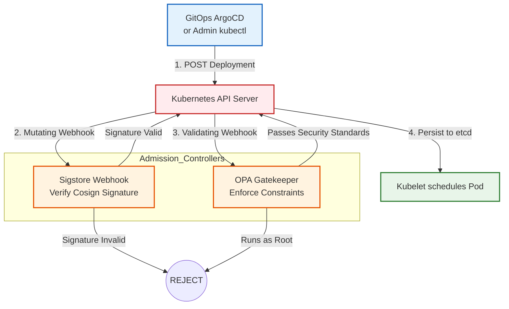
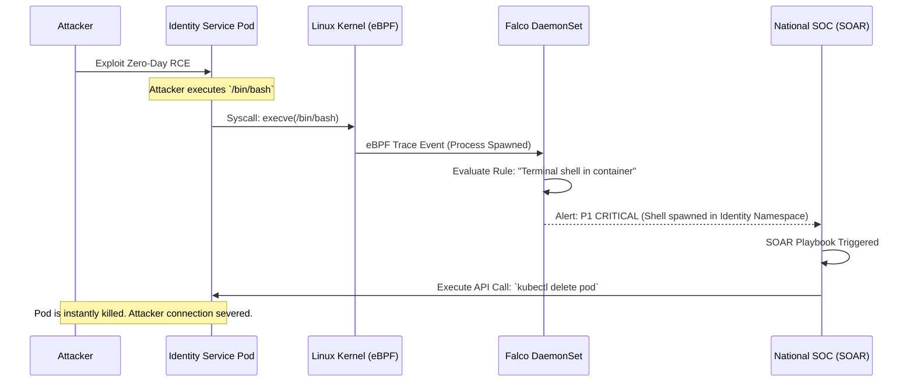

# SNISID Kubernetes Security Architecture
## Zero Trust Compute & Runtime Threat Defense

This document details the **Kubernetes Security Architecture** for SNISID. Because the system manages the sovereign identity of 15+ million Haitian citizens, a breach of the compute plane is catastrophic. This architecture assumes the network is hostile and enforces "Defense in Depth" across the entire Kubernetes lifecycle: from the supply chain, to admission control, down to eBPF kernel runtime security.

---

## 1. Supply Chain & Admission Control (OPA/Gatekeeper)

### Cryptographic Image Signing (Sigstore/Cosign)
To prevent malicious code from executing, SNISID enforces strict supply chain security.
1. During the CI/CD pipeline, every Docker image is scanned via Trivy and cryptographically signed using **Cosign**.
2. A mutating admission webhook (Sigstore Policy Controller) intercepts the deployment attempt. If the image signature is invalid or missing, Kubernetes outright rejects the pod.

### OPA Gatekeeper Constraints
**Open Policy Agent (OPA) Gatekeeper** acts as the cluster bouncer. Even if a cluster admin attempts to deploy a pod via `kubectl`, Gatekeeper enforces the organizational security policies.
- **No Privileged Pods:** Pods cannot run as `root` or request `Privileged` context.
- **Read-Only Root Filesystem:** Pods must mount their root filesystem as read-only.
- **Approved Registries Only:** Images can only be pulled from `harbor.snisid.ht`.

**Example YAML constraint for Read-Only Root Filesystem:**
```yaml
apiVersion: constraints.gatekeeper.sh/v1beta1
kind: K8sPSAReadOnlyRootFilesystem
metadata:
  name: pod-must-have-readonly-rootfs
spec:
  match:
    kinds:
      - apiGroups: [""]
        kinds: ["Pod"]
    namespaces: ["snisid-identity", "snisid-biometrics", "snisid-consent"]
```

---

## 2. Runtime Security & eBPF (Falco)

While OPA secures the *deployment* phase, **Falco** secures the *runtime* phase.

### Kernel-Level Threat Detection
Falco is deployed as a DaemonSet using **eBPF (Extended Berkeley Packet Filter)** to trace kernel system calls securely. It detects anomalous post-compromise behavior in real-time, such as:
- A malicious actor successfully exploiting an RCE (Remote Code Execution) vulnerability and popping a shell (`bash` or `sh`) inside a running container.
- A process attempting to write to sensitive directories like `/etc/shadow` or `/var/run/secrets`.
- An unexpected binary making outbound network connections (C2 server beaconing).

**Response:** If Falco detects a threat, it emits a critical alert to the SOC SIEM and can trigger a SOAR playbook to instantly `kubectl delete pod` or cordon the infected node.

---

## 3. Workload Isolation & Network Zero Trust

### Container Runtime Sandboxing (gVisor)
For highly exposed workloads (like the external API Gateway or Web Application Firewalls), SNISID replaces the standard `runc` runtime with **gVisor**. gVisor provides a user-space kernel wrapper, ensuring that even if a container breakout vulnerability (like a zero-day in the Linux kernel) is exploited, the attacker remains trapped in the sandbox and cannot access the underlying physical node.

### Network Segmentation (NetworkPolicies)
By default, Kubernetes allows all pods to communicate. SNISID implements a strict **Default-Deny All** NetworkPolicy for every namespace.

**Example Default Deny-All YAML:**
```yaml
apiVersion: networking.k8s.io/v1
kind: NetworkPolicy
metadata:
  name: default-deny-all
  namespace: snisid-identity
spec:
  podSelector: {} # Selects ALL pods in the namespace
  policyTypes:
  - Ingress
  - Egress
```
*Note: Traffic is only permitted via explicit, granular `Allow` rules (e.g., Identity Pod is only allowed Egress to the CockroachDB port).*

---

## 4. Architecture Diagrams (Mermaid)

### 1. Supply Chain & Admission Control Flow
This diagram illustrates how a deployment request is heavily validated before it is allowed into the cluster.



### 2. Falco eBPF Runtime Threat Defense
This flowchart demonstrates the real-time kernel monitoring and automated SOC response.



---
*Prepared by the SNISID Cloud Infrastructure & Resilience Board.*
