# SNISID Kubernetes Topology Architecture

Below is the complete Kubernetes topology diagram detailing the multi-cluster environment, CI/CD GitOps pipelines, namespaces, security boundaries, observability stack, and Disaster Recovery setup.

```mermaid
graph TD
    %% Styling and Themes
    classDef gitops fill:#e3f2fd,stroke:#1565c0,stroke-width:2px;
    classDef mgt fill:#f3e5f5,stroke:#6a1b9a,stroke-width:2px;
    classDef prod fill:#e8f5e9,stroke:#2e7d32,stroke-width:2px;
    classDef dr fill:#ffebee,stroke:#c62828,stroke-width:2px;
    classDef sec fill:#fff3e0,stroke:#e65100,stroke-width:2px;
    classDef obs fill:#e0f7fa,stroke:#006064,stroke-width:2px;

    %% 1. CI/CD & GitOps Control Plane
    subgraph L1 [GitOps & CI/CD Control Plane]
        GL[GitLab CI/CD <br/> Image Build & Cosign Sign]:::gitops
        HAR[Harbor OCI Registry]:::gitops
        GIT[GitOps Repo <br/> Kustomize / Helm Manifests]:::gitops
        
        GL -->|Push Signed Image| HAR
        GL -->|Commit Tag Update| GIT
    end

    %% 2. Management Cluster
    subgraph L2 [Management Cluster]
        ARGO[ArgoCD GitOps Controller]:::mgt
        THANOS[Thanos Global Metrics Querier]:::mgt
        
        GIT -.->|Webhook Trigger| ARGO
    end

    %% 3. Primary Production Cluster (Port-au-Prince)
    subgraph L3 [Primary HA Cluster - Port-au-Prince]
        K8S_API[Kubernetes API Server]:::prod
        KYV[Kyverno Admission Controller]:::sec
        
        ARGO -->|Syncs Desired State| K8S_API
        K8S_API -->|Validates Admission| KYV
        KYV -.->|Verifies Image Signature| HAR
        
        subgraph NS_EDGE [Namespace: snisid-edge]
            ING[Kong Ingress Controller + WAF]:::prod
        end
        
        subgraph NS_CORE [Namespace: snisid-core]
            ISTIO[Istio Service Mesh Control Plane]:::sec
            APP1[Identity Service Pod <br/> + Envoy Sidecar]:::prod
            APP2[Biometric Service Pod <br/> + Envoy Sidecar]:::prod
            
            ISTIO -.->|Manages mTLS| APP1
            ISTIO -.->|Manages mTLS| APP2
        end
        
        subgraph NS_SEC [Namespace: snisid-security]
            VAULT[HashiCorp Vault]:::sec
            FALCO[Falco Runtime Security DaemonSet]:::sec
            SPIRE[SPIRE Server - Workload Identity]:::sec
        end
        
        subgraph NS_OBS [Namespace: snisid-obs]
            OTEL[OpenTelemetry Collector]:::obs
            PROM[Prometheus Operator]:::obs
            LOKI[Grafana Loki]:::obs
        end
        
        %% Internal Cluster Routing & Security
        ING -->|Routes External Traffic| APP1
        APP1 <-->|mTLS Encrypted Traffic| APP2
        
        VAULT -.->|Injects Dynamic DB Secrets| APP1
        SPIRE -.->|Issues X.509 SVIDs| APP1
        
        %% Observability & Telemetry Flows
        APP1 -.->|Metrics/Traces| OTEL
        FALCO -.->|Container Runtime Alerts| LOKI
        OTEL -->|Metrics| PROM
        OTEL -->|Logs| LOKI
    end

    %% 4. Disaster Recovery Cluster (Cap-Haïtien)
    subgraph L4 [Disaster Recovery Cluster - Cap-Haïtien]
        DR_API[DR K8s API Server]:::dr
        DR_ING[DR Kong Ingress]:::dr
        DR_CORE[DR Identity Services]:::dr
        DR_PROM[DR Prometheus]:::dr
        
        ARGO -.->|Passive GitOps Sync| DR_API
        DR_PROM -.->|Metrics Federation| THANOS
        PROM -.->|Metrics Federation| THANOS
    end
```

