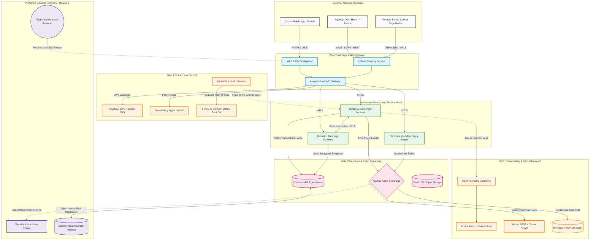

# SNISID Master Architecture Diagram

Below is the complete, enterprise-grade Mermaid architecture diagram representing the entire SNISID national infrastructure.

```mermaid
graph TD
    %% Styling and Themes
    classDef external fill:#f9f9f9,stroke:#333,stroke-width:2px;
    classDef edge fill:#e1f5fe,stroke:#0277bd,stroke-width:2px;
    classDef core fill:#e8f5e9,stroke:#2e7d32,stroke-width:2px;
    classDef security fill:#fff3e0,stroke:#ef6c00,stroke-width:2px;
    classDef data fill:#fce4ec,stroke:#c2185b,stroke-width:2px;
    classDef dr fill:#ede7f6,stroke:#4527a0,stroke-width:2px;

    %% 1. External Layer
    subgraph L1 [External Actors & Agencies]
        C[Citizen Mobile App / Portals]:::external
        A1[Agency: DGI / Health / Justice]:::external
        A2[Remote Border Control Edge Nodes]:::external
    end

    %% 2. Edge & Interoperability Layer
    subgraph L2 [Zero Trust Edge & API Gateway]
        WAF[WAF & DDoS Mitigation]:::edge
        AGW[Kong National API Gateway]:::edge
        XROAD[X-Road Security Servers]:::edge
        
        C -->|HTTPS / OIDC| WAF
        A1 -->|mTLS / SOAP / REST| XROAD
        A2 -->|Offline Sync / mTLS| XROAD
        WAF --> AGW
        XROAD --> AGW
    end

    %% 3. Identity & Security Layer
    subgraph L3 [IAM, PKI & Access Control]
        IDP[Keycloak IDP / National SSO]:::security
        OPA[Open Policy Agent / ABAC]:::security
        VAULT[HashiCorp Vault / Secrets]:::security
        HSM[FIPS 140-3 HSM / Offline Root CA]:::security
        
        AGW -->|JWT Validation| IDP
        AGW -->|Policy Check| OPA
        VAULT -->|Hardware Root of Trust| HSM
    end

    %% 4. Kubernetes Workloads & Service Mesh
    subgraph L4 [Kubernetes Core & Istio Service Mesh]
        ISVC[Identity & Enrollment Services]:::core
        BSVC[Biometric Matching Services]:::core
        WSVC[Temporal Workflow Saga Engine]:::core
        
        AGW -->|mTLS| ISVC
        AGW -->|mTLS| BSVC
        AGW -->|mTLS| WSVC
        ISVC <-->|Strict Pod-to-Pod mTLS| BSVC
        VAULT -.->|Inject SPIFFE/SVID Certs| ISVC
    end

    %% 5. Event Bus & Data Persistence
    subgraph L5 [Data Persistence & Event Streaming]
        KAFKA{Apache Kafka Event Bus}:::data
        CDB[(CockroachDB Core Master)]:::data
        S3[(Ceph / S3 Object Storage)]:::data
        
        ISVC -->|Emit Async Events| KAFKA
        WSVC -->|Orchestrate Topics| KAFKA
        ISVC -->|CQRS Transactional Write| CDB
        BSVC -->|Store Encrypted Templates| CDB
    end

    %% 6. Observability, Audit & SOC
    subgraph L6 [SOC, Observability & Immutable Audit]
        OTEL[OpenTelemetry Collectors]:::security
        PROM[Prometheus + Grafana Loki]:::security
        SIEM[Wazuh SIEM + Cortex SOAR]:::security
        WORM[(Immutable WORM Ledger)]:::security
        
        ISVC -.->|Traces, Metrics, Logs| OTEL
        OTEL --> PROM
        KAFKA -->|Continuous Audit Trail| WORM
        KAFKA -->|Security Alerts & Falco| SIEM
    end

    %% 7. Disaster Recovery & PRA/PCA
    subgraph L7 [PRA/PCA Disaster Recovery - Region B]
        GSLB((Global Server Load Balancer)):::dr
        DR_K8S[Standby Kubernetes Cluster]:::dr
        DR_CDB[(Standby CockroachDB Follower)]:::dr
        
        GSLB -.->|Active/Active DNS Failover| WAF
        CDB <-->|Synchronous Raft Replication| DR_CDB
        KAFKA -.->|MirrorMaker 2 Async Sync| DR_K8S
    end
```
