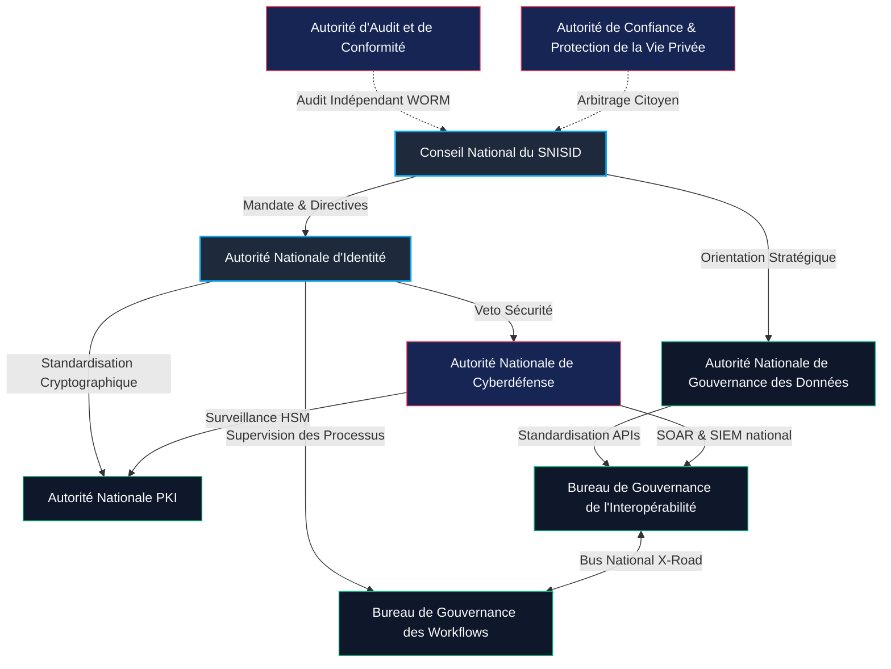
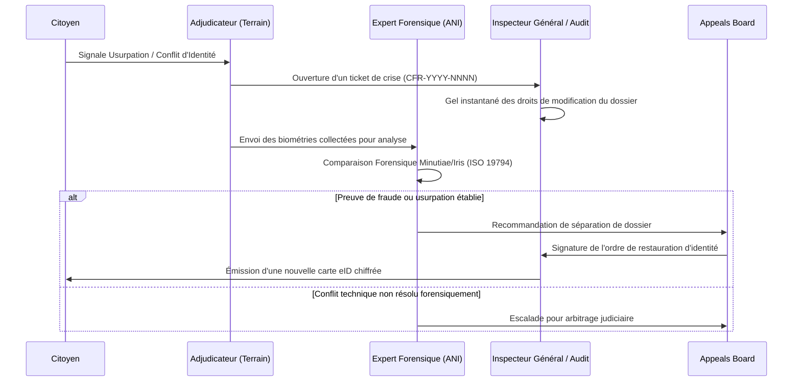
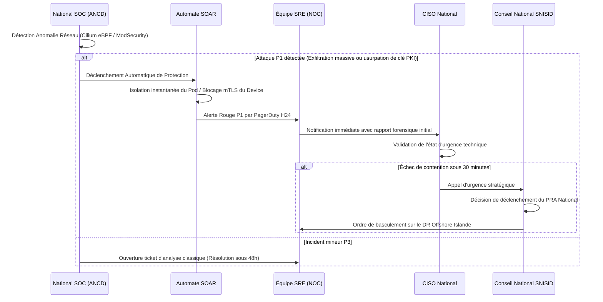

# SNISID SOUVERAIN : PLAN DE GOUVERNANCE NATIONALE DE RÉFÉRENCE
## Cadre de Gouvernance de l'Infrastructure Critique Nationale d'Identité Numérique et d'Interopérabilité
**République d'Haïti — Production Gouvernementale H24/7/365**

---

## PRÉAMBULE : STATUT DE L'INFRASTRUCTURE
Le Système National d’Identification et d’Interopérabilité Sécurisée des Identités et des Données (SNISID) est classé réglementairement comme **Infrastructure Critique Souveraine de Sécurité Nationale**. Il ne s'agit pas d'un système d'information standard ou d'une simple application logicielle, mais du fondement même de la souveraineté numérique de la République d'Haïti. En tant que tel, son exploitation, sa résilience cybernétique et son intégrité juridique sont régies par le présent cadre de gouvernance nationale, opposable à l'ensemble des institutions républicaines.

---

# SECTION 1 — STRUCTURE DE GOUVERNANCE NATIONALE

Le modèle institutionnel du SNISID repose sur une séparation stricte des pouvoirs (législatif, de régulation, d'exécution, d'audit et cyber-défense). Le schéma institutionnel s'articule autour de neuf (9) autorités clés coordonnées de manière matricielle.



---

## 🏛️ Descriptif des Neuf (9) Organes Souverains

### 1. Conseil National du SNISID (CNS)
*   **Composition :** Présidé par le Premier Ministre, co-présidé par le Ministre de la Justice et de la Sécurité Publique (MJSP), le Secrétaire Général de la Présidence, le Directeur Général de l'Office National d'Identification (ONI) et le CISO National (ANCD).
*   **Rôle et Pouvoirs :** Plus haute instance décisionnelle de l'État en matière d'identité souveraine. Le CNS valide la feuille de route stratégique, approuve les allocations budgétaires et arbitre les blocages politiques ou institutionnels majeurs inter-agences. Il détient le pouvoir ultime de déclenchement des protocoles nationaux d'état d'urgence numérique.

### 2. Autorité Nationale d'Identité (ANI)
*   **Composition :** Hauts fonctionnaires de la Direction de l'État Civil, ingénieurs en biométrie de l'ONI, juristes spécialisés du Ministère de la Justice.
*   **Rôle et Pouvoirs :** Opérateur exécutif de la base nationale d'identité. Elle gère le cycle de vie du Numéro National d'Identification (NNI), assure la maintenance fonctionnelle de l'ABIS (Automated Biometric Identification System) et certifie l'identité juridique de chaque citoyen enrôlé.

### 3. Autorité Nationale de Gouvernance des Données (ANGD)
*   **Composition :** Experts en métadonnées, archivistes nationaux, data scientists, délégués à la protection des données (DPO) ministériels.
*   **Rôle et Pouvoirs :** Régulateur de l'accès aux données. L'ANGD définit la classification de sécurité de chaque donnée PII (Personally Identifiable Information), contrôle les flux de données inter-agences et veille au respect strict du principe de non-centralisation (les données restent chez le producteur originel, l'interopérabilité ne servant que de routeur).

### 4. Autorité Nationale PKI (AN-PKI)
*   **Composition :** Cryptographes d'État, ingénieurs en infrastructure de clés publiques, officiers de sécurité HSM (Hardware Security Module).
*   **Rôle et Pouvoirs :** Gestionnaire de l'infrastructure de confiance. L'AN-PKI opère la Root CA hors-ligne nationale (placée sous coffre-fort physique blindé à cage de Faraday) et les autorités de certification filles (Citizen CA, Device CA, GovSign CA). Elle est garante de l'intégrité de la chaîne de signature nationale.

### 5. Autorité Nationale de Cyberdéfense (ANCD)
*   **Composition :** Analystes du CERT National (Computer Emergency Response Team), ingénieurs en sécurité offensive/défensive, experts en cyber-renseignement de la DCPJ.
*   **Rôle et Pouvoirs :** Bouclier cybernétique de l'État. L'ANCD dispose d'un droit de veto technique absolu sur toute modification d'architecture du SNISID qui dégraderait le niveau de sécurité. Elle supervise le SOC (Security Operations Center) H24 national et orchestre les playbooks SOAR (Security Orchestration, Automation, and Response) en cas d'attaque par des groupes APT ou cyber-terroristes.

### 6. Bureau de Gouvernance des Workflows (BGW)
*   **Composition :** Ingénieurs BPMN, analystes de processus d'affaires d'État, responsables de l'expérience utilisateur citoyenne.
*   **Rôle et Pouvoirs :** Concepteur des processus métier. Le BGW modélise, teste et automatise l'ensemble des flux transactionnels d'identité (par exemple, le passage du statut *Pré-enrôlé* à *Actif* après validation biométrique de l'ABIS). Il gère le moteur de workflow centralisé (Camunda/Temporal).

### 7. Bureau de Gouvernance de l'Interopérabilité (BGI)
*   **Composition :** Administrateurs réseau X-Road d'État, ingénieurs d'intégration API, architectes de protocoles de communication sécurisés.
*   **Rôle et Pouvoirs :** Opérateur technique du bus de données national. Le BGI distribue et configure les serveurs de sécurité X-Road auprès des agences, gère l'annuaire central d'API de l'État et audite la conformité des payloads transitant sur le bus de données.

### 8. Autorité d'Audit et de Conformité (AAC)
*   **Composition :** Auditeurs certifiés ISO 27001 / CISA, inspecteurs de l'Inspection Générale de l'État (IGE), magistrats de la Cour Supérieure des Comptes (CSCCA).
*   **Rôle et Pouvoirs :** Contrôle de légalité technique et financière. L'AAC accède de façon cryptographique et immutable aux logs WORM (Write-Once-Read-Many) pour traquer la corruption administrative, s'assurer qu'aucun fonctionnaire ne consulte de dossier citoyen sans mandat légitime, et attester la conformité réglementaire continue du système.

### 9. Autorité de Confiance et Protection de la Vie Privée (ACPVP)
*   **Composition :** Représentants indépendants des droits de l'homme, experts de la société civile, juristes constitutionnalistes de l'Université d'État d'Haïti (UEH).
*   **Rôle et Pouvoirs :** Défenseur des citoyens. L'ACPVP instruit les recours citoyens en cas de usurpation d'identité, de vol de données ou d'erreurs d'adjudication biométrique. Elle valide les règles éthiques et de non-biais racial ou démographique des modèles algorithmiques de l'ABIS.

---

# SECTION 2 — GOUVERNANCE INTER-AGENCES ET MODÈLES D'INTÉGRATION

Pour éviter l'écueil d'une base de données monolithique vulnérable à des attaques de masse et à la dérive autoritaire, le SNISID adopte le modèle d'**architecture d'intégration décentralisée et fédérée via le bus national X-Road**.

## 🤝 Cartographie des Acteurs Gouvernementaux d'Haïti

1.  **ONI (Office National d'Identification) :** Propriétaire et gardien exclusif de la donnée d'identité biométrique brute (templates d'empreintes digitales, d'iris et de visages) et des identités démographiques de référence.
2.  **ANH (Archives Nationales d'Haïti) :** Source officielle des actes de naissance et d'état civil physiques et numérisés. L'ANH valide la filiation et la légitimité juridique lors de la phase d'enrôlement initiale d'un citoyen.
3.  **DGI (Direction Générale des Impôts) :** Consomme l'identité SNISID pour lier le NIF (Numéro d'Identification Fiscale) au NNI de manière univoque, évitant ainsi l'évasion fiscale par identités multiples.
4.  **DCPJ (Direction Centrale de la Police Judiciaire) :** L'Unité de Lutte Contre le Cybercrime (ULCC-DCPJ) et le Bureau des Affaires Financières et Économiques (BAFE) accèdent au système sous contrôle judiciaire strict pour enquêter sur les usurpations d'identité, fraudes documentaires et activités terroristes.
5.  **DGIE (Direction Générale de l'Immigration et de l'Émigration) :** Utilise le SNISID pour synchroniser le passeport biométrique et le NNI de tout citoyen haïtien franchissant les frontières terrestres, maritimes ou aéroportuaires.
6.  **CEP (Conseil Électoral Provisoire) :** Extrait de manière anonymisée et cryptographique les listes d'électeurs en se basant sur le statut civil du SNISID (citoyen majeur, non déchu de ses droits civils, non déclaré décédé).
7.  **Ministère de la Justice et de la Sécurité Publique (MJSP) :** Coordonne la légalité républicaine et fournit le registre des casiers judiciaires et déchéances de droits civiques.
8.  **Ministère de la Santé Publique (MSPP) :** Alimente l'enregistrement des naissances (déclarations d'accouchement en maternité) et des décès en temps réel, initiant le cycle de vie SNISID dès la naissance et suspendant instantanément les identités au décès.
9.  **Ministère de l'Éducation Nationale (MENFP) :** Associe le parcours scolaire de chaque élève à son NNI unique, luttant contre la falsification des diplômes nationaux.

---

## 📊 Matrice RACI Nationale de la Gouvernance Inter-Agences

Cette matrice attribue la responsabilité décisionnelle pour l'ensemble des transactions critiques nationales.

| Activité / Processus | CNS | ANI | ANGD | AN_PKI | ANCD | BGW | BGI | ONI | ANH | DGI | DCPJ |
|---|---|---|---|---|---|---|---|---|---|---|---|
| **Création / Attribution du NNI** | I | **A** | C | I | I | R | I | R | C | - | - |
| **Modification des Biométries** | C | **A** | C | - | C | R | - | R | - | - | C |
| **Intégration technique d'une Agence** | C | I | R | C | C | I | **A** | I | - | C | I |
| **Audit des logs de requête X-Road** | **A** | I | C | - | R | - | R | I | - | I | C |
| **Suspension d'Identité post-décès** | I | **A** | I | I | - | R | - | R | C | I | - |
| **Gestion d'Incident Cyber P1 (Breach)**| **A** | I | I | C | R | - | C | I | - | - | C |
| **Arbitrage de conflit d'identité (T4/T5)**| C | **A** | - | - | - | R | - | R | C | - | R |

**Légende :**
*   **R (Responsible) :** Exécute le processus opérationnel ou technique.
*   **A (Accountable) :** Valide et endosse la responsabilité finale. Une seule entité par ligne. Détient un droit d'approbation ou de veto.
*   **C (Consulted) :** Doit être consultée pour avis d'expert avant prise de décision.
*   **I (Informed) :** Informée des résultats après validation.

---

## 📞 Niveaux de Service (SLA) & Protocole d'Escalade Inter-Agences

Pour assurer un fonctionnement H24 d'infrastructure nationale de production, les agences connectées au bus X-Road doivent respecter des SLAs opérationnels drastiques et opposables par le Premier Ministre.

```
+---------------------------------------------------------------------------------+
|                        INCIDENT CYBER OU TECHNIQUE CRITIQUE                     |
+---------------------------------------------------------------------------------+
                                         |
                                         v
                      +--------------------------------------+
                      |      ANCD (National SOC / CISO)       |
                      |   - Triage de sécurité sous 15m.     |
                      |   - Isolation réseau (Cilium/WAF)    |
                      +--------------------------------------+
                                         |
                                         | [Escalade si blocage ou impact national]
                                         v
                      +--------------------------------------+
                      |         Comité CCB Hebdo/Urgent      |
                      |   - Décision de rollback ou patch   |
                      |   - Temps de résolution max: 4h      |
                      +--------------------------------------+
                                         |
                                         | [Si crise souveraine / paralysie de l'État]
                                         v
                      +--------------------------------------+
                      |     CNS (Conseil National SNISID)    |
                      |   - Décret d'urgence numérique       |
                      |   - Déploiement PRA Offshore         |
                      +--------------------------------------+
```

### Classification des Incidents et Temps de Réaction (SLA)

1.  **Priorité 1 (P1) — Critique Nationale :** Interruption complète du bus X-Road, corruption de la base de données ABIS, détection d'une intrusion active de type Advanced Persistent Threat (APT) sur l'infrastructure de clés publiques (AN-PKI).
    *   *Temps d'Alerte SOC :* ≤ 5 minutes.
    *   *Temps d'Atténuation/Contention :* ≤ 30 minutes.
    *   *Temps de Résolution (RTO) :* ≤ 4 heures (basculement en Active-Active ou PRA).
2.  **Priorité 2 (P2) — Haute Priorité :** Indisponibilité complète de l'API d'une agence critique (ex: DGI ou Immigration), taux d'échec anormal des requêtes d'enrôlement local au niveau d'un département (ex: Artibonite) > 10% sur 1 heure.
    *   *Temps d'Alerte SOC :* ≤ 15 minutes.
    *   *Temps d'Atténuation :* ≤ 2 heures.
    *   *Temps de Résolution :* ≤ 12 heures.
3.  **Priorité 3 (P3) — Normale :** Anomalies mineures sur les interfaces d'enrôlement web, ralentissement de performance de recherche (temps de réponse ABIS > 5 secondes), échec de synchronisation d'un Edge Node hors-ligne sans risque de perte de données.
    *   *Temps de Résolution :* ≤ 48 heures.

---

# SECTION 3 — CADRE JURIDIQUE DE L'IDENTITÉ SOUVERAINE

La souveraineté technique du SNISID est nulle sans une armature juridique nationale blindée, garantissant la légalité incontestée de l'infrastructure devant la justice haïtienne.

## ⚖️ Projet de Décret Organique du SNISID (Canevas de Rédaction Législative)

Le futur décret portant création, organisation et fonctionnement du SNISID doit intégrer les dispositions légales intangibles suivantes :

### TITRE I — DU STATUT ET DE L'IMPLANTATION DU SNISID
*   **Article 1 :** Il est institué en République d'Haïti le Système National d’Identification et d’Interopérabilité Sécurisée des Identités et des Données (SNISID). Le SNISID est déclaré Infrastructure Critique d'Intérêt National Majeur.
*   **Article 2 :** L'intégrité de la base de données centrale du SNISID est protégée par la loi sur la Sécurité de l'État. Aucun organisme étranger, gouvernement tiers ou entreprise privée ne peut détenir de droits de propriété, d'accès direct ou de contrôle sur tout ou partie des infrastructures physiques, logicielles ou cryptographiques du SNISID.
*   **Article 3 :** Toutes les données biographiques et biométriques des citoyens haïtiens résidant en Haïti ou à l'étranger doivent être exclusivement stockées sur le territoire national ou au sein d'enclaves offshore souveraines spécifiquement négociées par traité bilatéral et placées sous le contrôle exclusif de l'État haïtien.

### TITRE II — DE LA GARANTIE DU NUMÉRO NATIONAL D'IDENTIFICATION (NNI)
*   **Article 4 :** Tout citoyen haïtien se voit attribuer dès sa naissance ou lors de son enrôlement un Numéro National d'Identification (NNI) unique, cryptographiquement lié à son identité civile. Le NNI remplace légalement et sur une base transitoire tout numéro d'identification fiscale (NIF) ou numéro de carte d'identification nationale (CIN) pour toutes les interactions de droit public ou privé en République d'Haïti.
*   **Article 5 :** L'usage du NNI pour la réconciliation inter-agences est strictement réservé au bus d'interopérabilité souverain X-Road. Il est formellement interdit à toute entité technique ou commerciale tierce de stocker ou d'utiliser le NNI sans accord formel de l'ANGD.

### TITRE III — DE LA SIGNATURE ÉLECTRONIQUE SOUVERAINE ET DES PKI
*   **Article 6 :** Les signatures électroniques qualifiées, générées au moyen des clés cryptographiques privées émise par l'Autorité Nationale PKI (AN-PKI) et stockées de manière sécurisée au sein des eID Smart Cards ou de l'enclave sécurisée mobile SNISID, ont la même force probante et les mêmes effets juridiques que la signature manuscrite sur support papier devant toutes les juridictions de la République d'Haïti.
*   **Article 7 :** Les logs d'accès cryptographiquement signés et archivés de façon immutable sur le stockage WORM du bus X-Road constituent des preuves matérielles indiscutables des transactions inter-agences, opposables aux tiers sans contestation possible quant à leur provenance ou leur intégrité.

### TITRE IV — DE LA PROTECTION ET DE LA SOUVERAINETÉ BIOMÉTRIQUE
*   **Article 8 :** L'extraction des templates mathématiques cryptographiés à partir des caractéristiques biométriques (iris, empreintes, visage) est la seule méthode d'archivage biométrique autorisée. Le stockage permanent d'images biométriques brutes est interdit, sauf pour les besoins spécifiques d'enquêtes judiciaires criminelles autorisées par ordonnance motivée d'un juge d'instruction.

---

## 🏛️ Modèle d'Escalade Judiciaire : Du Adjudicateur de Terrain aux Tribunaux Nationaux

En cas de conflit d'identité insoluble (ex: deux personnes réclament la même identité légale avec des templates biométriques proches ou conflictuels), la hiérarchie juridique d'appel s'établit comme suit :

```
[Incident d'Identité Détecté au Guichet]
                 │
                 ▼
[Décision Initiale : Adjudicateur Biométrique (Tiers 2)]
                 │
                 ▼ (Appel Administratif sous 7 jours)
[Revue de Niveau 3 : Directeur Régional de l'ONI + Conseiller Juridique]
                 │
                 ▼ (Contestation sous 14 jours)
[Instance Administrative Suprême : National Identity Appeals Board (NIAB)]
                 │
                 ▼ (Pourvoi Judiciaire)
[Tribunal de Paix / Tribunal de Première Instance (Décision de Droit Civil)]
                 │
                 ▼ (Pourvoi en Cassation pour vice de forme)
[Cour de Cassation de la République d'Haïti (Jugement Définitif Obligatoire)]
```

---

# SECTION 4 — GOUVERNANCE OPÉRATIONNELLE ET CONTINUITÉ H24/7/365

Faire tourner une infrastructure critique dans le contexte opérationnel d'Haïti exige des structures de continuité robustes capables d'absorber des crises systémiques (coupures réseau prolongées, instabilité énergétique majeure, catastrophes naturelles comme les séismes de la faille presqu'île du Sud, ou crises de sécurité civile).

## 🔋 Cadre Opérationnel et Organisationnel des Centres H24

Le SNISID maintient trois (3) équipes techniques tournant en mode 3x8 pour assurer la continuité opérationnelle du Core, de l'Edge et du bus d'interopérabilité.

```mermaid
gantt
    title Cycle de Rotation d'Équipes SNISID H24 (3x8)
    dateFormat  HH:mm
    axisFormat %H:%M
    section Équipe Alpha
    Shift Matin (06:00 - 14:00) :active, alpha, 06:00, 14:00
    section Équipe Bêta
    Shift Après-Midi (14:00 - 22:00) :active, beta, 14:00, 22:00
    section Équipe Gamma
    Shift Nuit (22:00 - 06:00) :active, gamma, 22:00, 06:00
```

*   **Rôles Présents par Équipe de Shift (Matin/Après-Midi/Nuit) :**
    1.  **1x Incident Commander (IC) :** Représentant de l'ANCD, habilité à prendre des décisions d'urgence, y compris l'isolation réseau d'une agence compromise sans validation préalable en cas d'attaque P1.
    2.  **2x Cyber Security Analysts (SOC) :** Surveillent les alertes d'intrusion, les anomalies réseau (Cilium eBPF flow logs) et les logs WAF.
    3.  **2x Site Reliability Engineers (SRE) :** Veillent à la santé des clusters Kubernetes Active-Active, à la réplication database (CockroachDB) et à la charge de la bande passante Starlink/VSAT.
    4.  **1x Biometric Quality Controller :** Supervise le moteur d'adjudication ABIS pour débloquer les cas d'enrôlement bloqués sur anomalie de files d'attente.

---

## 🌪️ Gestion des Crises Nationales et Résilience Infrastructurelle

### 1. Protocole de Continuité sur Perte Totale de Connectivité (Offline-First local)
*   **Fonctionnement Dégradé :** En cas de coupure de la dorsale internet ou des liaisons satellites (Starlink), les bureaux d'enrôlement de province basculent sur les **Edge Nodes de résilience locale**.
*   **Mécanisme Cryptographique :** Les Edge Nodes vérifient localement les cartes à puce citoyennes (eID) par signature asymétrique en utilisant les clés publiques d'ancrage stockées en mémoire sécurisée TPM 2.0. Aucun appel réseau au Core n'est requis pour valider l'identité physique du citoyen.
*   **Stockage et Restauration (Store-and-Forward) :** Toutes les transactions d'enrôlement temporaires ou d'accès aux services publics locaux sont stockées sur le serveur local de sécurité X-Road de manière chiffrée, dans un buffer NATS JetStream à haute persistance. Au retour de la liaison satellite, les logs sont injectés de façon asynchrone dans le bus central Kafka avec réconciliation cryptographique et signature d'horodatage TSA.

### 2. Protocole anti-intrusion physique au niveau des communes (Edge Zeroization)
*   **Situation :** Invasion ou vol physique d'un Edge Node SNISID dans un guichet communal ONI par des bandes armées ou des forces hostiles.
*   **Protection Passive :** Le boîtier physique de l'Edge Node est équipé de commutateurs d'intrusion sur châssis (intrusion switches) reliés à la puce TPM 2.0 cryptographique.
*   **Processus d'Autodestruction (Zeroization) :** Dès détection d'une ouverture physique du boîtier sans authentification multi-facteurs de maintenance, ou en cas de commande à distance initiée par le SOC (via canal de secours SMS chiffré), la clé d'encrage de l'Edge Node stockée dans le TPM est instantanément écrasée. Le disque d'archivage SSD (chiffré en AES-XTS-512) devient immédiatement un bloc de silicium inexploitable et illisible, protégeant à 100% les données citoyennes locales stockées.

### 3. Protocole Offshore d'Urgence (Sovereign DR Offshore Vault)
*   **Condition :** Risque géopolitique d'invasion, destruction complète par séisme majeur de force > 8.0 des deux datacenters de Port-au-Prince et du Cap-Haïtien.
*   **Le Concept :** L'État haïtien maintient un accord bilatéral avec un partenaire souverain neutre disposant d'un centre hautement sécurisé à l'étranger (ex: Islande, Suisse ou enclave diplomatique antillaise).
*   **Le Processus :** Toutes les 24 heures, un dump de la structure nationale d'identités (templates biométriques anonymes mathématiques exclusifs et structure civile) est chiffré par une clé asymétrique publique dont le décryptage requiert un quorum d'administrateurs (M-of-N avec M=5, N=9 signatures d'État réparties). Ce dump chiffré est téléversé de manière hautement sécurisée par une liaison dédiée VPN IPsec air-gappée vers le coffre-fort numérique offshore. En cas de destruction physique totale sur le territoire national, l'État d'Haïti conserve la possibilité légale et technique de restaurer l'intégrité de l'identité civile de sa population sous 72 heures dès stabilisation de la crise.

---

# SECTION 5 — ARCHITECTURE DE SÉCURITÉ DE LA GOUVERNANCE

Le SNISID applique une politique de **sécurité Zero Trust stricte**, où l'accès à l'information n'est jamais implicite, peu importe la position de l'utilisateur sur le réseau gouvernemental.

```
       [ REQUÊTE D'ACCÈS DU FONCTIONNAIRE DGI ]
                          │
                          ▼
             +──────────────────────────+
             |    Validation mTLS       | ---> [Vérification du certificat Device]
             +──────────────────────────+
                          │
                          ▼
             +──────────────────────────+
             |   Auth FIDO2 / Keycloak  | ---> [Vérification identité de l'agent]
             +──────────────────────────+
                          │
                          ▼
             +──────────────────────────+
             |    Contrôle OPA (Rego)   | ---> [Vérification des attributs contextuels]
             +──────────────────────────+
                          │
                          ├─► [Commune correcte ? OUI]
                          ├─► [Heures de bureau ? OUI]
                          ├─► [Consentement citoyen push ? OUI]
                          │
                          ▼
             [ ACCÈS AUTORISÉ AUX DONNÉES ]
```

## 🔒 Modèle RBAC / ABAC avec Enforceur de Règle OPA (Rego)

Pour limiter drastiquement le risque d'abus administratif, toutes les transactions de données sensibles (lecture/écriture de PII, accès biométrique) passent obligatoirement par des politiques d'autorisation contextuelles (Attribute-Based Access Control) évaluées en temps réel par **Open Policy Agent (OPA)** sous forme de Rego-policies.

### Exemple Réel de Politique Rego d'Accès aux Données Citoyennes par un Agent de la DGI

La politique Rego suivante impose que :
1.  L'utilisateur ait le rôle RBAC d'agent fiscal (`dgi_agent`).
2.  L'appareil de l'utilisateur soit un terminal gouvernemental approuvé et connecté en mTLS.
3.  L'accès ne soit autorisé que pendant les heures officielles de travail.
4.  L'agent fiscal appartienne à la même commune que le dossier citoyen qu'il tente de consulter.
5.  Le citoyen ait donné son consentement actif via l'application mobile.

```rego
package snisid.authz

# Politique d'interdiction par défaut
default allow = false

# Récupération de l'heure courante (format UNIX timestamp)
import input.user
import input.action
import input.resource
import input.context

# Règle d'autorisation
allow {
    # 1. Vérification du rôle RBAC de l'utilisateur
    user.roles[_] == "dgi_agent"

    # 2. Vérification de la méthode d'accès (Obligatoirement en lecture ou recherche d'identité spécifique)
    action.type in ["read", "search"]

    # 3. Vérification de l'intégrité de la liaison Device (Approbation par mTLS attestée)
    context.device_trusted == true

    # 4. Restriction temporelle : Heures de bureau strictes (08:00 - 17:00 local, UTC-4)
    context.working_hours == true

    # 5. Restriction géographique : L'agent ne peut modifier/lire que les dossiers de sa commune d'affectation
    user.assigned_commune == resource.citizen_commune

    # 6. Vérification du consentement cryptographique du citoyen (Token actif et signé par la clé privée du citoyen)
    resource.consent_token_valid == true
}
```

---

## 🔑 Gouvernance du Privilège et Menaces Internes

La pire menace pesant sur le système souverain national est la compromission interne (menace de l'initié/insider). SNISID implémente le principe du **Double Contrôle Systémique obligatoire** pour toutes les opérations critiques :

1.  **Cérémonie des Clés Root CA (Secret Sharing) :** La clé de signature racine du SNISID ne peut pas être activée ou modifiée par un seul administrateur. Son activation nécessite la réunion physique d'un quorum de titulaires de secrets selon l'algorithme cryptographique de Shamir (M-of-N avec M=5, N=9). Les porteurs de parts de clé incluent le CISO National, le Directeur Général de l'ONI, le Directeur des Archives Nationales, un Magistrat de la Cour de Cassation et le Représentant de l'ACPVP.
2.  **Enregistrement des Actions d'Administration (Immutabilité) :** Toutes les actions d'administration système (accès shell SSH, modification des bases de données par les DBA, modifications de pipelines K8s) sont streamées de manière synchrone via Kafka vers un stockage **WORM physique**. Ce système interdit structurellement toute altération ou suppression de logs, même par un administrateur disposant des privilèges ROOT.

---

# SECTION 6 — MATRICE DE CONFORMITÉ NATIONALE ET NORMES TECHNIQUES

La souveraineté numérique du SNISID s'adosse à la démonstration formelle de sa conformité avec les standards industriels et de sécurité internationaux les plus exigeants.

## 📋 Tableau de Correspondance de Conformité Continue

| Norme / Référentiel | Description et Objectif | Implémentation Pratique dans SNISID | Validation / Audit Automation |
|---|---|---|---|
| **ISO/IEC 27001** | Gestion de la Sécurité de l'Information. | Chiffrement systématique AES-256-GCM à tous les étages, gestion des privilèges certifiée. | Audit biannuel indépendant + surveillance temps réel avec Trivy et Semgrep. |
| **ISO/IEC 22301** | Gestion de la Continuité d'Activité (BCMS). | Clusters Kubernetes Active-Active multi-régions (Cap-Haïtien et Port-au-Prince) + DR Offshore Vault Islande. | Simulation de basculement complet de datacenter (tests de chaos monkey) tous les 6 mois. |
| **NIST CSF (v2.0)** | Cadre de Cybersécurité (Identify, Protect, Detect, Respond, Recover). | Intégration native du SOC national avec SOAR automatique et outil de chasse aux menaces (Threat Hunting). | Rapports automatisés générés mensuellement par le SIEM/OpenSearch. |
| **CIS Controls** | Meilleures pratiques de durcissement des systèmes (Top 18). | Durcissement complet des OS via Talos Linux (immutable et readonly file system), isolation réseau par Cilium eBPF. | Scripts de validation Terraform plan et Crossplane automatisés en CI/CD GitOps. |
| **ISO/IEC 24760** | Cadre de gestion des identités numériques. | Processus strict de cycle de vie des identités (`Verified` -> `Active` -> `Suspended` -> `Deceased`). | Moteur de workflow BPMN avec règles de validation en amont de toute écriture DB. |

---

## 🤖 Conformité Automatisée et "Policy-as-Code" (GitOps)

Aucun être humain n'est autorisé à exécuter un changement de configuration manuellement en production via des commandes du type `kubectl apply` ou en modifiant des bases de données de production directement.

*   **Le Modèle GitOps :** La totalité de la configuration de l'infrastructure, des règles réseau Cilium et des politiques d'accès Rego (OPA) est formalisée de manière déclarative dans un dépôt Git privé de l'État haïtien hautement contrôlé.
*   **Contrôle CI/CD :** Toute modification de configuration passe par une "Pull Request". Celle-ci doit obligatoirement subir des validations automatisées :
    1.  *Scan de Sécurité du code :* Analyse statique des configurations OPA pour détecter les vulnérabilités permissives.
    2.  *Double Validation Humaine :* La Pull Request doit être signée cryptographiquement (via clés GPG privées sur clés FIDO2 physiques) par le CISO National (ANCD) et le lead architecte système (ANI) avant d'être fusionnée.
*   **Déploiement ArgoCD :** L'opérateur Kubernetes ArgoCD, s'exécutant au sein des clusters SNISID, détecte la mise à jour de la configuration déclarative sur le Git de l'État et applique les modifications de manière logicielle. Toute dérive de configuration manuelle tentée en production est instantanément écrasée par l'opérateur ArgoCD pour restaurer l'état conforme spécifié dans le code Git officiel.

---

# SECTION 7 — CONFIANCE CITOYENNE ET GOUVERNANCE DE LA TRANSPARENCE

La clé de voûte de la réussite du déploiement national du SNISID réside dans l'adhésion populaire. Les citoyens haïtiens doivent disposer d'un contrôle souverain absolu sur l'usage de leurs données.

```
       [ APPLICATION MOBILE DU CITOYEN - PORTAIL CONFIDENCE ]
  +-----------------------------------------------------------------+
  | [ Tableau de bord de transparence ]                             |
  | NNI: 1990-2342-9908 (Actif)                                     |
  |                                                                 |
  | [ Historique des accès ]                                        |
  | - 2026-05-24 14:32 - DGI (Demande de vérification fiscale)     |
  | - 2026-05-24 09:12 - Ministère de la Santé (Dossier Médical)    |
  | - 2026-05-23 18:22 - Immigration (Contrôle aéroport)            |
  |                                                                 |
  | [ Consentements Actifs ]                                        |
  | [x] Banque Nationale de Crédit (BNC) - Valide jusqu'au 12/2026  |
  | [ ] Digicel Telecom (Accès NNI) - [ RÉVOQUER LE CONSENTEMENT ]  |
  +-----------------------------------------------------------------+
```

## 📱 Portail Confidence : Consentement et Souveraineté du Citoyen

Le SNISID met à disposition de chaque citoyen haïtien une application mobile et un portail USSD hautement sécurisés nommés **Portail Confidence**, lui garantissant le respect de sa vie privée :

1.  **Dashboard des Accès Temps Réel :** Chaque citoyen reçoit une notification instantanée et peut consulter l'historique complet de toutes les requêtes formulées sur ses données personnelles par l'ensemble des administrations de l'État ou des tiers agréés. (Exemple de log visible : *"L'agent DGI [NIF 120-998-1] a accédé à votre nom, prénom et statut fiscal à la date du 24/05/2026 à 14h32"*).
2.  **Gestion des Consentements Tiers :** Un citoyen ouvrant un compte bancaire ou demandant une ligne téléphonique auprès d'un opérateur privé doit valider une demande de consentement explicite via l'application mobile en s'authentifiant biométriquement (MFA FIDO2). Il conserve le droit d'annuler instantanément ce droit de lecture à tout moment depuis son application, bloquant immédiatement toute future requête API de l'entité privée sur le bus X-Road.
3.  **Masquage et Données Minimales (Privacy-by-Design) :** Le bus national applique des masques de données dynamiques à la source. Si une agence ou un commerce doit simplement vérifier l'âge légal d'un citoyen (ex : majorité), l'API SNISID ne retourne pas la date de naissance complète, mais un booléen épuré : `is_over_18 = true`. De même, les adresses de domicile ou données de santé ne sont jamais incluses dans les payloads d'identité générale.

---

## 🛠️ Cadre de Résolution des Conflits d'Identité et de Restauration

En cas d'erreur de saisie, de tentative de fraude ou d'usurpation d'identité avérée, un protocole strict et normé permet de restaurer la confiance d'un citoyen :



### Les 4 Piliers du Processus de Restauration d'Identité

1.  **Dépôt de plainte et enregistrement :** Le citoyen victime signale l'anomalie en ligne ou en guichet. Un ticket d'identité bloqué (`Suspended-Investigating`) est généré. Le statut de l'identité citoyenne concernée bascule immédiatement dans un mode de protection contre toute modification administrative, interdisant toute radiation ou modification d'adresse jusqu'à résolution.
2.  **Collecte de preuve forensique :** Le citoyen fournit à nouveau ses 10 empreintes digitales, une capture d'iris et une photo 3D du visage en guichet d'audit sécurisé de niveau 3. L'expert forensique de l'ANI compare ces données avec les données initiales historiques en appliquant la méthode d'analyse des minutiae de l'Interpol standard.
3.  **Décision et Restauration :** Après validation par le National Identity Appeals Board (NIAB), l'ancienne identité conflictuelle compromise est définitivement scindée en deux. Les données altérées ou frauduleuses sont déplacées dans une structure d'archives historiques criminelles non-interopérables sous clé cryptographique double. L'identité légitime du citoyen est restaurée à son état originel intègre.
4.  **Réémission Sécurisée :** Une nouvelle eID Smart Card physique dotée d'une clé de signature asymétrique fraîche est émise et remise en main propre sous enveloppe scellée contenant un mot de passe à usage unique (OTP) imprimé sur papier carbone sécurisé.

---

# SECTION 8 — WORKFLOWS CYBER-RÉSILIENTS ET SYNTHÈSE DES ESCALADES

Pour garantir une compréhension opérationnelle sans faille par les ingénieurs système et officiers de sécurité d'Haïti, cette section documente sous forme de diagrammes de flux et de matrices synthétiques les procédures standard du SNISID en production.

## 🚨 Processus Standard H24 d'Escalade d'un Incident Cyber (NOC/SOC)



---

## 📊 Tableau Synthétique de Prise de Décision face aux Crises Majeures

Le tableau suivant fixe sans ambiguïté les actions automatiques et les lignes de commandement souveraines face aux pires scénarios d'exploitation en Haïti.

| Scénario de Crise | Conséquence Technique | Déclencheur Automatique | Autorité Habilitée à Décider | Action de Remédiation Standard | RTO / RPO Cible |
|---|---|---|---|---|---|
| **Raid physique sur un centre ONI communal** | Risque de vol de matériel d'enrôlement et tentative d'extraction de clés. | Signal d'ouverture de châssis physique ou perte de heartbeat réseau prolongée > 24h. | CISO National (ANCD) | Déclenchement à distance de l'effacement total (Zeroization) des clés de sécurité TPM de l'Edge Node. | RTO: Instantané / RPO: 0 (aucune donnée locale résiduelle). |
| **Corruption d'un certificat d'infrastructure ou de clé PKI** | Risque de fausses signatures d'identité gouvernementales ou d'actes d'état civil fictifs. | Alerte de révocation de certificat ou divergence de signature système détectée par l'Audit Ledger. | AN-PKI (Autorité Nationale PKI) | Révocation immédiate de la CA compromised, régénération de la chaîne intermédiaire de confiance par Key Ceremony urgente. | RTO: ≤ 1 heure / RPO: < 5 minutes. |
| **Séisme majeur détruisant le centre de Port-au-Prince** | Perte totale du datacenter central de production. | Heartbeat global perdu sur le site central, divergence de quorum base de données CockroachDB. | Incident Commander H24 (ANCD/SRE) | Promotion immédiate du site Cap-Haïtien au rang de site Master Unique de Production, réplication de secours active H24. | RTO: < 15 minutes / RPO: < 1 minute (semi-synchrone). |
| **Attaque par rançongiciel (Ransomware) de l'Immigration** | Tentative de propagation d'un malware à travers le bus d'interopérabilité. | Alertes d'analyse antivirus ou comportement de scan réseau anormal sur le Security Server de la DGIE. | Incident Commander National SOC | Isolation réseau unilatérale et immédiate de la DGIE au niveau du bus X-Road (blocage mTLS de leur Security Server). | RTO: < 5 minutes pour isolation / RPO: Sans impact sur le reste de l'État. |

---

## 🔐 CONCLUSION DE LA GOUVERNANCE SOUVERAINE
Le présent plan de gouvernance nationale d'infrastructure critique sécurise et garantit de façon pérenne et autonome la protection des identités de la population haïtienne. Par la mise en œuvre rigoureuse de la sécurité **Zero Trust**, de l'**interopérabilité décentralisée X-Road** et du respect scrupuleux du **cadre de souveraineté légale d'Haïti**, le SNISID se dresse en rempart républicain de confiance, résilient devant l'histoire et face aux défis futurs de la modernité numérique.

*Validé en Conseil National du SNISID pour application immédiate sur tout le territoire national.*
*Classification : SOUVERAIN / INFRASTRUCTURE CRITIQUE NATIONALE DE SÉCURITÉ DE L'ÉTAT*
