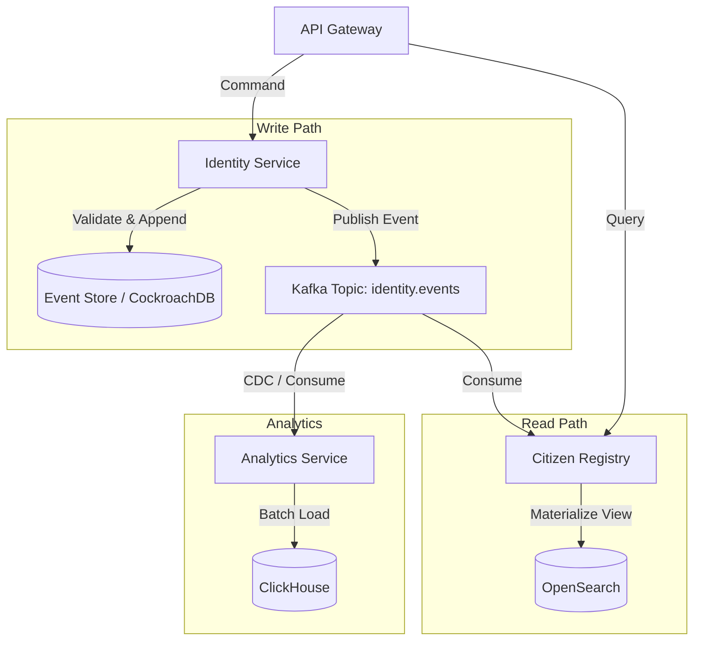
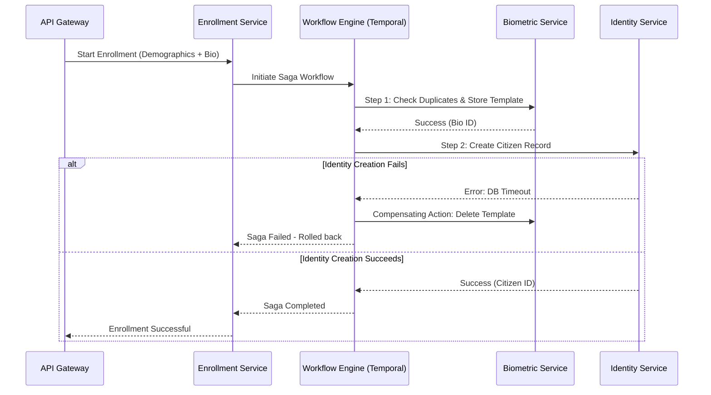
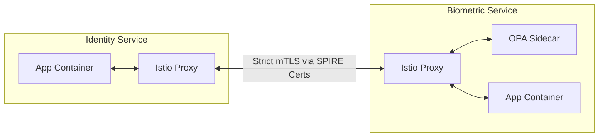
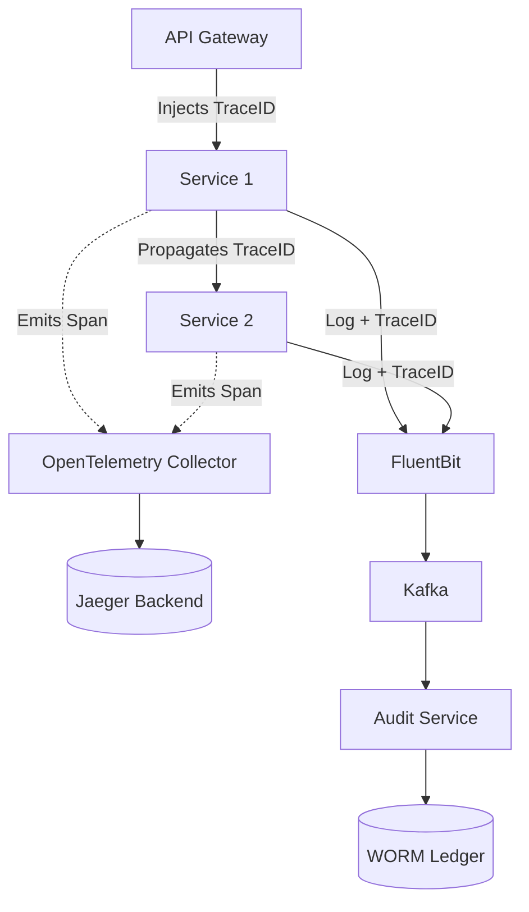

# SNISID: Microservices Architecture & Distributed Systems Design
## Final Production-Grade Specification

This document details the complete, production-grade microservices architecture for the **Système National d’Identification et d’Interopérabilité Sécurisée des Identités et des Données (SNISID)**, ensuring scalability for 15+ million citizens, extreme resilience, and zero-trust security.

---

## 1. Complete Microservices Inventory & Responsibilities

The system strictly adheres to the **Database-per-Service** pattern to ensure loose coupling. The core services include:

1. **API Gateway (Edge):** Serves as the ingress point. Handles WAF, TLS termination, API routing, rate limiting, and global authentication checks.
2. **Identity Service:** The core transactional write-service for citizen data. Manages creation and structural updates to the digital identity.
3. **Citizen Registry:** The read-optimized query service (CQRS read model). Serves fast search, retrieval, and indexing of citizen data.
4. **Consent Service:** Manages privacy directives. Stores citizen consent grants allowing specific agencies (e.g., DGI, Health) to access their data.
5. **Notification Service:** Asynchronously delivers SMS, USSD, and Email alerts (e.g., "Your eID card is ready").
6. **Audit Service:** Centralized immutable ledger. Ingests all system events, proofs, and API access logs for anti-corruption and compliance.
7. **Biometric Service:** Interfaces with the underlying ABIS. Manages 1:1 verification and 1:N deduplication workflows using encrypted templates.
8. **Authentication Service:** Validates citizen/agency credentials, handles MFA (OTP/Biometric), and issues OIDC/JWT tokens.
9. **Authorization Service:** Acts as the central Policy Decision Point (PDP) distributing ABAC/RBAC policies to Open Policy Agent (OPA) sidecars.
10. **Interoperability Service:** Implements the X-Road protocol. Translates SNISID internal data into standardized, signed envelopes for other government agencies.
11. **Document Verification Service:** Validates physical and digital documents (MRZ parsing, OCR, NFC chip cryptographic verification on passports/eIDs).
12. **Enrollment Service:** Orchestrates the multi-stage, stateful process of capturing demographic and biometric data for new citizens.
13. **Agency Connector Service:** A lightweight edge agent deployed at remote agency locations to securely buffer and transmit requests to the core.
14. **Workflow Engine:** Stateful saga orchestrator (e.g., Temporal.io or Camunda Zeebe) managing long-running business processes.
15. **Fraud Detection Service:** Real-time stream processor analyzing access patterns for anomalies (e.g., impossible travel, brute force, deduplication hits).
16. **Analytics Service:** Ingests change streams (CDC) to build OLAP cubes for national demographic dashboards.
17. **Monitoring Service:** The observability stack (Prometheus, Jaeger, OpenTelemetry) providing cluster-wide health and telemetry data.
18. **PKI Service:** Manages X.509 certificate lifecycles, integrating with HSMs to issue client/server certificates.

---

## 2. API, Event Contracts & Communication

### API Contracts (Synchronous)
- **External Edge APIs:** RESTful, documented using **OpenAPI 3.0**. Versioning is handled via URI paths (e.g., `https://api.snisid.ht/v1/citizen/`).
- **Internal Microservice APIs:** **gRPC** utilizing Protocol Buffers (v3) for high-performance, strongly-typed, binary-serialized communication.
- **Contract Testing:** Consumer-Driven Contract Testing (via Pact) ensures services do not break dependencies during deployments.

### Event Contracts (Asynchronous)
- **Standard:** **CloudEvents** specification wrapping binary payload.
- **Serialization:** **Apache Avro** with a centralized **Schema Registry** to enforce backwards/forwards compatibility.
- **Kafka/NATS Topics:** Follow domain-driven naming `snisid.[domain].[entity].[action]`.
  - `snisid.enrollment.citizen.registered`
  - `snisid.identity.biometrics.matched`
  - `snisid.audit.system.accessed`

### Internal Communication Flows
- Synchronous calls are reserved for operations requiring immediate consistency (e.g., JWT validation, API Gateway to Auth).
- Asynchronous Event-Driven communication is used for cross-domain side-effects (e.g., Identity Service emitting `IdentityCreated`, which the Notification Service reads to send an SMS).

---

## 3. Database Strategy Per Service
Adhering to **Polyglot Persistence**, services utilize databases optimized for their specific workload:
- **Identity Service (Write):** CockroachDB (Distributed SQL for ACID transactions and multi-region resilience).
- **Citizen Registry (Read):** Elasticsearch / OpenSearch (Optimized for full-text and fuzzy search).
- **Workflow Engine:** PostgreSQL (State management).
- **Biometric Service:** PostgreSQL with `pgvector` for fast template metadata retrieval, backed by S3/MinIO for encrypted BLOBs.
- **Consent / Auth Service:** Redis Cluster (Low latency, high throughput for tokens and cache).
- **Audit Service:** Cassandra or WORM-compliant S3 storage.
- **Analytics Service:** ClickHouse (Columnar OLAP database).

---

## 4. CQRS & Event Sourcing
**Event Sourcing** is utilized in the **Identity** and **Enrollment** domains.
- Instead of updating a database row, the Identity Service appends immutable events (`CitizenRegistered`, `AddressUpdated`, `NameCorrected`) to an Event Store (Kafka/CockroachDB).
- **CQRS Pattern:** The `Citizen Registry` consumes these Kafka events to build a materialized read view in Elasticsearch. If the read database is destroyed, it can be entirely rebuilt by replaying the Event Store from time zero.

---

## 5. Resiliency & Distributed Transaction Patterns

### Saga Orchestration
For distributed transactions spanning multiple services (e.g., the *Citizen Enrollment Flow*), SNISID uses the **Saga Pattern orchestrated by Temporal.io**.
1. *Enrollment Service* initiates the Saga.
2. Calls *Biometric Service* (Step 1).
3. Calls *Identity Service* (Step 2).
4. Calls *Notification Service* (Step 3).
- **Compensating Transactions:** If Step 2 fails, the Saga automatically triggers a rollback mechanism in the Biometric Service to delete the orphaned template.

### Circuit Breakers & Retries
Implemented at the infrastructure level via **Istio / Envoy Proxy**:
- **Retries:** Automatic exponential backoff + jitter for transient HTTP 503/504 or gRPC `UNAVAILABLE` errors.
- **Circuit Breakers:** If a service experiences >50% failure rate over 10 seconds, Envoy trips the circuit, failing fast to prevent cascading system collapse.

### Idempotency
All POST/PUT/PATCH endpoints require an `Idempotency-Key` header. The API Gateway/Services cache this key in Redis for 24 hours. Duplicate requests resulting from network timeouts safely return the cached response without reprocessing.

---

## 6. Observability, Service Discovery & Scaling

### Distributed Tracing & Audit Propagation
- **OpenTelemetry (OTel):** SDKs are embedded in every microservice.
- W3C `traceparent` headers are automatically injected and extracted across gRPC/HTTP and Kafka boundaries.
- **Audit Context Injection:** A middleware interceptor guarantees that the `CitizenID`, `AgentID`, and `TraceID` are logged in every FluentBit log entry.

### Kubernetes Deployment & Horizontal Scaling
- **Deployment:** Declarative via **ArgoCD** (GitOps). Helm charts define the Kubernetes primitives.
- **Service Discovery:** Native Kubernetes DNS + Istio Service Registry.
- **Horizontal Pod Autoscaling (HPA):**
  - Standard services scale on CPU/Memory thresholds (e.g., target 70%).
  - Asynchronous workers scale using **KEDA (Kubernetes Event-driven Autoscaling)** based on the Kafka consumer group lag (e.g., if queue depth > 1000, spin up 10 more Notification Service pods).
- **Production Deployment Examples:** Strict Pod Anti-Affinity rules ensure multiple replicas of the same service are never scheduled on the same physical K8s node or Availability Zone.

---

## 7. Zero Trust Security & Boundaries

### Boundaries & Authentication
- **External Edge:** Protected by the API Gateway and WAF.
- **Inter-Service Authentication:** **SPIFFE/SPIRE** provisions cryptographic identities (X.509 SVIDs) to every Kubernetes Pod.

### mTLS Architecture
- **Istio Service Mesh** enforces strict mutual TLS (mTLS) for 100% of internal traffic. Pod A cannot communicate with Pod B unless both possess valid, short-lived SPIFFE certificates and Istio Authorization Policies allow the connection.

### RBAC / ABAC Enforcement
- **Open Policy Agent (OPA):** Deployed as a sidecar to every service pod.
- Microservices do not contain authorization logic. They extract the JWT, pass it to the OPA sidecar, and OPA evaluates centralized Rego policies (e.g., `allow if token.role == "agent" and input.action == "read"`).

### Secrets Management
- **HashiCorp Vault:** Used exclusively for secrets.
- Microservices authenticate to Vault using their Kubernetes Service Account. Vault dynamically generates short-lived database credentials (TTL: 1 hour). If a microservice is compromised, the credential expires rapidly.

---

## 8. Data & Offline Synchronization Strategy

### Data Synchronization (CDC)
To synchronize the transactional databases with the Analytics and Registry databases without impacting performance, **Debezium (Change Data Capture)** reads the CockroachDB Write-Ahead Logs (WAL) and publishes changes directly to Kafka.

### Offline Synchronization Model (Haiti Context)
For remote agencies with intermittent internet:
- **Agency Connector Service** runs on a local edge node utilizing **NATS Jetstream** (lightweight message broker).
- Transactions (e.g., an offline biometric verification) are written to the local NATS queue.
- A background synchronizer continuously attempts to push the local NATS queue to the central Kafka cluster using TLS-encrypted gRPC streams.
- **Conflict Resolution:** Last-Write-Wins (LWW) utilizing Vector Clocks or CockroachDB's native distributed timestamping ensures data consistency upon reconnection.

---

## 9. Recommended Technologies
- **Languages:** Go (Core Services), Rust (Cryptography/Audit), Java/Kotlin (Interoperability/Sagas).
- **Databases:** CockroachDB, PostgreSQL, Redis, ClickHouse.
- **Infrastructure:** Kubernetes (Talos Linux), Istio (Mesh), Cilium (CNI), ArgoCD.
- **Streaming:** Apache Kafka (Strimzi), NATS Jetstream, Debezium.
- **Security:** Kong, Keycloak, HashiCorp Vault, OPA, SPIRE.

---

## 10. Architecture Diagrams (Mermaid)

### 1. CQRS and Event Sourcing Data Flow


### 2. Saga Orchestration (Enrollment Flow)


### 3. Zero Trust Service-to-Service Flow (mTLS & OPA)


### 4. Offline Edge Synchronization Model
```mermaid
graph TD
    subgraph Agency Edge Node (Remote location)
        AC[Agency Connector App]
        NATS[(Local NATS Jetstream)]
        AC -->|Write Offline Events| NATS
    end

    subgraph SNISID Core Datacenter
        Sync[Edge Sync Gateway]
        KAFKA[(Central Kafka Cluster)]
    end

    NATS -.->|Intermittent Internet Connection| Sync
    Sync -->|Publish| KAFKA
```

### 5. Distributed Tracing & Audit Flow


---
*Prepared for the Republic of Haiti - SNISID Production Deployment.*
