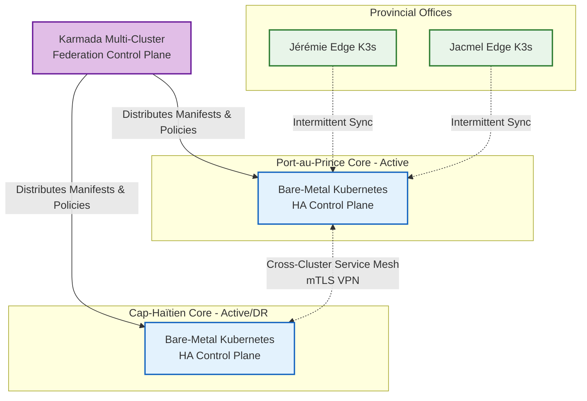
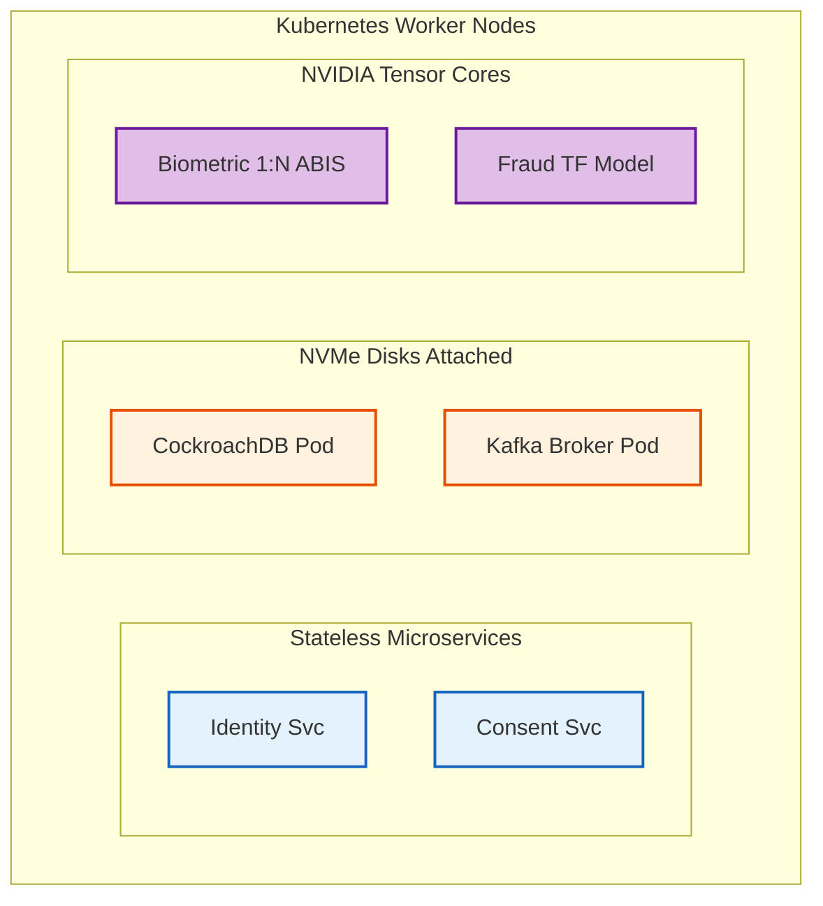

# SNISID Multi-Cluster Kubernetes Architecture
## Federation, Edge Compute & Sovereign DNS

This document outlines the advanced **Multi-Cluster Kubernetes Architecture** for SNISID. Going beyond a single datacenter deployment, SNISID operates as a massively distributed, federated cluster ecosystem spanning regional core datacenters down to ruggedized edge nodes in rural provinces.

---

## 1. Multi-Cluster Federation & Topology

SNISID utilizes a multi-cluster control plane (e.g., **Karmada** or **KubeFed**) to manage workloads seamlessly across disjointed geographic locations.

### Regional Core Clusters
- **DC1 (Port-au-Prince - Primary):** High-Capacity, multi-availability zone bare-metal Kubernetes cluster. Handles 70% of national traffic.
- **DC2 (Cap-Haïtien - Active/Active DR):** Secondary core cluster. State is synchronized via CockroachDB and Kafka cross-cluster replication. If DC1 fails due to a catastrophic event, the global load balancer routes 100% of traffic to DC2.

### Edge Kubernetes (K3s) & Offline Resilience
- **Provincial Edge Nodes:** Remote government offices (e.g., Jérémie, Ouanaminthe) run lightweight **K3s** clusters on localized hardware. 
- **Offline Autonomy:** As detailed in the Offline Architecture, these edge K3s clusters contain their own lightweight NATS queues and encrypted databases. If the internet connection to Port-au-Prince drops, the local K3s cluster continues routing local UI traffic and biometric validation requests without interruption.

---

## 2. Node Segmentation & GPU Workloads

Worker nodes within the core clusters are aggressively segmented using Kubernetes `Taints`, `Tolerations`, and `NodeAffinity`.

- **Standard Worker Nodes:** Run stateless Golang microservices (Identity, Registry, Consent). Scaled dynamically via Cluster Autoscaler based on CPU/Memory thresholds.
- **Stateful Node Pools:** Highly optimized bare-metal nodes with NVMe SSDs, strictly reserved for StatefulSets (CockroachDB, Kafka, OpenSearch).
- **GPU Node Pools:** Specialized hardware equipped with NVIDIA GPUs (using the NVIDIA device plugin for K8s). These nodes are heavily tainted and exclusively run:
  1. The **Biometric ABIS** C++ in-memory matching engine (1:N deduplication).
  2. The **AI Fraud Detection** TensorFlow/Flink inference models.

---

## 3. Sovereign DNS & Cluster Isolation

### Sovereign DNS
- **CoreDNS:** Every cluster runs CoreDNS.
- **Cross-Cluster Service Discovery:** External DNS requests are resolved by a sovereign BGP Anycast DNS system that SNISID controls. If `identity.snisid.local` is queried in DC2, and the local service is down, CoreDNS forwards the request over the encrypted VPN to the DC1 service mesh.

### Namespace Multitenancy & ABAC
- Workloads are strictly isolated by namespaces (e.g., `snisid-identity`, `snisid-interop`, `snisid-biometrics`).
- **Network Policies:** Default `Deny-All` NetworkPolicies are applied to every namespace. Pod A cannot talk to Pod B unless an explicit `Allow` rule is defined.

---

## 4. Architecture Diagrams (Mermaid)

### 1. Global Multi-Cluster Federation Topology
This diagram illustrates the geographical distribution and federation of the Kubernetes clusters across Haiti.

### 2. Node Pool Segmentation (Core Cluster)
This illustrates how workloads are strictly assigned to specific hardware profiles.

---
*Prepared by the SNISID Cloud Infrastructure & Resilience Board.*
