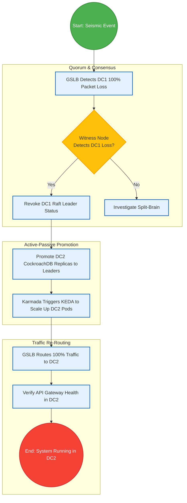

# SNISID National Multi-Datacenter Architecture
## Tri-Region High Availability & Federation Strategy

To ensure absolute uninterrupted sovereignty for the Republic of Haiti, the SNISID platform utilizes a **Tri-Region Multi-Datacenter (Multi-DC) Architecture**. This ensures the platform can survive catastrophic regional events, ranging from magnitude 8.0+ earthquakes to Category 5 hurricanes, without losing a single byte of citizen data.

---

## 1. Tri-Region Datacenter Topology

- **DC1: Port-au-Prince (Primary / Active):** The main hub handling 70% of national traffic. Heavily fortified, base-isolated against seismic activity.
- **DC2: Cap-Haïtien (Secondary / Active):** The northern hub handling 30% of national traffic. Runs in an Active-Active configuration with DC1 for read-heavy workloads (Citizen Registry) and Active-Passive for write-heavy stateful workloads.
- **DC3: Les Cayes / Hinche (Deep DR / Air-Gapped Cold Standby):** A highly secure, deeply buried bunker. Connected asynchronously. Houses the offline LTO robotic tape libraries and the root offline PKI.

---

## 2. Replication & Federation Strategies

### Kubernetes Federation (Karmada)
Instead of managing three disparate clusters, SNISID uses **Karmada (Kubernetes Armada)** to manage multi-cluster deployments.
- A central Karmada control plane dynamically schedules workloads across DC1 and DC2 based on regional load.
- If DC1 loses power, Karmada automatically detects the taint and orchestrates ArgoCD to spin up the missing pods in DC2.

### Storage Replication (Ceph & CockroachDB)
- **CockroachDB (Transactional Identity State):** Deployed as a single logical cluster spanning DC1 and DC2. Uses Raft consensus. Data is synchronously replicated before a commit is acknowledged. Zero RPO.
- **Ceph (Biometric BLOBs):** Ceph RBD (RADOS Block Device) asynchronous mirroring is used to sync encrypted biometric templates from DC1 to DC2 over the dark fiber ring.
- **Kafka MirrorMaker 2:** Replicates the CQRS Event Source logs from DC1 to DC2 to ensure the Read Models can be rebuilt anywhere.

---

## 3. Network Redundancy & Sovereign BGP
- **BGP Anycast:** The national SNISID IP addresses are announced via BGP Anycast from both DC1 and DC2.
- **Global Server Load Balancing (GSLB):** CoreDNS routes agency API traffic to the nearest healthy datacenter based on latency and health checks.
- **Split-Brain Prevention:** A highly available etcd/Consul quorum uses a lightweight witness node in a neutral government building to maintain quorum and prevent split-brain scenarios if the dark fiber between DC1 and DC2 is severed.

---

## 4. Architecture & Failover Diagrams (Mermaid)

### 1. Tri-Region Active-Active Replication Topology
```mermaid
graph TD
    classDef primary fill:#e3f2fd,stroke:#1565c0,stroke-width:2px;
    classDef secondary fill:#e8f5e9,stroke:#2e7d32,stroke-width:2px;
    classDef dr fill:#ffebee,stroke:#c62828,stroke-width:2px;
    classDef net fill:#fff3e0,stroke:#e65100,stroke-width:2px;

    GSLB((Global Server Load Balancer <br/> BGP Anycast)):::net

    subgraph DC1 [DC1: Port-au-Prince (Active)]
        K1[Karmada Managed K8s]:::primary
        CDB1[(CockroachDB Region 1)]:::primary
        KAF1[Kafka Cluster A]:::primary
        K1 --> CDB1
        K1 --> KAF1
    end

    subgraph DC2 [DC2: Cap-Haïtien (Active)]
        K2[Karmada Managed K8s]:::secondary
        CDB2[(CockroachDB Region 2)]:::secondary
        KAF2[Kafka Cluster B]:::secondary
        K2 --> CDB2
        K2 --> KAF2
    end

    subgraph DC3 [DC3: Deep DR (Cold Standby)]
        Vault[(Immutable WORM S3)]:::dr
        Tape[(LTO Tape Air-Gap)]:::dr
    end

    GSLB -->|70% Traffic| K1
    GSLB -->|30% Traffic| K2

    %% Replication
    CDB1 <==>|Synchronous Raft Consensus| CDB2
    KAF1 <==>|MirrorMaker 2 Async| KAF2
    
    CDB1 -.->|Daily Async Backup| Vault
    CDB2 -.->|Daily Async Backup| Vault
    Vault -.->|Weekly Dump| Tape
```

### 2. Automated Failover & Recovery Workflow
This flowchart dictates the automated response if Port-au-Prince (DC1) goes completely offline due to a catastrophic event.



### 3. Split-Brain Prevention (Witness Node Architecture)
If the dark fiber between DC1 and DC2 breaks, both datacenters might think the other is dead and try to become the primary (Split-Brain). SNISID uses a lightweight Witness Node in a geographically separate, neutral location (e.g., the National Palace) to break the tie.

```mermaid
graph TD
    classDef node fill:#e3f2fd,stroke:#1565c0,stroke-width:2px;
    classDef witness fill:#fff3e0,stroke:#e65100,stroke-width:2px;
    classDef dead fill:#ffebee,stroke:#c62828,stroke-width:2px;

    DC1[DC1: PaP <br/> Consul/etcd Node 1]:::node
    DC2[DC2: Cap-Haïtien <br/> Consul/etcd Node 2]:::node
    WIT[DC-Neutral Witness Node <br/> (National Palace)]:::witness

    DC1 -.->|Fiber Cut| DC2:::dead
    DC1 <-->|Vote 1| WIT
    DC2 <-->|Vote 2| WIT

    %% Explanation: If DC1 and DC2 can't talk, they both ask the Witness. 
    %% The Witness can only vote for one. The one with 2 votes (Node + Witness) becomes the Primary.
```

---
*Prepared by the SNISID Cloud Infrastructure & Resilience Board.*
