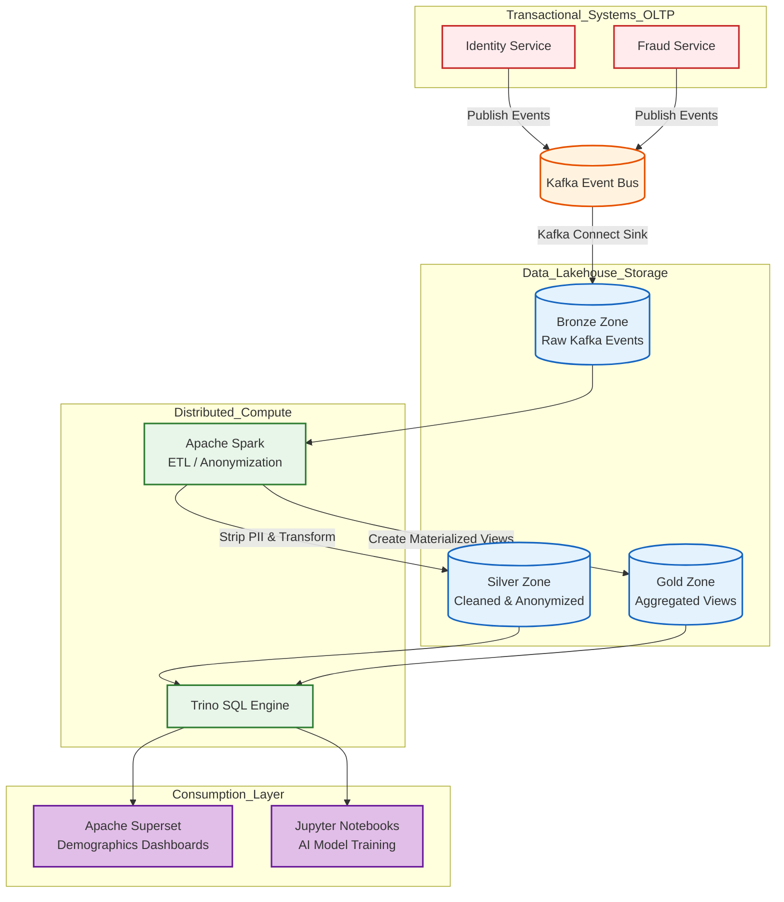
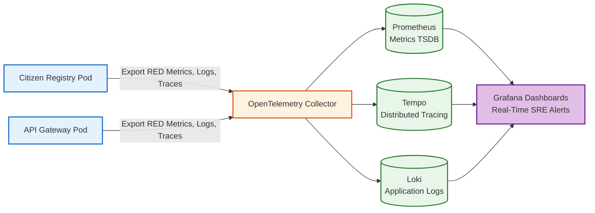

# SNISID National Analytics Architecture
## Sovereign Data Lake & Predictive Intelligence

This document details the architectural design for the **National Analytics Service**. While the core SNISID microservices are heavily optimized for extreme transactional throughput (OLTP), the Haitian government also requires deep, long-term analytical capabilities (OLAP) to drive policy decisions, monitor national demographics, and retrain fraud-detection AI models.

Crucially, this analytics architecture strictly enforces privacy; all citizen Personally Identifiable Information (PII) is cryptographically tokenized or anonymized before entering the Data Lake.

---

## 1. The Sovereign Data Lakehouse

SNISID utilizes an open-source Data Lakehouse architecture (combining the flexibility of a Data Lake with the ACID guarantees of a Data Warehouse).

### Storage & Compute Separation
- **Storage Layer:** All analytical data is stored in **Apache Iceberg** table formats on S3-compatible, on-premise Ceph Object Storage.
- **Compute Layer:** **Trino** (formerly PrestoSQL) and **Apache Spark** are used to run massively parallel, distributed SQL queries across the petabytes of stored data.

### The ELT Pipeline (Extract, Load, Transform)
1. **Extract/Load:** A Kafka Connect sink continuously streams raw, immutable events (e.g., `CitizenRegistered`, `FraudFlagged`) from the Kafka Event Bus directly into the "Bronze" (Raw) zone of the Data Lake.
2. **Transform (Anonymization):** Spark jobs run periodically to clean the data, stripping out PII (like exact names or raw biometric templates), mapping exact birthdates to birth *years*, and moving the cleaned data to the "Silver" and "Gold" zones for querying.

---

## 2. Analytics Domains & Integration

### 1. Citizen & Demographic Analytics (Business Intelligence)
- **Use Case:** The CEP (Electoral Council) needs to predict how many citizens will turn 18 before the next election cycle to allocate voting booths.
- **Integration:** Data is visualized using **Apache Superset** or **Metabase**, providing rich, interactive dashboards for authorized government ministers and analysts.

### 2. Fraud & Predictive AI Analytics
- **Use Case:** The ML models in the Fraud Detection Service must be periodically retrained on historical data to adapt to new attack vectors.
- **Integration:** Data scientists use Jupyter Notebooks connected directly to the Spark clusters to analyze millions of past fraud flags and train new TensorFlow models.

### 3. Operational Analytics & Observability
- **Use Case:** The SRE team needs to monitor the real-time latency of the Identity Service and track API error rates.
- **Integration:** This bypasses the Data Lake entirely. **OpenTelemetry** traces, metrics, and logs are scraped by Prometheus and visualized in real-time **Grafana** dashboards.

---

## 3. Architecture Diagrams (Mermaid)

### 1. Global Data Pipeline & Analytics Topology
This diagram illustrates how data flows from the transactional microservices, through the anonymization pipelines, and into the BI dashboards.

### 2. Operational Observability & KPI Monitoring Flow
This flowchart isolates the operational (SRE) analytics, distinct from the demographic business intelligence.

---
*Prepared by the SNISID Cloud Infrastructure & Resilience Board.*
