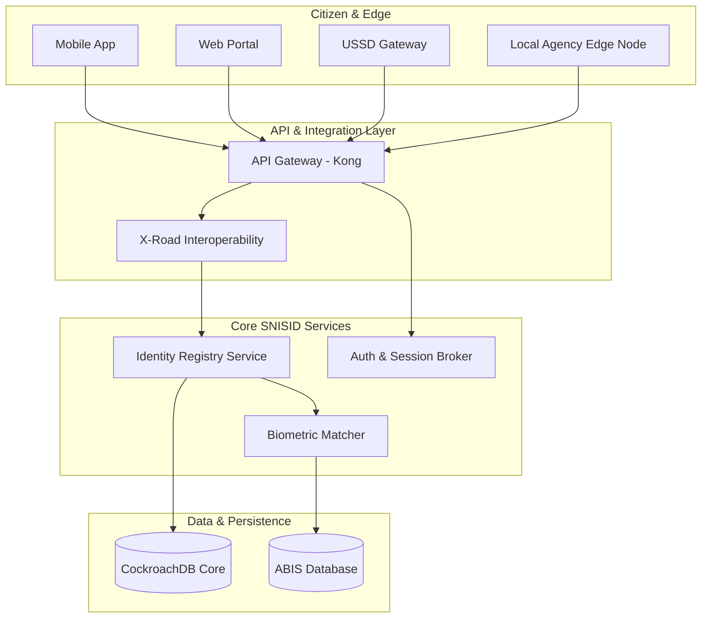
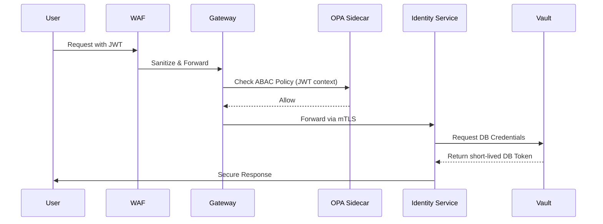
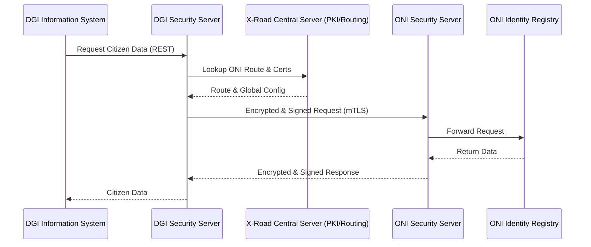
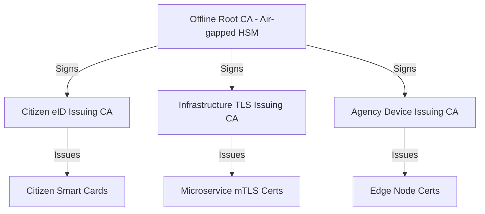
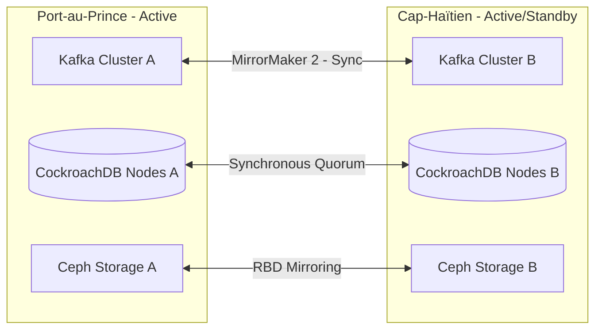
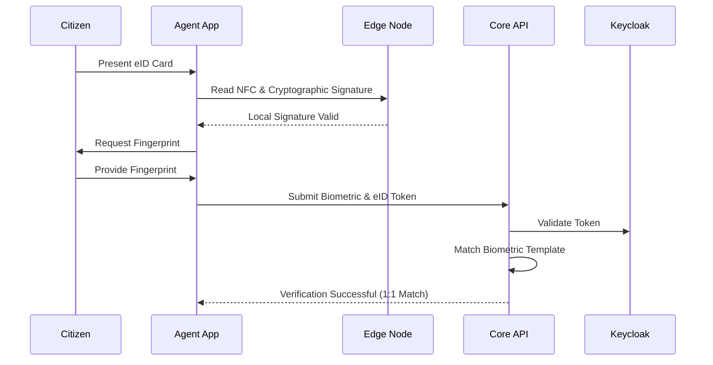
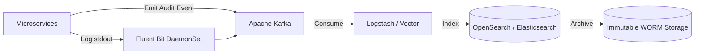
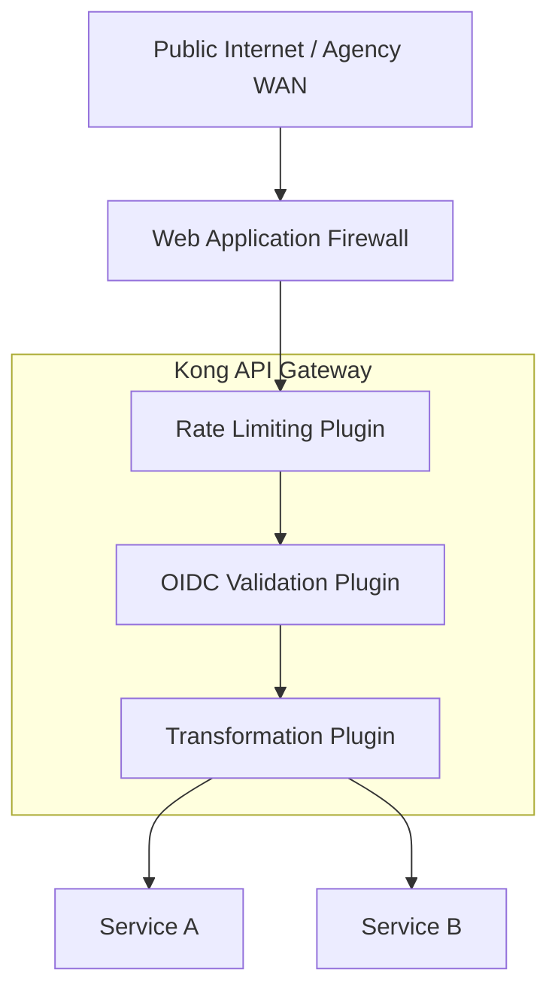
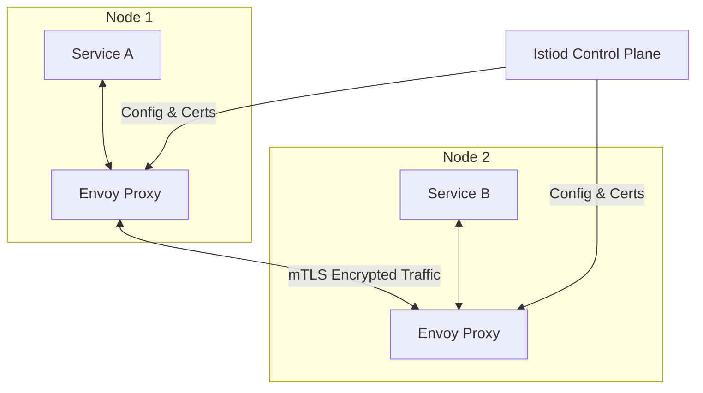

# SNISID: Système National d’Identification et d’Interopérabilité Sécurisée des Identités et des Données
## Final National Architecture Document
**Republic of Haiti - Sovereign Digital Identity & Interoperability Platform**

---

## 1. Executive Architecture Overview
SNISID is the foundational Digital Public Infrastructure (DPI) for the Republic of Haiti. It is designed to provide a sovereign, secure, highly available, and tamper-proof ecosystem for citizen identification and inter-agency data exchange. Built strictly on Zero Trust principles, cloud-native paradigms, and a decentralized event-driven architecture, SNISID ensures robust service delivery across all national agencies (ONI, ANH, DGI, DCPJ, DGIE, CEP, Immigration, Customs, Justice, Health, Education, and Social Protection) despite systemic infrastructure challenges such as power instability and intermittent connectivity.

## 2. Full National Platform Architecture
The SNISID platform operates as a hybrid, multi-tier distributed system utilizing the X-Road interoperability standard for secure data exchange.
- **Edge Tier (Agency & Citizen):** Agency endpoints, mobile applications, USSD interfaces, and offline-capable Local Identity Nodes deployed at remote offices.
- **Interoperability Tier:** Decentralized, point-to-point encrypted communication layer acting as the national data exchange, governed by a central Central Server for routing and PKI validation.
- **Core Identity Tier:** The central master registry acting as the single source of truth for identity, integrating an Automated Biometric Identification System (ABIS).
- **Sovereign Infrastructure Tier:** Multi-datacenter Kubernetes clusters deployed in sovereign facilities (e.g., Port-au-Prince and Cap-Haïtien) ensuring 99.999% availability.

## 3. Core Architecture Layers
1. **Citizen Layer:** Mobile App (iOS/Android), Web Portals, Smart ID cards (eID) with NFC/Contact chips, and USSD gateways for feature-phone accessibility.
2. **Agency Layer:** Standardized API clients, biometric capture clients, and edge gateways deployed securely within agency perimeters.
3. **Integration Layer:** API Gateways (Kong/Tyk) and the National Interoperability framework (X-Road Security Servers).
4. **Identity Orchestration Layer:** Identity brokers (Keycloak) federating authentication, supporting OIDC, SAML 2.0, and OAuth2.0.
5. **PKI Layer:** Sovereign Public Key Infrastructure (EJBCA) backed by FIPS 140-2 Level 3/4 Hardware Security Modules (HSMs).
6. **Security Layer:** HashiCorp Vault for dynamic secrets management, Open Policy Agent (OPA) for distributed ABAC policy enforcement.
7. **Audit Layer:** Immutable ledger using Write-Once-Read-Many (WORM) storage, processing events via Kafka into Elasticsearch/OpenSearch.
8. **Analytics Layer:** ClickHouse for high-throughput aggregated analytics, paired with Apache Superset for executive dashboards.
9. **Governance Layer:** Apache Atlas for metadata management, data lineage, and privacy law compliance enforcement.
10. **Disaster Recovery Layer:** Active-Active multi-region replication using Ceph/Rook for block/object storage and Kafka MirrorMaker for event streaming.

## 4. Detailed Microservices Architecture
SNISID adopts a domain-driven, loosely coupled microservices architecture.
- **Core Identity Services (Rust/Go):** High-performance, low-memory services managing the citizen registry via CQRS (Command Query Responsibility Segregation) and Event Sourcing patterns.
- **Biometric Integration Service (C++/Go):** Orchestrates communication between the registry and the underlying ABIS utilizing ISO 19794 biometric standards.
- **Interoperability Gateway Service (Java/Spring Boot):** Manages routing, data transformation, and policy enforcement for data flowing between agencies.
- **Auth & Session Service (Go):** Issues and validates JWTs, manages distributed sessions, and handles MFA flows.
- **Audit & Traceability Service (Rust):** High-throughput service that ingests system events and writes them to the immutable ledger.
- **PKI Orchestrator (Go):** Automates the lifecycle (issuance, rotation, revocation) of certificates for edge nodes and microservices via ACME/SCEP.

## 5. Kubernetes Cluster Topology
Clusters are deployed using Talos Linux or RKE2 to ensure a secure, immutable, and minimal footprint OS.
- **Control Plane Nodes:** Highly available control planes distributed across three distinct availability zones (racks/power grids) per region.
- **Worker Nodes:** Dedicated node pools for compute-heavy workloads (Biometrics), IO-heavy workloads (Databases), and general-purpose microservices.
- **CNI (Container Network Interface):** Cilium (eBPF-based) is utilized for high-performance networking, deep L7 observability, and strict network policy enforcement at the pod level.
- **Ingress:** NGINX Ingress Controllers integrated with a Web Application Firewall (WAF) (e.g., ModSecurity or Coraza).

## 6. Multi-Region High Availability Architecture
To ensure continuous operation:
- **Region A (Port-au-Prince):** Primary active datacenter.
- **Region B (Cap-Haïtien):** Secondary active datacenter.
- **Global Load Balancing:** BGP Anycast or Geo-DNS routes traffic to the nearest healthy datacenter.
- **Database Replication:** CockroachDB or PostgreSQL with Citus provides multi-region synchronous/asynchronous replication.
- **State Management:** Redis clusters deployed per region for localized fast-caching, with eventual consistency for non-critical global state.

## 7. API Gateway Architecture
The API Gateway (Kong Enterprise or Tyk) acts as the central ingress point for all external traffic.
- **Authentication:** Validates JWTs issued by the Identity Orchestrator.
- **Rate Limiting:** Protects backend services from DDoS and abuse.
- **Threat Protection:** Performs payload size checks, SQLi/XSS filtering.
- **Monetization/Quotas:** Tracks API usage per agency for billing or quota enforcement.

## 8. Event-Driven Architecture using Kafka/NATS
An event-driven backbone minimizes synchronous coupling.
- **Apache Kafka:** Used for core asynchronous workflows (e.g., identity creation workflows, audit logging, data synchronization). Deployed via Strimzi Operator.
- **Schema Registry:** Enforces strict Avro/Protobuf schemas for all events to prevent data corruption.
- **NATS JetStream:** Utilized at the edge for low-latency, lightweight messaging within remote agency offices where resource constraints exist.

## 9. Service Mesh Architecture
Istio or Cilium Service Mesh is deployed to manage east-west traffic.
- **mTLS Everywhere:** All pod-to-pod communication is encrypted using short-lived certificates issued by the mesh control plane.
- **Traffic Management:** Enables canary deployments, circuit breaking, and automatic retries for resilient inter-service communication.

## 10. Zero Trust Architecture
SNISID assumes the network is perpetually hostile.
- **Workload Identity:** SPIFFE/SPIRE provides cryptographically verifiable identities to every workload.
- **No Perimeter Trust:** Being inside the agency LAN grants no implicit privileges. Every request must be strongly authenticated and authorized.
- **Continuous Verification:** Access tokens are short-lived (e.g., 5-15 minutes), requiring continuous re-evaluation of trust.

## 11. IAM Architecture
- **Citizen IAM (CIAM):** Handles millions of identities, supporting biometric logins, SMS/USSD OTPs, and Smart Card (PKI) authentication.
- **Agency/Enterprise IAM:** Manages civil servants and administrators, federated with existing Active Directory/LDAP systems via Keycloak.

## 12. RBAC/ABAC Authorization Model
- **RBAC (Role-Based Access Control):** Assigns baseline permissions based on an employee's role (e.g., "Customs Officer").
- **ABAC (Attribute-Based Access Control):** Enforced by OPA sidecars. Policies are written in Rego and evaluate context in real-time (e.g., "Customs Officer can only view citizen passport data if the citizen is currently physically present at the border crossing, and the time is during working hours").

## 13. Secure Biometric Architecture
- **Data Minimization:** Raw biometric images (fingerprints, iris, face) are strictly converted into encrypted templates. Raw images are discarded unless legally required for a specific investigative enclave.
- **Template Security:** Biometric templates are encrypted at rest using AES-256-GCM and signed to detect tampering.
- **Liveness Detection:** Presentation Attack Detection (PAD) algorithms are mandatory for all mobile and edge biometric captures.

## 14. National PKI Architecture
A highly secure, tiered PKI hierarchy:
- **Offline Root CA:** Kept entirely disconnected from any network, stored in a Faraday cage, and requiring a multi-person quorum to operate.
- **Policy CAs:** Defines distinct branches (e.g., Citizen eID CA, Server TLS CA, Agency CA).
- **Issuing CAs:** Online CAs responsible for the automated signing of daily certificates.

## 15. HSM Integration Model
Hardware Security Modules (FIPS 140-2 Level 3/4) secure the cryptographic foundation.
- **Key Generation:** All Root and Issuing CA private keys are generated and remain within the HSM boundary.
- **Database TDE:** Master Encryption Keys (MEK) for database Transparent Data Encryption are wrapped and protected by the HSM.
- **Biometric Signing:** Keys used to sign biometric templates are stored in HSMs.

## 16. Offline-First Operational Architecture for Unstable Networks
Designed specifically for remote Haitian provinces:
- **Local Edge Nodes:** Deployable mini-servers (e.g., hardened Intel NUCs or ARM clusters) act as local Identity Gateways.
- **Cryptographic Verification:** eID Smart Cards contain a digital signature. Edge nodes verify this signature locally against a cached Public Key, requiring no internet connection.
- **Store-and-Forward:** Audit logs and offline transactions are queued locally via NATS and asynchronously flushed to the central Kafka cluster once satellite or 4G connectivity is restored.
- **Compressed Revocation:** Certificate Revocation Lists (CRLs) are compressed using Bloom filters and distributed via minimal bandwidth channels (e.g., USSD or SMS broadcasting).

## 17. Haiti-Specific Resilience Strategy
- **Power Instability:** Edge nodes utilize low-voltage ARM architecture backed by lithium iron phosphate (LiFePO4) batteries and localized solar panels. Datacenters utilize N+1 generators and heavy UPS systems.
- **Internet Outages:** Heavy reliance on the Offline-First Architecture (Point 16). Critical backbone links utilize Starlink/VSAT failovers.
- **Natural Disasters:** Geographically separated datacenters (Port-au-Prince and Cap-Haïtien) ensuring survival of seismic or hurricane events.
- **Physical Attacks:** Edge servers utilize TPM 2.0. Chassis intrusion switches trigger immediate cryptographic zeroization, rendering the hardware useless and data unreadable.
- **Political Instability:** Multi-Party Computation (MPC) and Shamir's Secret Sharing require M-of-N administrators to execute critical infrastructure commands (e.g., accessing the Root CA or exporting bulk data).

## 18. PRA/PCA (Disaster Recovery/Business Continuity) Architecture
- **RPO (Recovery Point Objective):** < 1 minute for identity data, achieved via synchronous/semi-synchronous database replication.
- **RTO (Recovery Time Objective):** < 15 minutes for failover to the secondary datacenter.
- **Immutable Backups:** Air-gapped, immutable backups are taken daily and stored in a hardened offshore/sovereign cloud vault.

## 19. Multi-Datacenter Architecture
Datacenters operate in an Active-Active configuration for read-heavy workloads and Active-Passive for strictly consistent write operations. Global Traffic Managers (GTM) seamlessly route users during partial or full facility degradation.

## 20. OpenTelemetry Observability Architecture
- **Metrics:** Prometheus clusters scrape metrics from all infrastructure and application layers.
- **Traces:** Distributed tracing via Jaeger ensures a request can be tracked from the Mobile App, through the API Gateway, across microservices, down to the database.
- **Logs:** Fluent Bit daemonsets collect logs from standard output, enriching them with Kubernetes metadata before forwarding to the centralized SIEM.

## 21. SOC Integration Architecture
SNISID natively integrates with the National Security Operations Center (SOC).
- Security events (failed logins, OPA policy violations, WAF blocks) are normalized and streamed in real-time to a SIEM (e.g., Wazuh or Splunk).
- Automated playbooks (SOAR) can dynamically isolate compromised pods or block malicious IPs at the API Gateway.

## 22. Threat Detection Architecture
- **Runtime Security:** Falco (eBPF-based) monitors container runtime behavior, detecting unauthorized shell spawns, unexpected file modifications, or privilege escalations.
- **Network Anomaly Detection:** Cilium provides flow logs analyzed by machine learning models to detect lateral movement or data exfiltration.

## 23. Audit Logging Architecture
Strict compliance with anti-corruption and privacy mandates:
- Every read, write, and authentication attempt generates a signed JSON event.
- Events are appended to a Write-Once-Read-Many (WORM) storage backend.
- A blockchain/Merkle-tree hashing structure ensures that once a log is written, its historical integrity can be mathematically proven.

## 24. Compliance Architecture
Designed to meet international standards (GDPR, ISO 27001, ISO 27701) while enforcing Haitian sovereign law. Data retention policies, right-to-be-forgotten workflows, and consent management are built into the data schema natively.

## 25. GitOps Architecture
- **ArgoCD/Flux:** The desired state of the entire Kubernetes infrastructure is declared in a secure Git repository. 
- No human has direct `kubectl` access to production. ArgoCD continuously monitors Git and pulls changes into the cluster, ensuring immutability and instant rollback capabilities.

## 26. DevSecOps Architecture
Security is shifted left. Every commit undergoes:
1. Static Application Security Testing (SAST) via SonarQube/Semgrep.
2. Software Composition Analysis (SCA) via Trivy/Dependabot.
3. Container Image Scanning.
4. Dynamic Application Security Testing (DAST) in staging environments.

## 27. Infrastructure-as-Code Strategy
Terraform and Crossplane define all underlying infrastructure (networks, VMs, storage). This ensures the entire national infrastructure can be predictably rebuilt from scratch in a disaster scenario.

## 28. Secrets Management Architecture
- HashiCorp Vault is the single source of truth for secrets.
- **Dynamic Secrets:** Database credentials are generated on-the-fly for microservices and expire automatically after a short TTL, eliminating static, long-lived passwords.

## 29. Secure CI/CD Pipelines
GitLab CI/CD or GitHub Actions pipelines are secured using OIDC to authenticate with cloud providers, eliminating long-lived CI credentials. Artifacts (Docker images) are signed using Sigstore/Cosign before deployment.

## 30. Data Governance Architecture
A central metadata repository (Apache Atlas) maps all PII data flows. It enforces policies dictating which agency can access which fields (e.g., DGI can view tax IDs, Health can view medical data, neither can view the other's restricted fields without explicit citizen consent).

## 31. National Interoperability Standards
Adoption of the **X-Road** standard (proven in Estonia). Agencies do not connect to a centralized database; instead, they expose standardized REST/SOAP APIs via X-Road Security Servers, which handle mutual authentication, signing, and logging of the data exchange.

## 32. Data Classification Framework
Data is tagged at the schema level:
- **Public:** Agency directories, statistical anonymized data.
- **Confidential:** Basic citizen info (Name, DOB).
- **Secret:** Biometric data, specific financial records, active law enforcement investigations.
Access controls mathematically prevent 'Secret' data from flowing through 'Confidential' API endpoints.

## 33. Identity Lifecycle Workflows
Strict state machines govern the identity lifecycle: `Pre-Enrolled` -> `Verified (Biometrics)` -> `Active` -> `Suspended (Lost Card/Investigation)` -> `Deceased`. Each transition requires cryptographically signed approvals from authorized agents.

## 34. National API Governance Standards
All APIs adhere to OpenAPI 3.0 specifications. Versioning is mandatory via URI path (`/v1/citizen`). Breaking changes require a 6-month deprecation window and approval from the Central Governance Board.

## 35. Technical Recommendations
- **Avoid Vendor Lock-in:** Use open-source, CNCF-backed projects.
- **Invest in Edge:** Prioritize hardware procurement for robust edge nodes.
- **Capacity Building:** Establish a specialized national IT task force to manage the Kubernetes infrastructure.

## 36. Recommended Technologies
- **Compute:** Kubernetes (RKE2), containerd
- **Service Mesh / CNI:** Cilium, Istio
- **Databases:** CockroachDB (Core), PostgreSQL (Agency), ClickHouse (Analytics)
- **Messaging:** Apache Kafka, NATS JetStream
- **Security:** HashiCorp Vault, Keycloak, OPA, Falco, EJBCA
- **Interoperability:** X-Road 
- **Observability:** Prometheus, Jaeger, OpenTelemetry, Grafana

## 37. Security Recommendations
- Institute a national bug bounty program for SNISID.
- Conduct bi-annual independent Red Team assessments.
- Mandate FIDO2/WebAuthn hardware keys for all privileged administrative access.

## 38. Scalability Strategy
The stateless microservices scale horizontally via Kubernetes HPA (Horizontal Pod Autoscaler). The database tier utilizes CockroachDB for distributed, horizontal scaling of transactional data without compromising ACID guarantees, easily supporting 15+ million active citizens.

## 39. Future AI Integration Architecture
The architecture lays the groundwork for AI via an asynchronous event sink. Anonymized data lakes feed into secure machine learning pipelines to detect systemic fraud, optimize agency resource allocation, and predict infrastructure failures, ensuring AI models never interact directly with live production transactional databases.

---

## 40. Architecture Diagrams (Mermaid)

### 1. Overall Architecture

### 2. Kubernetes Topology

*(Note: Mermaid beta architecture diagram concept. Alternatively viewed as a standard network graph)*

### 3. Zero Trust Flows

### 4. Inter-Agency Communication (X-Road)

### 5. PKI Hierarchy

### 6. Disaster Recovery Architecture

### 7. Identity Verification Workflow

### 8. Audit Flow

### 9. API Gateway Architecture

### 10. Service Mesh Architecture

---
*End of Document*
