# SNISID: Production-Grade National Enrollment Workflow
## Multi-Channel Identity Onboarding, Biometric Assurance & Offline Resilience

This document specifies the **complete production-grade enrollment architecture** for the Système National d'Identification et d'Interopérabilité Sécurisée des Identités et des Données (SNISID). Enrollment is the foundational act of the national identity system — the moment a citizen transitions from an undocumented individual to a cryptographically assured, biometrically deduplicated sovereign digital identity. This framework governs every pathway through which that enrollment can occur: fixed-site ONI centers, mobile enrollment kits in the rural Artibonite, and fully disconnected offline operations during hurricanes or infrastructure failures.

---

## Table of Contents

1. [Enrollment Channel Architecture](#1-enrollment-channel-architecture)
2. [Master Enrollment BPMN — End-to-End Saga](#2-master-enrollment-bpmn--end-to-end-saga)
3. [Fixed-Site Enrollment Workflow](#3-fixed-site-enrollment-workflow)
4. [Mobile Enrollment Workflow](#4-mobile-enrollment-workflow)
5. [Offline Enrollment & Deferred Processing](#5-offline-enrollment--deferred-processing)
6. [Biometric Capture Pipeline](#6-biometric-capture-pipeline)
7. [Anti-Spoofing & Presentation Attack Detection](#7-anti-spoofing--presentation-attack-detection)
8. [Document Verification Pipeline](#8-document-verification-pipeline)
9. [Fraud Scoring Engine Integration](#9-fraud-scoring-engine-integration)
10. [Offline Synchronization Architecture](#10-offline-synchronization-architecture)
11. [PKI Certificate Issuance Workflow](#11-pki-certificate-issuance-workflow)
12. [Citizen Notification Workflow](#12-citizen-notification-workflow)
13. [Audit Logging Architecture](#13-audit-logging-architecture)
14. [Exception Handling & Compensating Transactions](#14-exception-handling--compensating-transactions)
15. [Security Controls Matrix](#15-security-controls-matrix)
16. [SLA & Operational Metrics](#16-sla--operational-metrics)

---

## 1. Enrollment Channel Architecture

SNISID supports three distinct enrollment channels, each engineered for different operational realities across Haiti's geography:

| Channel | Location | Connectivity | Biometric Capability | Throughput | Target Population |
|---------|----------|-------------|---------------------|------------|-------------------|
| **Fixed-Site** | ONI Regional Centers (10 départements) | Always-on fiber/LTE | Full multi-modal (10-print, dual-iris, 3D facial) | 200+ enrollments/day | Urban citizens, walk-ins |
| **Mobile Kit (MEK)** | Remote communes, markets, churches | Intermittent 4G/Starlink | Full multi-modal (ruggedized) | 50–80 enrollments/day | Rural populations, elderly, disabled |
| **Offline Emergency** | Disaster zones, refugee camps | No connectivity | Reduced (fingerprint + facial) | 30–50 enrollments/day | Displaced persons, emergency registration |

### Channel Architecture Topology

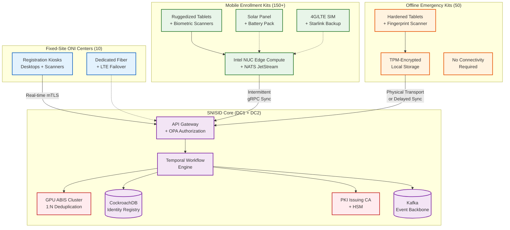

---

## 2. Master Enrollment BPMN — End-to-End Saga

This is the **canonical, production-grade enrollment saga** orchestrated by the Temporal Workflow Engine. It governs every enrollment regardless of channel, with channel-specific sub-processes branching where needed.

```mermaid
flowchart TD
    classDef startEvent fill:#4CAF50,stroke:#388E3C,stroke-width:2px,color:white;
    classDef endEvent fill:#F44336,stroke:#D32F2F,stroke-width:2px,color:white;
    classDef task fill:#E3F2FD,stroke:#1565C0,stroke-width:2px;
    classDef gateway fill:#FFC107,stroke:#FFA000,stroke-width:2px;
    classDef subProc fill:#F3E5F5,stroke:#7B1FA2,stroke-width:2px,stroke-dasharray: 5 5;
    classDef danger fill:#ffebee,stroke:#c62828,stroke-width:2px;
    classDef audit fill:#e8f5e9,stroke:#2e7d32,stroke-width:2px;
    classDef data fill:#FFF3E0,stroke:#E65100,stroke-width:2px;

    S((Citizen Presents<br/>for Enrollment)):::startEvent

    S --> CHANNEL{Enrollment<br/>Channel}:::gateway

    CHANNEL -- Fixed-Site --> FS_INIT[Initialize<br/>Fixed-Site Session]:::task
    CHANNEL -- Mobile Kit --> MK_INIT[Initialize<br/>Mobile Kit Session]:::task
    CHANNEL -- Offline Emergency --> OE_INIT[Initialize<br/>Offline Emergency Session]:::task

    FS_INIT --> COMMON_START
    MK_INIT --> COMMON_START
    OE_INIT --> COMMON_START

    COMMON_START[Generate Enrollment<br/>Transaction ID]:::audit
    COMMON_START --> AUDIT_START[Write WORM:<br/>ENROLL.SESSION.STARTED]:::audit

    AUDIT_START --> DOC_VERIFY[[Document Verification<br/>Sub-Process]]:::subProc
    DOC_VERIFY --> DOC_DEC{Documents<br/>Valid?}:::gateway
    DOC_DEC -- No --> DOC_REJECT[Reject: Insufficient<br/>Documentation]:::danger
    DOC_DEC -- Yes --> DEMO_CAPTURE[Capture Citizen<br/>Demographics]:::task

    DEMO_CAPTURE --> DEMO_VALIDATE[Validate Demographics<br/>Format & Completeness]:::task
    DEMO_VALIDATE --> VELOCITY[[Fraud Velocity<br/>Check Sub-Process]]:::subProc
    VELOCITY --> VEL_DEC{Velocity<br/>Clear?}:::gateway
    VEL_DEC -- No --> FRAUD_FREEZE[Freeze: Suspicious<br/>Activity Detected]:::danger
    VEL_DEC -- Yes --> BIO_CAPTURE[[Biometric Capture<br/>Sub-Process]]:::subProc

    BIO_CAPTURE --> ANTISPOOFING[[Anti-Spoofing / PAD<br/>Validation]]:::subProc
    ANTISPOOFING --> PAD_DEC{Liveness<br/>Confirmed?}:::gateway
    PAD_DEC -- No --> PAD_REJECT[Reject: Presentation<br/>Attack Detected]:::danger
    PAD_DEC -- Yes --> QUALITY_CHECK[ISO 19794 Quality<br/>Threshold Check]:::task

    QUALITY_CHECK --> QUAL_DEC{Quality<br/>Pass?}:::gateway
    QUAL_DEC -- "No (Retry ≤3)" --> BIO_CAPTURE
    QUAL_DEC -- "No (Retries Exhausted)" --> QUAL_EXCEPT[Exception: Quality<br/>Cannot Be Met]:::danger
    QUAL_DEC -- Yes --> TEMPLATE_EXTRACT[Extract Biometric<br/>Templates]:::task

    TEMPLATE_EXTRACT --> ONLINE_CHECK{Device<br/>Online?}:::gateway
    ONLINE_CHECK -- Yes --> DEDUP[[ABIS 1:N<br/>Deduplication]]:::subProc
    ONLINE_CHECK -- No --> OFFLINE_QUEUE[Queue for Deferred<br/>1:N Deduplication]:::data

    DEDUP --> DEDUP_DEC{Duplicate<br/>Found?}:::gateway
    DEDUP_DEC -- "Yes (Score ≥85%)" --> CONFLICT_REF[Route to Conflict<br/>Resolution Framework]:::danger
    DEDUP_DEC -- "No (Unique)" --> FRAUD_SCORE[[AI Fraud Scoring<br/>Engine]]:::subProc

    FRAUD_SCORE --> RISK_DEC{Risk<br/>Score}:::gateway
    RISK_DEC -- "Low (<0.4)" --> APPROVE_AUTO[Auto-Approve<br/>Enrollment]:::task
    RISK_DEC -- "Medium (0.4–0.7)" --> STEP_UP[Require Step-Up:<br/>Additional Document or Witness]:::task
    RISK_DEC -- "High (>0.7)" --> FRAUD_FREEZE

    STEP_UP --> STEP_DEC{Step-Up<br/>Satisfied?}:::gateway
    STEP_DEC -- Yes --> APPROVE_AUTO
    STEP_DEC -- No --> FRAUD_FREEZE

    APPROVE_AUTO --> SUPERVISOR{Supervisor<br/>Review Required?}:::gateway
    SUPERVISOR -- "Yes (T3+ bio, first-time<br/>enrollment, minor)" --> SUPERVISOR_REVIEW[Supervisor Review<br/>& Countersign]:::task
    SUPERVISOR -- No --> WRITE_DB

    SUPERVISOR_REVIEW --> SUP_DEC{Supervisor<br/>Approves?}:::gateway
    SUP_DEC -- Yes --> WRITE_DB
    SUP_DEC -- No --> REJECT_FINAL[Reject Enrollment<br/>with Rationale]:::danger

    WRITE_DB[(Commit Identity Record<br/>to CockroachDB)]:::data
    WRITE_DB --> GEN_NNI[Generate NNI<br/>Numéro National d'Identification]:::task
    GEN_NNI --> PKI_ISSUE[[PKI Certificate<br/>Issuance Sub-Process]]:::subProc

    PKI_ISSUE --> CARD_QUEUE[Queue eID Smart Card<br/>for Personalization]:::task
    CARD_QUEUE --> NOTIFY[[Citizen Notification<br/>Sub-Process]]:::subProc
    NOTIFY --> KAFKA_PUB[Publish Event:<br/>IDENTITY.ACTIVATED]:::audit
    KAFKA_PUB --> AUDIT_END[Write WORM:<br/>ENROLL.COMPLETED]:::audit
    AUDIT_END --> E1((Enrollment<br/>Complete)):::endEvent

    OFFLINE_QUEUE --> OFFLINE_ACK[Return Offline<br/>Success to Agent]:::task
    OFFLINE_ACK --> E2((Pending<br/>Sync)):::endEvent

    DOC_REJECT --> AUDIT_REJECT[Write WORM:<br/>ENROLL.REJECTED]:::audit
    FRAUD_FREEZE --> AUDIT_FRAUD[Write WORM:<br/>ENROLL.FRAUD.FLAGGED]:::audit
    PAD_REJECT --> AUDIT_PAD[Write WORM:<br/>ENROLL.PAD.REJECTED]:::audit
    REJECT_FINAL --> AUDIT_REJ2[Write WORM:<br/>ENROLL.SUPERVISOR.REJECTED]:::audit

    AUDIT_REJECT --> E3((Rejected)):::endEvent
    AUDIT_FRAUD --> E4((Fraud<br/>Investigation)):::endEvent
    AUDIT_PAD --> E5((PAD<br/>Rejected)):::endEvent
    AUDIT_REJ2 --> E6((Supervisor<br/>Rejected)):::endEvent
    QUAL_EXCEPT --> E7((Quality<br/>Exception)):::endEvent
```

---

## 3. Fixed-Site Enrollment Workflow

### 3.1 Operational Flow — ONI Center

Fixed-site enrollment occurs at the 10 regional ONI centers, each staffed with trained agents, calibrated biometric hardware, and always-on network connectivity.

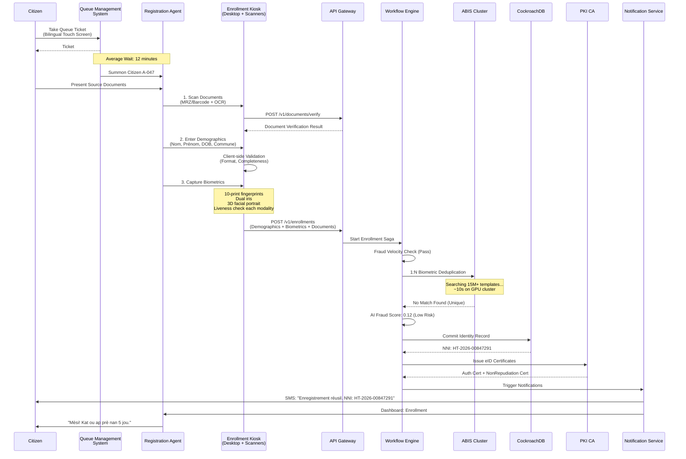

### 3.2 Fixed-Site Hardware Requirements

| Component | Specification | Certification | Quantity per Center |
|-----------|-------------|---------------|-------------------|
| Fingerprint Scanner | FBI-certified 500dpi optical slap scanner | FBI Appendix F / STQC | 4 |
| Iris Camera | Dual-iris NIR camera, 15cm–35cm capture distance | ISO/IEC 19794-6 | 2 |
| Facial Camera | 3D structured-light camera, ICAO-compliant | ISO/IEC 19794-5 | 2 |
| Document Scanner | Flatbed + MRZ/barcode reader, UV/IR capability | ICAO 9303 | 4 |
| Workstation | Desktop PC, i7/Ryzen7, 32GB RAM, TPM 2.0 | FIPS 140-3 (TPM) | 4 |
| Queue Display | 55" bilingual FR/HT status display | — | 1 |
| Network | Fiber primary + dual 4G/LTE failover | — | 1 |
| UPS | 8-hour battery backup for full center | — | 1 |

---

## 4. Mobile Enrollment Workflow

### 4.1 Mobile Enrollment Kit (MEK) Operations

MEKs are deployed to communes without ONI centers — approximately 570 communes across Haiti's 10 départements. Each kit is a self-contained enrollment station.

```mermaid
flowchart TD
    classDef startEvent fill:#4CAF50,stroke:#388E3C,stroke-width:2px,color:white;
    classDef endEvent fill:#F44336,stroke:#D32F2F,stroke-width:2px,color:white;
    classDef task fill:#E3F2FD,stroke:#1565C0,stroke-width:2px;
    classDef gateway fill:#FFC107,stroke:#FFA000,stroke-width:2px;
    classDef mobile fill:#e8f5e9,stroke:#2e7d32,stroke-width:2px;
    classDef sync fill:#fff3e0,stroke:#e65100,stroke-width:2px;
    classDef audit fill:#f3e5f5,stroke:#7b1fa2,stroke-width:2px;

    S((Agent Arrives<br/>at Commune)):::startEvent

    S --> SETUP[Power On MEK<br/>Verify Battery + Solar]:::mobile
    SETUP --> BOOT[Secure Boot Sequence<br/>TPM Attestation]:::mobile
    BOOT --> TPM_DEC{TPM<br/>Valid?}:::gateway
    TPM_DEC -- No --> LOCKOUT[Device Lockout<br/>Alert SOC]:::task
    TPM_DEC -- Yes --> AUTH_AGENT[Agent Authenticates<br/>FIDO2 + Fingerprint]:::mobile

    AUTH_AGENT --> CONN_CHECK{Network<br/>Available?}:::gateway
    CONN_CHECK -- Yes --> SYNC_DOWN[Download Latest<br/>CRL + Config Updates]:::sync
    CONN_CHECK -- No --> OFFLINE_MODE[Enter Offline<br/>Enrollment Mode]:::mobile

    SYNC_DOWN --> QUEUE_START[Begin Enrollment<br/>Queue Processing]:::task
    OFFLINE_MODE --> QUEUE_START

    QUEUE_START --> CITIZEN_REG[Register Citizen<br/>on Tablet UI]:::task

    subgraph Per_Citizen ["Per Citizen Enrollment"]
        CITIZEN_REG --> SCAN_DOCS[Scan Documents<br/>via Tablet Camera + OCR]:::task
        SCAN_DOCS --> CAPTURE_DEMO[Enter Demographics<br/>on Tablet Form]:::task
        CAPTURE_DEMO --> CAPTURE_BIO[Capture Biometrics<br/>via USB Scanners]:::mobile
        CAPTURE_BIO --> LOCAL_QUALITY[Local ISO 19794<br/>Quality Check]:::task
        LOCAL_QUALITY --> Q_PASS{Quality<br/>Pass?}:::gateway
        Q_PASS -- "No (Retry)" --> CAPTURE_BIO
        Q_PASS -- Yes --> LOCAL_LIVENESS[Local Liveness<br/>Detection (PAD)]:::mobile
        LOCAL_LIVENESS --> LIVE_DEC{Liveness<br/>OK?}:::gateway
        LIVE_DEC -- No --> ALERT_AGENT[Alert Agent:<br/>Possible Spoof Attempt]:::task
        LIVE_DEC -- Yes --> ENCRYPT_PAYLOAD[Encrypt Enrollment<br/>Payload (AES-256-GCM)]:::audit
        ENCRYPT_PAYLOAD --> WRITE_NATS[Write to Local<br/>NATS JetStream Queue]:::sync
        WRITE_NATS --> RECEIPT[Print Enrollment<br/>Receipt for Citizen]:::task
    end

    RECEIPT --> NEXT{More<br/>Citizens?}:::gateway
    NEXT -- Yes --> CITIZEN_REG
    NEXT -- No --> END_DAY[End of Day:<br/>Attempt Bulk Sync]:::sync

    END_DAY --> SYNC_UP{Network<br/>Available?}:::gateway
    SYNC_UP -- Yes --> FLUSH[Flush NATS Queue<br/>to Core via mTLS gRPC]:::sync
    SYNC_UP -- No --> STORE[Retain Encrypted<br/>on Device for Transport]:::mobile

    FLUSH --> E1((Sync<br/>Complete)):::endEvent
    STORE --> E2((Pending<br/>Transport)):::endEvent
    LOCKOUT --> E3((Device<br/>Locked)):::endEvent
    ALERT_AGENT --> E4((Spoof<br/>Flagged)):::endEvent
```

### 4.2 MEK Hardware Manifest

| Component | Specification | Weight | Power |
|-----------|-------------|--------|-------|
| Tablet | 10" ruggedized Android, IP68, MIL-STD-810G | 650g | USB-C |
| Intel NUC | Edge compute node, i5, 16GB, 512GB NVMe, TPM 2.0 | 1.2kg | 65W |
| Fingerprint Scanner | USB 500dpi tenprint slap | 400g | USB |
| Iris Scanner | Dual-iris NIR, USB | 350g | USB |
| Camera | USB 8MP ICAO-compliant portrait | 200g | USB |
| Document Scanner | Portable A4 scanner with MRZ reader | 500g | USB |
| Solar Panel | 100W foldable panel | 2.5kg | — |
| Battery Pack | 288Wh LiFePO4 (8h runtime) | 3.0kg | — |
| 4G Router | Dual-SIM (Digicel + Natcom), external antenna | 300g | USB |
| Pelican Case | IP67 waterproof transport case | 4.0kg | — |
| **Total Kit Weight** | | **~13kg** | |

### 4.3 Mobile Enrollment Sequence — Intermittent Connectivity

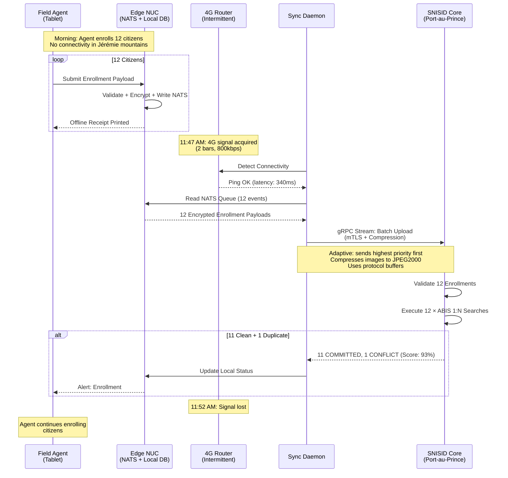

---

## 5. Offline Enrollment & Deferred Processing

### 5.1 Offline Enrollment Guarantees

When operating fully offline, SNISID provides these guarantees:

| Guarantee | Implementation | Limitation |
|-----------|---------------|------------|
| **Data Integrity** | All payloads encrypted AES-256-GCM, signed with agent's device certificate | — |
| **Tamper Resistance** | TPM-bound encryption keys; secure boot chain | Compromised HSM = total device compromise |
| **Enrollment Receipt** | Citizen receives printed receipt with temp enrollment ID | Not a valid NNI until central confirmation |
| **Deferred Deduplication** | 1:N ABIS search runs on sync | Enrollment may be revoked post-sync if duplicate detected |
| **Local 1:1 Verification** | Can verify already-enrolled citizens against local commune cache | Limited to cached population (~5,000 per commune) |
| **Maximum Offline Duration** | 30 days before mandatory sync or physical transport to ONI center | Longer durations risk cache staleness |

### 5.2 Offline State Machine

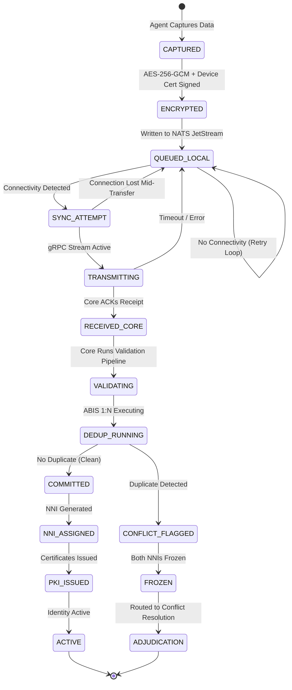

### 5.3 Deferred 1:N Deduplication BPMN

```mermaid
flowchart TD
    classDef startEvent fill:#4CAF50,stroke:#388E3C,stroke-width:2px,color:white;
    classDef endEvent fill:#F44336,stroke:#D32F2F,stroke-width:2px,color:white;
    classDef task fill:#E3F2FD,stroke:#1565C0,stroke-width:2px;
    classDef gateway fill:#FFC107,stroke:#FFA000,stroke-width:2px;
    classDef danger fill:#ffebee,stroke:#c62828,stroke-width:2px;
    classDef data fill:#FFF3E0,stroke:#E65100,stroke-width:2px;

    S((Offline Batch<br/>Arrives at Core)):::startEvent

    S --> DECRYPT[Decrypt Payload<br/>Verify Device Cert Signature]:::task
    DECRYPT --> SIG_DEC{Signature<br/>Valid?}:::gateway
    SIG_DEC -- No --> TAMPER[ALERT: Possible<br/>Payload Tampering]:::danger
    SIG_DEC -- Yes --> SCHEMA[Validate Schema<br/>& Completeness]:::task

    SCHEMA --> LOOP_START[For Each Enrollment<br/>in Batch]:::task

    LOOP_START --> DEDUP[Submit to ABIS<br/>1:N Search]:::task
    DEDUP --> DEDUP_RESULT{Match<br/>Found?}:::gateway

    DEDUP_RESULT -- No --> FRAUD_AI[Run AI Fraud<br/>Scoring Model]:::task
    DEDUP_RESULT -- "Yes ≥85%" --> CONFLICT[Create ConflictCase<br/>Freeze Both NNIs]:::danger

    FRAUD_AI --> RISK{Risk<br/>Level}:::gateway
    RISK -- Low --> COMMIT[Commit to<br/>Identity Registry]:::task
    RISK -- Medium --> QUEUE_REVIEW[Queue for<br/>Supervisor Review]:::task
    RISK -- High --> FREEZE_FRAUD[Freeze + Refer<br/>to DCPJ]:::danger

    COMMIT --> NNI[Generate<br/>NNI]:::task
    NNI --> PKI_REQ[Request PKI<br/>Certificates]:::task
    PKI_REQ --> CARD_QUEUE[Queue Smart Card<br/>Personalization]:::task
    CARD_QUEUE --> SMS[Send SMS:<br/>"Enregistrement konfime"]:::task
    SMS --> NEXT{More in<br/>Batch?}:::gateway
    NEXT -- Yes --> LOOP_START
    NEXT -- No --> REPORT[Generate Batch<br/>Processing Report]:::task

    QUEUE_REVIEW --> NEXT
    CONFLICT --> NEXT
    FREEZE_FRAUD --> NEXT

    REPORT --> SYNC_ACK[Send Batch ACK<br/>to Edge Device]:::data
    SYNC_ACK --> E((Batch<br/>Complete)):::endEvent
    TAMPER --> E2((Security<br/>Incident)):::endEvent
```

---

## 6. Biometric Capture Pipeline

### 6.1 Multi-Modal Capture Sequence

```mermaid
flowchart LR
    classDef capture fill:#e3f2fd,stroke:#1565c0,stroke-width:2px;
    classDef quality fill:#e8f5e9,stroke:#2e7d32,stroke-width:2px;
    classDef extract fill:#f3e5f5,stroke:#7b1fa2,stroke-width:2px;
    classDef store fill:#fff3e0,stroke:#e65100,stroke-width:2px;

    subgraph Step_1 ["Step 1: Fingerprints"]
        FP_CAP[Capture 10-Print<br/>Slap Scan]:::capture
        FP_QUAL[NFIQ2 Quality<br/>Score ≥ 40]:::quality
        FP_EXT[Minutiae<br/>Extraction]:::extract
        FP_TPL[ISO 19794-2<br/>Template]:::store
    end

    subgraph Step_2 ["Step 2: Iris"]
        IR_CAP[Capture Dual<br/>Iris (NIR)]:::capture
        IR_QUAL[Usable Iris<br/>Area ≥ 70%]:::quality
        IR_EXT[IrisCode<br/>Generation]:::extract
        IR_TPL[ISO 19794-6<br/>Template]:::store
    end

    subgraph Step_3 ["Step 3: Facial"]
        FC_CAP[Capture 3D<br/>Facial Portrait]:::capture
        FC_QUAL[ICAO Compliance<br/>Check]:::quality
        FC_EXT[Feature Vector<br/>Extraction]:::extract
        FC_TPL[ISO 19794-5<br/>Template]:::store
    end

    FP_CAP --> FP_QUAL --> FP_EXT --> FP_TPL
    IR_CAP --> IR_QUAL --> IR_EXT --> IR_TPL
    FC_CAP --> FC_QUAL --> FC_EXT --> FC_TPL

    FP_TPL --> BUNDLE[Bundle All<br/>Templates]:::store
    IR_TPL --> BUNDLE
    FC_TPL --> BUNDLE
    BUNDLE --> ENCRYPT[AES-256<br/>Encrypt Bundle]:::store
```

### 6.2 Quality Thresholds & Retry Policy

| Modality | Quality Metric | Minimum Threshold | Max Retries | Fallback |
|----------|---------------|-------------------|-------------|----------|
| Fingerprint (10-print) | NFIQ2 score | ≥ 40 (per finger) | 3 per finger | Accept if 8/10 fingers pass |
| Fingerprint (individual) | Minutiae count | ≥ 12 minutiae | 3 | Accept reduced set |
| Iris (left) | Usable iris area | ≥ 70% | 3 | Skip if medical condition documented |
| Iris (right) | Usable iris area | ≥ 70% | 3 | Skip if medical condition documented |
| Facial (3D) | ICAO compliance | All 23 checks pass | 5 | Reposition + adjust lighting |
| Facial (liveness) | PAD confidence | ≥ 95% | 3 | Escalate to supervisor |

### 6.3 Exception Accommodations

| Condition | Accommodation | Documentation Required |
|-----------|-------------|----------------------|
| Missing fingers (amputation) | Record available fingers; flag as "Partial Capture" | Medical certificate |
| Severe cataracts / blindness | Skip iris capture; rely on fingerprint + facial | Medical certificate |
| Infant (0–5 years) | Facial photo only; schedule biometric update at age 5 | Birth certificate |
| Elderly with worn fingerprints | Prioritize iris + facial; accept lower NFIQ threshold (≥25) | Age verification |
| Physical disability (movement) | Allow extended capture time; mobile agent assistance | Agent attestation |

---

## 7. Anti-Spoofing & Presentation Attack Detection

### 7.1 PAD Architecture

```mermaid
graph TD
    classDef sensor fill:#e3f2fd,stroke:#1565c0,stroke-width:2px;
    classDef ai fill:#f3e5f5,stroke:#7b1fa2,stroke-width:2px;
    classDef decision fill:#FFC107,stroke:#FFA000,stroke-width:2px;
    classDef action fill:#ffebee,stroke:#c62828,stroke-width:2px;

    subgraph Fingerprint_PAD ["Fingerprint Anti-Spoofing"]
        FP_SENSOR[Multispectral<br/>Sensor Data]:::sensor
        FP_SWEAT[Sweat Pore<br/>Detection]:::ai
        FP_PULSE[Pulse Oximetry<br/>Blood Flow]:::ai
        FP_TEXTURE[Skin Texture<br/>Analysis (CNN)]:::ai
        FP_SENSOR --> FP_SWEAT
        FP_SENSOR --> FP_PULSE
        FP_SENSOR --> FP_TEXTURE
    end

    subgraph Iris_PAD ["Iris Anti-Spoofing"]
        IR_SENSOR[NIR + Visible<br/>Light Fusion]:::sensor
        IR_PUPIL[Pupil Dilation<br/>Response Test]:::ai
        IR_REFLECT[Corneal Light<br/>Reflection Pattern]:::ai
        IR_TEXTURE[Iris Texture<br/>Analysis (CNN)]:::ai
        IR_SENSOR --> IR_PUPIL
        IR_SENSOR --> IR_REFLECT
        IR_SENSOR --> IR_TEXTURE
    end

    subgraph Facial_PAD ["Facial Anti-Spoofing"]
        FC_SENSOR[3D Structured<br/>Light + RGB]:::sensor
        FC_DEPTH[Depth Map<br/>Consistency Check]:::ai
        FC_BLINK[Blink & Micro-Expression<br/>Detection]:::ai
        FC_MORPH[Morphing Attack<br/>Detection (MAD)]:::ai
        FC_DEEP[Deepfake<br/>Artifact Detection]:::ai
        FC_SENSOR --> FC_DEPTH
        FC_SENSOR --> FC_BLINK
        FC_SENSOR --> FC_MORPH
        FC_SENSOR --> FC_DEEP
    end

    FP_SWEAT & FP_PULSE & FP_TEXTURE --> FP_SCORE[Fingerprint<br/>PAD Score]:::ai
    IR_PUPIL & IR_REFLECT & IR_TEXTURE --> IR_SCORE[Iris<br/>PAD Score]:::ai
    FC_DEPTH & FC_BLINK & FC_MORPH & FC_DEEP --> FC_SCORE[Facial<br/>PAD Score]:::ai

    FP_SCORE --> FUSION[Multi-Modal PAD<br/>Fusion Engine]:::ai
    IR_SCORE --> FUSION
    FC_SCORE --> FUSION

    FUSION --> PAD_DEC{Combined<br/>PAD Score}:::decision
    PAD_DEC -- "≥95%: LIVE" --> PROCEED[Proceed with<br/>Enrollment]:::sensor
    PAD_DEC -- "80–94%: UNCERTAIN" --> MANUAL[Flag for Agent<br/>Manual Override]:::action
    PAD_DEC -- "<80%: ATTACK" --> REJECT[Reject + Alert<br/>SOC + Log Evidence]:::action
```

### 7.2 Attack Vector Coverage

| Attack Type | Detection Method | Detection Rate | False Rejection Rate |
|-------------|-----------------|----------------|---------------------|
| 2D Printed Photo (face) | Depth map analysis | 99.9% | <0.01% |
| High-res Screen Replay (face) | Moiré pattern + light reflection | 99.7% | <0.05% |
| 3D Silicone Mask (face) | Skin texture + thermal | 99.2% | <0.1% |
| Deepfake Video (face) | Temporal artifact analysis | 98.5% | <0.2% |
| Morphed Photo (face) | Differential morph detection | 97.8% | <0.3% |
| Gelatin/Silicone Finger | Multispectral + pulse | 99.5% | <0.05% |
| Latent Print Lift (finger) | Sweat pore absence | 99.8% | <0.01% |
| Printed Iris (paper) | Pupil response test | 99.9% | <0.01% |
| Contact Lens (iris) | Edge irregularity | 98.0% | <0.5% |

---

## 8. Document Verification Pipeline

### 8.1 Document Processing Workflow

```mermaid
flowchart TD
    classDef startEvent fill:#4CAF50,stroke:#388E3C,stroke-width:2px,color:white;
    classDef endEvent fill:#F44336,stroke:#D32F2F,stroke-width:2px,color:white;
    classDef task fill:#E3F2FD,stroke:#1565C0,stroke-width:2px;
    classDef gateway fill:#FFC107,stroke:#FFA000,stroke-width:2px;
    classDef ai fill:#f3e5f5,stroke:#7b1fa2,stroke-width:2px;
    classDef danger fill:#ffebee,stroke:#c62828,stroke-width:2px;

    S((Document<br/>Presented)):::startEvent

    S --> SCAN[High-Resolution<br/>Scan (600dpi)]:::task
    SCAN --> MRZ{Has MRZ /<br/>Barcode?}:::gateway
    MRZ -- Yes --> MRZ_READ[Read MRZ / Barcode<br/>Extract Machine Data]:::task
    MRZ -- No --> OCR_FULL[Full-Page OCR<br/>FR + HT Language Models]:::ai

    MRZ_READ --> CROSS_CHECK[Cross-Check MRZ Data<br/>vs OCR Visual Data]:::task
    OCR_FULL --> CROSS_CHECK

    CROSS_CHECK --> MATCH_DEC{MRZ ↔ Visual<br/>Match?}:::gateway
    MATCH_DEC -- No --> ALERT_TAMPER[Alert: Possible<br/>Document Tampering]:::danger
    MATCH_DEC -- Yes --> DOC_TYPE{Document<br/>Type}:::gateway

    DOC_TYPE -- "Birth Certificate<br/>(Acte de Naissance)" --> CIVIL_CHECK[Verify Against<br/>Civil Registry API]:::task
    DOC_TYPE -- "Jugement Supplétif" --> COURT_CHECK[Verify Against<br/>Court Records API]:::task
    DOC_TYPE -- "Passport" --> IMMIG_CHECK[Verify Against<br/>Immigration DB]:::task
    DOC_TYPE -- "Previous CIN" --> LEGACY_CHECK[Verify Against<br/>Legacy ONI Database]:::task
    DOC_TYPE -- Other --> MANUAL_DOC[Queue for Agent<br/>Manual Verification]:::task

    CIVIL_CHECK --> REGISTRY_DEC{Registry<br/>Match?}:::gateway
    COURT_CHECK --> REGISTRY_DEC
    IMMIG_CHECK --> REGISTRY_DEC
    LEGACY_CHECK --> REGISTRY_DEC

    REGISTRY_DEC -- "Confirmed" --> FORGERY_AI[AI Forgery<br/>Detection Scan]:::ai
    REGISTRY_DEC -- "Not Found" --> MANUAL_DOC
    REGISTRY_DEC -- "Contradicts" --> ALERT_TAMPER

    FORGERY_AI --> FORGE_DEC{Forgery<br/>Score}:::gateway
    FORGE_DEC -- "<5%: Genuine" --> ACCEPTED[Document<br/>Accepted]:::task
    FORGE_DEC -- "5–30%: Uncertain" --> MANUAL_DOC
    FORGE_DEC -- ">30%: Suspected Forgery" --> ALERT_TAMPER

    ACCEPTED --> E1((Verified)):::endEvent
    MANUAL_DOC --> E2((Manual<br/>Review)):::endEvent
    ALERT_TAMPER --> E3((Fraud<br/>Alert)):::endEvent
```

### 8.2 Accepted Document Matrix

| Priority | Document | Verification Method | Sufficient Alone? |
|----------|---------|--------------------|--------------------|
| 1 | Acte de Naissance (Birth Certificate) | Civil Registry API lookup | Yes |
| 2 | Jugement Supplétif (Court Order) | Court Records API + seal verification | Yes |
| 3 | Passport (Haitian) | Immigration DB + MRZ validation | Yes |
| 4 | Previous CIN (National ID) | Legacy ONI database lookup | Yes (with biometric confirm) |
| 5 | Baptismal Certificate | OCR + parish registry cross-ref | No — requires corroboration |
| 6 | Hospital Birth Record | OCR + hospital records API | No — requires corroboration |
| 7 | Electoral Card (CEP) | CEP voter database lookup | No — requires corroboration |
| 8 | School Records / Diploma | OCR + institution verification | No — supporting only |
| 9 | Sworn Affidavit (2 witnesses) | Notary seal verification + witness NNI check | No — last resort only |

---

## 9. Fraud Scoring Engine Integration

### 9.1 Enrollment Fraud Scoring Pipeline

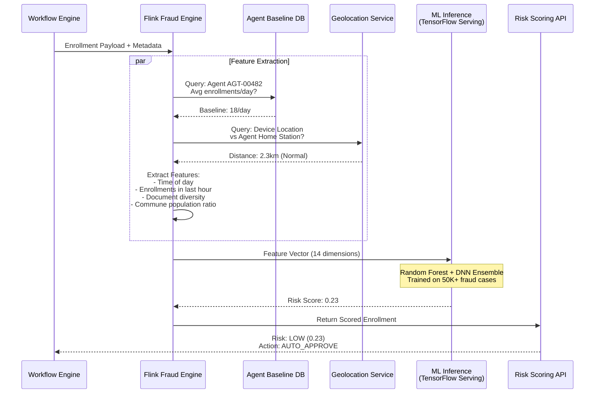

### 9.2 Fraud Feature Vector

| Feature | Description | Weight | Source |
|---------|------------|--------|--------|
| `agent_velocity` | Enrollments by this agent in last 1h/8h/24h | High | Agent Baseline DB |
| `agent_deviation` | Std deviations from agent's historical mean | High | Agent Baseline DB |
| `device_location` | GPS distance from agent's assigned station | Medium | Device GPS |
| `time_of_day` | Hour of enrollment (night = suspicious) | Medium | System clock |
| `document_type_diversity` | Variety of documents across batch | Medium | Document Pipeline |
| `commune_saturation` | % of commune population enrolled today | Medium | Registry |
| `biometric_quality_mean` | Average NFIQ score across batch | Low | Biometric Pipeline |
| `demographic_entropy` | Statistical randomness of names/DOBs | Medium | Demographics |
| `inter_enrollment_gap` | Time between consecutive enrollments | Medium | Workflow Engine |
| `photo_similarity` | Cosine similarity of faces across batch | High | ABIS |
| `same_witness_repeat` | How often same witness appears in affidavits | High | Document Pipeline |
| `network_geo_velocity` | Impossible travel between enrollments | High | Geolocation Service |
| `device_integrity` | TPM attestation freshness | Low | Device |
| `offline_duration` | How long device was offline before sync | Medium | Sync Daemon |

---

## 10. Offline Synchronization Architecture

### 10.1 Synchronization Protocol

```mermaid
flowchart TD
    classDef edge fill:#e8f5e9,stroke:#2e7d32,stroke-width:2px;
    classDef sync fill:#e3f2fd,stroke:#1565c0,stroke-width:2px;
    classDef core fill:#f3e5f5,stroke:#7b1fa2,stroke-width:2px;
    classDef conflict fill:#ffebee,stroke:#c62828,stroke-width:2px;

    subgraph Edge_Device ["Edge Device (MEK / Emergency Kit)"]
        NATS[(NATS JetStream<br/>Local Queue)]:::edge
        LOCAL_DB[(SQLite<br/>Local Cache)]:::edge
        SYNC_AGENT[Sync Daemon<br/>Background Process]:::sync
    end

    subgraph Network_Layer ["Network Transport"]
        PROBE[Connectivity<br/>Probe (5s interval)]:::sync
        BACKOFF[Exponential Backoff<br/>5s → 10s → 20s → 60s]:::sync
        COMPRESS[Protocol Buffer<br/>Serialization + LZ4]:::sync
        PRIORITY[Priority Queue<br/>Fraud Alerts > Enrollments > Updates]:::sync
    end

    subgraph Core_Ingest ["SNISID Core Ingestion"]
        GW_SYNC[Sync Gateway<br/>Endpoint]:::core
        VALIDATE[Validate Device<br/>Certificate + Payload]:::core
        IDEMPOTENCY[Idempotency Check<br/>Transaction ID Dedup]:::core
        KAFKA_WRITE[(Publish to<br/>Kafka Topics)]:::core
    end

    subgraph Conflict_Resolution ["Conflict Resolution (CRDT)"]
        VECTOR_CLOCK[Compare Vector<br/>Clocks]:::conflict
        LWW[Last-Write-Wins<br/>Resolution]:::conflict
        MANUAL_MERGE[Flag for Manual<br/>Merge if Divergent]:::conflict
    end

    NATS --> SYNC_AGENT
    LOCAL_DB --> SYNC_AGENT
    SYNC_AGENT --> PROBE
    PROBE -->|Connected| PRIORITY
    PROBE -->|Disconnected| BACKOFF
    BACKOFF -->|Retry| PROBE
    PRIORITY --> COMPRESS
    COMPRESS --> GW_SYNC

    GW_SYNC --> VALIDATE
    VALIDATE --> IDEMPOTENCY
    IDEMPOTENCY -->|New| KAFKA_WRITE
    IDEMPOTENCY -->|Duplicate| ACK_SKIP[ACK Without<br/>Reprocessing]:::core

    KAFKA_WRITE --> VECTOR_CLOCK
    VECTOR_CLOCK -->|No Conflict| COMMIT[Commit<br/>Directly]:::core
    VECTOR_CLOCK -->|Conflict Detected| LWW
    LWW -->|Auto-Resolved| COMMIT
    LWW -->|Cannot Auto-Resolve| MANUAL_MERGE
```

### 10.2 Bandwidth Optimization Strategies

| Strategy | Technique | Bandwidth Reduction | Applicable To |
|----------|----------|-------------------|---------------|
| **Image Compression** | JPEG2000 lossy at quality 85 for documents; WSQ for fingerprints | 60–80% | Biometric images, document scans |
| **Protocol Buffers** | Binary serialization vs JSON | 50–70% | All API payloads |
| **LZ4 Stream Compression** | Real-time compression on gRPC stream | 30–50% | All sync traffic |
| **Delta Sync** | Only send changed fields, not full records | 70–90% | Configuration & CRL updates |
| **Bloom Filter CRL** | Compressed probabilistic CRL check | 95% | Certificate revocation checks |
| **Priority Queuing** | Send fraud alerts before routine enrollments | N/A (latency) | Critical alerts |
| **Batch Coalescing** | Combine multiple enrollments into single request | 20–40% overhead reduction | Bulk enrollment sync |

### 10.3 Sync Resilience — Interrupted Transfer Recovery

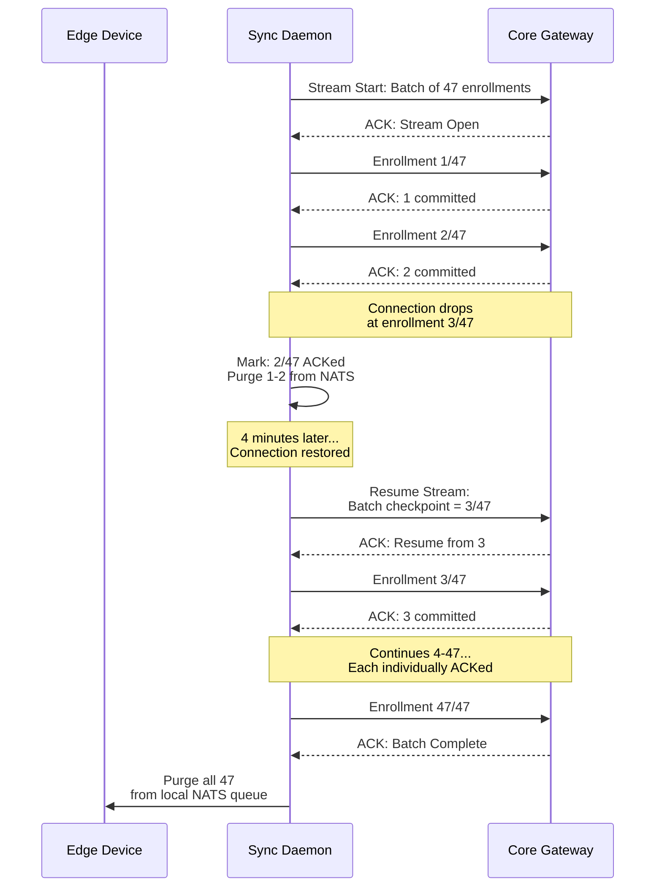

---

## 11. PKI Certificate Issuance Workflow

### 11.1 eID Certificate Issuance BPMN

```mermaid
flowchart TD
    classDef startEvent fill:#4CAF50,stroke:#388E3C,stroke-width:2px,color:white;
    classDef endEvent fill:#F44336,stroke:#D32F2F,stroke-width:2px,color:white;
    classDef task fill:#E3F2FD,stroke:#1565C0,stroke-width:2px;
    classDef gateway fill:#FFC107,stroke:#FFA000,stroke-width:2px;
    classDef pki fill:#f3e5f5,stroke:#7b1fa2,stroke-width:2px;
    classDef card fill:#e8f5e9,stroke:#2e7d32,stroke-width:2px;

    S((Identity<br/>Committed)):::startEvent

    S --> REQ_GEN[Generate Certificate<br/>Signing Requests (CSRs)]:::pki
    REQ_GEN --> POLICY[Apply Certificate<br/>Policy (CP) Rules]:::pki

    POLICY --> DUAL_CERT[Issue Dual<br/>Certificates]:::pki

    subgraph Certificate_Issuance ["Citizen-eID-CA (Online HA)"]
        DUAL_CERT --> AUTH_CERT[Authentication Certificate<br/>Key Usage: Digital Signature<br/>Extended: Client Auth<br/>Validity: 10 years]:::pki
        DUAL_CERT --> NR_CERT[Non-Repudiation Certificate<br/>Key Usage: Non-Repudiation<br/>Extended: Email Protection<br/>Validity: 10 years]:::pki
    end

    AUTH_CERT --> HSM_SIGN[Sign with Issuing CA<br/>via HSM (ECC-P256)]:::pki
    NR_CERT --> HSM_SIGN

    HSM_SIGN --> OCSP_UPDATE[Update OCSP<br/>Pre-Computed Responses]:::pki
    OCSP_UPDATE --> AUDIT_LOG[Log Issuance to<br/>PKI Audit WORM]:::pki

    AUDIT_LOG --> CARD_PERS{eID Card<br/>Ready?}:::gateway
    CARD_PERS -- "Yes (Card in stock)" --> WRITE_CHIP[Write Certificates +<br/>Citizen Data to Smart Card]:::card
    CARD_PERS -- "No (Card pending)" --> QUEUE_CARD[Queue for Card<br/>Personalization Center]:::card

    WRITE_CHIP --> PIN_GEN[Generate Initial PIN<br/>(Sealed Envelope)]:::card
    PIN_GEN --> QUALITY_TEST[Test Card:<br/>Crypto Challenge/Response]:::card
    QUALITY_TEST --> PASS{Card<br/>Functional?}:::gateway
    PASS -- No --> REWRITE[Discard Card<br/>Re-Personalize New Card]:::card
    PASS -- Yes --> READY[Card Ready<br/>for Citizen Pickup]:::card

    QUEUE_CARD --> PERSONALIZE[Batch Personalization<br/>at Central Facility]:::card
    PERSONALIZE --> SHIP[Ship to Regional<br/>ONI Center]:::card
    SHIP --> READY

    READY --> NOTIFY_CITIZEN[Notify Citizen:<br/>"Kat ou prè pou pran"]:::task
    NOTIFY_CITIZEN --> E((PKI<br/>Complete)):::endEvent
    REWRITE --> WRITE_CHIP
```

### 11.2 Certificate Content Model

```yaml
Citizen_Authentication_Certificate:
  version: 3
  serial_number: "auto-generated (128-bit random)"
  signature_algorithm: "ecdsa-with-SHA384"
  issuer: "CN=SNISID Citizen eID Issuing CA, O=République d'Haïti, C=HT"
  validity:
    not_before: "2026-05-23T00:00:00Z"
    not_after: "2036-05-23T23:59:59Z"
  subject: "CN=HT-2026-00847291, SERIALNUMBER=HT-2026-00847291, O=Citizen, C=HT"
  public_key:
    algorithm: "EC (P-256)"
    key: "generated_on_smart_card_chip"  # Private key NEVER leaves the card
  extensions:
    key_usage: [digitalSignature]
    extended_key_usage: [clientAuth]
    subject_alt_name: "otherName: NNI=HT-2026-00847291"
    crl_distribution_points: ["http://crl.snisid.gouv.ht/citizen-eid.crl"]
    authority_info_access:
      ocsp: "http://ocsp.snisid.gouv.ht"
      ca_issuers: "http://ca.snisid.gouv.ht/citizen-eid-ca.crt"
    certificate_policies: ["OID 2.16.332.1.1.1.1 (SNISID Citizen Auth Policy)"]

Citizen_NonRepudiation_Certificate:
  # Identical structure, except:
  extensions:
    key_usage: [nonRepudiation]
    extended_key_usage: [emailProtection]
    certificate_policies: ["OID 2.16.332.1.1.1.2 (SNISID Citizen NR Policy)"]
```

---

## 12. Citizen Notification Workflow

### 12.1 Multi-Channel Notification Architecture

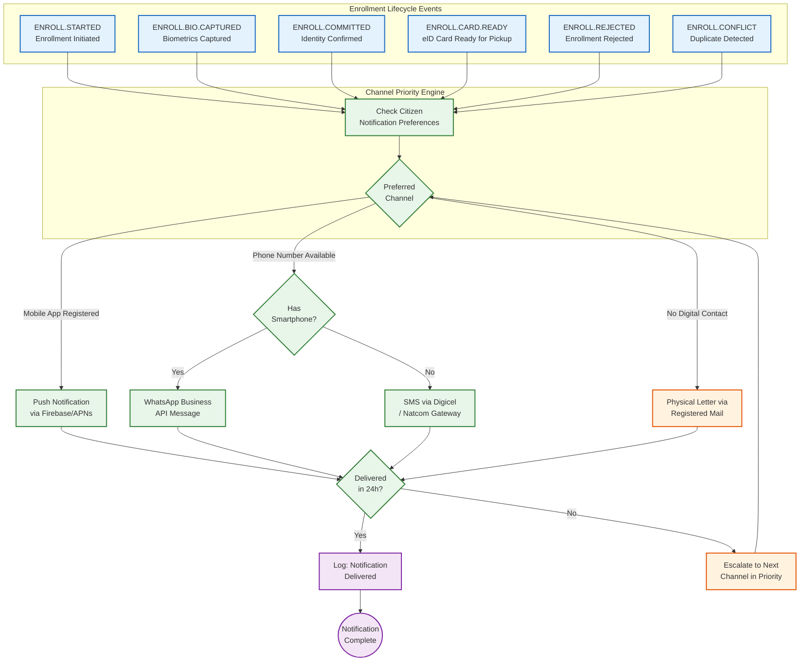

### 12.2 Notification Templates (Bilingual)

| Event | French (FR) | Kreyòl Ayisyen (HT) | Channel |
|-------|------------|---------------------|---------|
| `ENROLL.STARTED` | Votre inscription SNISID a été initiée. Réf: {txn_id} | Enskripsyon SNISID ou kòmanse. Ref: {txn_id} | SMS |
| `ENROLL.COMMITTED` | Félicitations! Votre identité nationale a été confirmée. NNI: {nni} | Felisitasyon! Idantite nasyonal ou konfime. NNI: {nni} | SMS + Push |
| `ENROLL.CARD.READY` | Votre carte eID est prête. Présentez-vous au bureau ONI de {location}. | Kat eID ou pare. Prezante w nan biwo ONI {location}. | SMS + Push + WhatsApp |
| `ENROLL.REJECTED` | Votre inscription a été refusée. Motif: {reason}. Vous pouvez faire appel sous 15 jours. | Enskripsyon ou refize. Rezon: {reason}. Ou ka fè apèl nan 15 jou. | SMS + Push |
| `ENROLL.CONFLICT` | Un conflit d'identité a été détecté. Veuillez vous présenter au bureau ONI le plus proche. | Yo detekte yon konfli idantite. Tanpri prezante w nan biwo ONI ki pi pre a. | SMS + Push + Call |

---

## 13. Audit Logging Architecture

### 13.1 Enrollment Audit Event Taxonomy

| Event Code | Description | Data Captured | Retention |
|-----------|-------------|---------------|-----------|
| `ENROLL.SESSION.STARTED` | Enrollment session initiated | Agent ID, device ID, channel, GPS, timestamp | 10 years |
| `ENROLL.DOC.SCANNED` | Document scanned and verified | Doc type, verification result, OCR hash | 10 years |
| `ENROLL.DOC.FORGERY.ALERT` | Forgery detected in document | Doc scan hash, forgery score, features | **Permanent** |
| `ENROLL.DEMO.CAPTURED` | Demographics entered | Demographics hash (not PII), validation result | 10 years |
| `ENROLL.BIO.CAPTURED` | Biometrics captured | Modality, quality scores, PAD result, template hash | 10 years |
| `ENROLL.BIO.PAD.FAILED` | Presentation attack detected | PAD scores, attack type, sensor telemetry | **Permanent** |
| `ENROLL.VELOCITY.CHECK` | Fraud velocity check result | Agent velocity, device velocity, result | 10 years |
| `ENROLL.ABIS.SEARCH` | ABIS 1:N deduplication result | Search time, gallery size, match result, score | 10 years |
| `ENROLL.FRAUD.SCORE` | AI fraud scoring result | 14-dimension feature vector, model version, score | 10 years |
| `ENROLL.SUPERVISOR.REVIEW` | Supervisor reviews enrollment | Reviewer ID, decision, rationale | 10 years |
| `ENROLL.COMMITTED` | Identity record committed to DB | NNI, record hash, DB transaction ID | **Permanent** |
| `ENROLL.PKI.ISSUED` | Certificates issued | Cert serial numbers, validity, CA used | **Permanent** |
| `ENROLL.CARD.PERSONALIZED` | Smart card written and tested | Card serial, chip ID, test result | **Permanent** |
| `ENROLL.NOTIFIED` | Citizen notified | Channel used, delivery status, message hash | 10 years |
| `ENROLL.REJECTED` | Enrollment rejected | Rejection reason, stage, deciding authority | 10 years |
| `ENROLL.SYNC.RECEIVED` | Offline enrollment received at core | Batch ID, device ID, transmission time, encryption verified | 10 years |
| `ENROLL.EXCEPTION` | Exception occurred during processing | Exception type, stage, compensating actions taken | **Permanent** |

### 13.2 Audit Pipeline — Enrollment Events

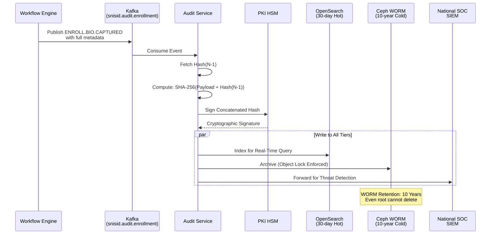

---

## 14. Exception Handling & Compensating Transactions

### 14.1 Exception Taxonomy

| Exception Code | Stage | Description | Compensating Action | Retry? |
|---------------|-------|-------------|--------------------|----|
| `EX-001` | Document Verification | Civil Registry API timeout | Retry 3× with exponential backoff; fallback to manual | Yes (3×) |
| `EX-002` | Biometric Capture | Scanner hardware failure | Switch to backup scanner; if none, reschedule citizen | No |
| `EX-003` | Biometric Capture | Quality threshold not achievable | Document exception; accept reduced modalities | No |
| `EX-004` | ABIS Deduplication | ABIS cluster unavailable | Queue for deferred processing; return pending status | Yes (∞) |
| `EX-005` | ABIS Deduplication | Search timeout (>60s) | Retry on alternate ABIS partition; escalate to ops | Yes (2×) |
| `EX-006` | Fraud Scoring | ML model serving unavailable | Default to MEDIUM risk; require supervisor review | Yes (3×) |
| `EX-007` | Database Commit | CockroachDB write failure | Saga rollback: delete biometric template, notify agent | Yes (5×) |
| `EX-008` | PKI Issuance | HSM unavailable | Queue certificate request; identity active without cert | Yes (∞) |
| `EX-009` | PKI Issuance | Smart card write failure | Discard card; re-personalize on new blank | No |
| `EX-010` | Notification | All channels failed to deliver | Log delivery failure; retry daily for 7 days | Yes (7×) |
| `EX-011` | Offline Sync | Payload decryption failure | Alert SOC: possible device compromise | No |
| `EX-012` | Offline Sync | Connection lost mid-transfer | Resume from last ACKed checkpoint | Yes (∞) |

### 14.2 Saga Rollback BPMN — Database Failure

```mermaid
flowchart TD
    classDef startEvent fill:#4CAF50,stroke:#388E3C,stroke-width:2px,color:white;
    classDef endEvent fill:#F44336,stroke:#D32F2F,stroke-width:2px,color:white;
    classDef task fill:#E3F2FD,stroke:#1565C0,stroke-width:2px;
    classDef gateway fill:#FFC107,stroke:#FFA000,stroke-width:2px;
    classDef compensate fill:#ffebee,stroke:#c62828,stroke-width:2px;
    classDef audit fill:#e8f5e9,stroke:#2e7d32,stroke-width:2px;

    S((DB Write<br/>Failed)):::startEvent

    S --> RETRY[Retry with Exponential<br/>Backoff (5 attempts)]:::task
    RETRY --> RETRY_DEC{Retry<br/>Succeeded?}:::gateway
    RETRY_DEC -- Yes --> RESUME[Resume Normal<br/>Workflow]:::task
    RETRY_DEC -- No --> COMPENSATE[Initiate Saga<br/>Compensation]:::compensate

    COMPENSATE --> COMP_BIO[Compensate: Delete<br/>Biometric Template from ABIS]:::compensate
    COMP_BIO --> COMP_AUDIT[Compensate: Mark Audit Trail<br/>as ROLLED_BACK]:::compensate
    COMP_AUDIT --> COMP_STATUS[Set Enrollment Status:<br/>FAILED_RECOVERABLE]:::compensate

    COMP_STATUS --> NOTIFY_AGENT[Notify Agent:<br/>"Echèk sistèm. Mande sitwayen an<br/>retounen nan 24è."]:::task
    NOTIFY_AGENT --> NOTIFY_OPS[Alert Operations:<br/>Database Health Critical]:::compensate
    NOTIFY_OPS --> LOG[Write WORM:<br/>ENROLL.EXCEPTION (EX-007)]:::audit

    LOG --> E1((Saga<br/>Failed Clean)):::endEvent
    RESUME --> E2((Continue<br/>Enrollment)):::endEvent
```

### 14.3 Saga Compensation Sequence — Full Failure

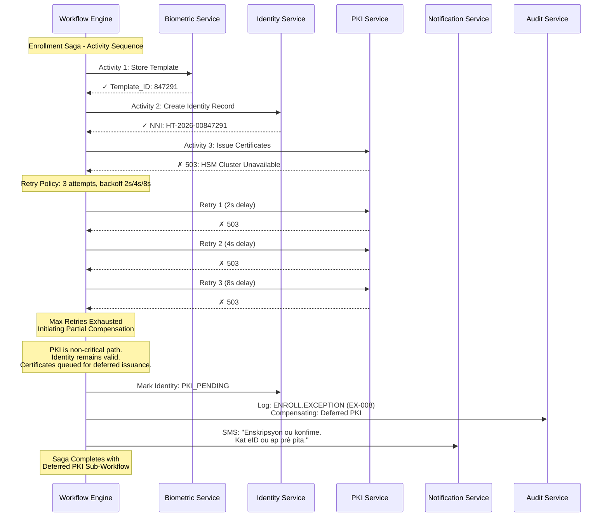

---

## 15. Security Controls Matrix

### 15.1 Enrollment Security Controls

| Control ID | Control | Layer | Implementation | Standard |
|-----------|---------|-------|----------------|----------|
| **SC-E-001** | Agent FIDO2 authentication before session start | Authentication | WebAuthn hardware key + fingerprint | NIST SP 800-63B (AAL3) |
| **SC-E-002** | mTLS on all enrollment API calls | Transport | Istio Envoy proxy auto-rotation | NIST SP 800-52 |
| **SC-E-003** | AES-256-GCM encryption of biometric payloads at rest | Data Protection | LUKS + TPM-bound keys on edge; CockroachDB TDE on core | FIPS 140-3 |
| **SC-E-004** | Biometric template irreversibility | Data Protection | One-way feature extraction; raw images archived in WORM | ISO/IEC 24745 |
| **SC-E-005** | Device TPM secure boot attestation | Device Integrity | TPM 2.0 platform integrity measurement | TCG PC Client |
| **SC-E-006** | Anti-tampering remote wipe on stolen MEK | Device Security | MDM + TPM lockout on theft flag | — |
| **SC-E-007** | Role-based access control (RBAC + ABAC) | Authorization | OPA policies evaluated at API Gateway | NIST AC-3 |
| **SC-E-008** | Supervisor maker-checker for T3+ enrollments | Process Control | Dual-authorization in Workflow Engine | SOX Compliance |
| **SC-E-009** | Presentation attack detection (multi-modal PAD) | Biometric Security | CNN-based PAD on fingerprint, iris, face | ISO/IEC 30107-3 |
| **SC-E-010** | Fraud velocity scoring on every enrollment | Fraud Prevention | Apache Flink + TensorFlow ensemble | — |
| **SC-E-011** | Cryptographic audit chaining (Merkle tree) | Audit Integrity | SHA-256 hash chain with HSM signatures | NIST SP 800-92 |
| **SC-E-012** | WORM storage for all audit events | Non-Repudiation | Ceph Object Lock, 10-year retention | SEC Rule 17a-4 |
| **SC-E-013** | Idempotent enrollment transactions | Data Consistency | Transaction ID deduplication at ingestion | — |
| **SC-E-014** | Saga pattern with compensating transactions | Data Consistency | Temporal.io orchestration | — |
| **SC-E-015** | Network micro-segmentation | Network Security | eBPF Cilium + Kubernetes NetworkPolicies | Zero Trust |
| **SC-E-016** | Offline payload encryption with device certificate | Data Protection | X.509 device cert from Device-IoT-CA | — |
| **SC-E-017** | CRL/OCSP revocation check before agent session | Certificate Validation | Bloom filter cache + OCSP stapling | RFC 6960 |
| **SC-E-018** | GPS geofencing for mobile kits | Physical Security | Alert if device leaves assigned department | — |
| **SC-E-019** | Video surveillance of fixed-site biometric capture | Process Integrity | CCTV with 30-day retention | — |
| **SC-E-020** | Mandatory CAPTCHA/proof-of-presence at kiosk | Bot Prevention | Physical presence verified by agent attestation | — |

### 15.2 Security Control Topology

```mermaid
graph TD
    classDef perimeter fill:#ffebee,stroke:#c62828,stroke-width:2px;
    classDef transport fill:#fff3e0,stroke:#e65100,stroke-width:2px;
    classDef app fill:#e3f2fd,stroke:#1565c0,stroke-width:2px;
    classDef data fill:#e8f5e9,stroke:#2e7d32,stroke-width:2px;
    classDef audit fill:#f3e5f5,stroke:#7b1fa2,stroke-width:2px;

    subgraph Perimeter ["Perimeter Security"]
        GPS[SC-E-018: GPS Geofencing]:::perimeter
        TPM[SC-E-005: TPM Attestation]:::perimeter
        WIPE[SC-E-006: Remote Wipe]:::perimeter
        CCTV[SC-E-019: Video Surveillance]:::perimeter
    end

    subgraph Transport ["Transport Security"]
        MTLS[SC-E-002: mTLS Everywhere]:::transport
        MICRO[SC-E-015: eBPF Microsegmentation]:::transport
        CRL[SC-E-017: CRL/OCSP Validation]:::transport
    end

    subgraph Application ["Application Security"]
        FIDO[SC-E-001: FIDO2 Agent Auth]:::app
        RBAC[SC-E-007: OPA RBAC/ABAC]:::app
        MAKER[SC-E-008: Maker-Checker]:::app
        PAD[SC-E-009: Multi-Modal PAD]:::app
        FRAUD[SC-E-010: AI Fraud Scoring]:::app
        SAGA[SC-E-014: Saga Compensation]:::app
        IDEMP[SC-E-013: Idempotency]:::app
    end

    subgraph Data ["Data Security"]
        AES[SC-E-003: AES-256-GCM at Rest]:::data
        IRREV[SC-E-004: Template Irreversibility]:::data
        OFFLINE_ENC[SC-E-016: Offline Payload Encryption]:::data
    end

    subgraph Audit_Controls ["Audit & Non-Repudiation"]
        CHAIN[SC-E-011: Cryptographic Audit Chain]:::audit
        WORM_CTL[SC-E-012: WORM Storage]:::audit
    end

    Perimeter --> Transport --> Application --> Data --> Audit_Controls
```

---

## 16. SLA & Operational Metrics

### 16.1 Enrollment SLA Targets

| Metric | Fixed-Site | Mobile Kit | Offline Emergency | Measurement |
|--------|-----------|-----------|-------------------|-------------|
| **Enrollment Processing Time** | ≤ 15 min/citizen | ≤ 20 min/citizen | ≤ 25 min/citizen | Agent start → receipt |
| **ABIS 1:N Search** | ≤ 10 seconds | ≤ 10 seconds (deferred) | Deferred only | GPU cluster time |
| **PKI Certificate Issuance** | ≤ 5 seconds | Deferred to sync | Deferred | CA signing time |
| **Smart Card Personalization** | ≤ 3 business days | ≤ 10 business days | ≤ 15 business days | Commit → card ready |
| **Citizen First Notification** | ≤ 30 seconds | ≤ 5 minutes post-sync | ≤ 24 hours post-sync | Commit → SMS sent |
| **Offline Sync Latency** | N/A | ≤ 4 hours typical | ≤ 30 days max | Capture → core receipt |
| **System Availability** | 99.9% | 99.5% (edge tolerance) | 99.0% (degraded mode) | Monthly uptime |
| **Fraud Detection Latency** | ≤ 2 seconds | ≤ 2 seconds post-sync | Deferred | Feature extraction → score |

### 16.2 Capacity Planning

| Metric | Year 1 | Year 3 | Year 5 |
|--------|--------|--------|--------|
| **Total Enrollments** | 2M | 8M | 15M |
| **Fixed-Site Centers** | 10 | 15 | 20 |
| **Mobile Enrollment Kits** | 150 | 300 | 500 |
| **Daily Enrollment Capacity** | 5,000 | 15,000 | 25,000 |
| **ABIS Gallery Size** | 2M templates | 8M templates | 15M templates |
| **ABIS Search Time (1:N)** | <5s | <8s | <12s |
| **Storage (Biometric + Audit)** | 20TB | 80TB | 150TB |
| **Peak Concurrent Agents** | 200 | 600 | 1,000 |

### 16.3 Operational Dashboard KPIs

| KPI | Description | Target | Alert Threshold |
|-----|-------------|--------|----------------|
| Enrollment Throughput | Enrollments completed per hour nationally | ≥ 300/hr | < 200/hr |
| ABIS Queue Depth | Pending deduplication searches | < 100 | > 500 |
| Offline Devices Pending Sync | MEKs with un-synced data > 24h | < 10 | > 30 |
| Fraud Flag Rate | % of enrollments flagged by AI | 1–3% | > 5% or < 0.5% |
| PAD Rejection Rate | % of biometric captures rejected by PAD | < 0.1% | > 0.5% |
| Document Verification Failure | % of documents failing automated verification | < 5% | > 10% |
| Exception Rate | % of enrollments hitting exception handlers | < 2% | > 5% |
| Agent Session Duration | Average active session time per agent | 6–8h | > 10h (fatigue risk) |

---

## Appendix A: Enrollment Data Flow — Complete Sequence

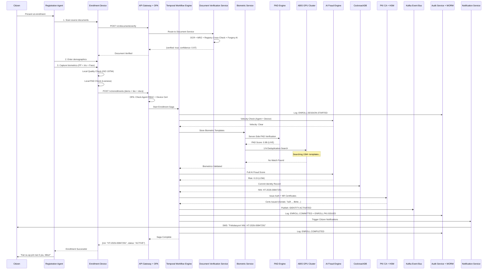

---

*Ratified by the National Digital Identity & Interoperability Steering Committee (Comité National d'Identité Numérique et d'Interopérabilité).*

*Document Classification: SNISID-OPS-ENR-001 | Version 1.0 | Date: 2026-05-23*

*Prepared by the SNISID Enterprise Architecture & Operations Division.*
