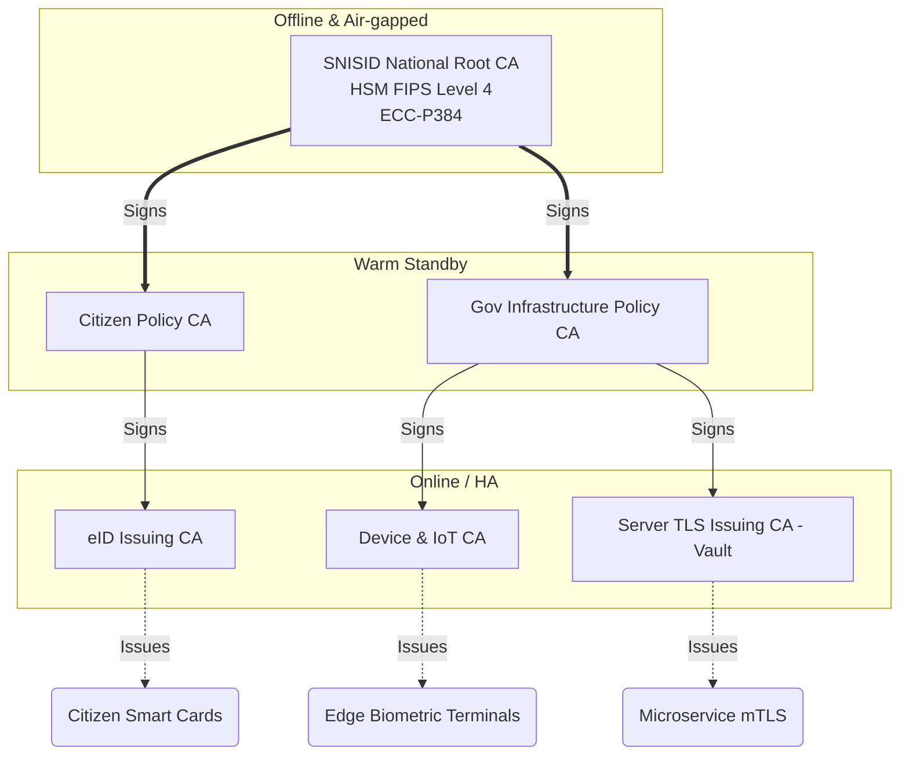
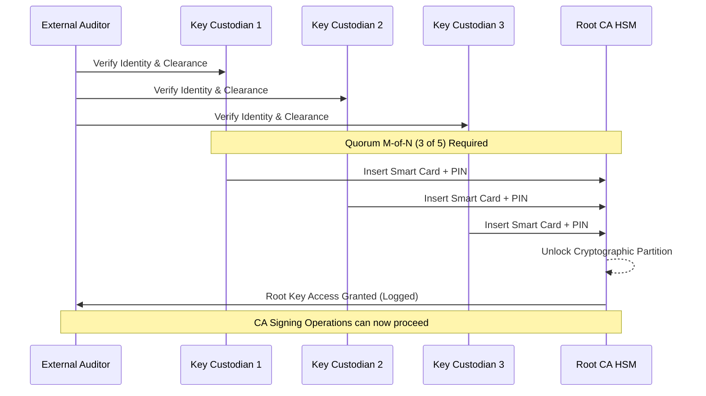
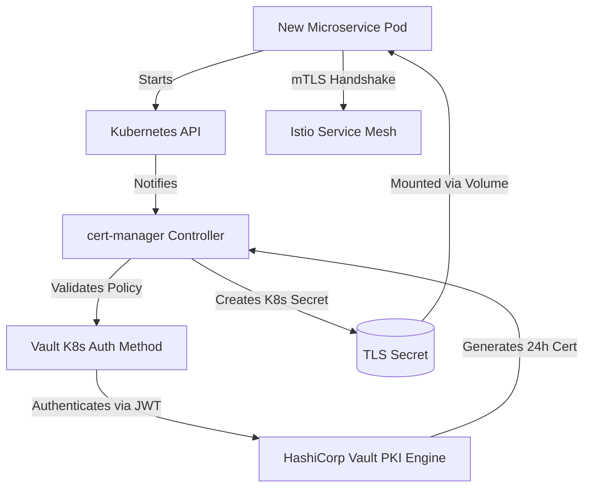
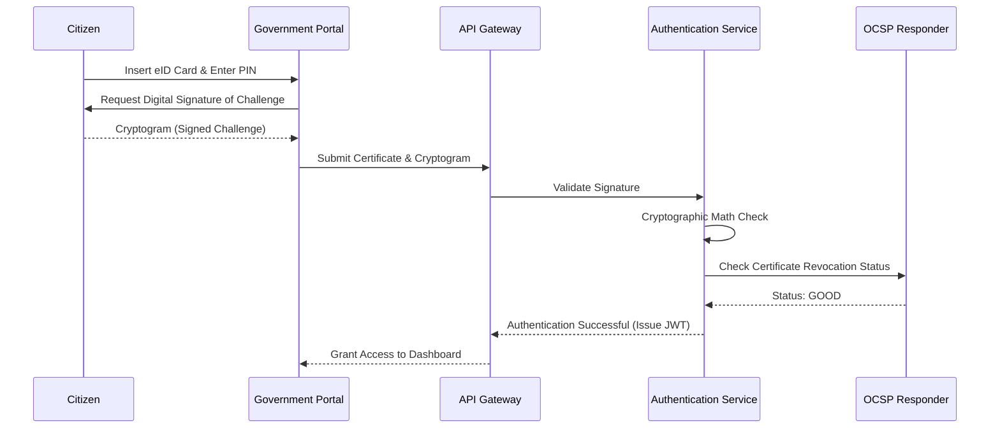
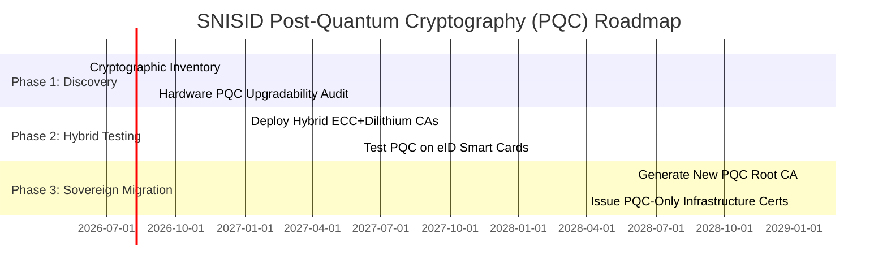

# SNISID: National PKI Architecture & Cryptographic Governance
## Final Production-Grade Sovereign Specification

This document defines the comprehensive National Public Key Infrastructure (PKI) architecture for the **Système National d’Identification et d’Interopérabilité Sécurisée des Identités et des Données (SNISID)** of the Republic of Haiti. It is designed to meet strict sovereign security requirements, adhering to **WebTrust, ETSI EN 319 411, and NIST FIPS 201/140-3** standards.

---

## 1. National PKI Hierarchy
SNISID utilizes a strict **Three-Tier PKI Hierarchy** to compartmentalize risk and ensure maximum cryptographic security.
- **Tier 1:** National Offline Root CA (Absolute Trust Anchor)
- **Tier 2:** Policy/Intermediate CAs (Logical & Domain Segmentation)
- **Tier 3:** Operational Issuing CAs (High-Availability automated issuance)

## 2. Offline Root CA Architecture
- **State:** Permanently **Offline** and air-gapped. Housed in a Level 4 secure vault within a Faraday cage.
- **Hardware:** Keys generated and retained inside a **FIPS 140-3 Level 4 HSM**. 
- **Purpose:** Exists *only* to sign the Tier 2 Policy CAs and its own Base CRLs.
- **Lifespan:** 25-30 years.

## 3. Intermediate CA Architecture
- **State:** Offline or heavily restricted "warm" standby.
- **Purpose:** Acts as a buffer between the Root and Issuing CAs. If an Issuing CA is compromised, the Intermediate CA revokes it without exposing the Root.
- **Branches:**
  - `Gov-Intermediate-CA`: Governs Civil Servants & Infrastructure.
  - `Citizen-Intermediate-CA`: Governs Citizen eIDs.
- **Lifespan:** 15-20 years.

## 4. Issuing CA Architecture
- **State:** Online, Highly Available (HA), clustered across the primary and secondary datacenters.
- **Software Engine:** EJBCA Enterprise or HashiCorp Vault PKI engines.
- **Branches:**
  - `Citizen-eID-CA`: Issues X.509 certs to smart cards.
  - `Infra-TLS-CA`: Issues server certs for API Gateways and microservices.
  - `Device-IoT-CA`: Issues certs to edge biometric terminals.
- **Lifespan:** 5-10 years.

## 5. OCSP Architecture (Online Certificate Status Protocol)
- Deployed as a highly available, globally distributed microservice behind Anycast IPs.
- **Pre-computed OCSP:** Responses are pre-signed by the Issuing CA to prevent the OCSP responder from needing access to a signing key, eliminating a critical attack vector.
- **Stapling:** All TLS endpoints (API Gateways, Istio Ingress) enforce OCSP Stapling (RFC 6961) to reduce latency and load on the PKI infrastructure.

## 6. CRL Architecture (Certificate Revocation Lists)
- **Full CRLs:** Generated daily. Kept available via HTTP/LDAP endpoints on highly resilient CDNs.
- **Delta CRLs:** Generated every 4 hours for the Issuing CAs to minimize payload size for low-bandwidth edge nodes in rural Haiti.
- **Offline Caching:** SNISID edge nodes utilize Bloom filters to compress and cache CRLs locally for offline verification.

## 7. HSM Integration Model
- **Core CAs:** Thales Luna Network HSMs or Entrust nShield (FIPS 140-3 Level 3/4).
- **Partitioning:** Cryptographic partitions separate Root, Intermediate, and Issuing CA keys on the physical hardware.
- **Database TDE:** Master keys for CockroachDB and PostgreSQL encryption-at-rest are wrapped by the HSMs using KMIP (Key Management Interoperability Protocol).

## 8. Key Ceremony Procedures
Root and Intermediate CAs are generated during a highly formalized **Key Ceremony**.
- **Physical Security:** Requires access through mantrap doors, biometric scans, and armed guards.
- **Isolation:** Conducted in a SCIF (Sensitive Compartmented Information Facility) with no external network connections.
- **Audit:** Fully recorded via video and audited by independent third parties (e.g., Big Four accounting firms) to achieve WebTrust certification.

## 9. Dual Control & Quorum Governance (M-of-N)
- **Shamir’s Secret Sharing:** The Root CA HSM smart-card activation pins are split using an M-of-N quorum (e.g., 3 of 5). 
- To activate the Root CA or export bulk keys, at least 3 distinct Key Custodians (representing different branches of government) must physically insert their smart cards simultaneously.

## 10. Certificate Lifecycle Automation
- **Citizen eIDs:** Lifecycle managed via the Identity Registry. Issuance is triggered upon successful biometric enrollment. Expiration is 10 years.
- **Infrastructure:** Fully automated via ACME (Automated Certificate Management Environment) and SCEP/EST protocols. No human manually generates CSRs for servers.

## 11. Certificate Revocation Workflows
Revocation can be triggered via:
- **Automated SOC Triggers:** If a server is breached, the SIEM triggers an API call to Vault/EJBCA to revoke the cert and append it to the Delta CRL immediately.
- **Citizen Action:** A citizen reporting a lost smart card via USSD/Web immediately flags the certificate status as `suspended` (reasonCode: certificateHold), escalating to `revoked` after 7 days.

## 12. Key Rotation Policies
- **Citizen eID Keys:** Non-rotatable (tied to the physical chip). Requires re-issuance of the card.
- **TLS Infrastructure:** Keys rotated automatically every 30-90 days via cert-manager.
- **Root/Intermediate:** Subject to manual rotation at 60% of their valid lifespan.

## 13. Smart Card (eID) Integration
- **Chip Specs:** CC EAL6+ certified secure elements.
- **On-Card Cryptography:** Private keys are generated *on the chip* during personalization. The private key can mathematically never leave the chip.
- **Usage:** Used for strong authentication, document signing, and off-grid validation.

## 14. Government Digital Signatures
- Adheres to **eIDAS Advanced/Qualified Electronic Signature (QES)** standards.
- Government officials utilize physical HSM-backed tokens to sign laws, procurement documents, and identity approvals, ensuring non-repudiation.

## 15. TLS Certificate Governance
- Strict enforcement of TLS 1.3 only. 
- Cipher suites restricted to Forward Secrecy (FS) capable suites (e.g., `TLS_AES_256_GCM_SHA384`, `TLS_CHACHA20_POLY1305_SHA256`).

## 16. Citizen Certificate Model
Two certificates are provisioned to the eID:
1. **Authentication Certificate:** For logging into SNISID and agency portals (Key Usage: Digital Signature, Client Auth).
2. **Non-Repudiation Certificate:** For legally binding electronic signatures (Key Usage: Non-Repudiation).

## 17. Device Certificate Strategy
Edge biometric scanners and kiosks use TPM 2.0 (Trusted Platform Module).
- An Initial Device Identifier (IDevID) is verified, and a Local Device Identifier (LDevID) is issued by the `Device-IoT-CA` to establish trust.

## 18. mTLS Architecture
Mutual TLS is the backbone of the Zero Trust architecture.
- Both the Client (e.g., DGI Gateway) and the Server (e.g., SNISID Core) present certificates.
- Terminated at the Istio Envoy proxy layer. Application code is shielded from TLS complexity.

## 19. Kubernetes Certificate Automation
- `cert-manager` is deployed as a Kubernetes controller.
- **Workflow:** When a new `Ingress` or `Pod` is created, `cert-manager` automatically requests a certificate from the internal PKI (Vault), mounts it as a Kubernetes Secret, and seamlessly rotates it 15 days before expiration.

## 20. Vault Integration
HashiCorp Vault acts as the operational Sub-CA for dynamic, high-velocity infrastructure.
- **PKI Secrets Engine:** Vault signs short-lived (e.g., 24-hour) certificates for microservices.
- Eliminates the impact of a compromised internal server key, as the key becomes useless within hours.

## 21. Disaster Recovery PKI Strategy
- **Root CA DR:** The Root CA HSM backup is stored in an encrypted state in a secure, geographically distinct physical vault (e.g., National Bank vault in Cap-Haïtien).
- **Issuing CA DR:** Database states (CRL, Issued Cert DB) are replicated synchronously to the secondary datacenter.

## 22. PKI Monitoring
- Synthetics continuously poll OCSP endpoints and CRL distribution points (CDPs) to ensure <50ms response times.
- Prometheus monitors the HSM metrics (temperature, cryptographic ops per second, failed PIN entries).

## 23. Audit Architecture
- Every certificate issuance, revocation, and failed validation request is signed and shipped to the immutable WORM storage.
- Splunk/Wazuh monitors for anomalies, such as an Issuing CA attempting to issue a certificate for a reserved internal domain (`*.snisid.local`) to an external IP.

## 24. Compliance Standards
- **ISO 27001:** Information Security Management.
- **NIST SP 800-57:** Recommendation for Key Management.
- **WebTrust for CA:** Mandated for the PKI to eventually be cross-signed and recognized by global operating systems (Microsoft, Apple, Mozilla).

## 25. CPS Structure (Certification Practice Statement)
The operational manual detailing *how* policies are enforced.
- Covers Facility Management, Logical Security, Personnel Controls (background checks), and Incident Response.

## 26. CP Structure (Certificate Policy)
The legal/governance document.
- Defines who is eligible for a certificate, what the certificate can be used for, and the liability limitations of the Republic of Haiti in case of key compromise.

## 27. Operational Procedures
- Background checks (clearance levels) for all PKI staff.
- Clean-room procedures for CA servers (no USB drives, disabled Bluetooth/WiFi, secure boot enforced).

## 28. Security Controls
- Network-level segregation of the PKI VLAN.
- Jump hosts/Bastion servers equipped with session recording are required to access any online CA administrative interface.

## 29. Cryptographic Recommendations
- **Hashing:** SHA-256 or SHA-384. (SHA-1 and MD5 strictly prohibited).
- **Asymmetric:** Elliptic Curve Cryptography (ECC) Secp256r1/Secp384r1 preferred over RSA for smaller payload sizes and better performance on smart cards. If RSA is used, minimum 3072-bit for Issuing, 4096-bit for Root.

## 30. Post-Quantum Readiness Strategy (PQC)
Quantum computers threaten RSA/ECC via Shor's Algorithm. SNISID utilizes Crypto-Agility:
- **Hybrid Certificates:** In the future, certificates will contain both a classical ECC signature and a NIST-approved post-quantum signature (e.g., ML-DSA / CRYSTALS-Dilithium).
- **Stateful Hash-Based Signatures (LMS/XMSS):** Considered for the next generation of the Offline Root CA, as they are mathematically proven to be quantum-resistant.

---

## Architecture & Governance Diagrams (Mermaid)

### 1. National PKI Hierarchy

### 2. Dual Control & Key Ceremony Workflow

### 3. Kubernetes & Vault Certificate Automation (cert-manager)

### 4. Smart Card / eID Authentication Flow

### 5. Post-Quantum Transition Timeline

---
*Prepared by the SNISID Security Architecture Board.*
