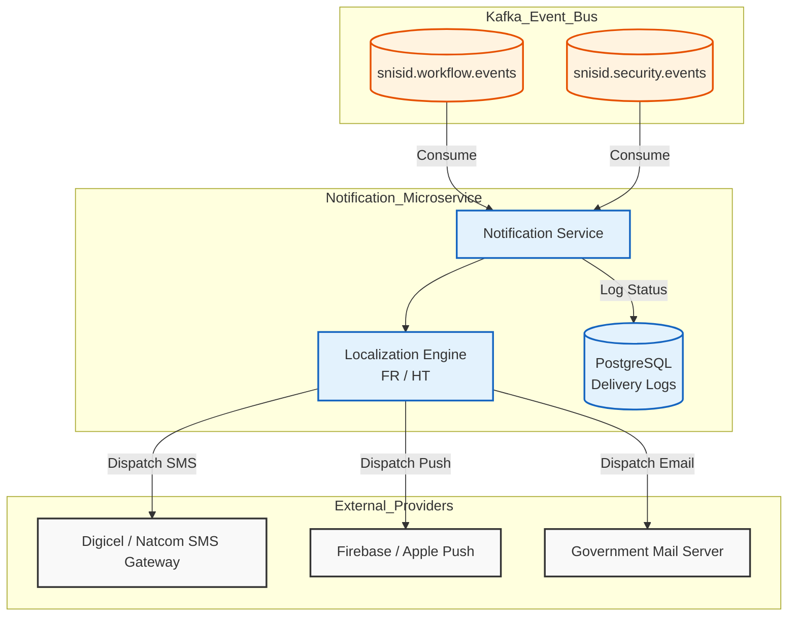
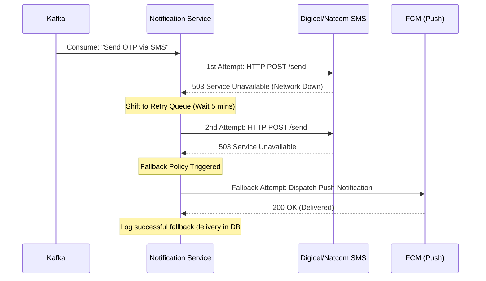

# SNISID Notification Service Architecture
## Multi-Channel Alerting & Citizen Communication

This document outlines the architectural design for the **Notification Service**. As a highly asynchronous, event-driven microservice, it is responsible for delivering critical alerts, security prompts, and status updates to citizens across multiple channels (SMS, Email, Mobile Push), ensuring they are kept informed in their preferred language.

---

## 1. Multi-Channel Delivery & Localization

### Multilingual & Haitian Creole Support
The system natively supports dynamic templating. When a notification event is received, the service queries the Citizen Registry for the user's preferred language.
- If the preference is `ht` (Haitian Creole), the service injects variables into the Creole template (e.g., *"Kat idantite w la pare pou w vin chèche l"*).
- If `fr` (French), it uses the French template (e.g., *"Votre carte d'identité est prête à être retirée"*).

### Channel Providers
- **SMS Integration:** Integrates directly with local Haitian telecom providers (Digicel, Natcom) via SMPP or REST APIs.
- **Push Notifications:** Integrates with FCM (Firebase Cloud Messaging) and APNs (Apple Push Notification service) for the SNISID Citizen Mobile App. Used heavily for cryptographic FIDO2 consent requests.
- **Email:** Standard SMTP integration for long-form government communications.

---

## 2. Event-Driven Kafka Integration

The Notification Service rarely receives synchronous HTTP requests. Instead, it acts as a massive Kafka consumer, listening to domain events across the entire SNISID ecosystem.

### Subscribed Kafka Topics
- `snisid.workflow.enrollment.completed` -> Triggers "Your ID is ready" SMS.
- `snisid.security.login.anomaly` -> Triggers "Unrecognized login detected" Push Notification.
- `snisid.consent.request.initiated` -> Triggers "Bank X is requesting your data" Push Notification.

---

## 3. Resilience & Delivery Guarantees

Telecom networks in Haiti can be highly unstable during extreme weather or grid outages. The Notification Service is built to handle extended provider downtime.

- **Exponential Backoff Retries:** If the Digicel SMS API returns a 503 error, the Notification Service shifts the message to a retry queue (e.g., waiting 1 minute, 5 minutes, then 30 minutes).
- **Offline Delivery Handling:** If a citizen's mobile phone is off-grid for days (e.g., during a hurricane), the Push Notification provider queues the message based on a configured Time-To-Live (TTL). If the TTL expires, the Notification Service can be configured to fallback to an alternative channel (e.g., attempting an SMS instead).
- **Dead Letter Queues (DLQ):** Messages that permanently fail delivery after all retries are sent to a DLQ for SOC/SRE visibility.

---

## 4. API Contract (OpenAPI Snippet)

While primarily event-driven, the service exposes an internal API for services that require synchronous trigger mechanisms (e.g., the API Gateway triggering an emergency OTP SMS).

```yaml
paths:
  /v1/notifications/send:
    post:
      summary: Dispatch an immediate multi-channel notification.
      requestBody:
        content:
          application/json:
            schema:
              type: object
              properties:
                niu: { type: string, description: "Citizen Identification Number" }
                template_id: { type: string, example: "OTP_LOGIN_001" }
                channels: 
                  type: array
                  items: { type: string, enum: [SMS, EMAIL, PUSH] }
                payload:
                  type: object
                  description: "Dynamic variables to inject into the template."
      responses:
        '202':
          description: Notification Accepted for processing.
```

---

## 5. Architecture & Workflow Diagrams (Mermaid)

### 1. Event-Driven Notification Topology
This diagram illustrates how the service listens to the global event bus and dispatches messages via the appropriate telecom/provider channels.



### 2. Retry Queue & Fallback Workflow
This sequence details the resilience mechanics when an external telecom provider is offline.



---
*Prepared by the SNISID Cloud Infrastructure & Resilience Board.*
