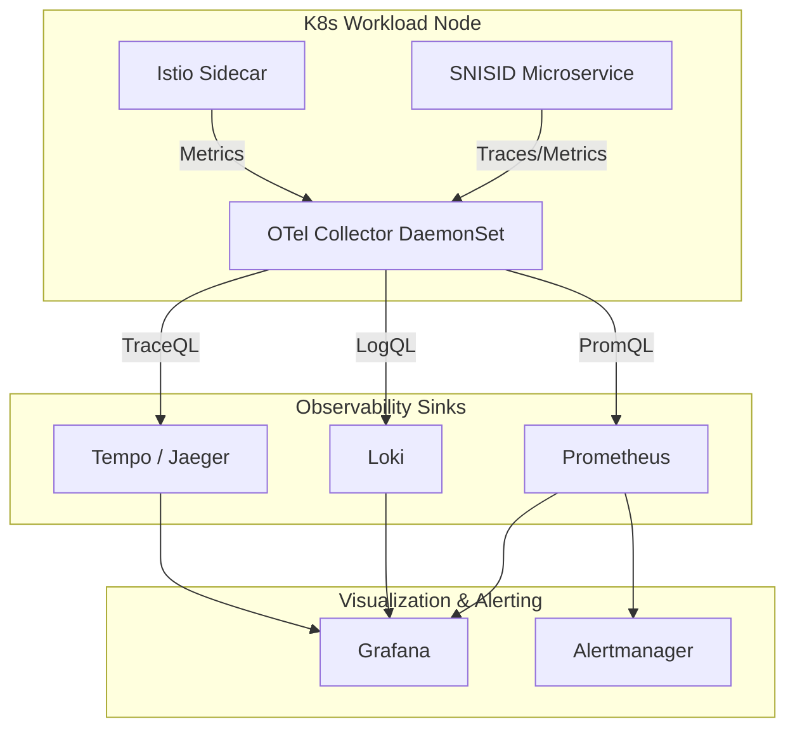
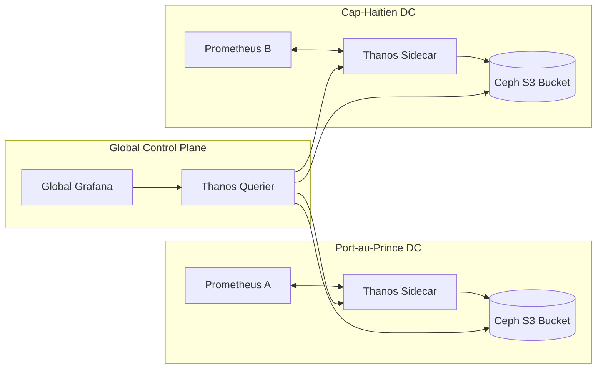
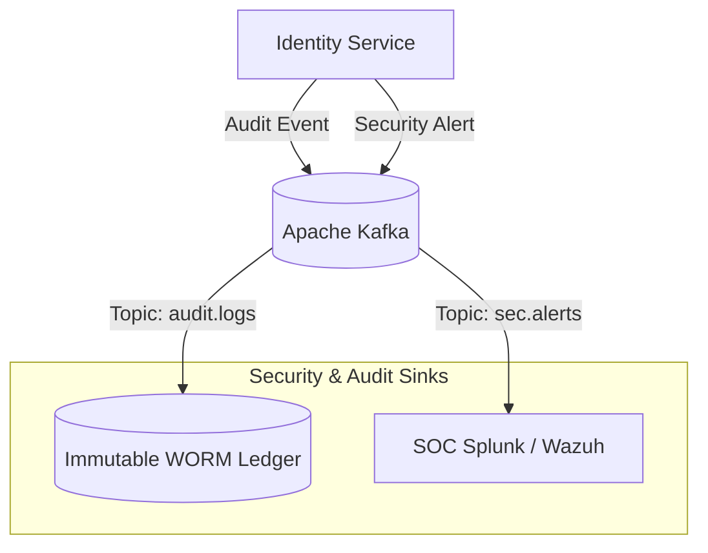

# SNISID: National Observability Architecture
## Comprehensive Telemetry & Sovereign Monitoring Strategy

This document defines the complete **Observability Architecture** for the Système National d’Identification et d’Interopérabilité Sécurisée des Identités et des Données (SNISID). Built on CNCF standards and the OpenTelemetry framework, this architecture provides unified visibility across all layers of the national sovereign infrastructure.

---

## 1. National Observability Strategy & OpenTelemetry

### National Strategy
SNISID adopts the "Three Pillars of Observability" (Metrics, Traces, Logs) integrated into a single pane of glass. It operates under a "Push and Pull" hybrid model, eliminating blind spots from the core Kubernetes clusters out to remote agency edge nodes.

### OpenTelemetry Architecture
Vendor lock-in is explicitly avoided. SNISID standardizes on **OpenTelemetry (OTel)**.
- **OTel Collectors:** Deployed as DaemonSets (per node) and sidecars (per sensitive workload) to ingest, process, filter, and export telemetry data to backend sinks.
- **Instrumentation:** Microservices are instrumented using standard OTel SDKs (Go, Rust, Java), ensuring consistent W3C trace context propagation.

## 2. Metrics, Logging, & Tracing Sinks

### Prometheus Architecture (Metrics)
- **Deployment:** Prometheus Operator runs in every cluster. It dynamically discovers targets via `ServiceMonitors` and `PodMonitors`.
- **Thanos Integration:** Thanos sidecars attach to Prometheus pods to upload metrics to S3/Ceph object storage for long-term retention. Thanos Query provides a unified global view across Port-au-Prince and Cap-Haïtien datacenters.

### Loki Architecture (Logging)
- **Log Aggregation:** Promtail or FluentBit parses container stdout/stderr, enriches logs with Kubernetes metadata (namespace, pod, labels), and pushes to Grafana Loki.
- **Storage Strategy:** Loki stores indexes in Cassandra/BoltDB and log chunks directly in cheap Object Storage (Rook/Ceph), allowing massively scalable, cost-effective log querying via LogQL.

### Distributed Tracing (Jaeger / Tempo)
- **Tracing Backend:** Grafana Tempo (or Jaeger) serves as the trace sink.
- **Trace Propagation:** HTTP headers (`traceparent`) seamlessly map requests spanning the API Gateway, Service Mesh (Istio), and backend microservices, pinpointing exact latency bottlenecks (e.g., a slow CockroachDB query).

## 3. Specialized Observability Domains

### Kubernetes & Service Mesh Observability
- **Kube-State-Metrics:** Captures the health of Deployments, Nodes, and Pods.
- **Istio Telemetry:** Istio automatically generates RED (Rate, Errors, Duration) metrics for every pod-to-pod communication over mTLS without requiring application code changes.

### Security, PKI & HSM Observability
- **PKI & HSM:** Synthetics continuously poll the OCSP responders. Custom Prometheus exporters poll the Thales HSMs via SNMP/syslog to track crypto-operations per second, temperature, and failed authentication attempts.
- **Threat & SOC Integration:** Falco runtime security alerts and WAF blocking events are mirrored simultaneously to both the SIEM (Wazuh/Splunk) for SOC triage and Loki for developer debugging.

### API & Audit Observability
- **Audit Logs:** Immutable audit logs (e.g., identity creation) are structurally separated from operational logs. They bypass Loki and stream via Kafka into a Write-Once-Read-Many (WORM) highly secure, cryptographically hashed ledger.
- **API Observability:** Kong/Tyk metrics expose global SLA metrics (P99 latency, 4xx/5xx ratios) for inter-agency data sharing.

### User Experience & Synthetic Monitoring
- **Synthetic Monitoring:** Blackbox Exporter continuously pings external national APIs, simulating citizen logins to detect outages before users report them.
- **UX Monitoring:** Real User Monitoring (RUM) agents in the SNISID Mobile App report crash data and frontend rendering latency back to the centralized OTel Collector.

## 4. Haiti-Specific Operational & DR Monitoring

### Haiti-Specific Resilience Telemetry
- **Edge Node Telemetry:** K3s nodes in remote provinces monitor local UPS battery levels, temperature, and VSAT/Starlink uplink latency.
- **Offline Buffering:** If an edge node loses internet, the local OTel Collector buffers logs/metrics to disk (Persistent Volumes) and flushes them to the central datacenter upon reconnection.

### Disaster Recovery & Multi-Region Monitoring
- Thanos Querier sits above both primary and secondary datacenters.
- Alerting rules are configured to detect if the synchronization lag (Kafka MirrorMaker or Ceph RBD) between Port-au-Prince and Cap-Haïtien exceeds 5 minutes, instantly notifying the DR engineers.

## 5. Dashboards, Alerting, & Governance

### Grafana Dashboards
- **Executive Dashboards:** High-level national KPIs (Active Citizens, Total Enrollments, System Availability %).
- **SOC Real-Time Dashboards:** Live attack maps, WAF block velocity, and Falco runtime anomalies.
- **Developer Dashboards:** Granular view of JVM heap usage, Go Goroutines, and database query latency per microservice.

### Alerting Architecture
- **Alertmanager:** Groups, deduplicates, and routes Prometheus alerts.
- **Routing:** 
  - `Critical` -> PagerDuty / SMS to on-call engineers.
  - `Warning` -> Slack / Mattermost channels.
  - `Security` -> SIEM / SOAR Webhooks for automated isolation.

### Compliance & Long-Term Retention
- **Operational Metrics/Logs:** Retained for 90 days.
- **Audit Logs:** Retained in WORM storage for 10 years to satisfy national compliance and international ISO 27001 standards.

---

## 6. Production-Ready Implementation Examples

### 1. Prometheus ServiceMonitor (YAML)
```yaml
apiVersion: monitoring.coreos.com/v1
kind: ServiceMonitor
metadata:
  name: snisid-identity-service-monitor
  namespace: snisid-obs
  labels:
    release: prometheus-operator
spec:
  selector:
    matchLabels:
      app: identity-service
  namespaceSelector:
    matchNames:
      - snisid-core
  endpoints:
  - port: metrics
    interval: 15s
    path: /metrics
```

### 2. OpenTelemetry Collector Configuration (Snippet)
```yaml
receivers:
  otlp:
    protocols:
      grpc:
      http:

processors:
  batch:
    send_batch_size: 1000
    timeout: 10s
  memory_limiter:
    check_interval: 1s
    limit_mib: 1500

exporters:
  prometheus:
    endpoint: "0.0.0.0:8889"
  loki:
    endpoint: "http://loki-gateway.snisid-obs.svc.cluster.local:80/loki/api/v1/push"
  otlp/tempo:
    endpoint: "tempo-distributor.snisid-obs.svc.cluster.local:4317"
    tls:
      insecure: true

service:
  pipelines:
    traces:
      receivers: [otlp]
      processors: [memory_limiter, batch]
      exporters: [otlp/tempo]
    metrics:
      receivers: [otlp]
      processors: [memory_limiter, batch]
      exporters: [prometheus]
```

---

## 7. Architecture Diagrams (Mermaid)

### 1. High-Level Observability Flow


### 2. Multi-Region High Availability Metrics (Thanos)


### 3. Immutable Audit Log & SIEM Pipeline


---
*Prepared by the SNISID Infrastructure & Observability Board.*
