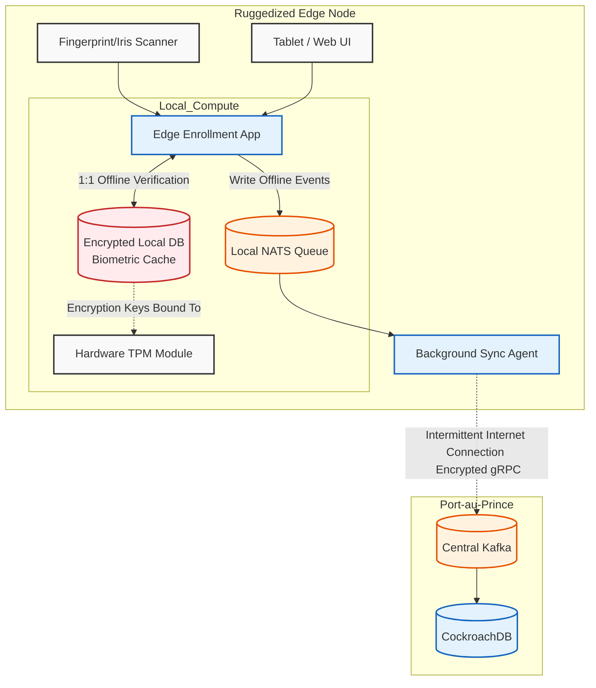
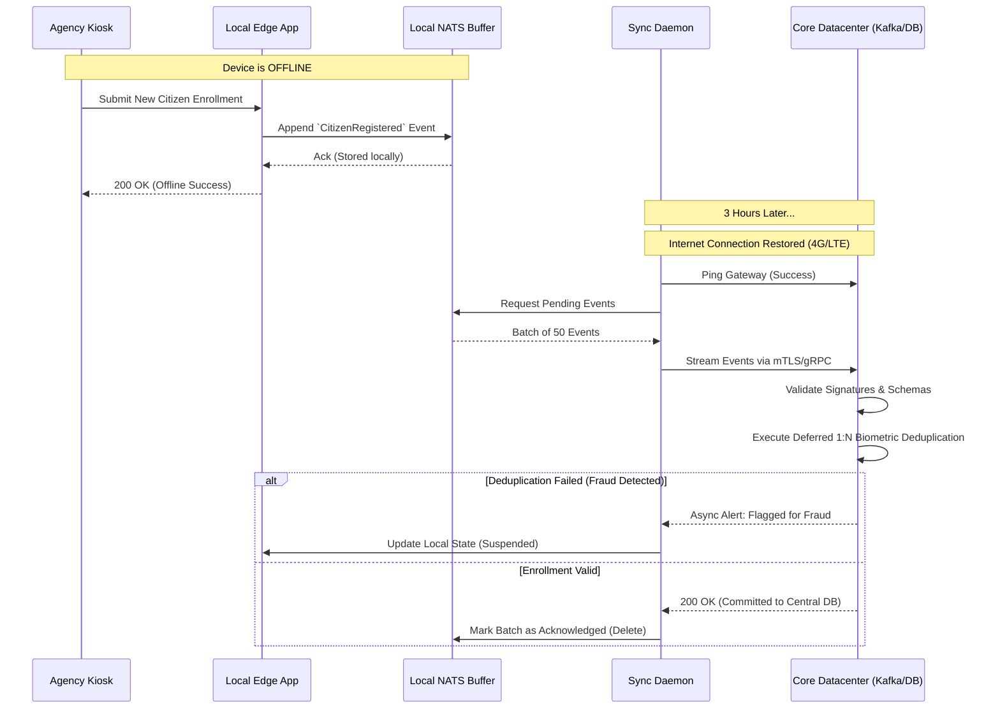

# SNISID Offline-First Architecture
## Edge Resilience for Unstable Infrastructure Environments

This document details the **Offline-First Architecture** for SNISID. Given the infrastructural realities in rural areas of the Republic of Haiti—where national power grid (EDH) outages are common and 4G/LTE signals from major telecom providers (Digicel, Natcom) can be highly intermittent—the system must be capable of seamless operation even when completely disconnected from the primary datacenters.

---

## 1. Haiti-Specific Resilience Strategy

SNISID treats network disconnects not as fatal exceptions, but as a standard operating state.
- **Edge Autonomy:** Government offices (e.g., remote ONI enrollment centers, rural clinics) operate their own localized micro-environments.
- **Asynchronous by Default:** Transactions (like enrolling a citizen or updating an address) do not require immediate confirmation from the Port-au-Prince core.
- **Mobile Enrollment Kits (MEKs):** For the most remote villages, SNISID deploys ruggedized, solar/battery-powered kits containing biometric capture devices and local compute nodes (e.g., Intel NUCs or hardened tablets).

---

## 2. Secure Edge Architecture & Storage

### Encrypted Local Storage
- **LUKS & TPM Binding:** All data at the edge is encrypted at rest using LUKS (Linux Unified Key Setup). The decryption keys are securely bound to the device's Hardware TPM (Trusted Platform Module).
- **Anti-Tamper & Remote Wipe:** If a Mobile Enrollment Kit is stolen or tampered with, the TPM locks the drive. Furthermore, upon connection to the internet, if the device has been flagged as stolen, it triggers a cryptographic shredding of the local disk.

### Offline Biometric Validation
- **Local Cache:** The edge node maintains a heavily compressed, encrypted cache of biometric templates specifically for the local population (e.g., citizens residing in that specific commune).
- **1:1 Offline Verification:** A citizen can be biometrically authenticated locally against this cache to receive services (e.g., at a clinic) without internet access.
- **Deferred 1:N Deduplication:** When enrolling a *new* citizen offline, local biometrics are captured and stored. The massive 1:N deduplication search is deferred until the unit connects to the core.

---

## 3. Synchronization & Conflict Resolution

### NATS Jetstream (Local Buffer)
- The edge node runs a lightweight message broker (**NATS Jetstream**).
- When a civil servant registers a citizen offline, the `CitizenRegistered` event is published to the local NATS queue. The application instantly returns a success message to the UI, providing a seamless user experience.

### Delayed Sync Workflow
- A background daemon continuously pings the core gateway.
- Once connectivity is restored (even briefly via 4G or Starlink), the daemon initiates a TLS-encrypted gRPC stream, flushing the NATS queue into the central Kafka backbone.

### Conflict Resolution (CRDTs)
- If a citizen's record is updated at a remote agency offline, and updated simultaneously at the central database, SNISID employs **CRDTs (Conflict-free Replicated Data Types)** and Vector Clocks.
- **Last-Write-Wins (LWW):** Using CockroachDB's distributed timestamping, the system automatically resolves the merge, ensuring absolute eventual consistency without manual intervention.

---

## 4. Architecture Diagrams (Mermaid)

### 1. Offline-First Edge Node Architecture
This diagram illustrates the internal components of a Mobile Enrollment Kit or Rural Agency Office operating entirely offline.

### 2. Delayed Synchronization & Resolution Flow
This sequence details what happens when a disconnected unit captures data and later reconnects to the national grid.

---
*Prepared by the SNISID Cloud Infrastructure & Resilience Board.*
