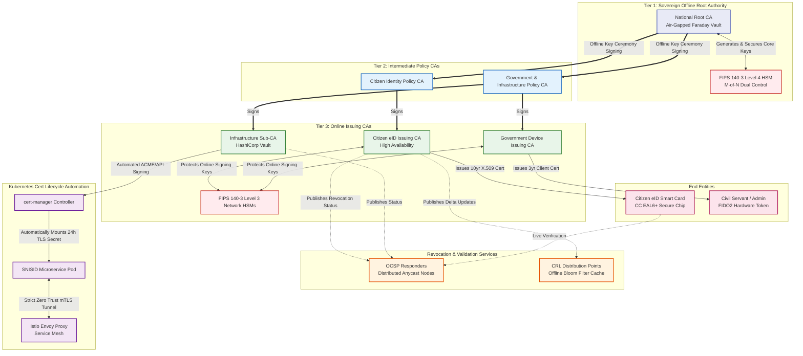

# SNISID National PKI Hierarchy Architecture

Below is the complete, enterprise-grade Mermaid diagram representing the multi-tiered Public Key Infrastructure (PKI) of the SNISID platform. 

It highlights the integration of Hardware Security Modules (HSMs), revocation validation (OCSP/CRL), end-entity citizens, and fully automated Kubernetes mTLS.

