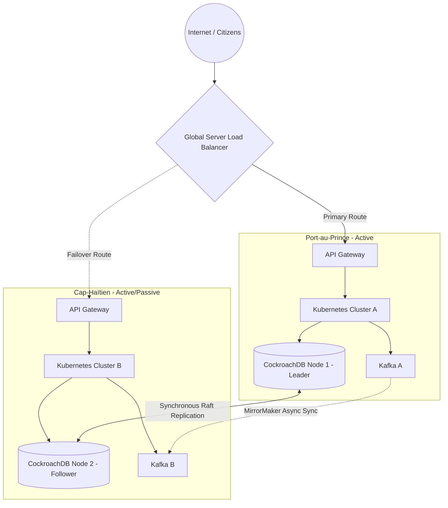
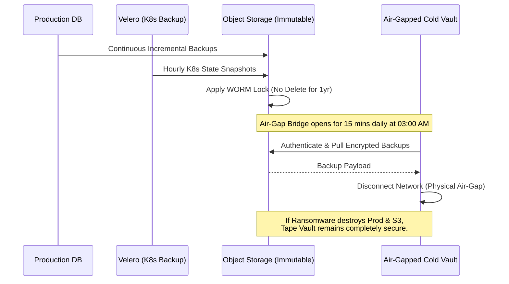
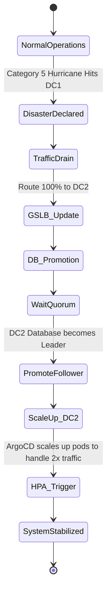

# SNISID: National PRA/PCA Architecture
## Sovereign Disaster Recovery & Business Continuity Plan

This document details the complete **Plan de Reprise d'Activité (PRA)** and **Plan de Continuité d'Activité (PCA)** for the Système National d’Identification et d’Interopérabilité Sécurisée des Identités et des Données (SNISID). Designed to withstand extreme environmental, infrastructural, and cyber threats specific to the Republic of Haiti, this architecture adheres to **ISO 22301** and **NIST SP 800-34** standards.

---

## 1. National Disaster Recovery & Business Continuity Strategy

### The PRA (Disaster Recovery) vs. PCA (Business Continuity)
- **PCA (Business Continuity):** Ensures that critical identity verifications (e.g., border control, police) continue uninterrupted despite severe degradation of the national infrastructure. Heavy reliance on offline-first edge nodes.
- **PRA (Disaster Recovery):** The automated process of fully restoring the central Kubernetes control plane, databases, and PKI infrastructure following a catastrophic failure (e.g., complete destruction of a datacenter).

### RTO & RPO Strategy
- **RPO (Recovery Point Objective):** The maximum acceptable data loss. SNISID targets **RPO = 0** for the core identity registry via synchronous multi-region database replication, and **RPO < 5 minutes** for non-critical audit logs.
- **RTO (Recovery Time Objective):** The maximum allowable downtime. SNISID targets **RTO < 15 minutes** for automated failovers, and **RTO < 4 hours** for a total cold-start of the secondary datacenter.

## 2. Multi-Region Failover Architecture

### Active-Active vs. Active-Passive
- **Active-Active (Stateless Workloads):** Both the Port-au-Prince (DC1) and Cap-Haïtien (DC2) datacenters actively serve API traffic. Global Server Load Balancing (GSLB) routes traffic to the nearest healthy datacenter.
- **Active-Passive (Stateful Workloads):** To avoid split-brain scenarios, the primary CockroachDB write-leader resides in DC1. If DC1 fails, DC2 automatically promotes its read-replicas to write-leaders.

### Multi-Datacenter Synchronization
- **Database Replication:** CockroachDB natively distributes chunks across both datacenters using Raft consensus.
- **Event Streaming:** Apache Kafka uses **MirrorMaker 2.0** to asynchronously replicate event topics (e.g., identity updates) from DC1 to DC2.

## 3. Haiti-Specific Resilience Strategy

### 1. Earthquake & Hurricane Resilience
- **Geographic Segregation:** The two primary datacenters are located on different tectonic fault lines and separated by significant distance to ensure a single hurricane/earthquake does not destroy both.
- **Bunker Facilities:** Datacenters are housed in seismically isolated (base-isolated) bunkers, elevated above historic flood plains (Category 5 Hurricane resistance).

### 2. Power Outage Resilience
- **N+1 Generation:** Each datacenter possesses N+1 diesel generators with 14 days of fuel reserves.
- **Edge Nodes (Solar+Battery):** Remote ONI agency offices utilize low-voltage ARM clusters (e.g., Raspberry Pi or Intel NUCs) powered by localized solar panels and LiFePO4 batteries, completely independent of the EDH national grid.

### 3. Internet Outage & Offline-First Operations
- **VSAT/Starlink Failover:** Core datacenters and critical edge nodes automatically failover from terrestrial fiber to encrypted satellite links.
- **Offline Operations:** eID Smart Cards contain signed cryptographic assertions. Remote agency edge nodes use cached public keys to verify citizen identities locally, requiring **zero internet connection**. Transactions are queued locally in NATS JetStream and flushed to the core when connectivity returns.

### 4. Physical Attack & Civil Unrest Resilience
- **TPM & Zeroization:** All edge nodes and core servers utilize TPM 2.0. Any physical chassis intrusion triggers an immediate hardware interrupt that cryptographically zeroizes (destroys) the encryption keys, rendering stolen hard drives useless.

## 4. Backup & Immutability Architecture

### Backup Architecture
- **Kubernetes State:** Velero takes hourly snapshots of the ETCD state and pushes them to object storage.
- **Database Snapshots:** CockroachDB and PostgreSQL take continuous incremental backups.

### Immutable & Air-Gapped Backups
- Backups are written to an S3-compatible Object Storage bucket with **Object Lock (WORM)** enabled. Even a rogue administrator with "root" credentials cannot delete or modify the backup for 10 years.
- **Air-Gapped Vault:** Once a day, a physical or logical air-gap is bridged for 15 minutes to pull the encrypted backups into a tertiary, deeply isolated "Cold Vault" (e.g., an offline tape library or sovereign cloud enclave) to protect against advanced Ransomware.

## 5. Specific Disaster Recovery Workflows

### Kubernetes Disaster Recovery
- If DC1 is destroyed, GitOps (ArgoCD) in DC2 is pointed to the primary Git repository. Because infrastructure is strictly declared as code, ArgoCD seamlessly provisions all Deployments, Services, and Network Policies in DC2 exactly as they were in DC1.

### PKI & HSM Disaster Recovery
- **Root CA:** The Offline Root CA remains safely air-gapped.
- **HSM DR:** The FIPS 140-3 HSM in DC1 replicates its encrypted key material to the HSM in DC2. If DC1 burns down, the HSM in DC2 requires a Quorum (M-of-N smart cards) to activate the Issuing CAs and resume signing certificates.

### SOC & Cyber Crisis Management
- **SOC Continuity:** If the primary SOC is compromised (physical or cyber), control shifts to a highly classified "War Room" utilizing Out-of-Band (OOB) communications (e.g., encrypted Threema/Signal channels over satellite).
- **Incident Response:** Pre-approved "Kill Switches" can instantly severe external BGP routes or isolate specific Kubernetes namespaces if a nation-state APT breach is detected.

## 6. Testing, Validation, & Executive Governance

### Recovery Testing Procedures (Chaos Engineering)
A PRA is useless if untested.
- **Game Days:** Bi-annual simulated disaster drills.
- **Chaos Mesh:** Automated injection of faults (killing random pods, simulating 100% CPU spikes, simulating 10-second network latency between datacenters) in the staging environment to ensure automated failover scripts actually work.

### Compliance & Executive Governance
- **Executive Sign-Off:** The PRA/PCA must be reviewed and signed annually by the Minister of the Interior and the National CISO.
- **Audit Integration:** All failover tests generate cryptographically signed logs proving to external auditors (ISO 22301) that RTO/RPO metrics were successfully met during the drill.

---

## 7. Architecture Diagrams (Mermaid)

### 1. Multi-Region Failover Architecture


### 2. Immutable Air-Gapped Backup Workflow


### 3. Hurricane / Earthquake Failover Sequence (Runbook)


### 4. PKI & HSM Disaster Recovery Flow
```mermaid
graph TD
    subgraph Region A
        HSM1[HSM 1 - Primary]
        CA1[Issuing CA - Online]
        CA1 -->|Sign| HSM1
    end

    subgraph Region B
        HSM2[HSM 2 - Standby]
        CA2[Issuing CA - Standby]
    end

    subgraph Secure Transfer
        Sync[Encrypted Key Replication]
    end

    HSM1 --> Sync
    Sync --> HSM2

    subgraph DR Activation
        Admin[Quorum 3-of-5 Smart Cards]
    end

    Admin -.->|Physical Insert| HSM2
    HSM2 -.->|Unlock Keys| CA2
    Note bottom of CA2: In case Region A is destroyed,<br/>Region B HSM must be manually unlocked<br/>by executives to resume issuing IDs.
```

---
*Prepared by the SNISID Business Continuity & Resilience Board.*
