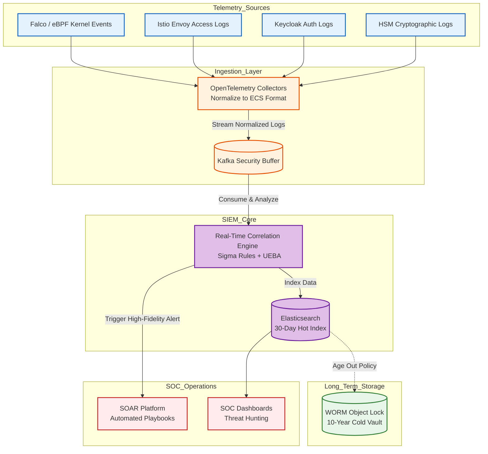
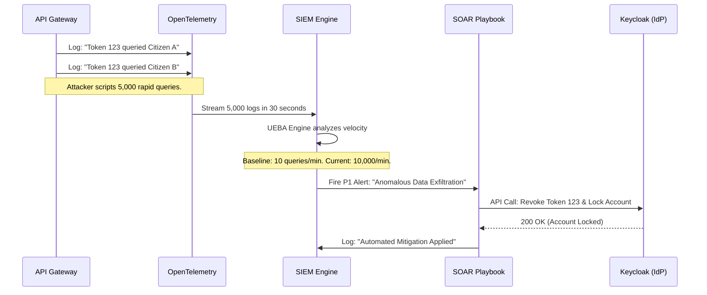

# SNISID SIEM Architecture
## National Security Information and Event Management

This document details the **SIEM (Security Information and Event Management) Architecture** for SNISID. As the central nervous system of the National SOC, the SIEM is responsible for ingesting, correlating, and analyzing terabytes of telemetry across the entire sovereign ecosystem in real-time. It transforms raw logs into actionable intelligence to detect advanced persistent threats (APTs), insider threats, and system anomalies.

---

## 1. Centralized Telemetry Ingestion

The SIEM ingests telemetry from every layer of the SNISID stack.

### Ingestion Sources
1. **Kubernetes & eBPF (Falco/Cilium):** Real-time kernel syscalls, network flows, and container lifecycle events.
2. **Microservices (OpenTelemetry):** Distributed traces, RED metrics, and application logs (Identity, Consent, Biometrics).
3. **API Gateway & Mesh (Istio/Envoy):** L7 access logs, mTLS termination events, and rate-limiting triggers.
4. **IAM & PKI (Keycloak/HSM):** Authentication successes/failures, JWT issuance, OPA authorization denials, and cryptographic signing events.
5. **Immutable Audit Service:** Non-repudiable business events (e.g., "Agent X queried Citizen Y").

### OpenTelemetry (OTel) Pipeline
- **OTel Collectors:** Deployed as DaemonSets on every Kubernetes node. They scrape metrics and receive traces/logs via gRPC.
- **Data Normalization:** The OTel collectors parse raw logs, extract fields (TraceID, UserID, IP), and format them into the unified Elastic Common Schema (ECS) before forwarding.

---

## 2. SIEM Data Pipelines & Correlation Engine

### High-Throughput Buffering (Kafka)
To prevent the SIEM from buckling under a massive DDoS attack or a sudden spike in logs, all telemetry is first buffered in a dedicated **Kafka Security Cluster**. The SIEM consumption engine reads from this buffer at its own pace.

### Real-Time Correlation & Detection
The SIEM uses a stream processing engine to correlate events across different domains in real-time.
- **Rule-Based Detection (Sigma Rules):** Triggers instantly on known bad behavior (e.g., "5 failed logins followed by a successful login from a new IP").
- **Anomaly Detection (Machine Learning):** Establishes baselines for entity behavior (UEBA). For example, it detects if an API token suddenly queries 100x more records than its 30-day historical average.

---

## 3. Alerting & SOC Integration

- **Tiered Alerting:** High-fidelity alerts (P1/P2) are routed directly to the SOC Analysts via SOAR (Security Orchestration, Automation, and Response) platform integrations (e.g., TheHive or Cortex XSOAR).
- **Automated Mitigation:** For critical, unambiguous threats (e.g., Falco detects a shell spawned in a container), the SIEM triggers a SOAR playbook to instantly quarantine the node or revoke the IAM session without human intervention.

---

## 4. Immutable Retention & Compliance

- **Hot Tier (30 Days):** Data is stored in high-performance SSD-backed Elasticsearch indices for rapid threat hunting and dashboarding.
- **Cold Vault (10 Years):** To comply with national legal requirements, logs are aged out into an S3-compatible Ceph object store with strict **Write-Once-Read-Many (WORM)** policies. These logs are mathematically chained and cannot be altered, ensuring forensic non-repudiation in Haitian courts.

---

## 5. Architecture Diagrams (Mermaid)

### 1. SIEM Data Pipeline & Aggregation Topology
This diagram illustrates the flow of telemetry from edge devices to the core SIEM correlation engine.

### 2. Threat Detection Workflow (Insider Threat Scenario)
This sequence diagram details how the SIEM detects and reacts to a compromised API credential.

---
*Prepared by the SNISID Cloud Infrastructure & Resilience Board.*
