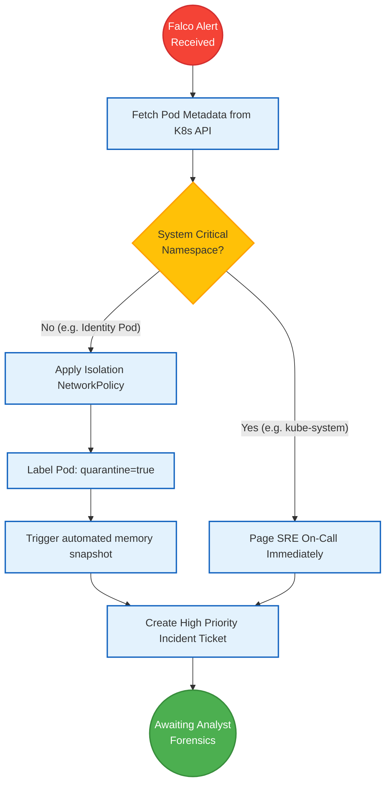

# SNISID SOAR Architecture
## Security Orchestration, Automation, and Response

This document details the **SOAR Architecture** for SNISID. While the SIEM acts as the "brain" detecting anomalies, the SOAR platform acts as the "immune system"—executing automated, machine-speed playbooks to contain, quarantine, and eradicate threats across the Kubernetes and Identity infrastructure before human analysts even wake up.

---

## 1. Automated Playbooks & Incident Automation

SNISID utilizes pre-coded, standardized playbooks (e.g., using Cortex XSOAR or an open-source equivalent like Shuffle/TheHive) triggered instantly by SIEM alerts.

### Playbook 1: Kubernetes Workload Compromise (Falco Alert)
**Trigger:** Falco eBPF detects `Terminal shell in container` or `Write below /etc`.
**Automated Response:**
1. **Enrichment:** SOAR queries Kubernetes API for the Pod IP, Namespace, and attached ServiceAccount.
2. **Containment:** SOAR applies a dynamic `CiliumNetworkPolicy` denying all Egress traffic from that specific Pod, cutting off the attacker's Command & Control (C2) beacon.
3. **Quarantine:** SOAR labels the pod `quarantine: true` (removing it from the Istio load balancer) but *does not kill it*, allowing SOC analysts to snapshot the memory for forensics.
4. **Notification:** Opens a Jira ticket and pushes an urgent notification to the Tier 2 SOC channel.

### Playbook 2: Insider Threat Data Exfiltration (UEBA Alert)
**Trigger:** SIEM detects "Impossible Travel" or "Mass API Queries" from a government agent's token.
**Automated Response:**
1. **Enrichment:** SOAR pulls the agent's identity and recent audit logs from OpenSearch.
2. **Containment:** SOAR calls the Keycloak Admin API to instantly revoke all active JWT sessions for that user.
3. **Mitigation:** SOAR suspends the user's IAM profile globally.
4. **Notification:** Dispatches an SMS alert to the agent's manager and the DCPJ (Judicial Police) liaison.

---

## 2. Threat Intelligence & Enrichment

Before escalating to a human, SOAR automatically enriches the ticket with context to save the analyst 30+ minutes of manual investigation:
- Checks the source IP against known malicious threat feeds (AlienVault OTX, VirusTotal).
- Queries the SNISID Identity database to resolve the `agent_id` to a physical human name, department, and geographic assignment.

---

## 3. Architecture Diagrams (Mermaid)

### 1. SOAR Integration Topology
This diagram illustrates how SOAR sits between the detection engines and the infrastructure APIs.

```mermaid
graph TD
    classDef siem fill:#ffebee,stroke:#c62828,stroke-width:2px;
    classDef soar fill:#e1bee7,stroke:#6a1b9a,stroke-width:2px;
    classDef api fill:#e3f2fd,stroke:#1565c0,stroke-width:2px;
    classDef act fill:#fff3e0,stroke:#e65100,stroke-width:2px;

    SIEM[SIEM / Correlation Engine]:::siem
    
    subgraph SOAR_Platform
        Orchestrator[Playbook Orchestrator]:::soar
        ThreatIntel[Threat Enrichment Hub]:::soar
        Orchestrator <--> ThreatIntel
    end

    subgraph Infrastructure_APIs [Mitigation Targets]
        K8S[Kubernetes API Server]:::api
        CILIUM[Cilium / Istio Control Plane]:::api
        IAM[Keycloak Admin API]:::api
    end

    subgraph SOC_Operations
        JIRA[Jira / Ticketing]:::act
        SLACK[SOC Paging System]:::act
    end

    SIEM -->|P1 Alert (JSON)| Orchestrator
    
    Orchestrator -->|Execute K8s Playbook| K8S
    Orchestrator -->|Execute Mesh Playbook| CILIUM
    Orchestrator -->|Execute Identity Playbook| IAM
    
    Orchestrator -->|Create Enriched Ticket| JIRA
    Orchestrator -->|Page Analyst| SLACK
```

### 2. Automated Compromised Pod Playbook Flow
This flowchart visualizes the exact sequence of the Kubernetes containment playbook.



---
*Prepared by the SNISID Cloud Infrastructure & Resilience Board.*
