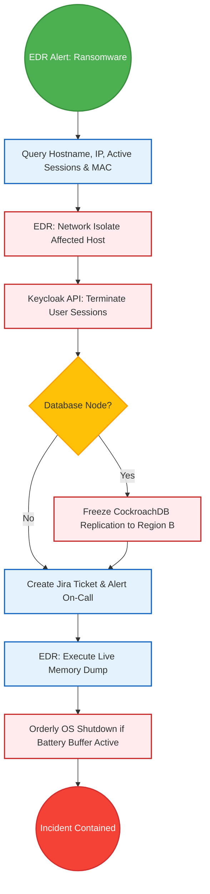
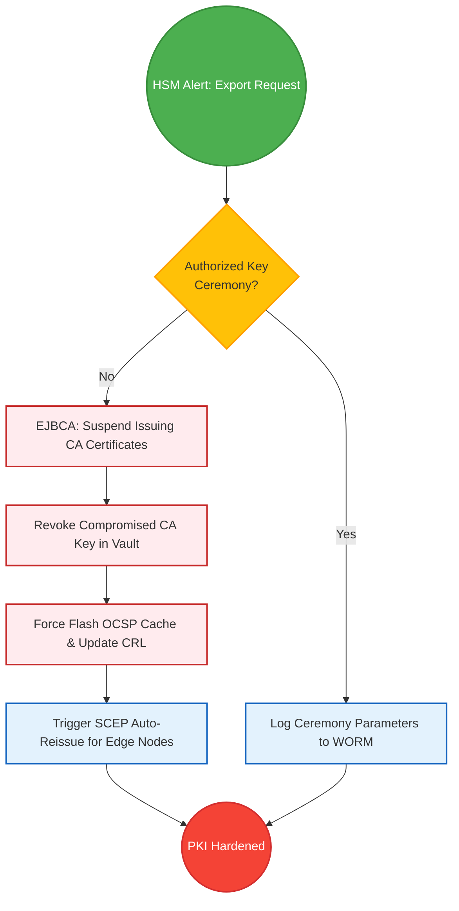

# SNISID: SOAR Playbooks Reference Manual
## Automated Incident Response Playbooks & Threat Containment Workflows

This document defines the **complete automated response playbooks** for the *Système National d'Identification et d'Interopérabilité Sécurisée des Identités et des Données (SNISID)*. 

These playbooks run on the central SOAR engine (Cortex XSOAR or Shuffle), executing automated, machine-speed mitigations to protect the national identity registry against systemic cyber threats.

---

## Table of Contents

1. [Playbook 01: Ransomware Incident Response](#playbook-01-ransomware-incident-response)
2. [Playbook 02: Insider Threat Response](#playbook-02-insider-threat-response)
3. [Playbook 03: API Gateway Compromise](#playbook-03-api-gateway-compromise)
4. [Playbook 04: Kubernetes Workload Compromise](#playbook-04-kubernetes-workload-compromise)
5. [Playbook 05: Certificate Authority / PKI Compromise](#playbook-05-certificate-authority--pki-compromise)
6. [Playbook 06: Biometric Fraud & Identity Spoofing](#playbook-06-biometric-fraud--identity-spoofing)
7. [Playbook 07: Data Exfiltration Containment](#playbook-07-data-exfiltration-containment)
8. [Playbook 08: Privilege Escalation Prevention](#playbook-08-privilege-escalation-prevention)
9. [Playbook 09: Malware Containment & C2 Block](#playbook-09-malware-containment--c2-block)
10. [Playbook 10: Phishing & Credential Harvesting Response](#playbook-10-phishing--credential-harvesting-response)
11. [Playbook 11: Nation-State / Cyber Crisis Response](#playbook-11-nation-state--cyber-crisis-response)

---

## Playbook 01: Ransomware Incident Response

### Workflow Diagram

* **Trigger**: EDR (CrowdStrike/SentinelOne) detects high-entropy file modifications, shadow copy deletions, or known ransomware binaries (e.g., LockBit, ALPHV) running on a workstation or server.
* **Enrichment**: Extracts hostname, local IP, active agent/admin accounts, and active database connection handles.
* **Containment**:
  * Calls EDR API to isolate the host network interface.
  * Calls Keycloak Admin API to revoke all active tokens for the logged-in agent.
  * *Critical Action*: If the host is a database node, the SOAR executes a script to suspend CockroachDB replication pipelines, preventing encrypted tables from propagating to the Cap-Haïtien secondary datacenter.
* **Eradication**: Tier 3 SREs restore the host from the latest daily immutable WORM backup.

---

## Playbook 02: Insider Threat Response

* **Trigger**: SIEM UEBA engine detects "Impossible Travel" (e.g., agent logged in from Cap-Haïtien and Port-au-Prince within 30 minutes) or an abnormal volume of queries to the citizen registry.
* **Enrichment**: Retrieves the agent's NNI, home commune, active session duration, and the transaction logs of accessed citizen records.
* **Containment**:
  * Calls Keycloak API to immediately invalidate all active JWT tokens.
  * Suspends the agent's Active Directory/LDAP credentials.
  * Disables the agent's WebAuthn FIDO2 token in HashiCorp Vault.
* **Escalation**: Sends an automated SMS alert to the ONI Regional Director and the DCPJ (Judicial Police) fraud coordination unit.

---

## Playbook 03: API Gateway Compromise

* **Trigger**: NGINX/Kong Ingress logs show a high rate of HTTP 403/401 errors, or OPA (Open Policy Agent) alerts on BOLA (Broken Object Level Authorization) violations.
* **Enrichment**: Resolves the attacker's source IP, ISP, ASN, target API endpoints, and any API keys used in the headers.
* **Containment**:
  * Pushes a temporary block rule to the Kong API Gateway or Cloudflare WAF for the source IP/ASN block.
  * Revokes the leaked API key or client secret in Keycloak.
  * Auto-deploys a canary container with rate-limiting sidecars to inspect downstream traffic.
* **Eradication**: Rotates the backend database credential secrets using HashiCorp Vault's dynamic secrets generator.

---

## Playbook 04: Kubernetes Workload Compromise

* **Trigger**: Falco runtime security agent detects a shell spawned inside an Identity service container or an unauthorized write to `/etc`.
* **Enrichment**: Gathers the Pod name, Namespace, Host Node IP, and Cilium eBPF network flow metrics.
* **Containment**:
  * Pushes a `CiliumNetworkPolicy` to the cluster, blocking all egress traffic from the pod to isolate the Command & Control (C2) beacon.
  * Labels the pod with `quarantine=true` to withdraw it from the Istio service mesh load balancer.
  * Triggers an automated memory dump of the container namespaces.
  * *Do Not Kill Pod*: The container remains active in quarantine to preserve volatile RAM evidence for Tier 3 analysis.

---

## Playbook 05: Certificate Authority / PKI Compromise

### Workflow Diagram

* **Trigger**: HSM audit log detects an unauthorized request to export private keys, or abnormal spikes in certificate issuances by the online Citizen eID CA.
* **Enrichment**: Identifies the certificate serial numbers, client IP requesting signing, and HSM administrative partition key IDs used.
* **Containment**:
  * Suspends EJBCA CA issuing authority certificates, halting all new issuances.
  * Calls Vault API to revoke the signing keys used by the compromised container.
  * Flushes the global OCSP responder cache to instantly publish revoked status.
* **Eradication**: Initiates a PKI Key Ceremony using a physical HSM M-of-N quorum to generate fresh keys and reissue root anchors to all regional offices.

---

## Playbook 06: Biometric Fraud & Identity Spoofing

* **Trigger**: The ABIS matching engine registers multiple hard-match biometric hits ($\ge 95\%$) from different communes using different biographical demographics.
* **Enrichment**: Compares the enrollment transaction IDs, geolocations, document OCR hashes, and enrollment agent FIDO2 tokens.
* **Containment**:
  * Freezes the newly created NNI and the existing matched NNI in CockroachDB to prevent civic mutations.
  * Places a hold on the smart card personalization queue for those records.
  * Flags the enrollment agent's account for active investigation.
* **Escalation**: Routes the case file to the Regional Director and files an automated referral to the DCPJ Fraud Unit.

---

## Playbook 07: Data Exfiltration Containment

* **Trigger**: Network Traffic Analyzer (Zeek) detects a high volume of outbound traffic over SSL/SSH (data exfiltration signature) to an unclassified IP.
* **Enrichment**: Cross-references the network flow with Keycloak OIDC sessions to map the exfiltration back to a specific application or user token.
* **Containment**:
  * Directs Cilium to apply bandwidth rate-limiting policies ($\le 10\text{ kbps}$) to the source container, slowing the data drain.
  * Revokes the active session token and shuts down the Kong gateway endpoint.
  * Isolates the source database node network segments.
* **Eradication**: Rotates all microservice tokens and patches the data leakage endpoint.

---

## Playbook 08: Privilege Escalation Prevention

* **Trigger**: PAM (Privileged Access Management) logs a successful root SSH login to an edge node or central server without a corresponding scheduled Jira change ticket.
* **Enrichment**: Identifies the admin's NNI, IP address, geolocation, and keystroke logs.
* **Containment**:
  * Terminates the active SSH session immediately.
  * Suspends the administrator's Keycloak account.
  * Unseals HashiCorp Vault's dynamic credentials and changes the system user root password.
* **Notification**: Pagers the CISO and SOC Manager on encrypted out-of-band channels.

---

## Playbook 09: Malware Containment & C2 Block

* **Trigger**: Zeek/Suricata NIDS detects command-and-control (C2) beaconing patterns (e.g., DNS tunneling, periodic HTTP queries to dynamic domains).
* **Enrichment**: Identifies the source node, destination C2 IP/domain, port, and process name.
* **Containment**:
  * Deploys a global DNS block rule via CoreDNS/Pi-hole servers, sinkhole-ing the malicious domain.
  * Calls EDR to kill the beaconing process on the host.
  * Isolate the host from the subnet.
* **Eradication**: Runs EDR malware removal scripts and extracts the malicious binary to a malware sandbox for reverse engineering.

---

## Playbook 10: Phishing & Credential Harvesting Response

* **Trigger**: A citizen or agent reports a suspicious duplicate SNISID portal login screen, or the mail gateway flags a phishing payload.
* **Enrichment**: Extracts malicious URLs, domain registrars, host IPs, and email header records (DKIM, SPF).
* **Containment**:
  * Adds the phishing domain to the national DNS blacklist.
  * Purges matching phishing emails from all agent mailboxes.
  * Triggers a mandatory password and MFA token reset for all agents who opened the email.
* **Eradication**: Files take-down requests with the hosting provider and domain registrar.

---

## Playbook 11: Nation-State / Cyber Crisis Response

* **Trigger**: Concurrent P1 alerts on PKI compromises, malware beaconing to state-sponsored C2 infrastructure, or physical attacks on datacenters.
* **Enrichment**: Collates all active incidents, maps them to threat actors (APT groups), and evaluates target assets.
* **Containment (Cyber Crisis Mode)**:
  * Shuts down terrestrial fiber interfaces, routing all traffic through Starlink satellite links.
  * Restricts access to the production CockroachDB registry to air-gapped War Room terminals.
  * Sets the global OPA policy to "Deny All" for all non-essential third-party agency connections.
* **Communications**: Shifts all command communications to hardware-encrypted out-of-band networks (Signal/Threema over satellite).

---

*All playbooks are integrated into the SNISID SOAR platform. They ensure compliance with ISO 27001 standards, guarantee forensic admissibility of evidence, and protect national public infrastructure.*
