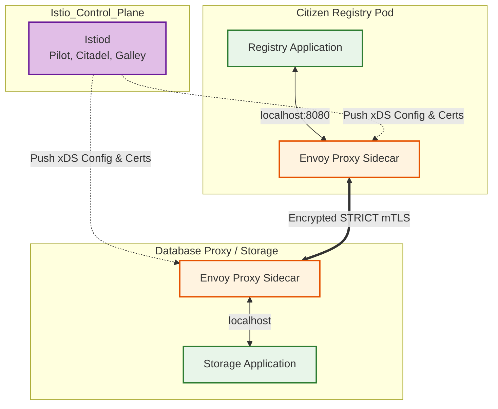
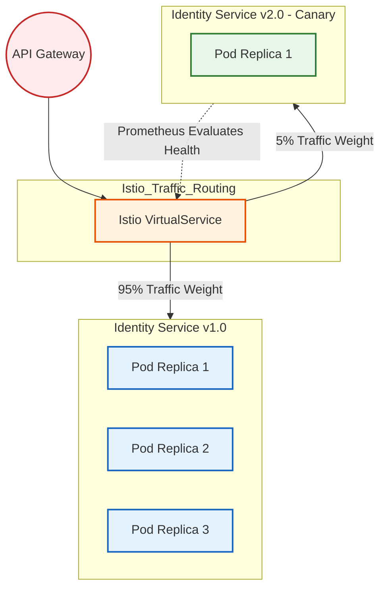
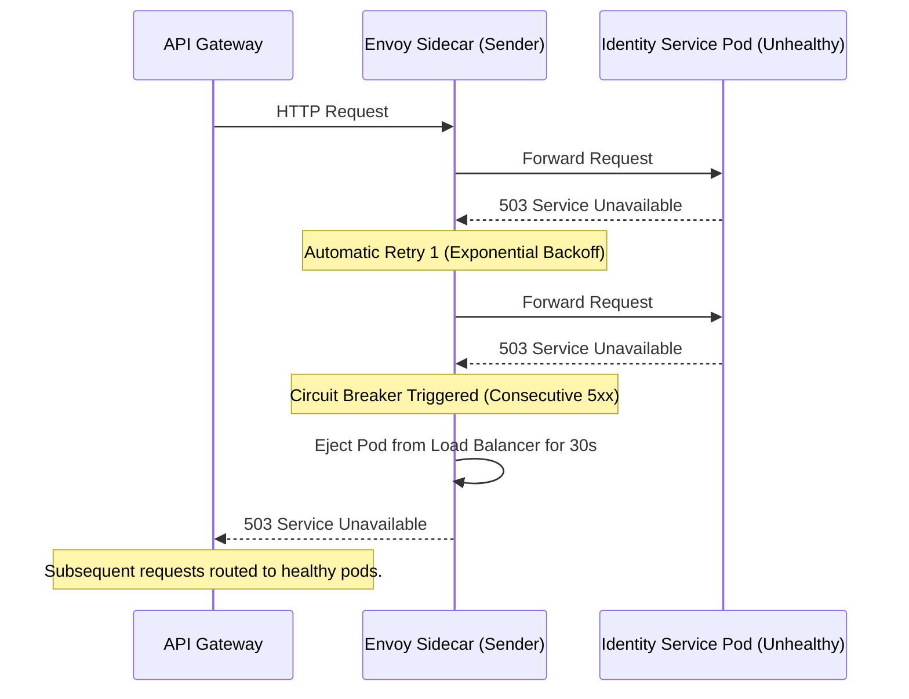

# SNISID Service Mesh Architecture
## Istio Zero Trust & Traffic Control Blueprint

This document details the production-grade **Service Mesh Architecture** for SNISID, utilizing **Istio** as the core networking plane. By abstracting network communication away from the application code, the Service Mesh provides a transparent layer for enforcing Zero Trust security, dynamic traffic management, and deep observability across all microservices.

---

## 1. Zero Trust & Security Operations

### Strict Mutual TLS (mTLS)
- SNISID enforces **STRICT mTLS** across the entire cluster. Plaintext HTTP traffic is completely rejected.
- **Identity via SPIFFE:** Istiod (the control plane) acts as a Certificate Authority (or integrates with the national PKI HSM), automatically issuing short-lived X.509 certificates to every Envoy proxy sidecar based on the pod's Kubernetes Service Account.
- If a bad actor gains access to the internal network, they cannot read or spoof traffic between microservices because they lack the cryptographic identity.

### Authorization Policies (L7 Firewall)
- Traffic is not permitted simply because it is encrypted. Istio `AuthorizationPolicies` define explicitly which services can communicate. (e.g., Only the API Gateway is permitted to call the Identity Service; the Identity Service cannot call the Consent Service).

---

## 2. Traffic Management & Resilience

### Circuit Breaking
To prevent cascading failures across the ecosystem, Istio `DestinationRules` implement outlier detection:
- If a microservice pod returns 5 consecutive `5xx` server errors, it is automatically ejected from the load-balancing pool for 30 seconds. This allows the failing pod time to recover or be killed by Kubernetes probes.

### Intelligent Retries & Timeouts
- **Retries:** Network blips are mitigated transparently by the Envoy proxy. Failed requests (e.g., connection refused, gateway timeouts) are automatically retried up to 3 times using exponential backoff.
- **Timeouts:** Hard timeouts are enforced at the network level, ensuring that a hanging downstream service does not freeze the upstream calling service.

---

## 3. Advanced Deployment Strategies

### Canary Deployments & Traffic Shifting
- SNISID utilizes GitOps (ArgoCD + Argo Rollouts) integrated with Istio for zero-downtime Canary deployments.
- When `Identity Service v2.0` is deployed, Istio `VirtualServices` route exactly 5% of live traffic to the new version.
- Prometheus monitors the error rate and latency of the 5% slice. If the metrics are healthy, Istio progressively shifts traffic (10%, 25%, 50%, 100%). If anomalies are detected, it instantly rolls back to `v1.0`.

### Fault Injection (Chaos Engineering)
- In the staging environments, SNISID intentionally introduces chaos using Istio Fault Injection to validate system resilience.
- **Delay Injection:** Adding 2 seconds of latency to 10% of requests to test timeout configurations.
- **Abort Injection:** Returning HTTP 500 errors to 5% of requests to test circuit breaker tripping.

---

## 4. Observability & Telemetry

- **No Code Instrumentation Required:** Envoy sidecars automatically capture RED metrics (Rate, Errors, Duration) for every inbound and outbound request.
- **Distributed Tracing:** Istio automatically propagates OpenTelemetry `B3` headers across service hops, visualizing the exact path of a transaction through the mesh in Jaeger/Tempo.
- **Mesh Visualization:** **Kiali** is used by the SRE team to visualize real-time traffic topology, health grades, and mTLS status across the cluster.

---

## 5. Architecture & Traffic Flow Diagrams (Mermaid)

### 1. Zero Trust Service Mesh Topology
This diagram illustrates how application containers are abstracted from the network layer via injected Envoy sidecars.

### 2. Canary Deployment Traffic Flow
This diagram shows how a `VirtualService` splits traffic between two versions of the Identity Service during a rolling upgrade.

### 3. Circuit Breaker & Retry Flow

---
*Prepared by the SNISID Cloud Infrastructure & Resilience Board.*
