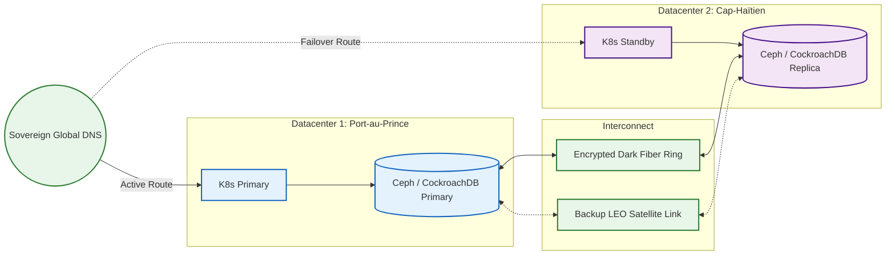

# SNISID Sovereign Government Cloud Architecture
## IaaS & PaaS Foundation for National Resilience

This document details the complete **Sovereign Government Cloud Architecture** underpinning the SNISID platform. By owning the entire stack—from the bare-metal servers to the sovereign DNS roots—the Republic of Haiti ensures absolute data sovereignty, eliminating reliance on foreign hyper-scalers (AWS, Azure) and protecting against extraterritorial data seizures.

---

## 1. Sovereign Datacenters & HA Networking

### Physical Datacenters (Tier III / IV)
- **Primary Region (DC1):** Port-au-Prince (Base-isolated bunker, heavily fortified).
- **Secondary Region (DC2):** Cap-Haïtien (Active-Passive failover, >100km geographic separation).
- **Power Resilience:** N+2 diesel generators with 30-day fuel reserves and redundant UPS arrays to combat national grid (EDH) instability.

### HA Networking & Sovereign Connectivity
- **BGP Autonomous System:** SNISID operates its own ASN and IP space.
- **Dark Fiber Ring:** The two datacenters are connected via an encrypted, dedicated dark fiber optic ring, bypassing public ISPs.
- **Satellite Failover:** OOB (Out-of-Band) management and edge-node synchronization automatically failover to encrypted LEO satellite networks (e.g., Starlink) if terrestrial fiber is severed.

## 2. Kubernetes & Compute Architecture

### Immutable Operating Systems
- **Talos Linux:** The bare-metal servers do not run standard Ubuntu/RHEL. They run Talos Linux, an immutable, API-managed OS designed specifically for Kubernetes. There is no SSH, no bash shell, and no console access, massively reducing the attack surface.

### Kubernetes Clusters (PaaS)
- **Multi-Tenant Isolation:** The cloud offers isolated Kubernetes clusters using Cilium (eBPF) CNI for strict network microsegmentation.
- **Namespaces as a Service:** Different government agencies (DGI, Justice, Health) are given logically isolated namespaces within the core cluster, governed by Kyverno/OPA policies preventing lateral movement.

## 3. Storage Architecture & Immutable Backups

### Distributed Storage (Ceph)
- **Rook/Ceph:** Provides unified block (RBD), file (CephFS), and object (S3) storage across the bare-metal nodes. 
- **Synchronous Mirroring:** Ceph RBD mirrors stateful volumes synchronously between Port-au-Prince and Cap-Haïtien for Zero RPO (Zero Data Loss).

### Immutable Backups & Air-Gapped Security
- **WORM Storage:** Database backups and SIEM audit logs are written to an S3-compatible bucket with Object Lock (Write-Once-Read-Many) enforced for 10 years.
- **The Air-Gapped Vault:** A robotic LTO tape library is physically disconnected from the network (air-gapped). Once a day, a network bridge opens for 15 minutes to pull the encrypted backups into the tape vault, neutralizing advanced ransomware threats.

## 4. Sovereign DNS & PKI

### Sovereign DNS
- **Internal DNS Roots:** SNISID hosts its own recursive and authoritative DNS servers for the `*.gov.ht` zone.
- **DNSSEC:** All internal domains are cryptographically signed using DNSSEC to prevent DNS spoofing and BGP hijacking.

### Sovereign PKI (Public Key Infrastructure)
- The Root CA resides on a FIPS 140-3 Level 4 HSM in an offline Faraday cage deep within the DC1 bunker. Online Issuing CAs use network-attached HSMs to automatically provision certificates to Kubernetes pods via `cert-manager`.

## 5. Zero Trust Networking

### The Perimeter & DMZ
- External traffic hits the **Edge DMZ** containing the Web Application Firewalls (WAF) and Anti-DDoS appliances.
- Traffic is then routed to the **API Gateway DMZ** (Kong), which terminates external TLS, validates JWTs, and enforces rate limits.
- Finally, traffic enters the **Core K8s Network** where Istio enforces strict service-to-service mutual TLS (mTLS).

---

## 6. Architecture Diagrams (Mermaid)

### 1. Sovereign Cloud Topology & Network Segregation
```mermaid
graph TD
    classDef ext fill:#f9f9f9,stroke:#333,stroke-width:2px;
    classDef dmz fill:#e1bee7,stroke:#6a1b9a,stroke-width:2px;
    classDef core fill:#e8f5e9,stroke:#2e7d32,stroke-width:2px;
    classDef secure fill:#ffebee,stroke:#c62828,stroke-width:2px;
    classDef storage fill:#fff3e0,stroke:#e65100,stroke-width:2px;

    Internet((Global Internet)):::ext
    
    subgraph DMZ_Layer [Tier 1: Edge DMZ (Public Facing)]
        BGP[BGP Edge Routers <br/> SNISID ASN]:::dmz
        DDOS[Hardware Anti-DDoS]:::dmz
        WAF[Web Application Firewall]:::dmz
    end

    subgraph API_Layer [Tier 2: API Gateway DMZ]
        KONG[Kong API Gateway]:::dmz
        DNS[Sovereign DNSSEC Servers]:::dmz
    end

    subgraph Core_Layer [Tier 3: Core Kubernetes Cloud]
        K8S[Talos Linux Bare-Metal K8s]:::core
        ISTIO[Istio Service Mesh <br/> Strict mTLS]:::core
        APPS[Identity & Biometric Microservices]:::core
    end

    subgraph Vault_Layer [Tier 4: Highly Restricted Enclave]
        VAULT[HashiCorp Vault]:::secure
        HSM[Network HSMs]:::secure
        WORM[(Immutable S3 Storage)]:::storage
    end

    subgraph AirGap [Tier 5: Air-Gapped Cold Vault]
        TAPE[(LTO Tape Library)]:::storage
    end

    Internet --> BGP
    BGP --> DDOS --> WAF
    WAF --> KONG
    KONG -->|mTLS| K8S
    K8S --> ISTIO --> APPS
    
    APPS -.->|Read/Write| VAULT
    VAULT -.->|PKCS#11| HSM
    APPS -.->|Audit Logs| WORM
    
    WORM -.->|Air-Gap Bridge (15m/day)| TAPE
```

### 2. Multi-Region Disaster Recovery Network (Dark Fiber)


---
*Prepared by the SNISID Cloud Infrastructure & Resilience Board.*
