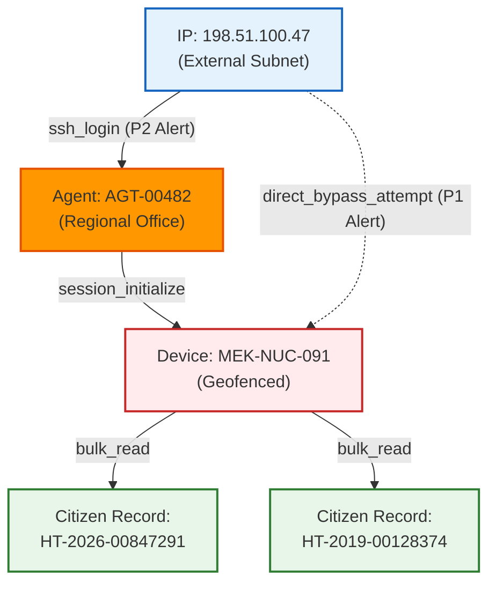

# SNISID: Sovereign Threat Hunting Platform Design
## AI Anomaly Detection, Graph Attack-Path Analysis & MITRE ATT&CK Detections

This document specifies the technical architecture for the **Sovereign Threat Hunting Platform** of the *Système National d'Identification et d'Interopérabilité Sécurisée des Identités et des Données (SNISID)*. 

As an active defense layer, this platform ingests high-throughput telemetry streams to identify Advanced Persistent Threats (APTs), zero-day attacks, insider threats, and identity fraud before they trigger signature-based security alerts.

---

## 1. AI & Machine Learning Threat Detection Pipeline

The threat hunting platform employs an asynchronous machine learning pipeline to analyze telemetry from the Kafka security bus without affecting live transaction workloads.

```
[Kafka Security Stream] ──► [Flink Feature Aggregator] ──► [Feature Store (Feast)]
                                                                  │
                                                                  ├─► [TensorFlow Autoencoder (Unsupervised Anomaly)]
                                                                  └─► [XGBoost Classifier (Supervised Fraud Scoring)]
                                                                                │
                                                                                ▼
                                                                     [Normalized Risk Score]
                                                                                │
                                                                 ┌──────────────┴──────────────┐
                                                                 ▼                             ▼
                                                           [Risk < 0.6]                  [Risk ≥ 0.6]
                                                           (Log Normal)           (P1 Alert to SIEM/SOAR)
```

* **Feature Store (Feast)**: Consolidates user/device baselines (e.g., `avg_queries_8h`, `distance_from_last_ip`, `failed_mfa_ratio`).
* **Unsupervised Autoencoders**: Trained on historical, clean system metrics. At runtime, the model reconstructs the input feature vector. If the reconstruction error exceeds a dynamic threshold ($\text{MSE} \ge 0.15$), the event is flagged as an anomaly (zero-day or novel threat signature).
* **Supervised XGBoost Classifier**: Ingests features from biometric captures, document scans, and API transactions to calculate a probability score for organized identity theft or duplicate registrations.

---

## 2. MITRE ATT&CK Mapping & Custom Sigma Rules

All threat hunting queries and SIEM correlation alerts are classified against the **MITRE ATT&CK Framework** to map platform defensive coverage.

| MITRE Technique | Threat Vector | Target Layer | Sigma Detection Rule | Hunting Priority |
|---|---|---|---|:---:|
| **T1078 (Valid Accounts)** | Rogue admin or insider agent abusing active credentials. | Identity Registry | `agent_anomalous_query_rate.yml` | High |
| **T1567 (Exfiltration)** | Bulk querying citizen records for exfiltration. | API Gateway | `api_gateway_data_exfiltration.yml` | High |
| **T1611 (Escape to Host)** | Container compromise attempting escape to Kubernetes node. | Container Runtime | `falco_container_privilege_escalation.yml` | Critical |
| **T1110 (Brute Force)** | Credential stuffing at agency kiosks. | IAM Portal | `keycloak_failed_mfa_stuffing.yml` | Medium |
| **T1553 (Subvert Trust)** | Rogue certificate generation attempting to spoof devices. | PKI/Vault | `vault_unauthorized_ca_signing.yml` | Critical |

### Sigma Rule: Anomalous Agent Query Rate (T1078)
```yaml
title: Anomalous Agent Query Rate (T1078)
id: 7201093a-7a1a-431f-9519-6473741d3aeb
status: production
description: Detects when a government agent queries citizen records at a rate exceeding 5 standard deviations from their 30-day UEBA baseline.
author: SNISID Threat Hunting Division
date: 2026-05-24
logsource:
    product: snisid
    service: identity-service
detection:
    selection:
        event_code: "CR.QUERY"
    timeframe: 10m
    value_count:
        agent_id:
            count: 500
    condition: selection and value_count > baseline_value * 5
falsepositives:
    - Mass data migration authorized by Regional Director (requires scheduled ticket)
level: high
tags:
    - attack.initial_access
    - attack.t1078
```

---

## 3. Graph-Based Attack Path Analysis (Neo4j)

To trace complex, multi-stage attacks where individual alerts appear low-risk but form a malicious chain collectively, SNISID correlates events using **Neo4j Graph Intelligence**:



* **Correlation Heuristics**: The graph engine dynamically correlates IP addresses, agent accounts, device certificates, and target citizen records. 
* **Attack Path Detection**: A Cypher query calculates path risk:
  ```cypher
  MATCH path = (ip:IPAddress)-[:AUTHENTICATED]->(agent:Agent)-[:OPERATES]->(dev:Device)-[:ACCESSED]->(citizen:Citizen)
  WHERE ip.risk_score > 0.6 AND dev.tamper_status = 'WARNING'
  RETURN path, sum(citizen.value) as exfil_impact
  ```

---

## 4. Domain-Specific Hunting Workflows

### 4.1. Kubernetes Threat Hunting Workflow
1. **Trigger**: Falco runtime raises a container alert (kernel syscall anomaly).
2. **Analysis**: Threat hunter queries OpenTelemetry Jaeger traces for that pod's specific Transaction ID, looking for unexpected outbound TCP sockets.
3. **Correlation**: Cross-checks pod audit logs against the ArgoCD GitOps repo to verify if the container image hash matches the declared registry state.
4. **Resolution**: If a hash mismatch exists, the hunter triggers the SOAR Playbook to quarantine the pod, dumping its RAM.

### 4.2. API & BOLA Hunting Workflow
1. **Trigger**: Kong access logs show resource ID manipulation (e.g., `/v1/citizens/HT-001` immediately followed by `/v1/citizens/HT-002` using the same token).
2. **Analysis**: Hunter aggregates OPA logs to check if the authorization requests returned multiple denied responses.
3. **Containment**: Blocks the client source IP, suspends the token, and prompts SRE to patch the endpoint authorization middleware.

### 4.3. Biometric Fraud & Duplicate Registration Hunting
1. **Trigger**: ABIS logs show multiple 1:N deduplication matches scoring $\ge 90\%$ over a 24-hour window from the same department.
2. **Analysis**: Pulls the document scans and runs OCR verification on document issue dates.
3. **Correlation**: Cross-references geolocations of the enrollment terminals; identifies if a single agent was involved in all enrollments.
4. **Escalation**: Flags agent account, locks NNIs, and notifies the DCPJ Fraud Unit.

---

## 5. Threat Hunter Dashboard UI Mockup

The Threat Hunting console consolidates system telemetry, alert timelines, and the Neo4j active attack graph:

```
┌─────────────────────────────────────────────────────────────────────────────────────────────┐
│  SNISID SOVEREIGN THREAT HUNTING PLATFORM               [Crisis Mode: OFF] [Uptime: 99.9%]  │
├───────────────────────────────────────────────────────┬─────────────────────────────────────┤
│  ACTIVE ANOMALIES QUEUE                               │  NEO4J ATTACK PATH VISUALIZATION    │
│  [P1] Anomaly on MEK-NUC-091 (Reconstruction > 0.8)   │                                     │
│  [P1] Velocity Breach: AGT-00482 (Jérémie mountains)  │      (198.51.100.47)                │
│  [P2] BOLA Anomaly: Kong API Gateway Endpoint /v1/cit │            │ (ssh)                  │
│  [P3] Bloom Filter Cache Miss Spike: Region B         │            ▼                        │
│                                                       │       [AGT-00482]                   │
│  SLA COMPLIANCE MONITOR                               │            │ (operates)             │
│  - Mean Time to Detect (MTTD): 3.2 minutes            │            ▼                        │
│  - Mean Time to Contain (MTTC): 12 seconds            │       [MEK-NUC-091]                 │
│  - Active SOAR Isolated Pods: 2                       │            │ (queries)              │
│                                                       │            ▼                        │
│  UEBA INSIDER THREAT MONITOR                          │      [HT-2026-00847291]             │
│  - Top Anomaly Score: AGT-00482 (Score: 0.94)         │                                     │
└───────────────────────────────────────────────────────┴─────────────────────────────────────┘
```

---

*This design blueprint outlines the technological standards for the SNISID Threat Hunting architecture, ensuring complete visibility and active containment capabilities across the national public infrastructure.*
