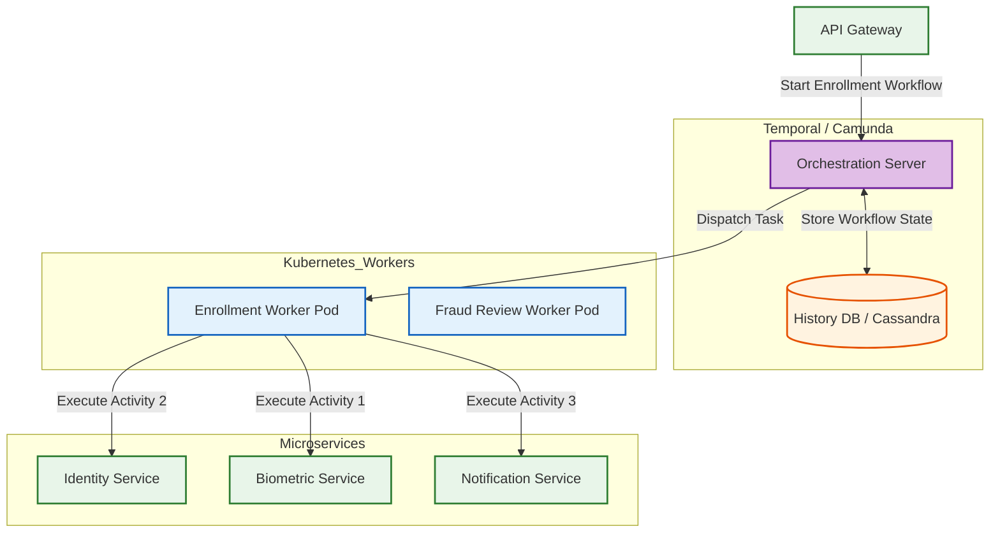
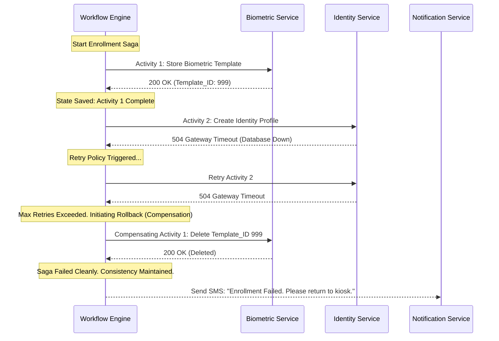
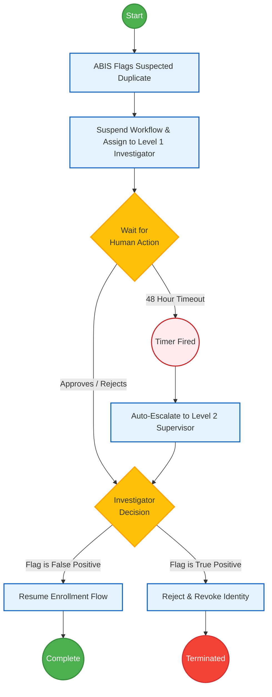

# SNISID Workflow Engine Architecture
## Distributed Sagas & BPMN Orchestration

This document details the **Workflow Engine Architecture** for SNISID. Because SNISID operates as a distributed microservices ecosystem, complex business processes (like Citizen Enrollment) span multiple independent databases. To guarantee data consistency across these services, SNISID abandons fragile distributed transactions (two-phase commit) in favor of the **Saga Pattern** orchestrated by a dedicated, stateful Workflow Engine (e.g., **Temporal.io** or **Camunda Zeebe**).

---

## 1. Core Workflow Capabilities

### Distributed Workflow Execution
The Workflow Engine acts as the central conductor. It coordinates calls to the Identity Service, Biometric Service, and Notification Service, maintaining the durable state of the overall transaction. If a pod crashes in the middle of a workflow, the engine seamlessly resumes execution from the exact line of code upon recovery.

### The Saga Pattern & Compensating Transactions
When executing a multi-step workflow across distributed databases, failure at any step requires a rollback.
- **Example:** If Step 1 (Save Biometrics) succeeds, but Step 2 (Create Identity Record) fails due to a DB timeout, the engine automatically executes a **Compensating Transaction**—it calls the Biometric Service to explicitly delete the orphaned template, guaranteeing eventual consistency.

### Human-in-the-Loop & SLA Enforcement
- **Human Approvals:** Workflows can be "paused" indefinitely while awaiting human input. For example, if the ABIS flags a citizen for suspected fraud, the workflow suspends and alerts a DCPJ investigator. Once the investigator clicks "Override" in the UI, the workflow resumes.
- **SLA Escalations:** The engine natively supports timers. If the human investigator does not resolve the fraud flag within 48 hours, an SLA timer fires, automatically escalating the ticket to a Senior Supervisor.

---

## 2. Kafka & Event-Driven Integration

The Workflow Engine integrates seamlessly with the Kafka backbone.
- **Event Listeners:** The engine can wait for external events to proceed. (e.g., The workflow pauses and waits until the `snisid.agency.tax_clearance.received` event is published to Kafka).
- **Event Publishers:** Upon successfully completing a Saga, the engine emits terminal events to Kafka (e.g., `snisid.workflow.enrollment.completed`), allowing downstream analytics and notification services to react.

---

## 3. Kubernetes Deployment Strategy

- **Stateless Workers:** The actual workflow code (e.g., Temporal Worker processes) runs in standard, stateless Kubernetes pods. They can be scaled infinitely via Horizontal Pod Autoscalers (HPA) based on queue depth.
- **Stateful Core:** The engine's core orchestration cluster is stateful and backed by highly available Cassandra or PostgreSQL clusters, ensuring the persistence of every workflow's execution history.

---

## 4. Architecture Diagrams (Mermaid)

### 1. Workflow Engine Deployment Topology
This diagram illustrates how the stateful engine orchestrates stateless workers and microservices.

### 2. Saga Pattern with Compensating Transactions
This sequence demonstrates a failure scenario during enrollment, where the engine automatically triggers the rollback mechanisms.

### 3. BPMN Human-in-the-Loop & SLA Escalation
This flowchart visualizes the process when the Biometric ABIS detects a duplicate template, triggering a manual human review with an SLA timer.

---
*Prepared by the SNISID Cloud Infrastructure & Resilience Board.*
