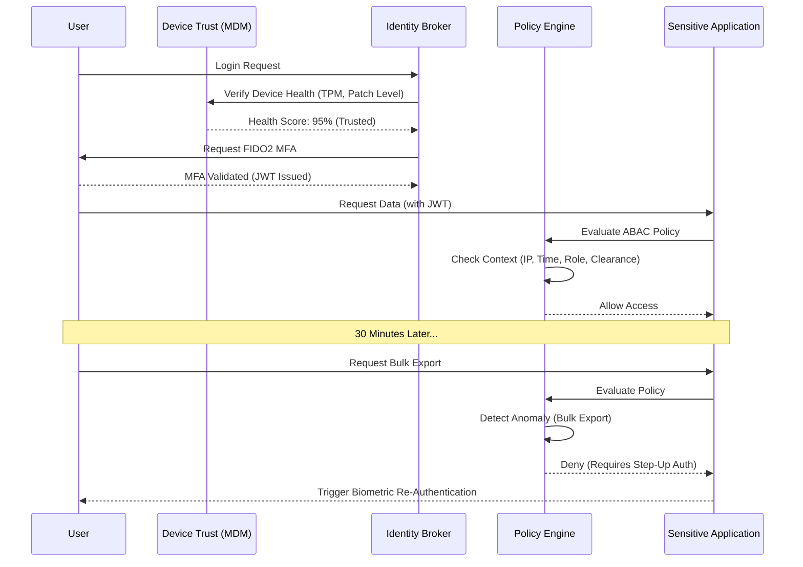

# SNISID: National Zero Trust Architecture (ZTA)
## Sovereign Cyber Defense Framework

This document outlines the comprehensive **Zero Trust Architecture (ZTA)** for the Système National d’Identification et d’Interopérabilité Sécurisée des Identités et des Données (SNISID). It is strictly aligned with **NIST SP 800-207** and the **CISA Zero Trust Maturity Model (Optimal Pillar)**, ensuring that no implicit trust is granted based on physical or network location.

---

## 1. National Zero Trust Framework & Core Principles
SNISID completely abandons the traditional "castle-and-moat" perimeter defense.
- **Assume Breach:** The internal network is treated as perpetually hostile and already compromised.
- **Verify Explicitly:** Every request—from a citizen, an agency worker, or an internal microservice—must be fully authenticated, authorized, and encrypted.
- **Least Privilege Access:** Access is granted dynamically based on the absolute minimum permissions required to perform the immediate task.

## 2. Identity-Centric Security Model
Identity is the new perimeter.
- **User Trust Architecture:** Identities (Citizens and Civil Servants) are the primary control plane. SNISID utilizes centralized OIDC/SAML federated identity providers (Keycloak) for all authentication.
- **Identity Federation:** DGI, ONI, and DCPJ integrate via federated Single Sign-On (SSO), preventing credential sprawl and allowing SNISID to revoke access instantly across all national systems if an identity is compromised.

## 3. Continuous Verification & Adaptive Access
Authentication is not a one-time event at login.
- **Continuous Monitoring:** Every API request is evaluated continuously. If context changes during a session (e.g., the user's IP changes to a high-risk ASN), access is immediately suspended.
- **Adaptive Access Controls:** The Policy Engine evaluates the Subject, Object, Action, and Environment. Access to "Public" data might only require a password, but accessing "Confidential" biometric records triggers a step-up MFA prompt.

## 4. Device Trust & Endpoint Security
- **Device Trust Architecture:** No personal or unmanaged device can access the SNISID administrative core. Devices are evaluated via Mobile Device Management (MDM) solutions.
- **Endpoint Security:** Edge scanners and laptops must possess a TPM 2.0 module, a valid `Device-IoT-CA` certificate, disk encryption (BitLocker/LUKS), and a running EDR agent (CrowdStrike/SentinelOne) to establish a trusted session.

## 5. Authentication: MFA, Biometrics & Risk-Based
- **Multi-Factor Authentication (MFA):** Mandatory for all civil servants (FIDO2/WebAuthn Hardware Security Keys).
- **Biometric Authentication:** Citizens use the eID NFC chip combined with a biometric facial/fingerprint scan (1:1 match) for high-assurance portal access.
- **Risk-Based Authentication:** Machine learning evaluates the login velocity, geolocation, and device fingerprint. Anomalous logins trigger immediate challenges or block access outright.

## 6. Authorization: RBAC & ABAC Architecture
- **Role-Based Access Control (RBAC):** Provides baseline permissions (e.g., "Customs Agent").
- **Attribute-Based Access Control (ABAC):** Executed by Open Policy Agent (OPA). Policies are written in Rego and evaluated per-request. E.g., *Access is Denied* even for a "Customs Agent" if the current time is outside their shift schedule, or if they are not logging in from a whitelisted DGI border IP address.

## 7. Network: Microsegmentation & Isolation
- **Microsegmentation:** The network is broken down into granular segments. Kubernetes namespaces are heavily restricted. 
- **Network Isolation:** Cilium CNI enforces L3/L4/L7 network policies. A compromised `Notification Service` pod physically cannot open a TCP connection to the `Identity Database` because the strict whitelist policy denies it.

## 8. Service-to-Service Authentication & mTLS
- **mTLS Architecture:** Istio Service Mesh mandates mutual TLS (mTLS) for 100% of internal SNISID traffic.
- **Service-to-Service Identity:** SPIFFE/SPIRE issues short-lived cryptographic identities (X.509 SVIDs) to every workload. Pod A proves its identity to Pod B cryptographically before a single byte of application data is exchanged.

## 9. API Security & Secrets Management
- **API Security Model:** API Gateways (Kong) inspect all ingress traffic for OWASP vulnerabilities and validate JWT signatures.
- **Secrets Management:** HashiCorp Vault injects short-lived, dynamic credentials. There are no static passwords in databases or configuration files. If an attacker extracts a database password from memory, it expires within minutes.

## 10. Threat Detection & Insider Threat Mitigation
- **UEBA Integration:** User and Entity Behavior Analytics track baseline behaviors. Large data exports or unusual API call frequencies trigger alerts to the SOC.
- **Insider Threat Mitigation:** "Maker-Checker" principles mandate two-person approval for sensitive actions (e.g., Identity Revocation).
- **AI-Assisted Threat Detection:** Real-time machine learning models analyze Istio flow logs to detect subtle lateral movement patterns indicative of an APT.

## 11. Secure Remote Access (ZTNA)
- Traditional VPNs are banned.
- **Zero Trust Network Access (ZTNA):** Civil servants working remotely authenticate through an Identity-Aware Proxy (e.g., Pomerium or Cloudflare Access). The proxy only grants access to specific individual applications (e.g., `https://hr.snisid.gov.ht`), completely hiding the rest of the internal network from the remote endpoint.

## 12. Session Security
- **Strict Session TTLs:** Idle sessions timeout in 15 minutes. Absolute session timeout is 8 hours.
- Token binding and IP-pinning prevent stolen JWTs from being replayed from a different location.

## 13. Audit, Compliance, & PKI Integration
- **PKI Integration:** The National PKI underpins the entire ZTA, issuing the certificates used for Device Trust, mTLS, and eID authentication.
- **Audit Architecture:** Every authorization decision (Allow/Deny) made by OPA, and every API request passing through the Gateway, is logged to the WORM storage via Kafka for forensic non-repudiation.
- **Compliance Architecture:** This architecture natively fulfills ISO 27001 logical access controls and GDPR data minimization requirements.

## 14. Operational Governance & Cyber Resilience
- **National Cyber Resilience Strategy:** SNISID's microsegmented architecture ensures that a successful breach of a peripheral system (e.g., an agency endpoint) does not compromise the core Identity Registry.
- **Incident Response & DR:** In the event of a detected breach, the SOAR automatically reconfigures Kubernetes Network Policies to quarantine the affected pod or subnet without impacting the rest of the highly-available (Active-Active) infrastructure.

---

## 15. Architecture Diagrams (Mermaid)

### 1. NIST 800-207 Logical Architecture Mapped to SNISID
```mermaid
graph TD
    subgraph Control Plane
        PE[Policy Engine (Keycloak/ABAC)]
        PA[Policy Administrator (OPA/Istio)]
    end

    subgraph Data Plane
        Sub[Subject: Citizen/Agent]
        Sys[System/Device]
        PEP[Policy Enforcement Point: API Gateway / Istio Proxy]
        Obj[Resource: Identity Registry DB]
    end

    subgraph External Inputs
        PKI[National PKI]
        SIEM[SOC / Threat Intel]
        CDP[Continuous Diagnostics]
    end

    Sub --> Sys
    Sys -->|Untrusted Request| PEP
    PEP -.->|Auth Request| PA
    PA -.->|Evaluate Context| PE
    PE -.->|Fetch Data| PKI
    PE -.->|Fetch Risk Score| SIEM
    PE -.->|Fetch Device Health| CDP
    PE -.->|Decision (Allow/Deny)| PA
    PA -.->|Apply Rule| PEP
    PEP -->|mTLS Trusted Request| Obj
```

### 2. Continuous Verification & Adaptive Access Flow


### 3. Kubernetes Microsegmentation & Service Mesh Zero Trust
```mermaid
graph TD
    subgraph Kubernetes Namespace: snisid-core
        subgraph Pod A [Identity Service]
            AppA[App Container]
            EnvA[Istio Envoy Sidecar]
            AppA <--> EnvA
        end
        
        subgraph Pod B [Biometric Service]
            AppB[App Container]
            EnvB[Istio Envoy Sidecar]
            OPAB[OPA Sidecar]
            AppB <--> OPAB
            OPAB <--> EnvB
        end
    end

    SPIRE[SPIFFE/SPIRE Server] -.->|Issues X.509 SVIDs| EnvA
    SPIRE -.->|Issues X.509 SVIDs| EnvB
    
    EnvA <-->|Strict mTLS Tunnel| EnvB
    
    Note right of EnvB: Envoy handles crypto.<br/>OPA handles AuthZ.<br/>App handles business logic.
```

### 4. Zero Trust Network Access (ZTNA) vs. VPN
```mermaid
graph TD
    RemoteWorker[Civil Servant Remote Laptop]
    
    subgraph Traditional VPN (Banned)
        VPN[VPN Gateway]
        IntNet[Entire Internal Network]
    end
    
    subgraph ZTNA (SNISID Architecture)
        IAP[Identity-Aware Proxy / Cloudflare Access]
        App1[HR Portal]
        App2[DGI Database]
    end

    RemoteWorker -.->|Old Way| VPN
    VPN -.->|Implicit Trust Granted| IntNet

    RemoteWorker -->|New Way (Device Checked)| IAP
    IAP -->|Explicit Micro-Tunnel| App1
    IAP -.-x|No Access Granted| App2
    
    style VPN fill:#f99,stroke:#333,stroke-width:2px
    style IAP fill:#9f9,stroke:#333,stroke-width:2px
```

---
*Prepared by the SNISID Security Architecture Board in compliance with CISA ZTA Guidelines.*
