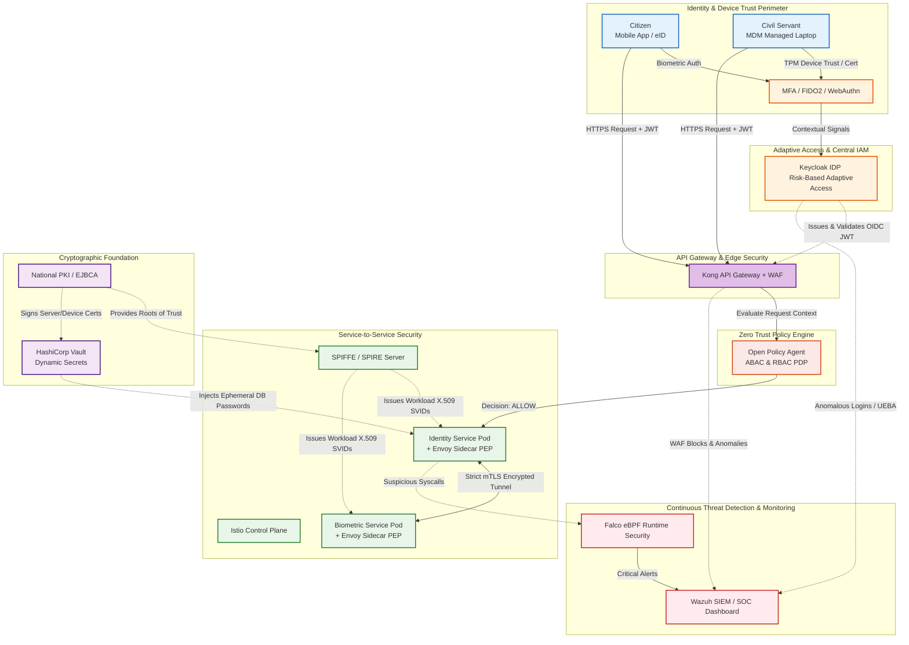

# SNISID Zero Trust Architecture Diagram

Below is the complete enterprise-grade Mermaid architecture diagram illustrating the Zero Trust security boundaries across the SNISID platform.

```mermaid
graph TD
    %% Styling and Themes
    classDef user fill:#e3f2fd,stroke:#1565c0,stroke-width:2px;
    classDef edge fill:#e1bee7,stroke:#6a1b9a,stroke-width:2px;
    classDef idp fill:#fff3e0,stroke:#e65100,stroke-width:2px;
    classDef authz fill:#fbe9e7,stroke:#d84315,stroke-width:2px;
    classDef mesh fill:#e8f5e9,stroke:#2e7d32,stroke-width:2px;
    classDef pki fill:#f3e5f5,stroke:#4a148c,stroke-width:2px;
    classDef soc fill:#ffebee,stroke:#c62828,stroke-width:2px;

    %% 1. Identity & Device Trust
    subgraph L1 [Identity & Device Trust Perimeter]
        CIT[Citizen <br/> Mobile App / eID]:::user
        EMP[Civil Servant <br/> MDM Managed Laptop]:::user
        
        CIT -->|Biometric Auth| MFA[MFA / FIDO2 / WebAuthn]:::idp
        EMP -->|TPM Device Trust / Cert| MFA
    end

    %% 2. Adaptive Access & IAM
    subgraph L2 [Adaptive Access & Central IAM]
        IAM[Keycloak IDP <br/> Risk-Based Adaptive Access]:::idp
        MFA -->|Contextual Signals| IAM
    end

    %% 3. API Gateway & Threat Inspection
    subgraph L3 [API Gateway & Edge Security]
        GW[Kong API Gateway + WAF]:::edge
        IAM -.->|Issues & Validates OIDC JWT| GW
        CIT -->|HTTPS Request + JWT| GW
        EMP -->|HTTPS Request + JWT| GW
    end

    %% 4. Zero Trust Authorization (ABAC/RBAC)
    subgraph L4 [Zero Trust Policy Engine]
        OPA[Open Policy Agent <br/> ABAC & RBAC PDP]:::authz
        GW -->|Evaluate Request Context| OPA
    end

    %% 5. Service Mesh & Workload Identity
    subgraph L5 [Service-to-Service Security]
        ISTIO[Istio Control Plane]:::mesh
        SPIRE[SPIFFE / SPIRE Server]:::mesh
        
        APP1[Identity Service Pod <br/> + Envoy Sidecar PEP]:::mesh
        APP2[Biometric Service Pod <br/> + Envoy Sidecar PEP]:::mesh
        
        SPIRE -.->|Issues Workload X.509 SVIDs| APP1
        SPIRE -.->|Issues Workload X.509 SVIDs| APP2
        
        OPA -->|Decision: ALLOW| APP1
        APP1 <-->|Strict mTLS Encrypted Tunnel| APP2
    end

    %% 6. National PKI & Secrets
    subgraph L6 [Cryptographic Foundation]
        PKI[National PKI / EJBCA]:::pki
        VAULT[HashiCorp Vault <br/> Dynamic Secrets]:::pki
        
        PKI -.->|Provides Roots of Trust| SPIRE
        PKI -.->|Signs Server/Device Certs| VAULT
        VAULT -.->|Injects Ephemeral DB Passwords| APP1
    end

    %% 7. Threat Detection & SOC
    subgraph L7 [Continuous Threat Detection & Monitoring]
        FALCO[Falco eBPF Runtime Security]:::soc
        SOC[Wazuh SIEM / SOC Dashboard]:::soc
        
        APP1 -.->|Suspicious Syscalls| FALCO
        GW -.->|WAF Blocks & Anomalies| SOC
        FALCO -->|Critical Alerts| SOC
        IAM -.->|Anomalous Logins / UEBA| SOC
    end
```
