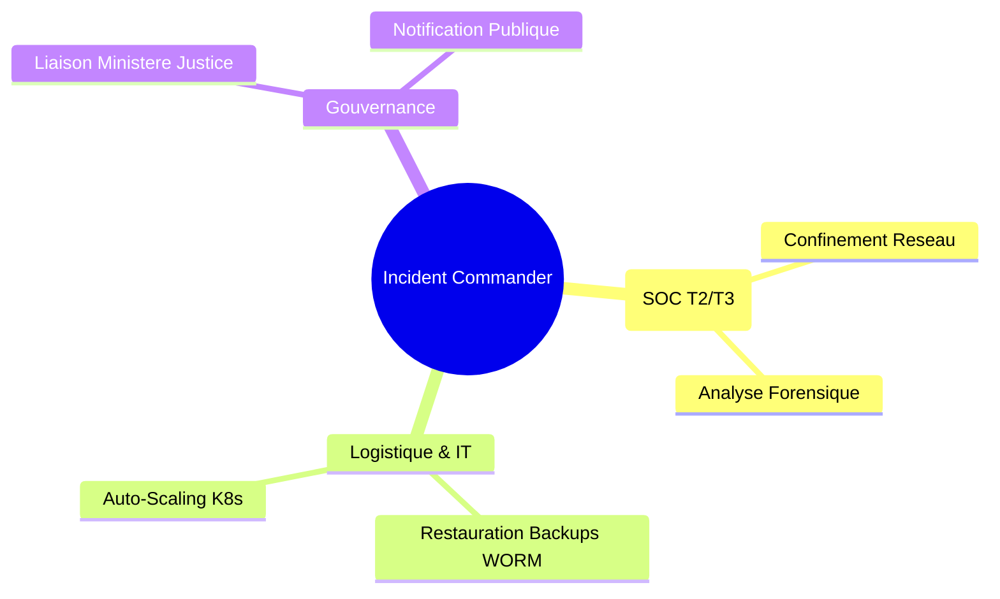

# VOLUME 1 : Structure du Commandement et du SOC
## Commandement National de Cyberdéfense — SNISID

Le Security Operations Center (SOC) du SNISID n'est pas un SOC d'entreprise classique ; c'est une entité paramilitaire conçue pour défendre la souveraineté numérique de l'État haïtien. 

---

## 🏛️ CHAPITRE 1 : LA PYRAMIDE DE DÉFENSE (SOC TIERS)

L'organisation repose sur une structure d'escalade stricte et continue (H24/7/365).

```mermaid
graph TD
    subgraph T1 [Tier 1 : Triage & Alerting (H24)]
        A1[Analystes T1] -->|Validation| A2[Filtre Faux Positifs]
        A2 -->|SOAR Triage| A3[Ticket Créé]
    end

    subgraph T2 [Tier 2 : Analyse Profonde & Confinement]
        B1[Incident Responders] --> B2[Analyse Malware / Réseau]
        A3 -->|Escalade P2/P1| B1
        B2 -->|Action de Confinement| B3[Isolement Zero Trust]
    end

    subgraph T3 [Tier 3 : Threat Hunting & Cyber Intelligence]
        C1[Threat Hunters] -->|Proactif| C2[Détection APT]
        C2 -->|IoC Feed| T1
        B2 -->|Escalade P1 Critique| C1
    end

    subgraph DFIR [DFIR & CERT National]
        D1[Équipe Forensique]
        C1 -->|Compromission Avérée| D1
    end
```

### 1.1 SOC Tier 1 (Triage & Monitoring)
*   **Mission :** Surveillance "Glass" (Écrans SIEM). Qualification initiale des alertes générées par le SIEM, l'EDR, et le WAF.
*   **SLA :** Temps de qualification d'une alerte < 15 minutes.
*   **Outils :** Dashboards Splunk/Elastic, Alertes automatisées via SOAR (Tines/Cortex XSOAR).

### 1.2 SOC Tier 2 (Incident Analysis & Containment)
*   **Mission :** Analyse des logs complexes, rétro-ingénierie légère de malwares, et exécution des actions de confinement d'urgence (blocage d'IP, révocation de sessions JWT, isolement de pods Kubernetes).
*   **SLA :** Temps de confinement (MTTC - Mean Time To Contain) < 60 minutes.

### 1.3 SOC Tier 3 (Threat Hunting & CTI)
*   **Mission :** Proactivité. Les Hunters ne gèrent pas la file d'attente des tickets. Ils cherchent activement les menaces furtives (Advanced Persistent Threats) tapies dans l'infrastructure de l'État en se basant sur la Cyber Threat Intelligence (CTI).

---

## 🕵️ CHAPITRE 2 : UNITÉS DFIR ET CERT NATIONAL

En cas de brèche avérée, les unités spécialisées prennent le relais du SOC.

### 2.1 DFIR (Digital Forensics and Incident Response)
*   **Forensique Légal :** L'équipe DFIR procède à l'acquisition des images mémoires (RAM) et disques sans altérer les preuves. Ils garantissent la "Chain of Custody" (Chaîne de possession) pour que les preuves numériques soient admissibles devant la Haute Cour de Justice de Port-au-Prince.
*   **Souveraineté :** Les données forensiques sont stockées dans des coffres WORM physiques sur le sol haïtien.

### 2.2 CERT (Computer Emergency Response Team) SNISID
*   **Mission :** Coordination inter-agences. Si une attaque cible le SNISID via le système de la Douane (interconnecté par X-Road), le CERT SNISID coordonne la défense conjointe avec le CERT Douanes et la DCPJ.

---

## ⚔️ CHAPITRE 3 : LA WAR ROOM ET LE COMMANDEMENT DE CRISE

Lorsqu'un incident de niveau **DEFCON 1** ou **P1 Critique** est déclaré (ex: tentative de destruction du registre civil, exfiltration de données biométriques), la **War Room Nationale** est activée.

### 3.1 Gouvernance de Crise (Crisis Command)
1.  **Incident Commander (IC) :** Autorité technique absolue. Il orchestre la bataille cybernétique et peut ordonner la coupure d'infrastructures entières.
2.  **Legal & Privacy Lead :** Assure que les contre-mesures respectent la loi haïtienne et prépare les notifications réglementaires.
3.  **Communications Lead :** Gère le flux d'informations vers le Gouvernement (Primature) et les citoyens pour éviter la panique.
4.  **Intelligence Liaison :** Fait le lien avec les agences de renseignement internationales (ex: Interpol, partenaires bilatéraux) pour l'attribution de l'attaque.


