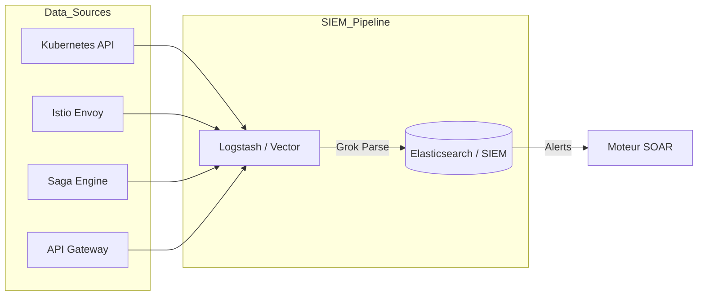

# VOLUME 2 : Opérations de Sécurité et Télémétrie (Security Operations)
## Commandement National de Cyberdéfense — SNISID

Le système de détection des menaces du SNISID est conçu pour aspirer, normaliser et analyser des millions d'événements par seconde provenant de l'infrastructure étatique.

---

## 📡 CHAPITRE 1 : ARCHITECTURE SIEM (SECURITY INFORMATION & EVENT MANAGEMENT)

Le SIEM (ex: Elastic Security / Splunk) est le cerveau analytique du SOC. Il ingère des logs immuables pour identifier des modèles d'attaque (Patterns).

### 1.1 Sources de Télémétrie (Ingestion Pipeline)
1.  **Kubernetes Audit Logs (API Server) :** Surveillance de toute tentative d'élévation de privilèges ou de création de pods malicieux.
2.  **Istio Service Mesh Logs :** Surveillance des flux de données Est-Ouest (entre les microservices internes). Détection de mouvements latéraux.
3.  **X-Road Gateway Logs :** Surveillance des flux Nord-Sud (Inter-agences). Toute anomalie dans les requêtes de la DGI ou de la Douane est traquée.
4.  **Kafka Event Bus (Audit WORM) :** Ingère les logs métiers applicatifs (qui a modifié l'acte de naissance de qui ?).

---

## 🧠 CHAPITRE 2 : UEBA ET DÉTECTION DES MENACES INTERNES (INSIDER THREATS)

La plus grande menace pour une base de données gouvernementale vient souvent de l'intérieur (agents corrompus, extorsion). Le SOC utilise l'UEBA (User and Entity Behavior Analytics) basé sur l'Apprentissage Automatique (Machine Learning).

### 2.1 Modélisation Comportementale (Baselining)
*   **Anomalie de Vélocité :** Un officier d'état civil qui valide historiquement 15 dossiers par jour, et qui soudainement en valide 300 entre 2h et 4h du matin.
*   **Anomalie Géographique (Impossible Travel) :** Le badge FIDO2 d'un agent est utilisé à Port-au-Prince, et 10 minutes plus tard, un login VPN utilisant les mêmes credentials apparaît depuis une adresse IP en Russie.
*   **Action SOC :** Le SIEM génère une alerte de "Risque Interne". Le SOAR gèle automatiquement le NNI et le certificat PKI de l'agent jusqu'à adjudication par un Superviseur.

---

## 🗺️ CHAPITRE 3 : THREAT INTELLIGENCE & MITRE ATT&CK MAPPING

Le SNISID ne se défend pas à l'aveugle. Le SOC mappe systématiquement ses capacités de détection sur le framework **MITRE ATT&CK**.

### 3.1 CTI (Cyber Threat Intelligence)
Le SIEM ingère en continu des flux de renseignements (IoC - Indicators of Compromise) via MISP et STIX/TAXII. Ces flux proviennent d'alliances internationales et d'agences partenaires. Toute adresse IP, Hash de fichier, ou nom de domaine malveillant entrant en contact avec l'État déclenche une alerte P1.

### 3.2 Mapping MITRE (Exemple de Détection)
| Tactic (MITRE) | Technique | Règle de Détection SIEM (Sigma/Elastic) | Action SOAR |
| :--- | :--- | :--- | :--- |
| **Initial Access (TA0001)** | Exploit Public-Facing App (T1190) | WAF bloque injection SQL / Payload suspecte sur X-Road | IP Block sur Pare-feu Edge |
| **Credential Access (TA0006)** | Brute Force (T1110) | > 5 échecs PKI Login en 1 min | Suspension Temporaire du compte agent |
| **Lateral Movement (TA0008)** | Exploitation of Remote Services (T1210) | Trafic SSH/RDP inattendu entre deux pods K8s | Isolation Réseau du Pod (NetworkPolicy) |
| **Exfiltration (TA0010)** | Exfiltration Over Alternative Protocol (T1048) | Transfert de > 100MB vers un DNS inconnu | Coupure du flux sortant (Egress Block) |

---

## 🛡️ CHAPITRE 4 : SÉCURITÉ KUBERNETES ET DÉTECTION API

### 4.1 Runtime Security (eBPF)
Le SOC utilise des agents eBPF (ex: Cilium Tetragon ou Falco) directement dans le kernel Linux des serveurs K8s pour détecter en temps réel :
*   L'exécution d'un shell (ex: `/bin/bash`) dans un conteneur d'API.
*   La modification inattendue d'un fichier binaire système.

### 4.2 Détection des Menaces API (API Threat Protection)
L'API Gateway (Kong / Apigee) intègre une protection contre le "Scraping" (aspiration massive des données d'identité) via des algorithmes de "Rate Limiting" stricts par jeton JWT institutionnel.
