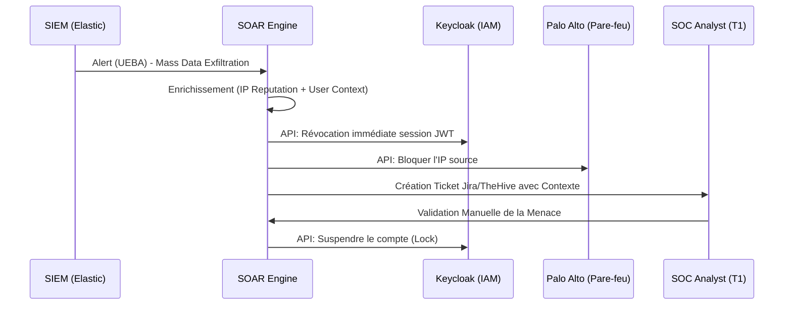

# VOLUME 3 : SOAR et Réponse aux Incidents (Incident Response)
## Commandement National de Cyberdéfense — SNISID

Lorsqu'une attaque frappe l'État à 3h00 du matin, la réponse doit être immédiate. L'Orchestration, l'Automatisation et la Réponse de Sécurité (SOAR) permet à l'infrastructure de se défendre elle-même de manière autonome avant l'intervention humaine.

---

## 🤖 CHAPITRE 1 : ORCHESTRATION ET AUTOMATISATION (SOAR)

Le Moteur SOAR s'interface via API avec l'ensemble de l'infrastructure étatique (Pare-feux, IAM, Kubernetes, PKI).

### 1.1 Playbook Automatisé de Confinement
*Scénario : Un agent tente de télécharger 15 000 dossiers d'identité depuis un IP non autorisé.*

*   **Temps de réponse de la machine (MTTR Automatisé) :** Moins de 2 secondes.

---

## 📈 CHAPITRE 2 : WORKFLOWS D'INCIDENT ET ESCALADE CYBER

Le SOC du SNISID classe les incidents selon une **Matrice de Sévérité Gouvernementale**.

### Matrice d'Escalade
| Niveau de Sévérité | Définition & Exemples | Actions et Escalade Requise |
| :--- | :--- | :--- |
| **P4 (LOW)** | Phishing isolé, Scan de port externe. | Traitement SOC T1. Clôture automatique SOAR. |
| **P3 (MEDIUM)** | Malware détecté sur poste utilisateur (Isolé). | SOC T2. Isolation du poste via EDR. Remédiation. |
| **P2 (HIGH)** | Compromission de compte d'un Officier d'État Civil. | SOC T3 + DFIR. Révocation PKI globale. Audit des transactions. |
| **P1 (CRITICAL)** | Ransomware, Exfiltration de BDD, Chute Data Center. | **WAR ROOM ACTIVÉE**. Incident Commander prend le contrôle. Coupure réseau autorisée. |

---

## 🔬 CHAPITRE 3 : PIPELINES FORENSIQUES ET PREUVES LÉGALES

Lorsque l'incident implique une fraude interne, un crime d'État ou une attaque terroriste, l'équipe DFIR doit collecter les preuves pour que le Ministère de la Justice (MJSP) puisse lancer des poursuites judiciaires.

### 3.1 Chain of Custody (Chaîne de Possession)
1.  **Acquisition WORM :** Les logs Kubernetes, les dumps mémoire (RAM) du conteneur compromis et les logs réseau PCAP sont extraits.
2.  **Hashing Immédiat :** Les fichiers de preuve sont hachés en SHA-256.
3.  **Signature de Scellement :** Le Hash est signé avec le certificat PKI de l'enquêteur DFIR.
4.  **Stockage Sécurisé :** Les preuves numériques sont déposées sur un stockage *Cold Storage* sans aucune connexion internet, sous clé physique.
5.  **Admissibilité :** La preuve cryptographique garantit au juge qu'aucun fichier n'a été altéré depuis l'instant de la compromission.

### 3.2 Post-Incident Recovery (Rétablissement)
Après éradication de la menace, l'infrastructure n'est jamais "nettoyée", elle est **reconstruite**.
*   **Immutable Infrastructure :** Le cluster corrompu est détruit. Un nouveau cluster est déployé "from scratch" en quelques minutes via le pipeline GitOps (ArgoCD) depuis des images de conteneurs saines signées (Cosign). 
*   **Data Replay :** Les événements propres sont rejoués depuis le registre Kafka WORM.
