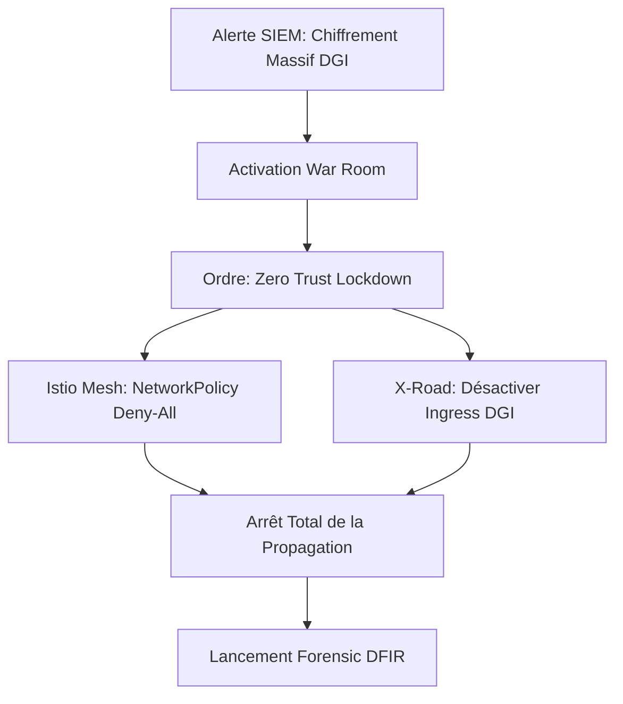

# VOLUME 4 : Playbooks de Crise et Cyber-Guerre (Crisis Playbooks)
## Commandement National de Cyberdéfense — SNISID

Ces playbooks ne sont activés que sur l'ordre de l'**Incident Commander** ou de la **Primature de la République**. Ils visent à contrer des attaques de type Cyberguerre (Cyber Warfare) menaçant l'existence numérique de l'État.

---

## 🦠 PLAYBOOK 1 : NATION-STATE RANSOMWARE (Confinement)

**Cible :** Une menace APT s'infiltre dans le réseau de la DGI ou des Douanes et tente de chiffrer les bases de données connectées, se propageant latéralement vers le SNISID.

### Stratégie de Riposte : "Scorched Earth Firewall"
1.  **Isolation Nord-Sud (API Gateway) :**
    *   L'API Gateway Sovereign (Kong) bloque instantanément l'intégralité du trafic inter-agences. Toutes les requêtes X-Road retournent `503 Service Unavailable`.
2.  **Lockdown Est-Ouest (Zero Trust Micro-Segmentation) :**
    *   Le Service Mesh (Istio) applique une Network Policy Deny-All sur tous les namespaces Kubernetes du SNISID, sauf pour le canal de télémétrie SOC.
    *   Plus aucun pod ne peut parler à un autre pod, stoppant net toute tentative de mouvement latéral de la part du ransomware.
3.  **Survie de la Base de Données (Immutable Backup) :**
    *   CockroachDB coupe ses connexions entrantes (Drain Mode).
    *   Les archives existantes WORM sur MinIO (S3 Object Lock) rejettent physiquement par conception la réécriture ou le chiffrement.

---

## 🔌 PLAYBOOK 2 : DISASTER CYBER RESPONSE (Coupure Nationale)

**Cible :** Une attaque massive sur l'infrastructure physique et télécom d'Haïti. Tentative de subversion du DNS National ou BGP Hijacking majeur.

### Stratégie de Survie : "Island Mode"
1.  **Détachement International :** Sur ordre de sécurité nationale, l'Ingénieur en Chef demande aux fournisseurs d'accès (Natcom/Digicel) la coupure de la route BGP internationale (Outbound/Inbound). Le réseau gouvernemental devient un Intranet fermé géant d'échelle nationale.
2.  **Repli sur PKI Hors-ligne :**
    *   Les certificats SSL/TLS publics (Let's Encrypt / DigiCert) ne pouvant plus être vérifiés, les agences gouvernementales basculent exclusivement sur l'**AN-PKI Sovereign** pour valider l'identité des serveurs.
3.  **Opérations Asynchrones :** Le moteur de synchronisation Edge (Kafka) met en mémoire tampon toutes les écritures tant que l'intégrité du réseau national n'est pas vérifiée par l'équipe Cyber.

---

## ⚔️ PLAYBOOK 3 : MANUEL DES OPÉRATIONS DE CYBER-GUERRE

Le SNISID est une infrastructure de défense. Ses opérateurs ont pour ordre de protéger la donnée quel qu'en soit le coût opérationnel.

*   **Règle d'Or (No-Negotiation) :** L'État Haïtien ne paie jamais de rançon cybercriminelle. Le système repose sur des restaurations WORM pures.
*   **Protection des Cibles de Haute Valeur (HVT) :** Les nœuds K8s hébergeant les Root CA (Autorités de certification) de l'AN-PKI sont hébergés sur des serveurs "Bare Metal" hors K8s, avec des pare-feux matériels en série pour garantir leur survie même si le réseau conteneurisé K8s est compromis (Conteneur Breakout).
*   **Détection d'Usurpation de l'État :** Si une fausse PKI (Rogue CA) est détectée tentant d'émettre des cartes eID, le SOC active le playbook `Rogue_PKI_Annihilation`, qui bannit tous les identifiants générés et pousse une révocation instantanée (OCSP/CRL) sur toute l'île via X-Road.
