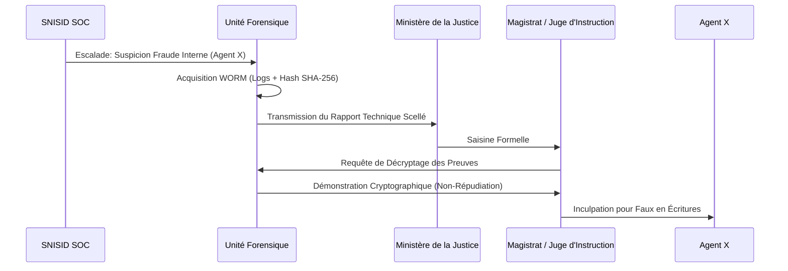

# VOLUME 3 : Cadre Légal et Juridique (Legal Framework)
## Architecture de Gouvernance — SNISID

L'Infrastructure Publique Numérique n'a de valeur que si ses productions (actes de naissance, signatures) ont une force probante absolue devant un tribunal. Ce cadre légal numérise le Code Civil et le Code Pénal haïtiens.

---

## 📜 CHAPITRE 1 : LOIS SUR L'IDENTITÉ ET LA BIOMÉTRIE

### 1.1 Le Numéro National d'Identification (NNI)
*   **Immutabilité Légale :** Le NNI est attribué à la naissance et détruit au décès. Il est juridiquement interdit de réassigner un NNI existant.
*   **Gouvernance Biométrique (AFIS) :** La collecte des empreintes digitales et de l'iris est une prérogative stricte de l'État.
    *   *Règle d'or :* Les données biométriques "brutes" (images) ne peuvent jamais être exportées hors de la base de l'ONI. Les agences de police (DCPJ) ne peuvent demander qu'une **comparaison mathématique (Matching Score)** via l'API, jamais l'extraction de l'image de l'empreinte.

### 1.2 Protection des Données (Data Privacy Law)
S'inspirant des standards internationaux (ex: RGPD), la gouvernance impose :
*   **Le principe de finalité :** Le Ministère de l'Éducation ne peut accéder qu'à l'âge de l'enfant, sans avoir le droit de consulter le statut pénal des parents.
*   **Auditabilité Systématique :** Chaque accès au dossier d'un citoyen par un fonctionnaire génère un journal WORM. Si le Président de la République consulte le dossier d'un citoyen, cette consultation est gravée cryptographiquement et auditable.

---

## ✒️ CHAPITRE 2 : LÉGALITÉ DE LA SIGNATURE NUMÉRIQUE (PKI)

Le SNISID introduit la transition du "Tampon Encreur" vers la cryptographie asymétrique.

### 2.1 Équivalence Juridique (Non-Répudiation)
*   La signature électronique qualifiée produite par la puce eID de la carte nationale d'identité (ou le jeton FIDO2 d'un agent) a la **même valeur légale qu'une signature manuscrite notariée** devant la loi haïtienne.
*   **Non-Répudiation :** Un officier d'état civil ne peut pas nier devant un juge avoir validé un acte de naissance si cet acte est signé par son certificat PKI, sauf s'il a déclaré le vol de son jeton (Révocation CRL) *avant* l'heure de la signature.

---

## ⚖️ CHAPITRE 3 : CYBERCRIMINALITÉ ET ESCALADE JUDICIAIRE

Lorsque le SOC détecte une fraude, le transfert vers la justice doit être fluide et légalement inattaquable.

### 3.1 Qualification des Crimes Cybernétiques de l'État Civil
1.  **Usurpation d'Identité :** Tentative de création d'un doublon biométrique. (Bloqué automatiquement par l'ABIS).
2.  **Faux en Écritures Publiques :** Un agent modifiant illicitement un statut marital. (Détecté par UEBA et audité par WORM).
3.  **Trahison Numérique / Cyber-Terrorisme :** Un administrateur système tentant de saboter la base de données.

### 3.2 Modèle d'Escalade Judiciaire (DFIR to Court)

*   **Recevabilité :** Parce que la chaîne de possession (Chain of Custody) est mathématiquement garantie par la PKI, l'avocat de la défense ne peut pas alléguer que les "logs ont été modifiés par la police".
