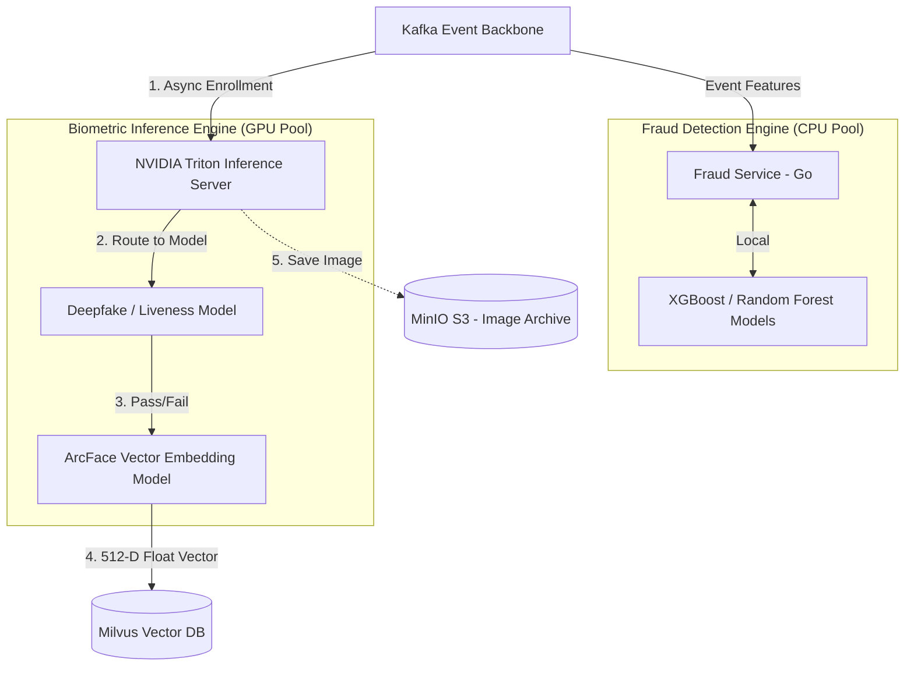

# SNISID: AI Integration & Inference Architecture

As a sovereign cyber intelligence platform, SNISID relies heavily on AI to perform complex biometric verification and detect synthetic identity rings in real-time. This document outlines the architecture for safely embedding, serving, and governing AI models at scale.

---

## 1. AI Integration Topology Diagram

---

## 2. Model Serving Architecture & GPU Segregation

Serving deep learning models requires specialized, expensive hardware. SNISID segregates AI serving to optimize costs and maximize throughput.

### 2.1. NVIDIA Triton Inference Server
*   **Centralized Serving:** Rather than embedding PyTorch/TensorFlow models directly inside Go or Python microservices, SNISID uses **NVIDIA Triton Inference Server**. Triton natively supports concurrent model execution, dynamic batching, and highly optimized GPU memory management.
*   **gRPC Protocol:** The Go Identity Service sends raw image bytes to Triton over a high-speed gRPC connection, receiving the mathematical feature vectors in return.

### 2.2. GPU Workload Segregation
*   **Node Taints:** In Kubernetes, nodes equipped with GPUs (e.g., NVIDIA A100s) are heavily tainted (`nvidia.com/gpu=true:NoSchedule`). 
*   **Tolerations:** Only the Triton Inference Pods possess the toleration to run on these nodes. Standard web services or databases will never accidentally schedule on a $10,000 GPU node, preventing extreme compute waste.

---

## 3. Real-Time Inference Flows

### 3.1. Flow 1: Biometric Verification & Deepfake Detection
When a citizen attempts to enroll or authenticate via a kiosk camera:
1.  **Liveness Detection First:** The raw video feed/image is sent to Triton. The Liveness model executes first to detect presentation attacks (e.g., a photo of a photo, a silicone mask, or an AI-generated deepfake). If it fails, the flow terminates immediately.
2.  **Feature Extraction:** If liveness passes, the Image Embedding model (e.g., ArcFace) strips the visual data and extracts a **512-dimensional float vector**.
3.  **Vector Search:** The mathematical vector is sent to the **Milvus Vector Database**. Milvus executes an Approximate Nearest Neighbor (ANN) search across the entire national population in `< 200ms` to detect if this exact face already exists under a different name (1:N Duplicate Check).

### 3.2. Flow 2: Real-Time Fraud Scoring
Fraud models operate on structured tabular data, not images. They execute entirely on standard CPUs.
*   **Kafka Stream Integration:** The Fraud Service listens to the Kafka stream. When an `identity.citizen.enrolled` event occurs, it aggregates contextual features (e.g., time of day, device fingerprint trust score, IP geolocation distance from home address).
*   **Inference:** It feeds these features into an XGBoost model. The model outputs a risk score from 0 to 100 within `< 50ms`.

---

## 4. AI Explainability & Governance Controls

In a government context, "Computer says no" is legally unacceptable. If a citizen is denied a passport due to a high fraud score, the system must explain exactly *why*.

### 4.1. Explainable AI (XAI)
*   **SHAP Values:** Every time the Fraud model generates a score (e.g., `Risk Score: 89/100`), it simultaneously outputs SHAP (SHapley Additive exPlanations) values. 
*   **Auditability:** The system logs: *"Risk Score 89. Top contributing factors: Device Fingerprint matched known fraud ring (+45), IP Address is foreign (+30), Biometric liveness confidence low (+14)."* This human-readable explanation is saved directly to the citizen's case file.

### 4.2. Data Minimization (Vectors, Not Faces)
*   Once Triton extracts the mathematical vector, the raw facial image is encrypted and sent to cold storage (MinIO) for legal auditing only.
*   The Vector DB and all downstream AI systems operate **only** on the mathematical vectors. A 512-D float array cannot be reverse-engineered back into a recognizable human face, guaranteeing extreme privacy even if the Vector DB is breached.

---

## 5. Feedback Loop & Model Lifecycle Design

AI models degrade over time as attackers evolve their methods (Model Drift).

1.  **Shadow Testing (A/B Deployment):** When data scientists train a new Fraud model (v2.0), it is deployed to Triton in "Shadow Mode". It receives live production traffic and generates scores, but its scores are *ignored* by the business logic. Analysts compare v1.0 vs v2.0 performance offline.
2.  **The Human-in-the-Loop Feedback:** If the v1.0 model flags an identity as fraud (Risk 90), but an L2 SOC Analyst manually reviews it and determines it is a False Positive, the Analyst clicks "Mark as Clean".
3.  **Automated Retraining Data Pipeline:** This "Mark as Clean" action fires a Kafka event. Apache Spark consumes this event and updates the historical Data Lake. During the weekly MLOps Kubeflow training run, the AI automatically learns from the Analyst's correction, improving its accuracy for the next deployment.
