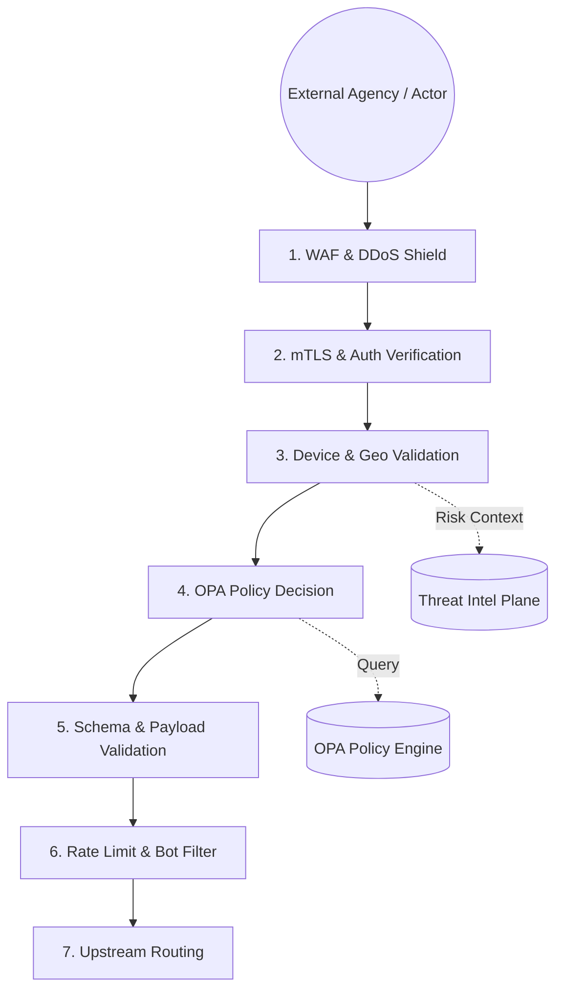

# SNISID: Secure API Gateway Enforcement Layer

The API Gateway is the "Sovereign Frontier" of the SNISID platform. It acts as a high-intelligence Policy Enforcement Point (PEP) that validates identity, context, and intent before allowing any traffic into the core intelligence zones.

---

## 1. The Request Lifecycle (7-Step Enforcement)

Every request entering the SNISID gateway undergoes a rigorous 7-step validation process.

---

## 2. Enforcement Pipeline Details

### 2.1. WAF & DDoS Integration
- **L7 Protection**: Blocks SQL injection, XSS, and known exploit patterns.
- **Adaptive Shield**: Automatically scales DDoS mitigation based on ingress burst patterns.

### 2.2. Multi-Layer Authentication
- **mTLS**: Mandatory for all agency-to-agency connections.
- **JWT (OIDC)**: Validates the actor's identity token issued by the National Identity Provider.
- **OAuth2**: Supports scoped access for specific functional domains (e.g., `scope: identity.read`).

### 2.3. Contextual Risk Assessment
The Gateway enriches the request with context before querying policies:
- **Geo-Risk**: Blocks IPs from sanctioned regions or anomalous locations.
- **Device Fingerprinting**: Validates the physical terminal's unique ID against the approved hardware registry.
- **Threat Scoring**: Fetches a real-time "Trust Score" (0.0-1.0). Scores below 0.7 trigger an MFA challenge or immediate rejection.

### 2.4. OPA Policy Enforcement
The Gateway acts as a client to the **Open Policy Agent (OPA)**.
- **Rego Policies**: Decouples authorization logic. Example: "DCI agents can only query biometrics between 08:00 and 18:00 from authorized kiosks."
- **Response**: OPA returns `ALLOW`, `DENY`, or `CHALLENGE` (triggering MFA).

---

## 3. API Trust Model

We map external agency identities to internal service principals.

| External Actor | Authentication | Internal Principal (SPIFFE ID) |
| :--- | :--- | :--- |
| **Police (DCPJ)** | mTLS + JWT | `spiffe://snisid.gov/agency/dcpj` |
| **Tax Authority (DGI)** | mTLS + JWT | `spiffe://snisid.gov/agency/dgi` |
| **Public Portal** | TLS 1.3 + OIDC | `spiffe://snisid.gov/user/citizen` |

---

## 4. Operational Controls

### 4.1. Rate Limiting & Bot Protection
- **Granular Limiting**: Per-agency, per-IP, and per-endpoint limits.
- **Behavioral Bot Detection**: Identifies automated scraping or brute-force attempts based on request velocity and header signatures.

### 4.2. API Schema Validation
- **Strict Enforcement**: All payloads must strictly match the OpenAPI/gRPC schema. Invalid parameters or malformed JSON are rejected at the edge.

---

## 5. Failure Handling Strategy

| Component Failure | Security Posture | Mitigation |
| :--- | :--- | :--- |
| **OPA Down** | **FAIL CLOSED** | Requests are denied if the policy engine is unreachable to prevent unauthorized access. |
| **Threat Intel Down** | **DEGRADED TRUST** | All requests are treated as "Medium Risk" and required to undergo MFA. |
| **Auth Service Down** | **FAIL CLOSED** | Token validation fails; no new sessions established. |

---

## 6. Implementation Stack

- **L7 Proxy**: Istio Ingress Gateway (Envoy-based).
- **Orchestrator**: Go-based API Gateway (Handling fingerprinting and OPA integration).
- **Policy Engine**: Open Policy Agent (OPA) running as a sidecar.
- **Authentication**: Keycloak / National IdP (OIDC).
- **Monitoring**: Prometheus (Tracking 4xx/5xx rates and policy denial latency).
