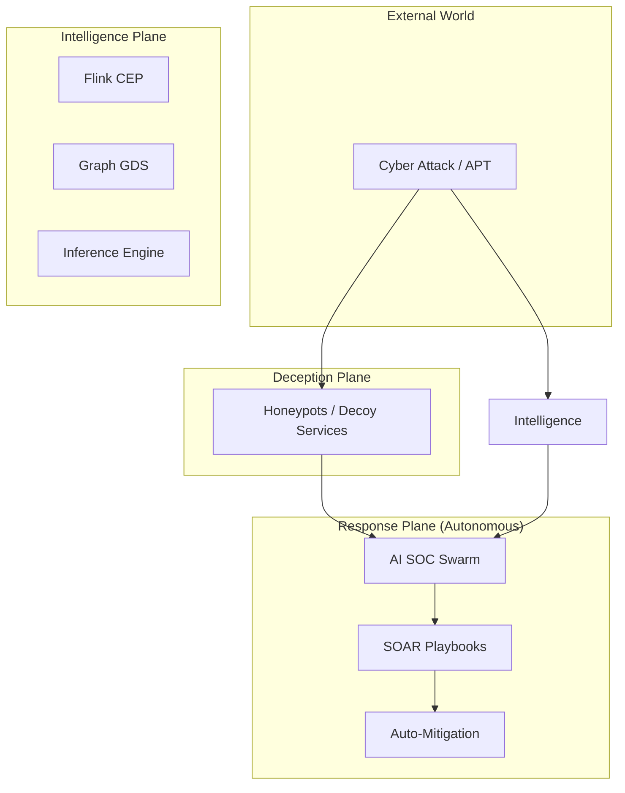

# SNISID: Advanced Cyber Defense & Automated Mitigation

The Advanced Defense layer transforms SNISID from a "Detect and Respond" system into an "Active Defense" platform capable of deceptive operations, automated mitigation, and autonomous cyber resilience.

---

## 1. Deception Plane: Cyber Deception & Honeypots (Prompt 182)

SNISID utilizes **High-Interaction Honeypots** and **Deceptive Artifacts** to mislead and detect attackers.

- **Deceptive Identities**: Fake "Admin" accounts in the National IAM that trigger an immediate P0 alert upon any login attempt.
- **Service Decoys**: Lightweight "Shadow Services" in the mesh (e.g., a fake `banking-api-v2`) that monitor for unauthorized probes.
- **Breadcrumbs**: Fake credentials and tokens placed in developer environments to track lateral movement attempts.
- **Goal**: To identify the "Intent" of an attacker early in the kill chain without exposing real national data.

---

## 2. Autonomous Incident Response (SOAR 2.0) (Prompt 181, 184)

Building on the basic playbooks, SOAR 2.0 introduces **Context-Aware Mitigation**.

- **Dynamic Blast Radius Containment**: The engine calculates the potential spread of a threat and automatically isolates the smallest possible set of resources to contain it (e.g., isolating a single Pod instead of a whole Namespace).
- **Auto-Quarantine Workflows**:
  - **Identified Threat**: Revoke SVID + Inject Cilium eBPF Deny + Taint Node.
  - **Suspected Threat**: Enforce "Strict MFA" + "Bandwidth Throttling" + "Deep Logging".
- **Self-Healing Resilience**: If a service is compromised, the engine can "Re-provision" a clean instance from a verified image while isolating the infected one for forensics.

---

## 3. Threat Hunting AI & Active Defense (Prompt 183, 193)

- **Proactive Hunters**: AI agents that perform continuous "Hypothesis-Driven Hunting" (e.g., "Find all services communicating with unusual destination ports during night hours").
- **Threat Actor Fingerprinting**: Identifying the specific APT (Advanced Persistent Threat) group based on their TTPs (Tactics, Techniques, and Procedures) as recorded in the national graph.
- **Active Countermeasures**: (Defensive Only) For confirmed data exfiltration, the system can inject "Chaff" (fake data) into the exfiltration stream to saturate the attacker's bandwidth and obscure real data.

---

## 4. Adversarial AI & Information Warfare Defense (Prompt 190, 191)

- **AI Model Protection**: Implementing **Differential Privacy** and **Adversarial Training** to ensure the national fraud models cannot be tricked or "Poisoned" by malicious inputs.
- **Deceptive Info Ops**: During a coordinated disinformation attack against the identity system, the platform can automatically inject "Truth-Verification Markers" into public-facing APIs and citizen apps to preserve trust.

---

## 5. Managed SOC Coordination & Governance (Prompt 195, 197)

- **Multi-Agency Hub**: A secure portal for sharing "Red-Alert" signals between the NCC (National Command Center) and agency-specific SOCs (Police, Finance).
- **Defense-as-Code (DaC)**: All mitigation playbooks and OPA policies are version-controlled and cryptographically signed, ensuring that defensive posture is auditable and consistent across regions.
- **Resilience Scorecard**: A real-time metric representing the nation's "Active Defense Health," based on successful containment rates and deception efficiency.

---

## 6. Autonomous SOC Final State Architecture (Prompt 200)

