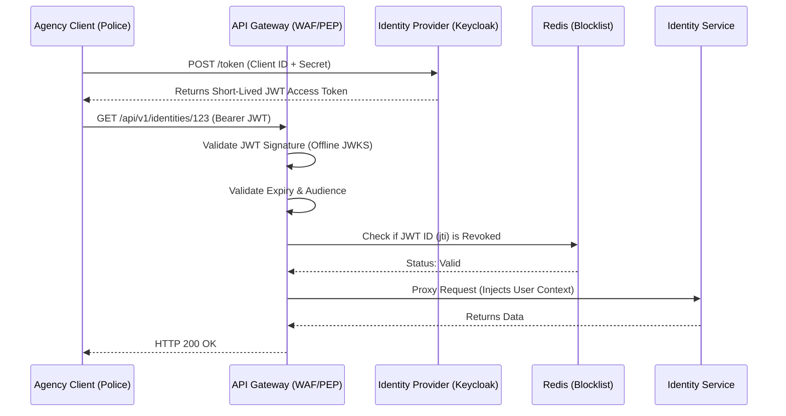

# SNISID: Authentication Architecture (JWT + OAuth2)

To uphold strict Zero Trust principles across national boundaries, SNISID employs a hybrid authentication architecture. It leverages the stateless, high-performance nature of JSON Web Tokens (JWT) for the data plane, anchored by the secure authorization flows of OAuth2 / OpenID Connect (OIDC) at the control plane.

---

## 1. OAuth2 Grant Types & API Strategy

The Identity Provider (IdP), such as Keycloak, issues tokens based on the caller's context.

### 1.1. Client Credentials Grant (Machine-to-Machine)
*   **Use Case:** Government agencies (e.g., Police, Tax Authority) querying the SNISID API Gateway programmatically.
*   **Flow:** The Agency backend authenticates directly with the SNISID IdP using a `client_id` and securely rotated `client_secret` (or private key JWT), receiving an Access Token.

### 1.2. Authorization Code Flow with PKCE (Human-to-Machine)
*   **Use Case:** Internal SNISID SOC Analysts or Admin staff accessing the SOC Dashboard (SPA).
*   **Flow:** The user is redirected to the IdP login page (enforcing MFA/Biometrics). Upon success, the SPA exchanges a short-lived authorization code for an Access Token and a Refresh Token.

---

## 2. Authentication Flow Diagram

---

## 3. Token Architecture & Lifecycle Model

### 3.1. Access Tokens (Stateless JWTs)
*   **Format:** Cryptographically signed JSON Web Token (RS256 algorithm).
*   **Lifespan:** Extremely short-lived (e.g., 5 to 15 minutes max).
*   **Payload (Claims):** Contains the `sub` (User/Agency ID), `aud` (Audience), `exp` (Expiry), and `scope` (e.g., `read:identity`). It does **not** contain PII.

### 3.2. Refresh Tokens (Stateful / Opaque)
*   **Format:** Opaque, high-entropy strings securely stored in the IdP database.
*   **Lifespan:** Medium-lived (e.g., 12 hours to 7 days), depending on session policy.
*   **Rotation Policy:** Refresh tokens are rotated strictly upon use. When a client uses a Refresh Token to get a new Access Token, the old Refresh Token is immediately invalidated, and a new one is issued. If a stolen Refresh Token is used twice, a compromise is assumed, and the entire token family is revoked immediately.

---

## 4. Token Revocation & Session Management

Because JWTs are stateless, they cannot be natively "revoked" before their expiration time. SNISID manages this via a hybrid Redis blocklist.

1.  **Standard Expiration:** 99% of sessions end naturally. Since the JWT expires in 10 minutes, the attack window for a stolen token is extremely small.
2.  **Immediate Revocation (Redis Blocklist):** If a device is compromised or an active threat is neutralized by the SOC, the SOC Alert Service issues a `RevokeSessionCommand`. The JWT's unique ID (`jti`) is immediately added to a globally replicated Redis Blocklist.
3.  **API Gateway Enforcement:** On every incoming request, the API Gateway performs an ultra-fast (`< 1ms`) check against Redis. If the `jti` is found, the Gateway drops the request with an `HTTP 401 Unauthorized`.

---

## 5. Security Enforcement & Zone Architecture

### 5.1. External API Authentication (Zone 1)
The **API Gateway** acts as the Policy Enforcement Point (PEP). Backend microservices do not validate raw JWT signatures from the public internet. The Gateway handles all cryptography, strips the external JWT, and passes clean contextual headers (e.g., `X-Agency-ID`) to the internal network.

### 5.2. Service-to-Service Authentication (Zone 0)
Inside the core cluster, SNISID operates under absolute Zero Trust.
*   Internal microservices do **not** use the external OAuth2 JWTs to talk to one another.
*   **SPIFFE / SPIRE:** Workloads are issued cryptographic identities.
*   **mTLS (Mutual TLS):** Every gRPC/REST call between the Identity Service and the Fraud Service is encrypted and mutually authenticated at the network level via an Istio Service Mesh. If an attacker breaches the cluster, they cannot impersonate an internal microservice because they lack the hardware-backed SPIFFE certificate.

---

## 6. Token Validation Pipeline Summary

When a request hits the SNISID perimeter, it must pass these strict gates:
1.  **Format Check:** Is the header `Authorization: Bearer <token>` present?
2.  **Cryptographic Signature:** Does the token's signature match the IdP's cached public JWKS keys?
3.  **Time Bounds:** Is `exp` in the future and `nbf` (Not Before) in the past?
4.  **Audience & Issuer:** Is the token specifically issued by SNISID for this specific endpoint?
5.  **Revocation Check:** Is the `jti` absent from the Redis blocklist?
6.  **Scope Verification:** Does the `scope` array contain the specific permission required for the HTTP method (e.g., `fraud:write`)?
