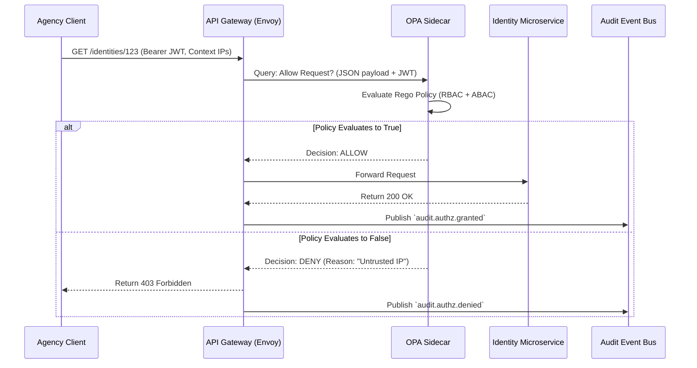

# SNISID: Authorization Architecture (Hybrid RBAC + ABAC)

In a multi-agency national system, static roles are insufficient. An officer might have the role of "Police Investigator," but they should not be authorized to view a citizen's profile from a foreign IP address at 3:00 AM unless assigned to a specific active case. 

To enforce absolute Least Privilege, SNISID employs a **Hybrid RBAC (Role-Based Access Control) + ABAC (Attribute-Based Access Control)** architecture powered by the **Open Policy Agent (OPA)**.

---

## 1. Role and Policy Hierarchy (RBAC Base)

The RBAC component handles the *static baseline* of what a user is generally permitted to do.

### Role Hierarchy Model
Roles are hierarchical and additive.
*   **Level 0 (Citizen):** Can only read/update their own specific `identity_id`.
*   **Level 1 (Agency Officer):** E.g., `role:police_officer`, `role:tax_auditor`. Grants baseline permissions to access the agency's dedicated endpoints.
*   **Level 2 (Agency Admin):** Can provision Level 1 roles within their specific `agency_id`.
*   **Level 3 (National Admin):** System-wide configuration. Strict MFA and hardware token required. Cannot view raw citizen PII (separation of duties).

**Detailed Role Model**: See the [SNISID RBAC Architecture](file:///c:/Users/sopil/Desktop/SNISID/SNISID_RBAC_Architecture.md) for full hierarchy, permission matrices, and JIT elevation workflows.

---

## 2. Attribute Evaluation System (ABAC Context)

Once the RBAC baseline permits an action, the ABAC component evaluates the *dynamic context* of the request.

**Detailed Attribute Model**: See the [SNISID ABAC Architecture](file:///c:/Users/sopil/Desktop/SNISID/SNISID_ABAC_Architecture.md) for full SREAK model definitions, Rego policy examples, and AI-driven adaptive evaluation.

### Evaluated Attributes
1.  **Subject Attributes (The Caller):**
    *   `agency_id` (Must match the data being requested).
    *   `security_clearance_level` (e.g., Top Secret vs Confidential).
    *   `active_case_id` (Is the officer actively assigned to an investigation?).
2.  **Resource Attributes (The Data):**
    *   `classification` (e.g., Is the requested identity flagged as a Protected Witness?).
    *   `status` (e.g., Cannot modify a `DECEASED` record).
3.  **Environmental Attributes (The Context):**
    *   `ip_geolocation` (Is the request originating from within national borders?).
    *   `device_trust_score` (Is the MDM-managed device compromised?).
    *   `time_of_day` (Is the access occurring during standard agency shifts?).

---

## 3. Authorization Architecture & Policy Engine (OPA)

SNISID offloads all authorization decisions from application code to the **Open Policy Agent (OPA)**. Policies are written in a declarative language called Rego.

*   **Decoupled Logic:** Microservices do not contain `if (user.role == "Admin")` statements. They simply ask OPA: "Can User X perform Action Y on Resource Z?"
*   **Sidecar Deployment:** To guarantee `< 2ms` latency, OPA is deployed as a Kubernetes Sidecar next to every microservice and the API Gateway. Policies are cached locally in-memory.

### Example Rego Policy (ABAC + RBAC)
```rego
package snisid.authz

default allow = false

# Allow access if the user is a Police Officer AND the request is from a trusted network
allow {
    input.jwt.roles[_] == "police_officer"
    input.method == "GET"
    input.path == ["api", "v1", "identities", identity_id]
    
    # ABAC Context Checks
    input.environment.network_zone == "secure_government_intranet"
    input.environment.device_trust_score > 80
}
```

---

## 4. Decision Flow Diagram



---

## 5. Emergency Override Policies ("Break-Glass")

In life-or-death situations (e.g., a medical emergency requiring blood type identification, or an active terrorist threat), standard ABAC attributes (like `active_case_id` or `shift_hours`) might block legitimate access.

SNISID implements a **"Break-Glass" Protocol**:
1.  **Invocation:** The officer passes a special HTTP header: `X-Emergency-Override-Reason: <Explanation>`.
2.  **Evaluation:** OPA detects this header. It bypasses standard ABAC environmental checks (but NOT the RBAC role requirement—a civilian cannot use Break-Glass).
3.  **Critical Logging:** The system immediately fires a `soc.alert.critical` event to the SOC and notifies the officer's Agency Admin.
4.  **Post-Incident Review:** Every Break-Glass invocation mandates a formal administrative review within 24 hours to justify the override.

---

## 6. Auditability of Authorization Decisions

Zero Trust requires mathematically proving *why* a decision was made.

*   **Decision Logs:** OPA logs every single authorization decision, including the exact JSON input it evaluated and the exact Rego policy lines that triggered the Allow/Deny.
*   **Immutable Storage:** These decision logs are published directly to the `audit.record.logged` Kafka topic, ensuring forensic traceability. If an unauthorized data leak occurs, the SOC can pinpoint precisely which policy rule permitted the exfiltration.
