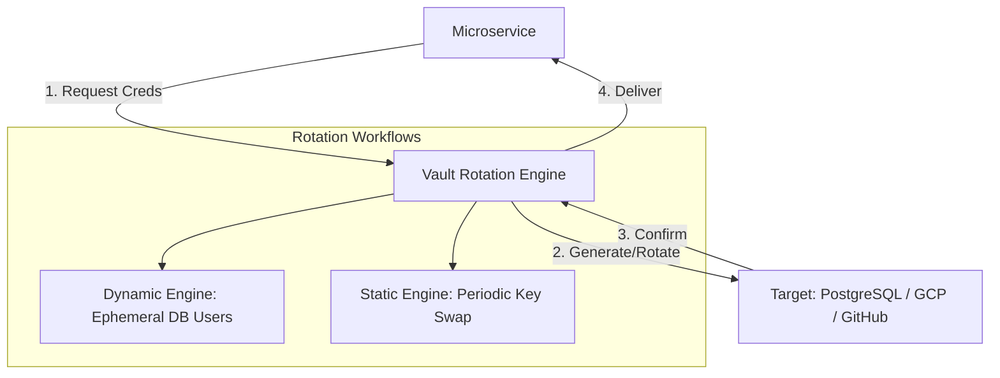

# SNISID: Automatic Secrets Rotation System

The Sovereign Rotation System eliminates the risk of long-lived, static credentials. By automating the lifecycle of every secret—from database passwords to API keys—the system ensures that any compromised credential becomes useless in minutes.

---

## 1. Rotation Architecture: The Orchestrator

The system is powered by the **Vault Rotation Engine**, which communicates directly with target infrastructure providers.

---

## 2. Rotation Workflows

### 2.1. Dynamic Secrets (Database & Cloud)
*   **Trigger**: On-demand when a service starts or its current lease expires.
*   **Mechanism**: Vault creates a unique user in the database (e.g., `v_app_identity_123`) with a short TTL (e.g., 60 mins).
*   **Cleanup**: Vault automatically drops the user when the TTL expires.
*   **No Rotation Needed**: The secret is never reused; a new one is issued every session.

### 2.2. Static Secrets (API Keys & Service Accounts)
*   **Trigger**: Scheduled (e.g., every 30 days) or manual.
*   **Workflow**:
    1.  **Generate**: Vault creates a new key version in the target provider.
    2.  **Overlap**: Both the old and new keys are active.
    3.  **Update**: Apps pull the new key from Vault.
    4.  **Revoke**: Vault deletes the old key after a 15-minute grace period.

---

## 3. Zero-Downtime Strategy (Dual-Credential Overlap)

To prevent service interruption during rotation:
- **Version Bundling**: Apps receive a bundle containing `Current_Secret` and `Previous_Secret`.
- **Graceful Swap**: The app attempts authentication with the `Current_Secret`; if it fails due to a rotation in progress, it falls back to the `Previous_Secret`.
- **Draining**: Database connections are gracefully closed and re-established using the new credentials.

---

## 4. Failure Handling & Monitoring

- **Automated Rollback**: If the "Validate" step fails after rotation, Vault rolls back to the previous known-good secret and alerts the SOC.
- **Monitoring**: 
  - **Metrics**: Time-to-Rotate, Failure Rate, Lease Expiration velocity.
  - **Audit**: Every rotation is logged to the **Sovereign Audit Ledger** as `secret.rotation.success/failed`.
- **Alerting**: Immediate critical alert if a rotation fails for a "Root" system (e.g., Root CA).

---

## 5. Compromise Response (The "Nuke" Workflow)

In the event of a confirmed breach:
1. **Scope Selection**: Select the affected domain (e.g., `Agency: Tax Authority`).
2. **Forced Rotation**: Triggers a global `REVOKE_ALL` on all active leases for that domain.
3. **Re-issuance**: Microservices automatically detect the revocation and request new credentials from Vault.
4. **Target Latency**: All secrets rotated across the entire domain in < 60 seconds.

---

## 6. Supported Secret Types

| Secret Type | Mechanism | Standard Rotation Interval |
| :--- | :--- | :--- |
| **Database Passwords** | Dynamic Vault Engine | Per-Session (Max 1h) |
| **API Keys (External)** | Static with Overlap | 30 Days |
| **Service Accounts** | Cloud SDK Integration | 90 Days |
| **JWT Signing Keys** | OIDC JWKS Rotation | 24 Hours |
| **SSH Keys** | Ephemeral Vault SSH | Per-Session |
