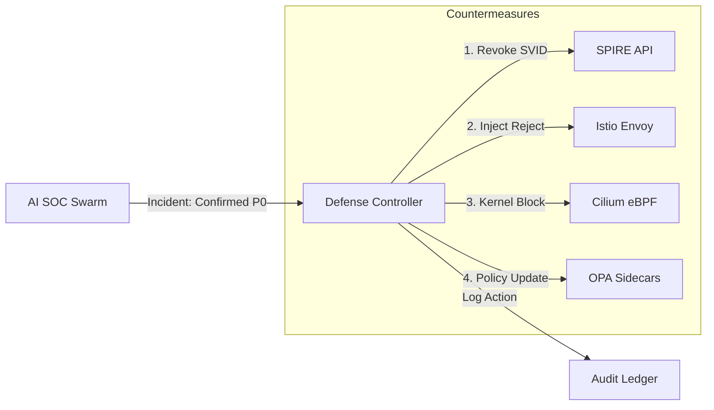

# SNISID: Autonomous Defense & Containment Architecture

The Autonomous Defense layer executes real-time countermeasures to neutralize confirmed threats, ensuring that an attacker is contained before they can move laterally or exfiltrate national data.

---

## 1. Auto-Quarantine Engine: Network Isolation

When a P0 threat is confirmed by the AI SOC Swarm, the Quarantine Engine triggers an immediate "Digital Blackout" for the compromised resource.

### 1.1. Multi-Layer Isolation
- **Layer 7 (Istio)**: The `Inference_Gateway` injects a **Global Reject Policy** for all traffic to/from the target Pod/Workload.
- **Layer 3/4 (Cilium)**: Injects an eBPF-based **NetworkPolicy** at the kernel level to block all raw socket communication, including non-mesh traffic.
- **Node Isolation**: In extreme cases, the engine can "Taint" a Kubernetes node, preventing new pods from being scheduled and forcing existing ones to drain (if they are not compromised).

---

## 2. Automatic Credential Revocation (Prompt 142)

Identity is the primary perimeter. The engine can instantly "De-Identity" a compromised actor.

- **SPIRE Integration**: The Response Agent calls the **SPIRE Server API** to immediately revoke the SVID (identity token) of the workload. This causes all mTLS connections to fail instantly.
- **Token Invalidation**: For human users, the engine injects the `identity_id` into the **Global Revocation List (Redis)**, which is checked by the API Gateway on every request.
- **MFA Reset**: Automatically triggers a "Force Logout" and resets all active MFA tokens for the affected identity.

---

## 3. Dynamic Policy Lockdown (Prompt 147)

The **Policy Plane (OPA)** can be updated in real-time to respond to emerging attack vectors.

- **Policy Injection**: The Response Agent pushes a new **Rego Bundle** to the OPA agents.
  - *Example*: "Deny all cross-regional data transfers for the next 60 minutes."
- **Scenario-Based Lockdown**:
  - **Ransomware Mode**: Disables all "Write/Delete" permissions on Object Storage across the entire namespace.
  - **Exfiltration Mode**: Blocks all egress to unknown IP ranges.
  - **Compromise Mode**: Restricts all administrative service accounts to "Read-Only".

---

## 4. Autonomous Response Workflow

---

## 5. Safety Guardrails (The Sovereign Veto)

To prevent "Autonomous Runaway," the engine is constrained by **Safe-State Policies**.

- **Critical Infrastructure Protection**: Certain nodes (e.g., the KMS or the National Database) are marked as `IMMUNE_TO_AUTO_QUARANTINE`. Any action against these nodes requires human "Root" approval.
- **Maximum Impact Quota**: The engine cannot quarantine more than 10% of a namespace's capacity without human intervention.
- **Automated Rollback**: If the ISTS trust score of the Defense Controller itself drops (e.g., it begins acting erratically), all autonomous actions are reverted, and the system enters "Manual-Only Mode."
