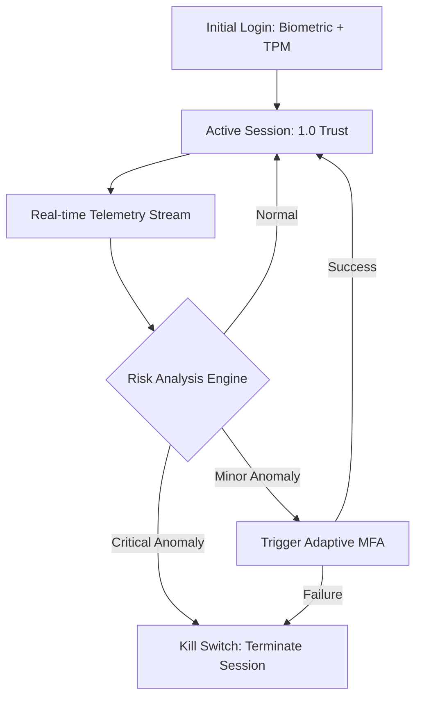

# SNISID: Continuous Authentication System (CAS)

The SNISID platform eliminates the concept of a "static session." In a Zero Trust environment, authentication is not a one-time event but a continuous evaluation of identity confidence based on real-time behavior, context, and risk.

---

## 1. Authentication Lifecycle

We move from **Initial Strong Authentication** to **Continuous Contextual Validation**.

---

## 2. Identity Confidence Scoring

Trust is quantified as a float value (0.0 - 1.0).

| Factor | Modifier | Description |
| :--- | :--- | :--- |
| **TPM Signature** | +0.2 | Valid hardware-bound device ID. |
| **Known Location** | +0.1 | Request originates from a known agency IP. |
| **Behavioral Baseline** | +0.2 | Request patterns match historical usage. |
| **Impossible Travel** | -0.6 | Geolocation shift physically impossible since last request. |
| **Anomalous API Usage** | -0.4 | Sudden spike in sensitive data export attempts. |
| **Device Health Fail** | -0.5 | Device OS or security patch version is outdated. |

- **Threshold > 0.8**: Seamless access.
- **Threshold 0.5 - 0.8**: Trigger "Step-up" MFA (WebAuthn / Biometric).
- **Threshold < 0.5**: Immediate session invalidation.

---

## 3. Behavioral Monitoring Architecture

The system uses **Apache Flink** to process millions of session events in real-time.

1. **Ingress**: API Gateway and Istio Envoy Proxies fire telemetry events (IP, DeviceID, Endpoint, Timestamp).
2. **Analysis (Flink)**: 
   - **Geo-Fencing**: Is the request coming from an authorized government zone?
   - **Velocity Check**: Are requests exceeding normal human interaction speeds?
   - **Sequence Check**: Is the user accessing endpoints in an anomalous order?
3. **Action**: Flink pushes a "Risk Update" to the **Policy Plane (OPA)**.

---

## 4. Re-validation Workflow

### 4.1. Silent Re-validation (Passive)
- **Device Attestation**: The system periodically pings the terminal's TPM to ensure it hasn't been tampered with.
- **Heartbeat**: Every 5 minutes, a silent cryptographic handshake occurs between the client and the Gateway.

### 4.2. Active Re-validation (Step-up)
- **MFA Trigger**: If the confidence score drops, the Gateway intercepts the next request and returns a `401 Challenge` response.
- **Methods**: SNISID prioritizes **WebAuthn (Biometric)** or **National Identity App** pushes.

---

## 5. Session Invalidation & Invalidation Pipeline

When a session is revoked, the system must purge it across the entire distributed infrastructure in **< 30 seconds**.

1. **Decision**: Risk Engine or SOC triggers `InvalidateSession(session_id)`.
2. **Redis Purge**: The active session is removed from the Global Session Cache.
3. **Gateway Broadcast**: A signal is sent to all API Gateways to reject the specific JWT.
4. **Mesh Block**: Istio `AuthorizationPolicy` is dynamically updated to deny the specific principal.
4. **Target Latency**: < 30 seconds for global propagation.

**Technical Token Lifecycle**: See the [SNISID Token Lifecycle Architecture](file:///c:/Users/sopil/Desktop/SNISID/SNISID_Token_Lifecycle_Architecture.md) for DPoP binding, Bloom-filter revocation, and risk-adaptive expiration logic.

---

## 6. AI-Driven Trust Evaluation

- **Anomaly Detection**: ML models (Isolation Forests / RNNs) are trained on "Normal Agency Operation" datasets to identify synthetic identity patterns or hijacked sessions.
- **Adaptive Expiration**: Sessions do not have a fixed time-to-live. Low-risk sessions may last 8 hours, while high-risk sessions (e.g., from remote edge nodes) may require re-validation every 30 minutes.

---

## 7. Failure Handling

| Failure Scenario | Behavior | Recovery |
| :--- | :--- | :--- |
| **Risk Engine Offline** | **FAIL SECURE** | All sessions revert to a 0.6 trust score, requiring frequent MFA. |
| **Telemetry Lag** | **DEGRADED TRUST** | Shorten session TTLs until the telemetry stream is restored. |
| **MFA Service Down** | **FAIL CLOSED** | High-risk operations (Trust < 0.8) are blocked until service restoration. |
