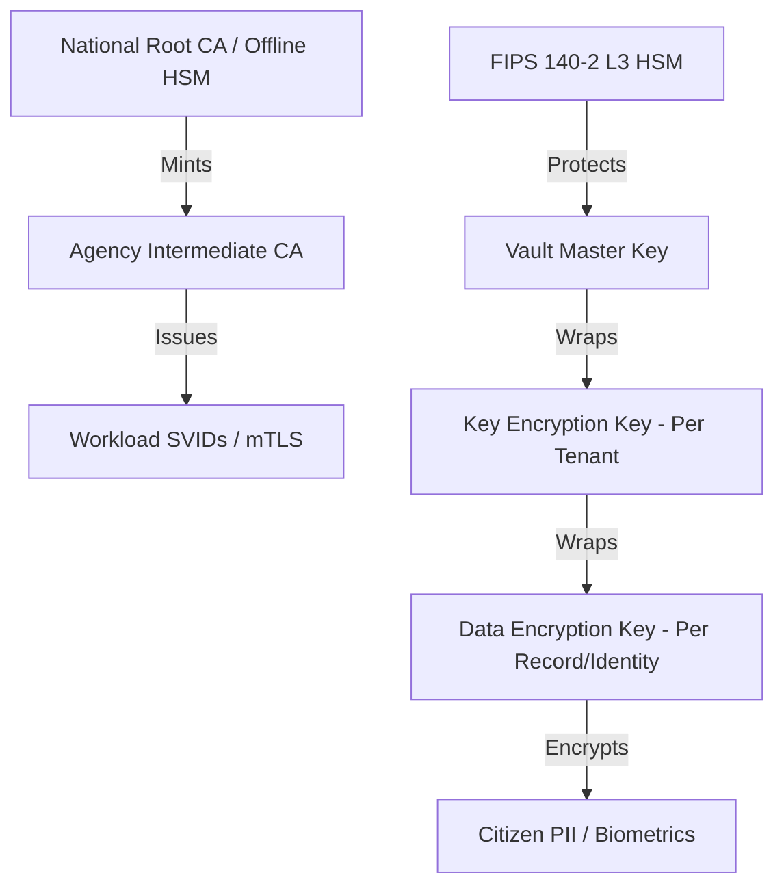

# SNISID: Comprehensive Cryptographic Architecture

To protect national sovereignty and citizen privacy, SNISID assumes that physical infrastructure compromises are inevitable. Therefore, the ultimate line of defense is mathematical: robust, modern cryptography.

---

## 1. Multi-Layered Key Hierarchy

SNISID implements a rigorous key hierarchy to minimize the blast radius of a potential compromise.

---

## 2. End-to-End Encryption (E2EE) Model

Sensitive data is never in cleartext within the platform's shared memory.

- **Edge-to-Core Protection**: Citizen biometrics are encrypted at the **Enrollment Kiosk** using the public key of the **National Identity Service**.
- **In-Memory Safety**: Decryption only occurs within a **Trusted Execution Environment (TEE)** or a hardened microservice memory space during AI inference or identity validation.
- **Field-Level Encryption (FLE)**: Databases like PostgreSQL only store the ciphertext of PII fields. The application fetches the ciphertext and requests decryption from Vault's **Transit Engine** using a short-lived token.

---

## 3. Post-Quantum Cryptography (PQC) Readiness

SNISID is "Quantum-Ready," anticipating the future threat of CRQC (Cryptographically Relevant Quantum Computers).

- **Standard**: Transitioning to NIST-standardized PQC algorithms.
- **Key Exchange**: Implementing **Hybrid Key Exchange** (ECDH + Kyber-768) for all internal mTLS and external TLS 1.3 tunnels.
- **Signatures**: Upgrading the National Root CA to support **Dilithium-3** for long-term digital signatures and non-repudiation.
- **Agility**: Cryptographic libraries are abstracted to allow for "Algorithm Swapping" without modifying microservice logic.

---

## 4. Database, File & Backup Encryption

### 4.1. Storage Isolation
- **Volume Encryption**: Every storage volume (EBS/Local) is encrypted via LUKS/AES-256-XTS.
- **WORM Storage**: Audit logs are written to **Write Once, Read Many** object storage with mandatory **Object Lock** and per-object encryption.

### 4.2. Secure Backups
- **Offline Integrity**: Backups are encrypted at the source using a unique **Backup Encryption Key (BEK)** before being replicated off-site.
- **Key Separation**: BEKs are stored in a physically isolated HSM and are never located on the same network as the backup storage.

---

## 5. Threat Mitigation Model

| Attack Vector | Cryptographic Mitigation |
| :--- | :--- |
| **Physical Theft** | Block-level AES-256 ensures disks are useless without HSM-backed keys. |
| **Insider Threat** | "Vault Transit" ensures developers and DBAs never see cleartext PII or master keys. |
| **Lateral Movement** | Strict mTLS (rotated every 12h) prevents impersonation even with network access. |
| **"Harvest Now, Decrypt Later"** | Hybrid PQC key exchange prevents future quantum decryption of captured traffic. |
| **Compliance Non-Compliance** | Mandatory FIPS 140-2 Level 3 HSMs for all root-level key operations. |

---

## 6. Key Management System (Vault/KMS)
 
Cryptographic keys are never hardcoded and never touch standard disk storage unencrypted.
*   **Primary Engine**: **HashiCorp Vault** (Enterprise) with Raft consensus.
*   **Hardware Root of Trust**: Protected by physical **HSMs** (FIPS 140-2 Level 3).
*   **Distributed Trust**: Master keys are protected by **Shamir's Secret Sharing** (3/5 threshold).
 
**Detailed KMS Infrastructure**: See the [SNISID Key Management System (KMS)](file:///c:/Users/sopil/Desktop/SNISID/SNISID_Key_Management_System.md) for cluster design, lifecycle management, and multi-region resilience protocols.
 
---
 
## 7. Crypto-Shredding & The Right to be Forgotten

SNISID supports absolute data deletion via **Cryptographic Shredding**.

1. **Mapping**: Every citizen has a unique `citizen_dek_id` in the Sovereign Vault.
2. **Deletion**: When a record is deleted (e.g., due to legal requirements), SNISID instructs Vault to destroy the specific DEK.
3. **Irreversibility**: Even if the ciphertext exists in an immutable backup or forensic log, it is mathematically unrecoverable without the DEK.
