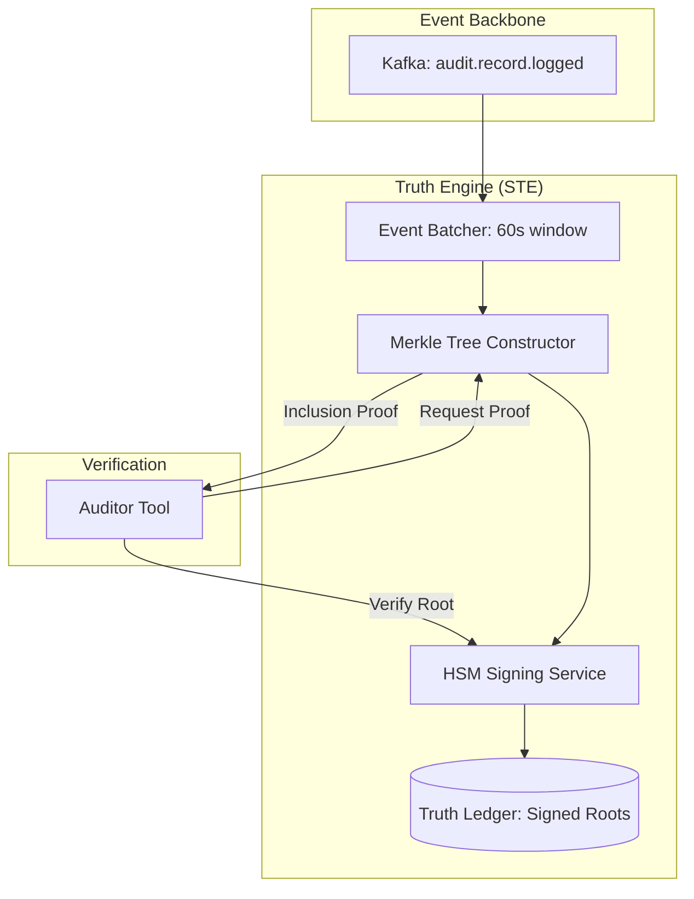

# SNISID: Cryptographic Audit & Integrity Verification

The Sovereign Truth Engine (STE) provides a mathematical foundation for absolute platform integrity. It ensures that every action taken within SNISID is recorded, signed, and verifiable, creating a legally admissible chain-of-custody that resists tampering even by privileged administrators.

---

## 1. Audit Integrity Architecture

The Truth Engine acts as a **Cryptographic Supervisor** for the Kafka event mesh and the WORM storage clusters.

---

## 2. Integrity Verification Workflows

### 2.1. Block Construction & Signing
1.  **Batching**: Audit events are gathered into a block every 60 seconds.
2.  **Hashing**: Each event is hashed using **SHA-3-256**.
3.  **Merkle Tree**: A binary Merkle Tree is built from the event hashes.
4.  **Root Signing**: The Merkle Root is sent to a physical **HSM (FIPS 140-2 Level 3)**, where it is signed using the **Sovereign Audit Private Key**.
5.  **Checkpointing**: The signed root and the block manifest are written to the **Truth Ledger**, which is stored in a separate, isolated data zone.

### 2.2. Background Verification (The "Continuous Auditor")
A background worker continuously performs the following checks:
- **Recalculation**: Re-computes the Merkle Tree for historical blocks from the WORM storage.
- **Signature Match**: Verifies that the computed root matches the signed root in the Truth Ledger.
- **Sequence Check**: Ensures no blocks are missing and that the `prev_block_hash` chain is unbroken.

---

## 3. Evidence Chain & Proof of Inclusion

The STE allows auditors to prove the existence of an event without scanning the entire ledger.

- **Merkle Proof (Proof of Inclusion)**: For any given `Event_ID`, the engine can provide a logarithmic-sized proof (the siblings in the tree) that proves the event was included in a specific signed block.
- **Non-Repudiation**: Because the signature is generated by an HSM and requires a multi-party "M-of-N" authorization for any administrative mutation, an official cannot deny an action they performed.

---

## 4. Tamper Detection & Breach Response

| Detection Signal | Threat | Response Workflow |
| :--- | :--- | :--- |
| **Merkle Mismatch** | Unauthorized Log Deletion/Edit | Trigger `SOVEREIGN_TAMPER_ALARM`; Lock affected storage partition; Notify National SOC. |
| **Signature Failure** | HSM Compromise or Key Tampering | Invalidate Audit Key; Rotate to Backup CA; Trigger forensic investigation of the KMS cluster. |
| **Sequence Gap** | Log Suppression Attack | Alert on "Missing Timeframes"; Automated failover to secondary audit bridge. |

---

## 5. Security Governance & Admissibility

- **Compliance Alignment**: The STE is designed to meet **ISO 27037** (Digital Evidence Collection) and **ISO 27042** (Digital Evidence Analysis) standards.
- **Public Checkpointing**: Periodic hashes of the Truth Ledger are published to a distributed government portal, ensuring that the state of the platform is known to external oversight bodies and cannot be "rewritten" after a major incident.
- **"Four-Eyes" Audit**: Generating a full compliance report requires the cryptographic authorization of two separate Audit Officers from different agencies (e.g., Judiciary + National SOC).
